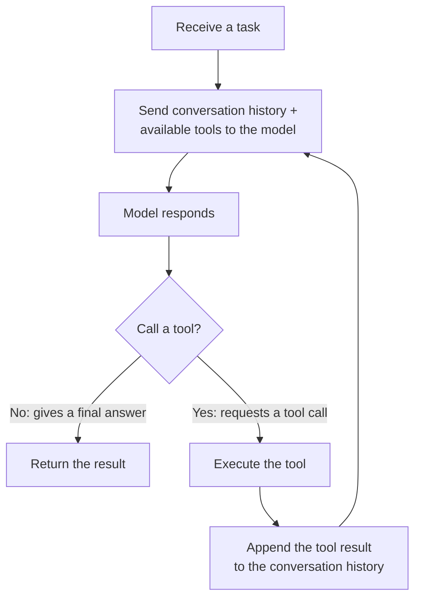

# 21.1 The Agent Control Loop

Chapter 20 was about Go serving a model: a request goes in, a stream of tokens comes out. But systems today often go a step further: they let the model not only answer, but also call tools, chain together multiple steps, and drive itself forward until a task is done. This is the AI agent. The word sounds mysterious, but the stance of this book is unchanged: set the model's intelligence aside and look only at the runtime side. Seen this way, an agent is nothing more than a control loop, and the control loop is one of the oldest and plainest structures in computer science. This chapter uses that lens to reduce an agent to a concurrency problem a Go programmer already knows.

## 21.1.1 Reducing an Agent to a Control Loop

Strip away all the fancy language, and the core of an agent is a loop:



Read that diagram once: send the context (the conversation history plus a description of the available tools) to the model; the model either gives a final answer (the loop ends) or requests a call to some tool; if the latter, execute that tool, append its result back to the context, and send it to the model again, and so on. What is called "autonomy" or "agency" is, mechanically, this loop with tool calls. The model is responsible for deciding "what to do next" at each step, and the agent runtime is responsible for faithfully running this loop: maintaining the context, dispatching tools, and feeding results back.

This realization is both demystifying and liberating. It tells us that writing an agent framework requires no machine learning whatsoever. What it requires is organizing a loop, a set of tools, and an ever-growing context correctly, concurrently, and reliably, and all of these are things the earlier parts of this book have already covered.

## 21.1.2 It Is a State Machine

Look at this loop a little more closely and it is in fact a state machine. On each turn the agent sits in some definite state:

- **Thinking**: waiting for the model to return (an inference request in the sense of Chapter 20, often streamed).
- **Awaiting a tool**: the model has decided to call some tool, and we are preparing or executing it.
- **Integrating**: the tool has a result, and we are appending it back into the context.
- **Done / Failed**: the loop terminates.

Writing these states out **explicitly**, rather than letting them lie implicit and scattered across the control flow, brings real engineering benefits. First, **observability**: at any moment we can report "which step is this agent stuck on", which matters greatly for debugging and monitoring. Second, **persistence and resumability**: a long-running agent task may take minutes and call dozens of tools, and making the state explicit lets us checkpoint it and resume from the breakpoint after a crash, rather than starting over. Third, **control**: timeouts, retries, and human intervention all hang more easily off explicit state transitions. Go has no fancy state-machine framework, but a struct with a `state` field plus a `for` plus a `switch` is plain in just the right way:

```go
type Agent struct {
    state   State
    history []Message // the ever-growing context
    tools   map[string]Tool
}

func (a *Agent) Run(ctx context.Context, task string) (string, error) {
    a.history = append(a.history, userMsg(task))
    for {
        select {
        case <-ctx.Done():
            return "", ctx.Err() // whole-task cancellation, see 21.3
        default:
        }
        resp := a.model.Infer(ctx, a.history) // thinking
        if resp.IsFinal() {
            return resp.Text, nil             // done
        }
        result := a.tools[resp.Call.Name].Invoke(ctx, resp.Call.Args) // awaiting a tool
        a.history = append(a.history, assistantMsg(resp), toolMsg(result)) // integrating
    }
}
```

This barely-thirty-line skeleton is the entire runtime core of an agent. Not a single line touches the model's internals. It is all context management, branching, and looping, genuine Go engineering code.

## 21.1.3 One Goroutine Per Agent, or Centralized Orchestration

A single agent is a loop, so what about **many** agents? This returns us to concurrency design. Two orientations, each with its place.

**One goroutine per agent.** The most natural shape: an agent's loop is a goroutine, isolated from the others, each running on its own. Chapter 9 says goroutines are cheap, so spinning up thousands is no trouble, and an agent's loop spends most of its time **waiting** (on the model, on a tool's I/O), exactly the workload a goroutine is most comfortable with. Multi-agent collaboration (a main agent spawning several sub-agents to work on subtasks in parallel) also falls out naturally, as the fan-out/fan-in of Chapter 10: the main goroutine spawns child goroutines and collects their results over a channel.

**Centralized orchestration.** When many agents **contend for the same scarce resource**, pure "each on its own" is not enough. The most typical scarce resource is the model backend, whether the in-process inference service of Chapter 20 or a rate-limited remote API, whose throughput is finite. Thousands of agent goroutines firing inference requests at once would instantly overwhelm the backend. This calls for a centralized scheduling layer that funnels all the agents' model calls through one point to do queuing, rate limiting, and prioritization. Its shape is exactly the one that recurs in [18.2.5](../ch18gpu/sched.md) and [20.3](../ch20inference/serving.md): **a shared resource managed by a single owner, with many users communicating with it over a channel**. The more agents there are, the more the backpressure and fairness at this funnel point matter, which is the subject of 21.3.

## 21.1.4 The Agent Stands on Top of Chapter 20

Finally, let us locate this chapter in the book. Every "thinking" step of an agent is an inference request in the sense of Chapter 20, that token stream that is delivered as a stream and needs backpressure and cancellation. So **the agent is a client of the inference service of Chapter 20**, and its control loop is repeatedly consuming the stream of 20.3.

This also means the boundary has changed. From Chapters 18 through 20, the core boundary was the **in-process FFI** (cgo to the device, to the runtime). At the agent layer, the model backend is often in another process, or even on another machine, and the boundary becomes a **network RPC**. But [18.1.4](../ch18gpu/boundary.md) already said that the FFI boundary and the inter-process boundary are only the same design choice placed at different positions. The boundary has changed form, but the discipline has not: still streaming, still backpressure, still cancellation, only this time what we cross is the network rather than cgo. Chapter 21 thus stands on the shoulders of Chapter 20, applying the same concurrency discipline in a higher, more autonomous loop.

## Summary

Set the model's intelligence aside, and in the eyes of the runtime an AI agent is a control loop: send the context to the model, the model either gives an answer or requests a tool call, execute the tool, append the result back to the context, and repeat. It is a state machine, and making the state explicit buys observability, resumability, and control, while Go expresses it plainly with a struct plus a `for`/`switch`, all without a touch of machine learning. The concurrency of many agents then weighs "one goroutine per agent" against "centralized orchestration of a scarce model backend", and the latter is again that familiar "single owner plus channel" shape. In the end the agent is a client of the inference service of Chapter 20, carrying the same discipline of streaming, backpressure, and cancellation onto a higher, cross-network, more autonomous loop.

The skeleton of the loop now stands, and the most important action inside it is "call a tool". The next section, [21.2](./mcp.md), goes into tool calls themselves: how a tool is described and dispatched, and how the Model Context Protocol uses a protocol to hand tools to the model in a standardized way.

## Further Reading

1. Shunyu Yao et al. *ReAct: Synergizing Reasoning and Acting in Language Models.*
   ICLR, 2023. https://arxiv.org/abs/2210.03629
   (the alternating "reason-act" loop, a representative formalization of the agent control loop)
2. Anthropic. *Building Effective Agents.* 2024.
   https://www.anthropic.com/research/building-effective-agents
   (the engineering view of agents as tool-calling loops and workflows)
3. Lilian Weng. *LLM Powered Autonomous Agents.* 2023.
   https://lilianweng.github.io/posts/2023-06-23-agent/
   (a survey of an agent's components: planning, memory, tool use)
4. This book: [9 The goroutine Scheduler](../../part3concurrency/ch09sched),
   [10 Channels and select](../../part3concurrency/ch10chan),
   [18.2 The Scheduler and Blocking External Calls](../ch18gpu/sched.md),
   [20.3 Serving, Batching, and Streaming](../ch20inference/serving.md),
   [21.2 Tool Calls and MCP](./mcp.md).
