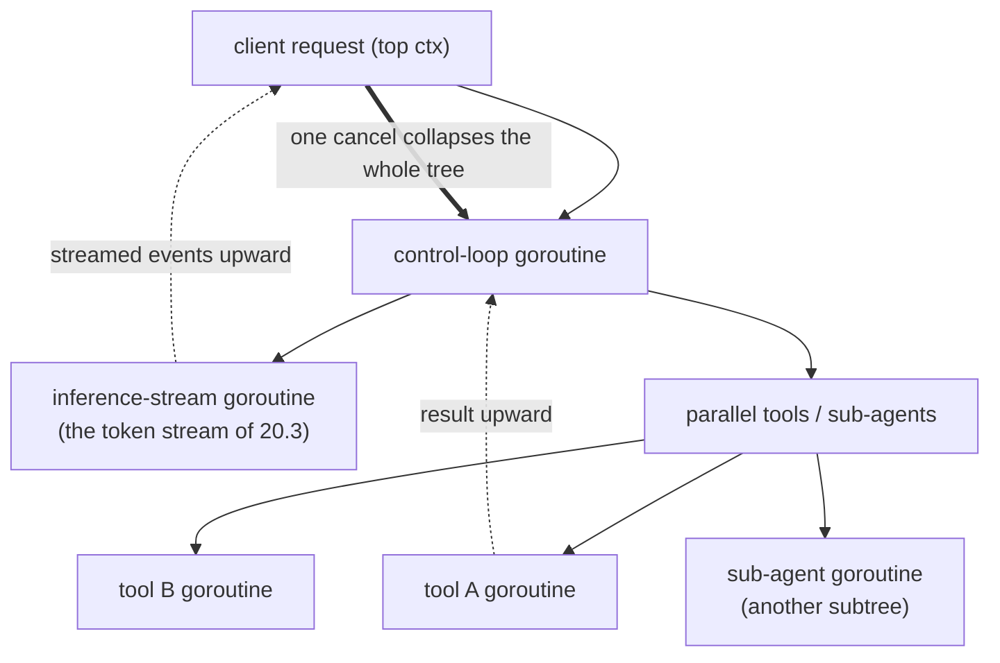

# 21.3 Streaming, Backpressure, and Cancellation

[21.1](./loop.md) stood up the agent's control loop, and [21.2](./mcp.md) made the tool calls inside it clear. This last section brings the context of Chapter 7 and the concurrency primitives of Chapters 10 and 11 onto the stage for the book's curtain call, because the real difficulty of a production-grade agent lies not in the skeleton of the loop but in three things that run through the entire chain: streaming, backpressure, and cancellation. They are intertwined, and what unifies them is a shape a Go programmer knows all too well, a tree of goroutines bound by a context.

## 21.3.1 The Whole Chain Is Streamed

First see clearly how data flows inside an agent. A request comes in from the client and lands on the agent's control loop; each step of the loop fires an inference at the model, and that inference is the **streamed token stream** of [20.3](../ch20inference/serving.md); the loop also calls tools, and a tool may itself be slow, may itself return as a stream. So **streaming is not the property of one layer but the normal state running through the entire chain**.

This brings an experiential requirement: the user should not stare at a blank screen while the agent silently runs through dozens of steps. What the model is thinking, which tool it is calling, what the tool returned, all of it should be **presented as it happens**. This means the agent does not merely consume the streams below it, it must also **re-produce** a stream of its own events upward: streaming events like "the model is emitting tokens", "starting to call tool X", "tool X returned" to the client in real time. One stream in, one stream out, with the control loop in between, and this is again the Chapter 10 idiom of "a goroutine passing events out one by one over a channel", only this time what it passes are the agent's execution events.

## 21.3.2 Cancellation Must Pierce Every Layer

Beyond streaming, the hardest requirement is **cancellation**. The user may hit "stop" at any moment, may close the connection; when an upper-level task fails, the sibling tasks running in parallel should stop at once. A single cancellation must be able to pierce that whole stack of call layers in the agent, and this is exactly what the `context` of Chapter 7 was designed to do.

Thread one ctx from the very top (the client request) all the way down: into the control loop, into every `model.Infer`, into every `tool.Invoke`, and on into every HTTP request and every database query inside a tool. Then a single `cancel()` at the top, and the signal of `ctx.Done()` reaches every layer at once: the model stops generating (releasing the per-request KV cache of 20.1), and in-flight tool I/O aborts immediately. The whole call stack falls like dominoes, cleanly, with no leaked goroutines and no inference left spinning and burning money.

```go
// one ctx threading the whole chain: loop, inference, tool, I/O inside the tool
func (a *Agent) step(ctx context.Context) error {
    stream, err := a.model.InferStream(ctx, a.history) // cancel -> stop generating
    if err != nil { return err }
    for ev := range stream {
        a.emit(ev)                                     // re-produce the event stream upward
        if ev.IsToolCall() {
            // the tool call carries the same ctx; cancellation reaches into the tool
            res, err := a.callTool(ctx, ev.Call)       // see 21.2, ctx threaded
            if err != nil { return err }
            a.history = append(a.history, toolMsg(res))
        }
    }
    return ctx.Err()
}
```

But there is a **deep boundary** hidden here, echoing Chapter 18, that deserves to be called out specifically. The cancellation of `context` is **cooperative**: it merely closes the `Done()` channel and **counts on every layer to actively check it and bow out**. Any layer that ignores ctx is where cancellation goes dead. The thorniest case is precisely the one [18.2](../ch18gpu/sched.md) discussed: **a tool stuck in a blocking cgo call cannot be cancelled**. Go's runtime cannot even preempt a thread running inside C, and the paper agreement of cooperative cancellation that `context` represents is even more powerless. So a tool that calls a local inference runtime, or some C library, once it enters that blocking crossing, leaves the upper-level cancellation with no choice but to wait for it to return on its own. This stitches the boundary story of Chapter 18 and the cancellation story of Chapter 21 at the same point: **the boundary of cooperative cancellation ends exactly at the unpreemptable FFI boundary**. When designing an agent's tools, this is a crack you must keep in mind: where you can use a separate process, where you can use cancellable I/O, do not put an uncancellable blocking cgo call on a path that cancellation must pass through.

## 21.3.3 Backpressure and Fan-Out: Letting the Slow Link Push Back

The third thing is **backpressure**, and it is the same system's third face alongside cancellation and streaming.

Follow the stream of 21.3.1: if the client reads slowly, the channel by which the agent emits events upward fills; once the channel is full, the rate at which the agent consumes the model's token stream is forced to slow; and this in turn (20.3) makes the model's generation block, holding the KV cache and not letting go. **The pressure of a slow consumer pushes back along the entire stream, all the way down to the device at the bottom.** This is not a bad thing. It is precisely the value of a bounded channel as a backpressure valve from Chapter 10: it forces the whole chain to move at the pace of its slowest link, instead of letting the fast end pile up memory until it bursts. The key is that the channel at every hop must be **bounded**, so that backpressure can propagate rather than accumulate somewhere into unbounded memory growth.

When an agent spawns **parallel** subtasks (calling several tools at once, spawning several sub-agents), backpressure and cancellation must also merge with fan-out and fan-in. The fan-out/fan-in of Chapter 10 has a handy wrapper here, `errgroup`: it binds a group of parallel goroutines to the same derived ctx, and the moment any one returns an error it cancels this ctx, so the remaining siblings all stop too.

```go
// call several tools in parallel: share one cancellable ctx, one failure stops all
g, ctx := errgroup.WithContext(ctx)
results := make([]Result, len(calls))
for i, call := range calls {
    i, call := i, call
    g.Go(func() error {
        r, err := a.callTool(ctx, call) // the same ctx: cancellation pierces every branch
        results[i] = r
        return err
    })
}
err := g.Wait() // wait for all to finish, or cancel the rest at the first error
```

One failure dragging the whole group into cancellation is exactly the cancellation tree of 21.3.2 expressed along the "parallel" edge. Fan-out creates the branches, the shared ctx guarantees these branches can all be cancelled together, and bounded channels guarantee that backpressure can propagate between them. The three together are what make a parallel agent both fast and controllable.

## 21.3.4 A Tree of goroutines Bound by a context

Draw the three sections of this chapter together, and the full picture of an agent in the eyes of the runtime is **a tree of goroutines bound by a context**:



Each node of the tree is a goroutine: the control loop, the inference stream, the parallel tools, the recursively spawned sub-agents. Along every edge of the tree, **streaming** lets events well up, **backpressure** lets a slow node push back on its upstream, and **cancellation** lets one signal at the top collapse the entire subtree. And every part of this tree, the goroutine, the channel, the `select`, the `context`, the `errgroup`, is something the earlier parts of this book have already covered. The agent, the newest and hottest workload of the 2020s, demands no new mechanism at the runtime level. What it demands is precisely the concurrency and cancellation that Go has polished over more than a decade.

## Summary

The difficulty of a production-grade agent lies not in the loop skeleton but in the streaming, backpressure, and cancellation that run through the whole chain. Streaming is the normal state: the agent consumes the token stream below and re-produces its own stream of execution events upward, so the user sees things as they happen. Cancellation must pierce every layer: one ctx threaded from the top lets `Done()` reach inference, tool, and the I/O inside the tool at once, so the whole call stack falls cleanly, but it is cooperative, and it ends at the unpreemptable blocking FFI boundary of Chapter 18, a crack you must face when designing tools. Backpressure pushes back along the stream all the way to the device, propagated by a bounded channel at every hop, while parallel fan-out uses `errgroup` to bind the shared ctx and the fan-in together, one failure dragging the whole group into cancellation. The three as one: an agent is a tree of goroutines bound by a context, events and backpressure flowing along its edges, one cancellation at the root collapsing the whole tree.

## Closing the Chapter and the Part

Chapter 21 reduced the agent to a control loop, tool calls, and a cancellation tree, using no machine learning anywhere, only the concurrency and cancellation of Chapters 7, 9, 10, and 11. This is exactly the finding that runs through Part Six: from the GPU to graphics, to inference, to the agent, these new workloads crowned with the names "heterogeneous" and "AI" demand at the runtime level no new magic, but the application of the same old principles in new settings, the cost accounting of the FFI boundary, the resource management of a single owner plus channels, cooperative cancellation and backpressure. The book opened by saying "code can always be rebuilt from scratch, but principles can live forever", and Part Six is one redemption of that line: frameworks turn over once a year, but the boundary that stands behind the frameworks, the cancellation tree, the maxim "do not communicate by sharing memory", will always be there. Hold these principles in hand, and no matter what the next hyped workload is called, you will recognize the skeleton of its runtime.

With that, the journey of the book, from the panorama and history of Part One to the heterogeneous and the AI of this part, comes to a close. May these principles, dug out from beneath the surface, become for the reader the eye that sees through appearances when facing any new workload.

## Further Reading

1. The Go Authors. *Package context.* https://pkg.go.dev/context
   (cooperative cancellation propagating along a call tree, the mechanical basis of the agent cancellation tree)
2. Sameer Ajmani. *Go Concurrency Patterns: Context.* The Go Blog, 2014.
   https://go.dev/blog/context
   (the design intent of context: threading cancellation and deadlines through a goroutine tree)
3. The Go Authors. *Package golang.org/x/sync/errgroup.*
   https://pkg.go.dev/golang.org/x/sync/errgroup
   (fan-out/fan-in plus a shared cancellable ctx, one failure stopping all)
4. This book: [7 Error Handling and context](../../part2lang/ch07errors),
   [10 Channels and select](../../part3concurrency/ch10chan),
   [11 Synchronization Primitives and Patterns](../../part3concurrency/ch11sync),
   [18.2 The Scheduler and Blocking External Calls](../ch18gpu/sched.md),
   [20.3 Serving, Batching, and Streaming](../ch20inference/serving.md),
   [21.1 The Agent Control Loop](./loop.md), [21.2 Tool Calls and MCP](./mcp.md).
