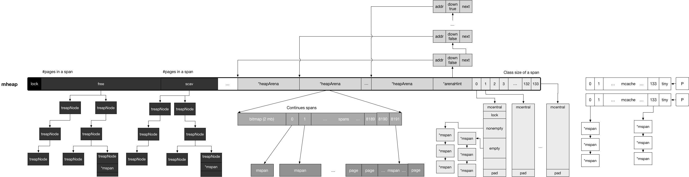

# 内存管理: 基本知识

[TOC]

到目前为止，我们已经分析了 Go 程序如何启动、初始化需要进行的关键步骤、初始化结束后，
主 goroutine 如何被调度器进行调度。现在我们来看 Go 中另一重要的关键组件：内存分配器。

Go 的内存分配器基于 Thread-Cache Malloc (tcmalloc) [1]，tcmalloc 为每个线程实现了一个本地缓存，
区分了小对象（小于 32kb）和大对象分配两种分配类型，其管理的内存单元称为 span。

我们不再介绍更多 tcmalloc 的具体细节，因为 Go 的内存分配器与 tcmalloc 存在一定差异。
这个差异来源于 Go 语言被设计为没有显式的内存分配与释放，
完全依靠编译器与运行时的配合来自动处理，因此也就造就为了内存分配器、垃圾回收器两大组件。

我们知道，在计算机领域中，无外乎时间换空间、空间换时间。统一管理内存会提前分配或一次性释放一大块内存，
进而减少与操作系统沟通造成的开销，进而提高程序的运行性能。
支持内存管理另一个优势就是能够更好的支持垃圾回收，这一点我们留到垃圾回收器一节中进行讨论。

## 内存分配器的主要结构

Go 的内存分配器主要包含以下几个核心组件：

- heapArena: 保留整个虚拟地址空间
- mheap：分配的堆，在页大小为 8KB 的粒度上进行管理
- mspan：是 mheap 上管理的一连串的页
- mcentral：搜集了给定大小等级的所有 span
- mcache：为 per-P 的缓存。

其中页是向操作系统申请内存的最小单位，目前设计为 8kb。

每一个结构虽然不都像是调度器 M/P/G 结构那样的大部头，但初次阅读这些结构时想要理清他们之间的关系还是比较麻烦的。
传统意义上的栈被 Go 的运行时霸占，不开放给用户态代码；而传统意义上的堆内存，又被 Go 运行时划分为了两个部分，
一个是 Go 运行时自身所需的堆内存，即堆外内存；另一部分则用于 Go 用户态代码所使用的堆内存，也叫做 Go 堆。
Go 堆负责了用户态对象的存放以及 goroutine 的执行栈。

### Arena

#### heapArena

Go 堆被视为由多个 arena 组成，每个 arena 在 64 位机器上位 64MB，且起始地址与 arena 的大小对齐，
所有的 arena 覆盖了整个 Go 堆的地址空间。

```go
const (
	pageSize             = 8192                       // 8kb
	heapArenaBytes       = 67108864                   // 64mb
	heapArenaBitmapBytes = heapArenaBytes / 32        // 2097152
	pagesPerArena        = heapArenaBytes / pageSize  // 8192
)

//go:notinheap
type heapArena struct {
	bitmap [heapArenaBitmapBytes]byte
	spans [pagesPerArena]*mspan
	pageInUse [pagesPerArena / 8]uint8
	pageMarks [pagesPerArena / 8]uint8
}
```

#### arenaHint

结构比较简单，是 arenaHint 链表的节点结构，保存了arena 的起始地址、是否为最后一个 arena，以及下一个 arenaHint 指针。

```go
//go:notinheap
type arenaHint struct {
	addr uintptr
	down bool
	next *arenaHint
}
```

### mspan

然而管理 arena 如此粒度的内存并不符合实践，相反，所有的堆对象都通过 span 按照预先设定好的
大小等级分别分配，小于 32kb 的小对象则分配在固定大小等级的 span 上，否则直接从 mheap 上进行分配。

`mspan` 是相同大小等级的 span 的双向链表的一个节点，每个节点还记录了自己的起始地址、
指向的 span 中页的数量。它要么位于 


```go
//go:notinheap
type mspan struct { // 双向链表
	next *mspan     // 链表中的下一个 span，如果为空则为 nil
	prev *mspan     // 链表中的前一个 span，如果为空则为 nil
    (...)
	startAddr uintptr // span 的第一个字节的地址，即 s.base()
	npages    uintptr // 一个 span 中的 page 数量
    (...)
	freeindex uintptr
    (...)
	allocCount  uint16     // 分配对象的数量
	spanclass   spanClass  // 大小等级与 noscan (uint8)
	incache     bool       // 是否被 mcache 使用
	state       mSpanState // mspaninuse 等等信息
	(...)
}
```

### mcache

是一个 per-P 的缓存，它是一个包含不同大小等级的 span 链表的数组，其中 mcache.alloc 的每一个数组元素
都是某一个特定大小的 mspan 的链表头指针。

```go
//go:notinheap
type mcache struct {
	(...)
	tiny             uintptr
	tinyoffset       uintptr
	local_tinyallocs uintptr
	alloc [numSpanClasses]*mspan // 用来分配的 spans，由 spanClass 索引
	stackcache [_NumStackOrders]stackfreelist
	(...)
}
```

当 mcache 中 span 的数量不够使用时，会向 mcentral 的 nonempty 列表中获得新的 span。

### mcentral

mcentral 

```go
//go:notinheap
type mcentral struct {
	lock      mutex
	spanclass spanClass
	nonempty  mSpanList // 带有自由对象的 span 列表，即非空闲列表
	empty     mSpanList // 没有自由对象的 span 列表（或缓存在 mcache 中）

	// 假设 mcaches 中的所有 span 都已完全分配，则 nmalloc 是
	// 从此 mcentral 分配的对象的累积计数。原子地写，在 STW 下读。
	nmalloc uint64
}
```

当 mcentral 中 nonempty 列表中也没有 可分配的 span 时，则会向 mheap 提出请求，从而获得
新的 span，并进而交给 mcache。

### mheap

```go
//go:notinheap
type mheap struct {
	lock      mutex
	free      mTreap // free 和 non-scavenged spans
	scav      mTreap // free 和 scavenged spans
	(...)
	arenas [1 << arenaL1Bits]*[1 << arenaL2Bits]*heapArena
	(...)
	arenaHints *arenaHint
	(...)
	central [numSpanClasses]struct {
		mcentral mcentral
		pad      [cpu.CacheLinePadSize - unsafe.Sizeof(mcentral{})%cpu.CacheLinePadSize]byte
	}

	// 各种分配器
	spanalloc             fixalloc // span* 分配器
	cachealloc            fixalloc // mcache* 分配器
	treapalloc            fixalloc // treapNodes* 分配器，用于大对象
	specialfinalizeralloc fixalloc // specialfinalizer* 分配器
	specialprofilealloc   fixalloc // specialprofile* 分配器
	speciallock           mutex    // 特殊记录分配器的锁
	arenaHintAlloc        fixalloc // arenaHints 分配器
	(...)
}
```

## 分配概览

### 小对象分配

当对一个小对象（<32kB）分配内存时，会将该对象所需的内存大小调整到某个能够容纳该对象的大小等级（size class），
并查看 mcache 中对应等级的 mspan，通过扫描 mspan 的 `freeindex` 来确定是否能够进行分配。

当没有可分配的 mspan 时，会从 mcentral 中获取一个所需大小空间的新的 mspan，从 mcentral 中分配会对其进行加锁，
但一次性获取整个 span 的过程均摊了对 mcentral 加锁的成本。

如果 mcentral 的 mspan 也为空时，则它也会发生增长，从而从 mheap 中获取一连串的页，作为一个新的 mspan 进行提供。
而如果 mheap 仍然为空，或者没有足够大的对象来进行分配时，则会从操作系统中分配一组新的页（至少 1MB），
从而均摊与操作系统沟通的成本。

### 微对象分配

对于过小的微对象（<16B），它们的分配过程与小对象的分配过程基本类似，但是是直接存储在 mcache 上，并由其以 16B 的块大小直接进行管理和释放。

### 大对象分配

大对象分配非常粗暴，不与 mcache 和 mcentral 沟通，直接绕过并通过 mheap 进行分配。

## 总结

图 1 展示了所有结构的关系。



_图 1: Go 内存管理结构总览_

heap 最中间的灰色区域 arena 覆盖了 Go 程序的整个虚拟内存，
每个 arena 包括一段 bitmap 和一段指向连续 span 的指针；
每个 span 由一串连续的页组成；每个 arena 的起始位置通过 arenaHint 进行记录。

分配的顺序从右向左，代价也就越来越大。
小对象和微对象优先从白色区域 per-P 的 mcache 分配 span，这个过程不需要加锁（白色）；
若失败则会从 mheap 持有的 mcentral 加锁获得新的 span，这个过程需要加锁，但只是局部（灰色）；
若仍失败则会从右侧的 free 或 scav 进行分配，这个过程需要对整个 heap 进行加锁，代价最大（黑色）。

## 进一步阅读的参考文献

1. [TCMalloc : Thread-Caching Malloc](http://goog-perftools.sourceforge.net/doc/tcmalloc.html)

## 许可

[Go under the hood](https://github.com/changkun/go-under-the-hood) | CC-BY-NC-ND 4.0 & MIT &copy; [changkun](https://changkun.de)
