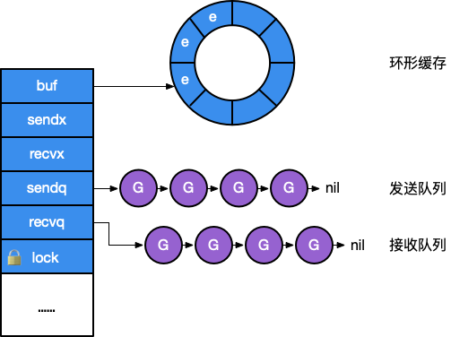

# 3.6 通信原语

> 本节内容提供一个线上演讲：[YouTube 在线](https://www.youtube.com/watch?v=d7fFCGGn0Wc)，[Google Slides 讲稿](https://changkun.de/s/chansrc/)。

Go 语言中 Channel 与 Select 语句受到 1978 年 CSP 原始理论的启发。
在语言设计中，Goroutine 就是 CSP 理论中的并发实体，
而 Channel 则对应 CSP 中输入输出指令的消息信道，Select 语句则是 CSP 中守卫和选择指令的组合。
他们的区别在于 CSP 理论中通信是隐式的，而 Go 的通信则是显式的由程序员进行控制；
CSP 理论中守卫指令只充当 Select 语句的一个分支，多个分支的 Select 语句由选择指令进行实现。

Channel 与 Select 是 Go 语言中提供的语言级的、基于消息传递的同步原语。

## Channel 的本质

### Channel 底层结构

实现 Channel 的结构并不神秘，本质上就是一个 `mutex` 锁加上一个环状缓存、
一个发送方队列和一个接收方队列：

```go
// src/runtime/chan.go
type hchan struct {
	qcount   uint           // 队列中的所有数据数
	dataqsiz uint           // 环形队列的大小
	buf      unsafe.Pointer // 指向大小为 dataqsiz 的数组
	elemsize uint16         // 元素大小
	closed   uint32         // 是否关闭
	elemtype *_type         // 元素类型
	sendx    uint           // 发送索引
	recvx    uint           // 接收索引
	recvq    waitq          // recv 等待列表，即（ <-ch ）
	sendq    waitq          // send 等待列表，即（ ch<- ）
	lock mutex
}
type waitq struct { // 等待队列 sudog 双向队列
	first *sudog
	last  *sudog
}
```

<div class="img-center" style="margin: 0 60px 0 30px; float: right; max-width: 40%">

<strong>图1：Channel 的结构</strong>
</div>

其中 `recvq` 和 `sendq` 分别是 `sudog` 的一个链式队列，
其元素是一个包含当前包含队 Goroutine 及其要在 Channel 中发送的数据的一个封装，
如图 1 所示。


> 更多关于 sudog 的细节，请参考 [6.8 同步原语](../../part2runtime/ch06sched/sync.md)。

### Channel 的创建

Channel 的创建语句由编译器完成如下翻译工作：

```go
make(chan type, n) => makechan(type, n)
```

将一个 `make` 语句转换为 `makechan` 调用。
而具体的 `makechan` 实现的本质是根据需要创建的元素大小，
对 `mallocgc` 进行封装，
因此，Channel 总是在堆上进行分配，它们会被垃圾回收器进行回收，
这也是为什么 Channel 不一定总是需要调用 `close(ch)` 进行显式地关闭。

```go
// src/runtime/chan.go

// 将 hchan 的大小对齐
const hchanSize = unsafe.Sizeof(hchan{}) + uintptr(-int(unsafe.Sizeof(hchan{}))&7)

func makechan(t *chantype, size int) *hchan {
	elem := t.elem
	...

	// 检查确认 channel 的容量不会溢出
	mem, overflow := math.MulUintptr(elem.size, uintptr(size))
	if overflow || mem > maxAlloc-hchanSize || size < 0 {
		panic("makechan: size out of range")
	}

	var c *hchan
	switch {
	case mem == 0:
		// 队列或元素大小为零
		c = (*hchan)(mallocgc(hchanSize, nil, true))
		...
	case elem.ptrdata == 0:
		// 元素不包含指针
		// 在一个调用中分配 hchan 和 buf
		c = (*hchan)(mallocgc(hchanSize+mem, nil, true))
		c.buf = add(unsafe.Pointer(c), hchanSize)
	default:
		// 元素包含指针
		c = new(hchan)
		c.buf = mallocgc(mem, elem, true)
	}

	c.elemsize = uint16(elem.size)
	c.elemtype = elem
	c.dataqsiz = uint(size)

	...
	return c
}
```

Channel 并不严格支持 `int64` 大小的缓冲，当 `make(chan type, n)` 中 n 为 `int64` 类型时，
运行时的实现仅仅只是将其强转为 `int`，提供了对 `int` 转型是否成功的检查：

```go
// src/runtime/chan.go

func makechan64(t *chantype, size int64) *hchan {
	if int64(int(size)) != size {
		panic("makechan: size out of range")
	}

	return makechan(t, int(size))
}
```

所以创建一个 Channel 最重要的操作就是创建 `hchan` 以及分配所需的 `buf` 大小的内存空间。

### 向 Channel 发送数据

发送数据完成的是如下的翻译过程：

```go
ch <- v => chansend1(ch, v)
```

而本质上它会去调用更为通用的 `chansend`：

```go
//go:nosplit
func chansend1(c *hchan, elem unsafe.Pointer) {
	chansend(c, elem, true)
}
```

下面我们来关注 `chansend` 的具体实现的第一个部分：

```go
func chansend(c *hchan, ep unsafe.Pointer, block bool) bool {
	// 当向 nil channel 发送数据时，会调用 gopark
	// 而 gopark 会将当前的 Goroutine 休眠，从而发生死锁崩溃
	if c == nil {
		if !block {
			return false
		}
		gopark(nil, nil, waitReasonChanSendNilChan)
		throw("unreachable")
	}

	...
}
```

在这个部分中，我们可以看到，如果一个 Channel 为零值（比如没有初始化），这时候的发送操作会暂止当前的 Goroutine（`gopark`）。
而 gopark 会将当前的 Goroutine 休眠，从而发生死锁崩溃。

现在我们来看一切已经准备就绪，开始对 Channel 加锁：

```go
func chansend(c *hchan, ep unsafe.Pointer, block bool) bool {
	...
	lock(&c.lock)

	// 持有锁之前我们已经检查了锁的状态，
	// 但这个状态可能在持有锁之前、该检查之后发生变化，
	// 因此还需要再检查一次 channel 的状态
	if c.closed != 0 { // 不允许向已经 close 的 channel 发送数据
		unlock(&c.lock)
		panic(plainError("send on closed channel"))
	}

	// 1. channel 上有阻塞的接收方，直接发送
	if sg := c.recvq.dequeue(); sg != nil {
		send(c, sg, ep, func() { unlock(&c.lock) })
		return true
	}

	// 2. 判断 channel 中缓存是否有剩余空间
	if c.qcount < c.dataqsiz {
		// 有剩余空间，存入 c.buf
		qp := chanbuf(c, c.sendx)
		...
		typedmemmove(c.elemtype, qp, ep) // 将要发送的数据拷贝到 buf 中
		c.sendx++
		if c.sendx == c.dataqsiz { // 如果 sendx 索引越界则设为 0
			c.sendx = 0
		}
		c.qcount++ // 完成存入，记录增加的数据，解锁
		unlock(&c.lock)
		return true
	}
	if !block {
		unlock(&c.lock)
		return false
	}

	...
}
```

到目前位置，代码中考虑了当 Channel 上有接收方等待，可以直接将数据发送走，并返回（情况 1）；或没有接收方
但缓存中还有剩余空间来存放没有读取的数据（情况 2）。对于直接发送数据的情况，由 `send` 调用完成：

```go
func send(c *hchan, sg *sudog, ep unsafe.Pointer, unlockf func()) {
	...
	if sg.elem != nil {
		sendDirect(c.elemtype, sg, ep)
		sg.elem = nil
	}
	gp := sg.g
	unlockf() // unlock(&c.lock)
	gp.param = unsafe.Pointer(sg)
	...
	// 复始一个 Goroutine，放入调度队列等待被后续调度
	goready(gp) // 将 gp 作为下一个立即被执行的 Goroutine
}
func sendDirect(t *_type, sg *sudog, src unsafe.Pointer) {
	dst := sg.elem
	... // 为了确保发送的数据能够被立刻观察到，需要写屏障支持，执行写屏障，保证代码正确性
	memmove(dst, src, t.size) // 直接写入接收方的执行栈！
}
```

`send` 操作其实是隐含了有接收方阻塞在 Channel 上，换句话说有接收方已经被暂止，
当我们发送完数据后，应该让该接收方就绪（让调度器继续开始调度接收方）。

这个 `send` 操作其实是一种优化。原因在于，已经处于等待状态的 Goroutine 是没有被执行的，
因此用户态代码不会与当前所发生数据发生任何竞争。我们也更没有必要冗余的将数据写入到缓存，
再让接收方从缓存中进行读取。因此我们可以看到， `sendDirect` 的调用，
本质上是将数据直接写入接收方的执行栈。

最后我们来看第三种情况，如果既找不到接收方，`buf` 也已经存满，
这时我们就应该阻塞当前的 Goroutine 了：

```go
func chansend(c *hchan, ep unsafe.Pointer, block bool) bool {
	...

	// 3. 阻塞在 channel 上，等待接收方接收数据
	gp := getg()
	mysg := acquireSudog()
	...
	c.sendq.enqueue(mysg)
	gopark(chanparkcommit, unsafe.Pointer(&c.lock)) // 将当前的 g 从调度队列移出

	// 因为调度器在停止当前 g 的时候会记录运行现场，当恢复阻塞的发送操作时候，会从此处继续开始执行
	...
	gp.waiting = nil
	gp.activeStackChans = false
	if gp.param == nil {
		if c.closed == 0 { // 正常唤醒状态，Goroutine 应该包含需要传递的参数，但如果没有唤醒时的参数，且 channel 没有被关闭，则为虚假唤醒
			throw("chansend: spurious wakeup")
		}
		panic(plainError("send on closed channel"))
	}
	gp.param = nil
	...
	mysg.c = nil // 取消与之前阻塞的 channel 的关联
	releaseSudog(mysg) // 从 sudog 中移除
	return true
}
func chanparkcommit(gp *g, chanLock unsafe.Pointer) bool {
	// 具有未解锁的指向 gp 栈的 sudog。栈的复制必须锁住那些 sudog 的 channel
	gp.activeStackChans = true
	unlock((*mutex)(chanLock))
	return true
}
```

简单总结一下，发送过程包含三个步骤：

1. 持有锁
2. 入队，拷贝要发送的数据
3. 释放锁

其中第二个步骤包含三个子步骤：

1. 找到是否有正在阻塞的接收方，是则直接发送
2. 找到是否有空余的缓存，是则存入
3. 阻塞直到被唤醒

### 从 Channel 接收数据

接收数据主要是完成以下翻译工作：

```go
v <- ch      =>  chanrecv1(ch, v)
v, ok <- ch  =>  ok := chanrecv2(ch, v)
```

他们的本质都是调用 `chanrecv`：

```go
//go:nosplit
func chanrecv1(c *hchan, elem unsafe.Pointer) {
	chanrecv(c, elem, true)
}
//go:nosplit
func chanrecv2(c *hchan, elem unsafe.Pointer) (received bool) {
	_, received = chanrecv(c, elem, true)
	return
}
```

chanrecv 的具体实现如下，由于我们已经仔细分析过发送过程了，
我们不再详细分拆下面代码的步骤，其处理方式基本一致：

1. 上锁
2. 从缓存中出队，拷贝要接收的数据
3. 解锁

其中第二个步骤包含三个子步骤：

1. 如果 Channel 已被关闭，且 Channel 没有数据，立刻返回
2. 如果存在正在阻塞的发送方，说明缓存已满，从缓存队头取一个数据，再复始一个阻塞的发送方
3. 否则，检查缓存，如果缓存中仍有数据，则从缓存中读取，读取过程会将队列中的数据拷贝一份到接收方的执行栈中
4. 没有能接受的数据，阻塞当前的接收方 Goroutine

```go
func chanrecv(c *hchan, ep unsafe.Pointer, block bool) (selected, received bool) {
	...
	// nil channel，同 send，会导致两个 Goroutine 的死锁
	if c == nil {
		if !block {
			return
		}
		gopark(nil, nil, waitReasonChanReceiveNilChan)
		throw("unreachable")
	}

	// 快速路径: 在不需要锁的情况下检查失败的非阻塞操作
	//
	// 注意到 channel 不能由已关闭转换为未关闭，则
	// 失败的条件是：1. 无 buf 时发送队列为空 2. 有 buf 时，buf 为空
	// 此处的 c.closed 必须在条件判断之后进行验证，
	// 因为指令重排后，如果先判断 c.closed，得出 channel 未关闭，无法判断失败条件中
	// channel 是已关闭还是未关闭（从而需要 atomic 操作）
	if !block && (c.dataqsiz == 0 && c.sendq.first == nil ||
		c.dataqsiz > 0 && atomic.Loaduint(&c.qcount) == 0) &&
		atomic.Load(&c.closed) == 0 {
		return
	}

	...

	lock(&c.lock)

	// 1. channel 已经 close，且 channel 中没有数据，则直接返回
	if c.closed != 0 && c.qcount == 0 {
		...
		unlock(&c.lock)
		if ep != nil {
			typedmemclr(c.elemtype, ep)
		}
		return true, false
	}

	// 2. channel 上有阻塞的发送方，直接接收
	if sg := c.sendq.dequeue(); sg != nil {
		recv(c, sg, ep, func() { unlock(&c.lock) })
		return true, true
	}

	// 3. channel 的 buf 不空
	if c.qcount > 0 {
		// 直接从队列中接收
		qp := chanbuf(c, c.recvx)
		...
		if ep != nil {
			typedmemmove(c.elemtype, ep, qp)
		}
		typedmemclr(c.elemtype, qp)
		c.recvx++
		if c.recvx == c.dataqsiz {
			c.recvx = 0
		}
		c.qcount--
		unlock(&c.lock)
		return true, true
	}

	if !block {
		unlock(&c.lock)
		return false, false
	}

	// 4. 没有数据可以接收，阻塞当前 Goroutine
	gp := getg()
	mysg := acquireSudog()
	...
	c.recvq.enqueue(mysg)
	gopark(chanparkcommit, unsafe.Pointer(&c.lock), waitReasonChanReceive)

	...
	// 被唤醒
	gp.waiting = nil
	...
	closed := gp.param == nil
	gp.param = nil
	mysg.c = nil
	releaseSudog(mysg)
	return true, !closed
}
```

接收数据同样包含直接往接收方的执行栈中拷贝要发送的数据，但这种情况当且仅当缓存大小为0时（即无缓冲 Channel）。

```go
func recv(c *hchan, sg *sudog, ep unsafe.Pointer, unlockf func(), skip int) {
	if c.dataqsiz == 0 {
		...
		if ep != nil {
			// 直接从对方的栈进行拷贝
			recvDirect(c.elemtype, sg, ep)
		}
	} else {
		// 从缓存队列拷贝
		qp := chanbuf(c, c.recvx)
		...
		// 从队列拷贝数据到接收方
		if ep != nil {
			typedmemmove(c.elemtype, ep, qp)
		}
		// 从发送方拷贝数据到队列
		typedmemmove(c.elemtype, qp, sg.elem)
		c.recvx++
		if c.recvx == c.dataqsiz {
			c.recvx = 0
		}
		c.sendx = c.recvx // c.sendx = (c.sendx+1) % c.dataqsiz
	}
	sg.elem = nil
	gp := sg.g
	unlockf()
	gp.param = unsafe.Pointer(sg)
	...
	goready(gp, skip+1)
}
```

到目前为止我们终于明白了为什么无缓冲 Channel 而言 `v <- ch` happens before `ch <- v` 了，
因为**无缓冲 Channel 的接收方会先从发送方栈拷贝数据后，发送方才会被放回调度队列中，等待重新调度**。

### Channel 的关闭

关闭 Channel 主要是完成以下翻译工作：

```go
close(ch) => closechan(ch)
```

具体的实现中，首先对 Channel 上锁，而后依次将阻塞在 Channel 的 g 添加到一个
gList 中，当所有的 g 均从 Channel 上移除时，可释放锁，并唤醒 gList 中的所有接收方和发送方：

```go
func closechan(c *hchan) {
	if c == nil { // close 一个空的 channel 会 panic
		panic(plainError("close of nil channel"))
	}

	lock(&c.lock)
	if c.closed != 0 { // close 一个已经关闭的的 channel 会 panic
		unlock(&c.lock)
		panic(plainError("close of closed channel"))
	}

	...
	c.closed = 1

	var glist gList

	// 释放所有的接收方
	for {
		sg := c.recvq.dequeue()
		if sg == nil { // 队列已空
			break
		}
		if sg.elem != nil {
			typedmemclr(c.elemtype, sg.elem) // 清零
			sg.elem = nil
		}
		...
		gp := sg.g
		gp.param = nil
		...
		glist.push(gp)
	}

	// 释放所有的发送方
	for {
		sg := c.sendq.dequeue()
		if sg == nil { // 队列已空
			break
		}
		sg.elem = nil
		...
		gp := sg.g
		gp.param = nil
		...
		glist.push(gp)
	}
	// 释放 channel 的锁
	unlock(&c.lock)

    // 就绪所有的 G
	for !glist.empty() {
		gp := glist.pop()
		gp.schedlink = 0
		goready(gp, 3)
	}
}
```

当 Channel 关闭时，我们必须让所有阻塞的接收方重新被调度，让所有的发送方也重新被调度，这时候
的实现先将 Goroutine 统一添加到一个列表中（需要锁），然后逐个地进行复始（不需要锁）。

## Select 语句的本质

### 分支的随机化

Select 本身会被编译为 `selectgo` 调用。这与普通的多个 if 分支不同。
`selectgo` 则用于随机化每条分支的执行顺序，普通多个 if 分支的执行顺序始终是一致的。

```go
type scase struct {
	c           *hchan         // chan
	elem        unsafe.Pointer // 数据元素
	kind        uint16
	...
}
func selectgo(cas0 *scase, order0 *uint16, ncases int) (int, bool) {
	...

	cas1 := (*[1 << 16]scase)(unsafe.Pointer(cas0))
	order1 := (*[1 << 17]uint16)(unsafe.Pointer(order0))

	scases := cas1[:ncases:ncases]
	pollorder := order1[:ncases:ncases]
	lockorder := order1[ncases:][:ncases:ncases]

	// 替换零值的 channel
	for i := range scases {
		cas := &scases[i]
		if cas.c == nil && cas.kind != caseDefault {
			*cas = scase{}
		}
	}

	...

	// 生成随机顺序
	for i := 1; i < ncases; i++ {
		j := fastrandn(uint32(i + 1))
		pollorder[i] = pollorder[j]
		pollorder[j] = uint16(i)
	}

	// 根据 channel 的地址进行堆排序，决定加锁的顺序，避免死锁
	for i := 0; i < ncases; i++ {
		...
	}
	...

	// 依次加锁
	sellock(scases, lockorder)

	var (
		gp     *g
		sg     *sudog
		c      *hchan
		k      *scase
		sglist *sudog
		sgnext *sudog
		qp     unsafe.Pointer
		nextp  **sudog
	)

loop:
	// 1 遍历 channel，检查是否就绪（可发送/可接收）
	var dfli int
	var dfl *scase
	var casi int
	var cas *scase
	var recvOK bool
	for i := 0; i < ncases; i++ {
		casi = int(pollorder[i])
		cas = &scases[casi]
		c = cas.c
		switch cas.kind {
		case caseNil:
			continue
		case caseRecv:
			sg = c.sendq.dequeue()
			if sg != nil {
				goto recv
			}
			if c.qcount > 0 {
				goto bufrecv
			}
			if c.closed != 0 {
				goto rclose
			}
		case caseSend:
			...
			if c.closed != 0 {
				goto sclose
			}
			sg = c.recvq.dequeue()
			if sg != nil {
				goto send
			}
			if c.qcount < c.dataqsiz {
				goto bufsend
			}
		case caseDefault:
			dfli = casi
			dfl = cas
		}
	}
	// 存在 default 分支，直接去 retc 执行
	if dfl != nil {
		selunlock(scases, lockorder)
		casi = dfli
		cas = dfl
		goto retc
	}

	// 2 入队所有的 channel
	gp = getg()
	...
	nextp = &gp.waiting
	for _, casei := range lockorder {
		casi = int(casei)
		cas = &scases[casi]
		if cas.kind == caseNil {
			continue
		}
		c = cas.c
		sg := acquireSudog()
		sg.g = gp
		sg.isSelect = true
		// 在 gp.waiting 上分配 elem 和入队 sg 之间没有栈分段，copystack 可以在其中找到它。
		sg.elem = cas.elem
		...
		sg.c = c
		// 按锁的顺序创建等待链表
		*nextp = sg
		nextp = &sg.waitlink

		switch cas.kind {
		case caseRecv:
			c.recvq.enqueue(sg)

		case caseSend:
			c.sendq.enqueue(sg)
		}
	}

	// 等待被唤醒
	gp.param = nil
	// selparkcommit 根据等待列表依次解锁
	gopark(selparkcommit, nil, waitReasonSelect)

	// 重新上锁
	sellock(scases, lockorder)

	gp.selectDone = 0
	sg = (*sudog)(gp.param)
	gp.param = nil

	// pass 3 - 从不成功的 channel 中出队
	// 否则将它们堆到一个安静的 channel 上并记录所有成功的分支
	// 我们按锁的顺序单向链接 sudog
	casi = -1
	cas = nil
	sglist = gp.waiting
	// 从 gp.waiting 取消链接之前清除所有的 elem
	for sg1 := gp.waiting; sg1 != nil; sg1 = sg1.waitlink {
		sg1.isSelect = false
		sg1.elem = nil
		sg1.c = nil
	}
	gp.waiting = nil

	for _, casei := range lockorder {
		k = &scases[casei]
		if k.kind == caseNil {
			continue
		}
		...
		if sg == sglist {
			// sg 已经被唤醒我们的 G 出队了。
			casi = int(casei)
			cas = k
		} else {
			c = k.c
			if k.kind == caseSend {
				c.sendq.dequeueSudoG(sglist)
			} else {
				c.recvq.dequeueSudoG(sglist)
			}
		}
		sgnext = sglist.waitlink
		sglist.waitlink = nil
		releaseSudog(sglist)
		sglist = sgnext
	}

	if cas == nil {
		// 当一个参与在 select 语句中的 channel 被关闭时，我们可以在 gp.param == nil 时进行唤醒(所以 cas == nil)
		// 最简单的方法就是循环并重新运行该操作，然后就能看到它现在已经被关闭了
		// 也许未来我们可以显式的发送关闭信号，
		// 但我们就必须区分在接收方上关闭和在发送方上关闭这两种情况了
		// 最简单的方法是不复制代码并重新检查上面的代码。
		// 我们知道某些 channel 被关闭了，也知道某些可能永远不会被重新打开，因此我们不会再次阻塞
		goto loop
	}

	c = cas.c
	...
	if cas.kind == caseRecv {
		recvOK = true
	}
	...
	selunlock(scases, lockorder)
	goto retc

bufrecv:
	// 可以从 buf 接收
	...
	recvOK = true
	qp = chanbuf(c, c.recvx)
	if cas.elem != nil {
		typedmemmove(c.elemtype, cas.elem, qp)
	}
	typedmemclr(c.elemtype, qp)
	c.recvx++
	if c.recvx == c.dataqsiz {
		c.recvx = 0
	}
	c.qcount--
	selunlock(scases, lockorder)
	goto retc

bufsend:
	// 可以发送到 buf
	...
	typedmemmove(c.elemtype, chanbuf(c, c.sendx), cas.elem)
	c.sendx++
	if c.sendx == c.dataqsiz {
		c.sendx = 0
	}
	c.qcount++
	selunlock(scases, lockorder)
	goto retc

recv:
	// 可以从一个休眠的发送方 (sg)直接接收
	recv(c, sg, cas.elem, func() { selunlock(scases, lockorder) }, 2)
	...
	recvOK = true
	goto retc

rclose:
	// 在已经关闭的 channel 末尾进行读
	selunlock(scases, lockorder)
	recvOK = false
	if cas.elem != nil {
		typedmemclr(c.elemtype, cas.elem)
	}
	...
	goto retc

send:
	// 可以向一个休眠的接收方 (sg) 发送
	...
	send(c, sg, cas.elem, func() { selunlock(scases, lockorder) }, 2)
	...
	goto retc

retc:
	...
	return casi, recvOK

sclose:
	// 向已关闭的 channel 进行发送
	selunlock(scases, lockorder)
	panic(plainError("send on closed channel"))
}
```

### 发送数据的分支

Select 的诸多用法其实本质上仍然是 Channel 操作，编译器会完成如下翻译工作：

```go
select {
case c <- v:
	...
default:
	...
}

=>

if selectnbsend(c, v) {
	...
} else {
	...
}
```

其中：

```go
func selectnbsend(c *hchan, elem unsafe.Pointer) (selected bool) {
	return chansend(c, elem, false, getcallerpc())
}
```

注意，这时 `chansend` 的第三个参数为 `false`，这与前面的普通 Channel 发送操作不同，
说明这时 Select 的操作是非阻塞的。

我们现在来关注 `chansend` 中当 block 为 `false` 的情况：

```go
func chansend(c *hchan, ep unsafe.Pointer, block bool, callerpc uintptr) bool {

	...

	// 快速路径: 检查不需要加锁时失败的非阻塞操作
	if !block && c.closed == 0 && ((c.dataqsiz == 0 && c.recvq.first == nil) ||
		(c.dataqsiz > 0 && c.qcount == c.dataqsiz)) {
		return false
	}

	...

	lock(&c.lock)

	...
}
```

这里的快速路径是一个优化，它发生在持有 Channel 锁之前。
这一连串检查不需要加锁有以下原因：

1. Channel 没有被关闭与 Channel 是否满的检查没有因果关系。换句话说，无论 Channel 是否被关闭，都不能得出 Channel 是否已满；Channel 是否满，也与 Channel 是否关闭无关，从而当发生指令重排时，这个检查也不会出错。
2. 当 Channel 已经被关闭、且缓存已满时，发送操作一定失败。

第二个关于 Select 的处理则是在当判断完 Channel 是否有 `buf` 可缓存当前的数据后，
如果没有读者阻塞在 Channel 上则会立即返回失败：

```go
func chansend(c *hchan, ep unsafe.Pointer, block bool, callerpc uintptr) bool {

	...

	lock(&c.lock)

	...

	// 2. 判断 channel 中缓存是否仍然有空间剩余
	if c.qcount < c.dataqsiz {
		// 有空间剩余，存入 buffer
		...
		unlock(&c.lock)
		return true
	}
	if !block {
		unlock(&c.lock)
		return false
	}

	...
}
```

因此这也是为什么，我们在没有配合 for 循环使用 Select 时，需要对发送失败进行处理，例如：

```go
func main() {
	ch := make(chan interface{})
	x := 1
	select {
	case ch <- x:
		println("send success") // 如果初始化为有缓存 channel，则会发送成功
	default:
		println("send failed") // 此时 send failed 会被输出
	}
	return
}
```

如果读者进一步尝试没有 default 的例子：

```go
// main.go
package main
func main() {
	ch := make(chan interface{})
	x := 1
	select {
	case ch <- x:
		println("send success") // 如果初始化为有缓存 channel，则会发送成功
	}
	return
}
```

会发现，此时程序会发生 panic：

```go
$ go run main.go
fatal error: all goroutines are asleep - deadlock!

goroutine 1 [chan send]:
main.main()
```

似乎与源码中发生的行为并不一致，因为按照之前的分析，当锁被解除后，并不会出现任何 panic。
这是为什么呢？事实上，编译器会特殊处理
**当 Select 语句只有一个分支的情况，即 `select` 关键字在只有一个分支时，没有被翻译成 `selectgo`。**
只有一个分支的情况下，`select` 与 `if` 是没有区别的，这种优化消除了只有一个分支情况下调用 `selectgo` 的性能开销：

```go
// src/cmd/compile/internal/gc/select.go
func walkselectcases(cases *Nodes) []*Node {
	// 获取 case 分支的数量
	n := cases.Len()

	// 优化: 没有 case 的情况
	if n == 0 {
		// 翻译为：block()
		...
		return
	}

	// 优化: 只有一个 case 的情况
	if n == 1 {
		// 翻译为：if ch == nil { block() }; n;
		...
		return
	}

	// 一般情况，调用 selecggo
	...
}
```

根据编译器的代码，我们甚至可以看到没有分支的 Select 会被编译成 `block` 的调用：

```go
func block() {
	gopark(nil, nil, waitReasonSelectNoCases) // forever
}
```

即让整个 Goroutine 暂止。

### 接收数据的分支


对于接收数据而言，编译器会将这段语法：

```go
select {
case v = <-c:
	...
default:
	...
}

=>

if selectnbrecv(&v, c) {
	...
} else {
	...
}
```

而

```go
select {
case v, ok = <-c:
	... foo
default:
	... bar
}

=>

if c != nil && selectnbrecv2(&v, &ok, c) {
	... foo
} else {
	... bar
}
```

其中：

```go
func selectnbrecv(elem unsafe.Pointer, c *hchan) (selected bool) {
	selected, _ = chanrecv(c, elem, false)
	return
}
func selectnbrecv2(elem unsafe.Pointer, received *bool, c *hchan) (selected bool) {
	selected, *received = chanrecv(c, elem, false)
	return
}
```

## Channel 的无锁实现

早在 2014 年时，Dmitry Vyukov 就已经提出实现无锁版本的 Channel [Vyukov, 2014a] [Vyukov, 2014b]，
但这提案虽然早年已经实现，但至今未被接受，其未被接收这一现实可以总结为以下三个原因。

早年的 Channel 实现基于比较交换的重试机制，换句话说：多个阻塞在同一 Channel 的 Goroutine 被唤醒时，
需要重新持有锁，这时谁抢到锁谁就能拿到数据。所以这些 Goroutine 被唤醒的顺序不是 FIFO，而是随机的，
最坏情况下可能存在一个 Goroutine 始终不会接受到数据。

后来 Russ Cox 希望 [Cox, 2015] 阻塞的 Goroutine 能够按照 FIFO 的顺序被唤醒
（虽然在语言层面上未定义多个 Goroutine 的唤醒顺序），保证得到数据的公平性，参与讨论的人中也表示支持这一提案。
但这一决定基本上抹杀了无锁 Channel 的实现机制 [Randall, 2015a]。
这是目前未使用无锁实现 Channel 的一个最主要的原因。

那在这个决定之前，无锁 Channel 早就已经实现了，为什么当时没有接受使用无锁版本的 Channel 呢？

第一个原因是提出的无锁 Channel 并非无等待算法，是否能有效提高 Channel 在大规模应用的性能并没有大规模测试的强有力的证据，
支撑性能表现的只有 Dmitry Vyukov 提交的性能测试；
与此同时，运行时调度器不是 NUMA-aware 的实现，在 CPU 核心与调度器 P 数量较多时，
一个社区实现的无锁 Channel [OneOfOne, 2016] 的性能测试结果 [Gjengset, 2016] 表明：
无锁版本的 Channel 甚至比基于 futex 加锁版本的 Channel 还要慢。
在后续对 Channel 性能优化的跟进中虽然没有采用无锁实现，
但仍然跟进了两个小成本的优化 [Vyukov, 2014d]：增加不需要锁时的快速路径和减少互斥锁的粒度。

第二个原因导致没有被接受的原因则在于：无锁版本的 Channel 可维护性大打折扣。
这里我们简单提一个由于无锁实现导致的维护性大打折扣的教训 [Randall, 2015b]。
在早年简化 Channel 实现的过程中，由于没有考虑到发送数据过程中，
对要发送数据的指针进行读取，将会与调度器对执行栈的伸缩发生竞争。这是因为
直接读取 Channel 的数据分为两个过程：1. 读取发送方的值的指针 2. 拷贝到要接收的位置。
然而在 1 和 2 这两个步骤之间，发送方的执行栈可能发生收缩，进而指针失效，成为竞争的源头。

虽然后来有人提出使用无锁编程的形式化验证工具 spin [Bell Labs, 1980] 
来让调度器代码与形式验证的模型进行同步，但显然这需要更多的工作量，并没有人采取任何行动。

## 小结

Channel 的实现是一个典型的环形队列加上 `mutex` 锁的实现，
与 Channel 同步出现的 Select 更像是一个语法糖，
其本质仍然是一个 `chansend` 和 `chanrecv` 的两个通用实现。
但为了支持 Select 在不同分支上的非阻塞操作，`selectgo` 完成了这一需求。

考虑到整个 Channel 操作带锁的成本较高，官方也曾考虑过使用无锁 Channel 的设计，
但由于年代久远，该改进仍处于搁置状态 [Vyukov, 2014b]。

## 进一步阅读的参考文献

- [Vyukov, 2014a] [Dmitry Vyukov, Go channels on steroids, January 2014](https://docs.google.com/document/d/1yIAYmbvL3JxOKOjuCyon7JhW4cSv1wy5hC0ApeGMV9s/pub)
- [Vyukov, 2014b] [Dmitry Vyukov, runtime: lock-free channels, October 2014](https://github.com/golang/go/issues/8899)
- [Vyukov, 2014c] [Dmitry Vyukov, runtime: chans on steroids, October 2014](https://codereview.appspot.com/12544043)
- [Vyukov, 2014d] [update on "lock-free channels", 2015](https://groups.google.com/forum/#!msg/golang-dev/0IElw_BbTrk/cGHMdNoHGQEJ)
- [Cox, 2015] [runtime: make sure blocked channels run operations in FIFO order](https://github.com/golang/go/issues/11506)
- [Randall, 2015a] [Keith Randall, runtime: simplify buffered channels, 2015](https://go-review.googlesource.com/c/go/+/9345/ )
- [Randall, 2015b] [Keith Randall, runtime: simplify chan ops, take 2, 2015](https://go-review.googlesource.com/c/go/+/16740)
- [OneOfOne, 2016] [OneOfOne, A scalable lock-free channel, 2016](https://github.com/OneOfOne/lfchan)
- [Gjengset, 2016] [Jon Gjengset, Fix poor scalability to many (true-SMP) cores, 2016](https://github.com/OneOfOne/lfchan/issues/3)
- [Chenebault, 2017] [Benjamin Chenebault, runtime: select is not fair](https://github.com/golang/go/issues/21806)
- [Bell Labs, 1980] [Bell Labs, Verifying Multi-threaded Software with Spin, 1980](http://spinroot.com/spin/whatispin.html)
## 许可

&copy; 2018-2020 The [golang.design](https://golang.design) Initiative Authors. Licensed under [CC-BY-NC-ND 4.0](https://creativecommons.org/licenses/by-nc-nd/4.0/).