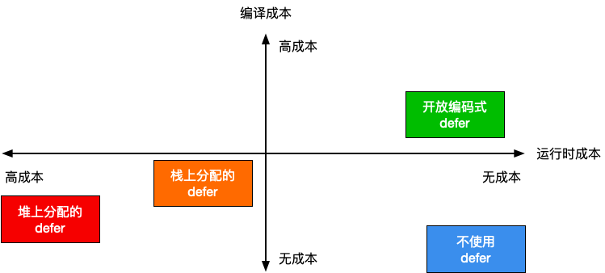

# 3.4 延迟语句

延迟语句 `defer` 在最早期的 Go 语言设计中并不存在，后来才单独增加了这一特性，
由 Robert Griesemer 完成语言规范的编写 [Griesemer, 2009]，
并由 Ken Thompson 完成最早期的实现 [Thompson, 2009]，两人合作完成这一语言特性。

defer 的语义表明，它会在函数返回、产生恐慌或者 `runtime.Goexit` 时被调用。直觉上看，
defer 应该由编译器直接将需要的函数调用插入到该调用的地方，似乎是一个编译期特性，
不应该存在运行时性能问题，非常类似于 C++ 的 RAII 范式（当离开资源的作用域时，
自动执行析构函数）。
但实际情况是，由于 defer 并没有与其依赖资源挂钩，也允许在条件、循环语句中出现，
从而不再是一个作用域相关的概念，这就是使得 defer 的语义变得相对复杂。
在一些复杂情况下，无法在编译期决定存在多少个 defer 调用。

例如，在一个执行次数不确定的 for 循环中，defer 的执行次数是随机的：

```go
func randomDefers() {
	rand.Seed(time.Now().UnixNano())
	for rand.Intn(100) > 42 {
		defer func() {
			println("golang-design/under-the-hood")
		}()
	}
}
```

因而 defer 并不是免费的午餐，在一个复杂的调用中，当无法直接确定需要的产生的延迟调用的数量时，
延迟语句将导致运行性能的下降。本节我们来讨论 defer 的实现本质及其对症下药的相关性能优化手段。

## 3.4.1 defer 的类型

延迟语句的文法产生式 `DeferStmt -> "defer" Expression` 的描述非常的简单，因而也
很容易将其处理为语法树的形式，但我们这里更关心的其实是它语义背后的中间和目标代码的形式。

在 [5.2 Go 程序编译流程](../../part1basic/ch05life/compile.md) 一节中我们提到过，
在进行中间代码生成阶段时，会通过 `compileSSA` 先调用 `buildssa` 为函数体生成 SSA 形式的函数，
并而后调用 `genssa` 将函数的 SSA 中间表示转换为具体的指令。

Go 语言的语句在执行 `buildssa` 阶段中，会由 `state.stmt` 完成函数中各个语句 SSA 处理。

```go
// src/cmd/compile/internal/gc/ssa.go
func buildssa(fn *Node, worker int) *ssa.Func {
	var s state
	...
	s.stmtList(fn.Nbody)
	...
}
func (s *state) stmtList(l Nodes) {
	for _, n := range l.Slice() { s.stmt(n) }
}
```

对于延迟语句而言，其中间表示会产生三种不同的延迟形式，
第一种是最一般情况下的在**堆上分配**的延迟语句，第二种是允许在**栈上分配**的延迟语句，
最后一种则是 **开放编码式(Open-coded)** 的延迟语句。

```go
// src/cmd/compile/internal/gc/ssa.go
func (s *state) stmt(n *Node) {
	...
	switch n.Op {
	case ODEFER:
		// 开放编码式 defer
		if s.hasOpenDefers {
			s.openDeferRecord(n.Left)
		} else {
			// 堆上分配的 defer
			d := callDefer
			if n.Esc == EscNever {
				// 栈上分配的 defer
				d = callDeferStack
			}
			s.call(n.Left, d)
		}
	case ...
	}
	...
}
```

## 3.4.2 在堆上分配的 defer

我们先来讨论最简单的在堆上分配的 defer 这种形式。在堆上分配的原因是 defer 语句出现
在了循环语句里，或者无法执行更高阶的编译器优化导致的。如果一个与 defer 出现在循环语句中，
则可执行的次数可能无法在编译期决定；如果一个调用中 defer 由于数量过多等原因，
不能被编译器进行开放编码，则也会在堆上分配 defer。

总之，由于这种不确定性的存在，在堆上分配的 defer 需要最多的运行时支持，
因而产生的运行时开销也最大。

### 编译阶段

为了使延迟语句的功能满足语言规范，该语句在编译的 SSA 阶段会被翻译为两个主体，
其中第一个主体是被延迟的函数本身，另一个主体则是函数结束时需要执行所记录 defer 的代码块。

`state.call` 调用会生成用于记录延迟调用参数的指令，并创建一个 `deferproc` 的调用指令；
而后在 `state.exit` 调用在函数返回前插入 `deferreturn` 调用的指令。

```go
// src/cmd/compile/internal/gc/ssa.go
func (s *state) call(n *Node, k callKind) *ssa.Value {
	...
	var call *ssa.Value
	if k == callDeferStack {
		...
	} else {
		// 在堆上创建 defer
		argStart := Ctxt.FixedFrameSize()
		// Defer 参数
		if k != callNormal {
			// 记录 deferproc 的参数
			argsize := s.constInt32(types.Types[TUINT32], int32(stksize))
			addr := s.constOffPtrSP(s.f.Config.Types.UInt32Ptr, argStart)
			s.store(types.Types[TUINT32], addr, argsize)	// 保存参数大小 siz
			addr = s.constOffPtrSP(s.f.Config.Types.UintptrPtr, argStart+int64(Widthptr))
			s.store(types.Types[TUINTPTR], addr, closure)	// 保存函数地址 fn
			stksize += 2 * int64(Widthptr)
			argStart += 2 * int64(Widthptr)
		}
		...

		// 创建 deferproc 调用
		switch {
		case k == callDefer:
			call = s.newValue1A(ssa.OpStaticCall, types.TypeMem, deferproc, s.mem())
		...
		}
		...
	}
	...

	// 结束 defer 块
	if k == callDefer || k == callDeferStack {
		s.exit()
		...
	}
	...
}
func (s *state) exit() *ssa.Block {
	if s.hasdefer {
		if s.hasOpenDefers {
			...
		} else {
			// 调用 deferreturn
			s.rtcall(Deferreturn, true, nil)
		}
	}
	...
}
```

例如，对于一个纯粹的 `defer` 调用而言：

```
package main

func foo() {
	return
}

func main() {
	defer foo()
	return
}
```

如果我们将其强制编译为在堆上分配的形式，可以观察到如下的汇编代码。其中 `defer foo()`
被转化为了 `deferproc` 调用，并在函数返回前，调用了 `deferreturn`：

```
TEXT main.foo(SB) /Users/changkun/Desktop/defer/ssa/main.go
	return
  0x104ea20		c3			RET			

TEXT main.main(SB) /Users/changkun/Desktop/defer/ssa/main.go
func main() {
  ...
  // 将 defer foo() { ... }() 转化为一个 deferproc 调用
  // 在调用 deferproc 前完成参数的准备工作，这个例子中没有参数
  0x104ea4d		c7042400000000		MOVL $0x0, 0(SP)		
  0x104ea54		488d0585290200		LEAQ go.func.*+60(SB), AX	
  0x104ea5b		4889442408		MOVQ AX, 0x8(SP)		
  0x104ea60		e8bb31fdff		CALL runtime.deferproc(SB)	
  ...
  // 函数返回指令 RET 前插入的 deferreturn 语句
  0x104ea7b		90			NOPL				
  0x104ea7c		e82f3afdff		CALL runtime.deferreturn(SB)	
  0x104ea81		488b6c2410		MOVQ 0x10(SP), BP		
  0x104ea86		4883c418		ADDQ $0x18, SP			
  0x104ea8a		c3			RET				
  // 函数的尾声
  0x104ea8b		e8d084ffff		CALL runtime.morestack_noctxt(SB)	
  0x104ea90		eb9e			JMP main.main(SB)			
```

### 运行阶段

一个函数中的延迟语句会被保存为一个 `_defer` 记录的链表，附着在一个 Goroutine 上。
`_defer` 记录的具体结构也非常简单，主要包含了参与调用的参数大小、
当前 defer 语句所在函数的 PC 和 SP 寄存器、被 defer 的函数的入口地址以及串联
多个 defer 的 link 链表，该链表指向下一个需要执行的 defer，如图 3.4.1 所示。

```go
// src/runtime/panic.go
type _defer struct {
	siz       int32
	heap      bool
	sp        uintptr
	pc        uintptr
	fn        *funcval
	link      *_defer
	...
}
// src/runtime/runtime2.go
type g struct {
	...
	_defer *_defer
	...
}
```

<div class="img-center" style="margin: 0 30px 0 20px; float: right; max-width: 60%">

<strong>图 3.4.1：附着在 Goroutine 上的 <code>_defer</code> 记录的链表</strong>
</div>

现在我们知道，一个在堆上分配的延迟语句被编译为了 `deferproc`，用于记录被延迟的函数调用；
在函数的尾声，会插入 `deferreturn` 调用，用于执行被延迟的调用。

下面我们就来详细看看这两个调用具体发生了什么事情。

我们先看创建 defer 的第一种形式 `deferproc`。
这个调用很简单，仅仅只是将需要被 defer 调用的函数做了一次记录：

```go
//go:nosplit
func deferproc(siz int32, fn *funcval) {
	...
	sp := getcallersp()
	argp := uintptr(unsafe.Pointer(&fn)) + unsafe.Sizeof(fn)
	callerpc := getcallerpc()

	d := newdefer(siz)
	d.fn = fn
	d.pc = callerpc
	d.sp = sp

	// 将参数保存到 _defer 记录中
	switch siz {
	case 0: // 什么也不做
	case sys.PtrSize:
		*(*uintptr)(deferArgs(d)) = *(*uintptr)(unsafe.Pointer(argp))
	default:
		memmove(deferArgs(d), unsafe.Pointer(argp), uintptr(siz))
	}

	return0()
}
```

这段代码中，本质上只是在做一些简单参数处理，
比如 `fn` 保存了 `defer` 所调用函数的调用地址，`siz` 确定了其参数的大小。
并且通过 `newdefer` 来创建一个新的 `_defer` 实例，
然后由 `fn`、`callerpc` 和 `sp` 来保存调用该 defer 的 Goroutine 上下文。

注意，在这里我们看到了一个对参数进行拷贝的操作。这个操作也是我们在实践过程中经历过的，
defer 调用被记录时，并不会对参数进行求值，而是会对参数完成一次拷贝。
这么做原因是由于语义上的考虑。直觉上讲，defer 的参数应当在它所写的位置对传入的参数
进行求值，而不是将求值步骤推迟，因为延后的参数可能发生变化，导致 defer 的语义发生意料之外的错误。
例如，`f, _ := os.Open("file.txt")` 后立刻指定 `defer f.Close()`，倘若随后的语句修改了
`f` 的值，那么将导致 `f` 无法被正常关闭。

出于性能考虑，`newdefer` 通过 P 或者调度器 sched 上的本地或全局 defer 池来
复用已经在堆上分配的内存。defer 的资源池会根据被延迟的调用所需的参数来决定 defer 记录
的大小等级，每 16 个字节分一个等级。此做法的动机与运行时内存分配器针对不同大小对象的分配思路雷同，
这里不再做深入讨论。

```go
// src/runtime/runtime2.go
type p struct {
	...
	// 不同大小的本地 defer 池
	deferpool    [5][]*_defer
	deferpoolbuf [5][32]*_defer
	...
}
type schedt struct {
	...
	// 不同大小的全局 defer 池
	deferlock mutex
	deferpool [5]*_defer
	...
}
```

对于新建的 `_defer` 实例而言，会将其加入到 Goroutine 所保留的 defer 链表上，
通过 `link` 字段串联。

```go
// src/runtime/panic.go

//go:nosplit
func newdefer(siz int32) *_defer {
	var d *_defer
	sc := deferclass(uintptr(siz))
	gp := getg()
	// 检查 defer 参数的大小是否从 p 的 deferpool 直接分配
	if sc < uintptr(len(p{}.deferpool)) {
		pp := gp.m.p.ptr()

		// 如果 p 本地无法分配，则从全局池中获取一半 defer，来填充 P 的本地资源池
		if len(pp.deferpool[sc]) == 0 && sched.deferpool[sc] != nil {
			// 出于性能考虑，如果发生栈的增长，则会调用 morestack，
			// 进一步降低 defer 的性能。因此切换到系统栈上执行，进而不会发生栈的增长。
			systemstack(func() {
				lock(&sched.deferlock)
				for len(pp.deferpool[sc]) < cap(pp.deferpool[sc])/2 && sched.deferpool[sc] != nil {
					d := sched.deferpool[sc]
					sched.deferpool[sc] = d.link
					d.link = nil
					pp.deferpool[sc] = append(pp.deferpool[sc], d)
				}
				unlock(&sched.deferlock)
			})
		}

		// 从 P 本地进行分配
		if n := len(pp.deferpool[sc]); n > 0 {
			d = pp.deferpool[sc][n-1]
			pp.deferpool[sc][n-1] = nil
			pp.deferpool[sc] = pp.deferpool[sc][:n-1]
		}
	}
	// 没有可用的缓存，直接从堆上分配新的 defer 和 args
	if d == nil {
		systemstack(func() {
			total := roundupsize(totaldefersize(uintptr(siz)))
			d = (*_defer)(mallocgc(total, deferType, true))
		})
	}
	// 将 _defer 实例添加到 Goroutine 的 _defer 链表上。
	d.siz = siz
	d.heap = true
	d.link = gp._defer
	gp._defer = d
	return d
}
```

`deferreturn` 被编译器插入到函数末尾，当跳转到它时，会将需要被 defer 的入口地址取出，
然后跳转并执行：

```go
// src/runtime/panic.go

//go:nosplit
func deferreturn(arg0 uintptr) {
	gp := getg()
	d := gp._defer
	if d == nil {
		return
	}
	// 确定 defer 的调用方是不是当前 deferreturn 的调用方
	sp := getcallersp()
	if d.sp != sp {
		return
	}
	...

	// 将参数复制出 _defer 记录外
	switch d.siz {
	case 0: // 什么也不做
	case sys.PtrSize:
		*(*uintptr)(unsafe.Pointer(&arg0)) = *(*uintptr)(deferArgs(d))
	default:
		memmove(unsafe.Pointer(&arg0), deferArgs(d), uintptr(d.siz))
	}
	// 获得被延迟的调用 fn 的入口地址，并随后立即将 _defer 释放掉
	fn := d.fn
	d.fn = nil
	gp._defer = d.link
	freedefer(d)

	// 调用，并跳转到下一个 defer
	jmpdefer(fn, uintptr(unsafe.Pointer(&arg0)))
}
```

在这个函数中，会在需要时对 `defer` 的参数再次进行拷贝，多个 `defer` 函数以 `jmpdefer` 尾调用形式被实现。
在跳转到 `fn` 之前，`_defer` 实例被释放归还，`jmpdefer` 真正需要的仅仅只是函数的入口地址和参数，
以及它的调用方 `deferreturn` 的 SP：

```asm
// src/runtime/asm_amd64.s

// func jmpdefer(fv *funcval, argp uintptr)
TEXT runtime·jmpdefer(SB), NOSPLIT, $0-16
	MOVQ	fv+0(FP), DX	// DX = fn
	MOVQ	argp+8(FP), BX	// 调用方 SP
	LEAQ	-8(BX), SP		// CALL 后的调用方 SP
	MOVQ	-8(SP), BP		// 恢复 BP，好像 deferreturn 返回
	SUBQ	$5, (SP)		// 再次返回到 CALL
	MOVQ	0(DX), BX		// BX = DX
	JMP	BX					// 最后才运行被 defer 的函数
```

这个 `jmpdefer` 巧妙的地方在于，它通过调用方 SP 来推算了 `deferreturn` 的入口地址，
从而在完成某个 `defer` 调用后，由于被 defer 的函数返回时会出栈，
会再次回到 `deferreturn` 的初始位置，进而继续反复调用，从而模拟 `deferreturn` 不断的对自己进行尾递归的假象。

上面的描述可能不太容易理解，我们再举一个实际的例子：

```go
package main

func foo() {
	for i := 1; i <= 42; i++ {
		defer func(i int) { println(i) }(i)
	}
	return
}

func main() {
	foo()
}
```

TODO: 绘图

释放操作非常普通，只是简单的将其归还到 P 的 `deferpool` 中，
并在本地池已满时将其归还到全局资源池:

```go
// src/runtime/panic.go

//go:nosplit
func freedefer(d *_defer) {
	...
	sc := deferclass(uintptr(d.siz))
	if sc >= uintptr(len(p{}.deferpool)) {
		return
	}
	pp := getg().m.p.ptr()
	// 如果 P 本地池已满，则将一半资源放入全局池，同样也是出于性能考虑
	// 操作会切换到系统栈上执行。
	if len(pp.deferpool[sc]) == cap(pp.deferpool[sc]) {
		systemstack(func() {
			var first, last *_defer
			for len(pp.deferpool[sc]) > cap(pp.deferpool[sc])/2 {
				n := len(pp.deferpool[sc])
				d := pp.deferpool[sc][n-1]
				pp.deferpool[sc][n-1] = nil
				pp.deferpool[sc] = pp.deferpool[sc][:n-1]
				if first == nil {
					first = d
				} else {
					last.link = d
				}
				last = d
			}
			lock(&sched.deferlock)
			last.link = sched.deferpool[sc]
			sched.deferpool[sc] = first
			unlock(&sched.deferlock)
		})
	}

	// 恢复 _defer 的零值，即 *d = _defer{}
	d.siz = 0
	...
	d.sp = 0
	d.pc = 0
	d.framepc = 0
	...
	d.link = nil

	// 放入 P 本地资源池
	pp.deferpool[sc] = append(pp.deferpool[sc], d)
}
```

## 3.4.3 在栈上创建 defer

defer 还可以直接在栈上进行分配，也就是第二种记录 defer 的形式 `deferprocStack`。
在栈上分配 defer 的好处在于函数返回后 `_defer` 便已得到释放，
不再需要考虑内存分配时产生的性能开销，只需要适当的维护 `_defer` 的链表即可。

在 SSA 阶段与在堆上分配的区别在于，在栈上创建 defer，
需要直接在函数调用帧上使用编译器来初始化 `_defer` 记录，并作为参数传递给 `deferprocStack`：

```go
// src/cmd/compile/internal/gc/ssa.go
func (s *state) call(n *Node, k callKind) *ssa.Value {
	...
	var call *ssa.Value
	if k == callDeferStack {
		// 直接在栈上创建 defer 记录
		t := deferstruct(stksize) // 从编译器角度构造 _defer 结构
		d := tempAt(n.Pos, s.curfn, t)

		s.vars[&memVar] = s.newValue1A(ssa.OpVarDef, types.TypeMem, d, s.mem())
		addr := s.addr(d, false)

		// 在栈上预留记录 _defer 的各个字段的空间
		s.store(types.Types[TUINT32],
			s.newValue1I(ssa.OpOffPtr, types.Types[TUINT32].PtrTo(), t.FieldOff(0), addr),
			s.constInt32(types.Types[TUINT32], int32(stksize)))
		s.store(closure.Type,
			s.newValue1I(ssa.OpOffPtr, closure.Type.PtrTo(), t.FieldOff(6), addr),
			closure)

		// 记录参与 defer 调用的函数参数
		ft := fn.Type
		off := t.FieldOff(12)
		args := n.Rlist.Slice()

		// 调用 deferprocStack，以 _defer 记录的指针作为参数传递
		arg0 := s.constOffPtrSP(types.Types[TUINTPTR], Ctxt.FixedFrameSize())
		s.store(types.Types[TUINTPTR], arg0, addr)
		call = s.newValue1A(ssa.OpStaticCall, types.TypeMem, deferprocStack, s.mem())
		...
	} else { ... }

	// 函数尾声与堆上分配的栈一样，调用 deferreturn
	if k == callDefer || k == callDeferStack {
		...
		s.exit()
	}
	...
}
```

可见，在编译阶段，一个 `_defer` 记录的空间已经在栈上得到保留，`deferprocStack` 的作用
就仅仅承担了运行时对该记录的初始化这一功能：

```go
// src/runtime/panic.go

//go:nosplit
func deferprocStack(d *_defer) {
	gp := getg()
	// 注意，siz 和 fn 已经在编译阶段完成设置，这里只初始化了其他字段
	d.started = false
	d.heap = false		// 可见此时 defer 被标记为不在堆上分配
	d.openDefer = false
	d.sp = getcallersp()
	d.pc = getcallerpc()
	...
	// 尽管在栈上进行分配，仍然需要将多个 _defer 记录通过链表进行串联，
	// 以便在 deferreturn 中找到被延迟的函数的入口地址：
	//   d.link = gp._defer
	//   gp._defer = d
	*(*uintptr)(unsafe.Pointer(&d.link)) = uintptr(unsafe.Pointer(gp._defer))
	*(*uintptr)(unsafe.Pointer(&gp._defer)) = uintptr(unsafe.Pointer(d))
	return0()
}
```

至于函数尾声的行为，与在堆上进行分配的操作同样是调用 `deferreturn`，我们就不再重复说明了。
当然，里面涉及的 `freedefer` 调用由于不需要释放任何内存，也就早早返回了：

```go
// src/runtime/panic.go
func freedefer(d *_defer) {
	if !d.heap { return }
	...
}
```

## 3.4.3 开放编码式 defer

正如本节最初所描述的那样，defer 给我们的第一感觉其实是一个编译期特性。前面我们讨论了
为什么 defer 会需要运行时的支持，以及需要运行时的 defer 是如何工作的。现在我们来
探究一下什么情况下能够让 defer 进化为一个仅编译期特性，即在函数末尾直接对延迟函数进行调用，
做到几乎不需要额外的开销。这类几乎不需要额外运行时性能开销的 defer，正是开放编码式 defer。
这类 defer 与直接调用产生的性能差异有多大呢？我们不妨编写两个性能测试：

```go
func call()      { func() {}() }
func callDefer() { defer func() {}() }
func BenchmarkDefer(b *testing.B) {
	for i := 0; i < b.N; i++ {
		call() // 第二次运行时替换为 callDefer
	}
}
```

在 Go 1.14 版本下，读者可以获得类似下方的性能估计，其中使用 `callDefer` 后，
性能损耗大约为 1 ns。这种纳秒级的性能损耗不到一个 CPU 时钟周期，
我们已经可以认为开放编码式 defer 几乎没有了性能开销：

```
name      old time/op  new time/op  delta
Defer-12  1.24ns ± 1%  2.23ns ± 1%  +80.06%  (p=0.000 n=10+9)
```

我们再来观察一下开放编码式 defer 最终被编译的形式：

```shell
$ go build -gcflags "-l" -ldflags=-compressdwarf=false -o main.out main.go
$ go tool objdump -S main.out > main.s
```

对于如下形式的函数调用：

```go
var mu sync.Mutex
func callDefer() {
	mu.Lock()
	defer mu.Unlock()
}
```

整个调用最终编译结果既没有 `deferproc` 或者 `deferprocStack`，也没有了 `deferreturn`。
延迟语句被直接插入到了函数的末尾：

```asm
TEXT main.callDefer(SB) /Users/changkun/Desktop/defer/main.go
func callDefer() {
  ...
	mu.Lock()
  0x105794a		488d05071f0a00		LEAQ main.mu(SB), AX		
  0x1057951		48890424		MOVQ AX, 0(SP)			
  0x1057955		e8f6f8ffff		CALL sync.(*Mutex).Lock(SB)	
	defer mu.Unlock()
  0x105795a		488d057f110200		LEAQ go.func.*+1064(SB), AX	
  0x1057961		4889442418		MOVQ AX, 0x18(SP)		
  0x1057966		488d05eb1e0a00		LEAQ main.mu(SB), AX		
  0x105796d		4889442410		MOVQ AX, 0x10(SP)		
}
  0x1057972		c644240f00		MOVB $0x0, 0xf(SP)		
  0x1057977		488b442410		MOVQ 0x10(SP), AX		
  0x105797c		48890424		MOVQ AX, 0(SP)			
  0x1057980		e8ebfbffff		CALL sync.(*Mutex).Unlock(SB)	
  0x1057985		488b6c2420		MOVQ 0x20(SP), BP		
  0x105798a		4883c428		ADDQ $0x28, SP			
  0x105798e		c3			RET				
  ...
```

那么开放编码式 defer 是怎么实现的？所有的 defer 都是开放编码式的吗？
什么情况下，开放编码式 defer 会退化为一个依赖运行时的特性？

### 产生条件

我们先来看开放编码式 defer 的产生条件。在 SSA 的构建阶段 `buildssa`，我们有：

```go
// src/cmd/compile/internal/gc/ssa.go
const maxOpenDefers = 8
func walkstmt(n *Node) *Node {
	...
	switch n.Op {
	case ODEFER:
		Curfn.Func.SetHasDefer(true)
		Curfn.Func.numDefers++
		// 超过 8 个 defer 时，禁用对 defer 进行开放编码
		if Curfn.Func.numDefers > maxOpenDefers {
			Curfn.Func.SetOpenCodedDeferDisallowed(true)
		}
		// 存在循环语句中的 defer，禁用对 defer 进行开放编码。
		// 是否有 defer 发生在循环语句内，会在 SSA 之前的逃逸分析中进行判断，
		// 逃逸分析会检查是否存在循环（loopDepth）：
		// if where.Op == ODEFER && e.loopDepth == 1 {
		// 	where.Esc = EscNever
		// 	...
		// }
		if n.Esc != EscNever {
			Curfn.Func.SetOpenCodedDeferDisallowed(true)
		}
	case ...
	}
	...
}
func buildssa(fn *Node, worker int) *ssa.Func {
	...
	var s state
	...
	s.hasdefer = fn.Func.HasDefer()
	...
	// 可以对 defer 进行开放编码的条件
	s.hasOpenDefers = Debug['N'] == 0 && s.hasdefer && !s.curfn.Func.OpenCodedDeferDisallowed()
	if s.hasOpenDefers &&
		s.curfn.Func.numReturns*s.curfn.Func.numDefers > 15 {
		s.hasOpenDefers = false
	}
	...
}
```

这样，我们得到了允许进行 defer 的开放编码的主要条件
（此处略去了一些常见生产环境无关的条件，例如启用竞争检查时也不能对 defer 进行开放编码）：

1. 没有禁用编译器优化，即没有设置 `-gcflags "-N"`
2. 存在 defer 调用
3. 函数内 defer 的数量不超过 8 个、且返回语句与延迟语句个数的乘积不超过 15
4. 没有与 defer 发生在循环语句中

### 延迟比特

当然，正常编写的 `defer` 可以直接被编译器分析得出，但是如本节开头提到的，如果一个
defer 发生在一个条件语句中，而这个条件必须等到运行时才能确定：

```go
if rand.Intn(100) < 42 {
	defer fmt.Println("meaning-of-life")
}
```

那么如何才能使用最小的成本，让插入到函数末尾的延迟语句，在条件成立时候被正确执行呢？
这便需要一种机制，能够记录存在延迟语句的条件分支是否被执行，
这种机制在 Go 中利用了延迟比特（defer bit）。这种做法非常巧妙，但原理却非常简单。

对于下面的代码而言：

```go
defer f1(a1)
if cond {
	defer f2(a2)
}
...
```

使用延迟比特的核心思想可以用下面的伪代码来概括。
在创建延迟调用的阶段，首先通过延迟比特的特定位置记录哪些带条件的 defer 被触发。
这个延迟比特是一个长度为 8 位的二进制码（也是硬件架构里最小、最通用的情况），
以每一位是否被设置为 1，来判断延迟语句是否在运行时被设置，如果设置，则发生调用。
否则则不调用：

```go
deferBits = 0           // 初始值 00000000
deferBits |= 1 << 0     // 遇到第一个 defer，设置为 00000001
_f1 = f1
_a1 = a1
if cond {
	// 如果第二个 defer 被设置，则设置为 00000011，否则依然为 00000001
	deferBits |= 1 << 1
	_f2 = f2
	_a2 = a2
}
```

在退出位置，再重新根据被标记的延迟比特，反向推导哪些位置的 defer 需要被触发，从而
执行延迟调用：

```go
exit:
// 按顺序倒序检查延迟比特。如果第二个 defer 被设置，则
//   00000011 & 00000010 == 00000010，即延迟比特不为零，应该调用 f2。
// 如果第二个 defer 没有被设置，则 
//   00000001 & 00000010 == 00000000，即延迟比特为零，不应该调用 f2。
if deferBits & 1 << 1 != 0 { // 00000011 & 00000010 != 0
	deferBits &^= 1<<1       // 00000001
	_f2(_a2)
}
// 同理，由于 00000001 & 00000001 == 00000001，因此延迟比特不为零，应该调用 f1
if deferBits && 1 << 0 != 0 {
	deferBits &^= 1<<0
	_f1(_a1)
}
```

在实际的实现中，可以看到，当可以设置开放编码式 defer 时，`buildssa` 会首先创建一个
长度位 8 位的临时变量：

```go
// src/cmd/compile/internal/gc/ssa.go
func buildssa(fn *Node, worker int) *ssa.Func {
	...
	if s.hasOpenDefers {
		// 创建 deferBits 临时变量
		deferBitsTemp := tempAt(src.NoXPos, s.curfn, types.Types[TUINT8])
		s.deferBitsTemp = deferBitsTemp
		// deferBits 被设计为 8 位二进制，因此可以被开放编码的 defer 数量不能超过 8 个
		// 此处还将起始 deferBits 设置为零
		startDeferBits := s.entryNewValue0(ssa.OpConst8, types.Types[TUINT8])
		s.vars[&deferBitsVar] = startDeferBits
		s.deferBitsAddr = s.addr(deferBitsTemp, false)
		s.store(types.Types[TUINT8], s.deferBitsAddr, startDeferBits)
		...
	}
	...
	s.stmtList(fn.Nbody) // 调用 s.stmt
	...
}
```

随后针对出现 defer 的语句，进行编码：

```go
// src/cmd/compile/internal/gc/ssa.go
func (s *state) stmt(n *Node) {
	...
	switch n.Op {
	case ODEFER:
		// 开放编码式 defer
		if s.hasOpenDefers {
			s.openDeferRecord(n.Left)
		} else { ... }
	case ...
	}
	...
}
// 存储一个 defer 调用的相关信息，例如所在的语法树结点、被延迟的调用、参数等等
type openDeferInfo struct {
	n           *Node
	closure     *ssa.Value
	closureNode *Node
	...
	argVals     []*ssa.Value
	argNodes    []*Node
}
func (s *state) openDeferRecord(n *Node) {
	...
	var args []*ssa.Value
	var argNodes []*Node

	// 记录与 defer 相关的入口地址与参数信息
	opendefer := &openDeferInfo{n: n}
	fn := n.Left
	// 记录函数入口地址
	if n.Op == OCALLFUNC {
		closureVal := s.expr(fn)
		closure := s.openDeferSave(nil, fn.Type, closureVal)
		opendefer.closureNode = closure.Aux.(*Node)
		if !(fn.Op == ONAME && fn.Class() == PFUNC) {
			opendefer.closure = closure
		}
	} else {
		...
	}
	// 记录需要立即求值的的参数
	for _, argn := range n.Rlist.Slice() {
		var v *ssa.Value
		if canSSAType(argn.Type) {
			v = s.openDeferSave(nil, argn.Type, s.expr(argn))
		} else {
			v = s.openDeferSave(argn, argn.Type, nil)
		}
		args = append(args, v)
		argNodes = append(argNodes, v.Aux.(*Node))
	}
	opendefer.argVals = args
	opendefer.argNodes = argNodes

	// 每多出现一个 defer，len(defers) 会增加，进而 
	// 延迟比特 deferBits |= 1<<len(defers) 被设置在不同的位上
	index := len(s.openDefers)
	s.openDefers = append(s.openDefers, opendefer)
	bitvalue := s.constInt8(types.Types[TUINT8], 1<<uint(index))
	newDeferBits := s.newValue2(ssa.OpOr8, types.Types[TUINT8], s.variable(&deferBitsVar, types.Types[TUINT8]), bitvalue)
	s.vars[&deferBitsVar] = newDeferBits
	s.store(types.Types[TUINT8], s.deferBitsAddr, newDeferBits)
}
```

在函数返回退出前，`state` 的 `exit` 函数会依次倒序创建对延迟比特的检查代码，
从而顺序调用被延迟的函数调用：

```go
// src/cmd/compile/internal/gc/ssa.go
func (s *state) exit() *ssa.Block {
	if s.hasdefer {
		if s.hasOpenDefers {
			...
			s.openDeferExit()
		} else {
			...
		}
	}
	...
}
func (s *state) openDeferExit() {
	deferExit := s.f.NewBlock(ssa.BlockPlain)
	s.endBlock().AddEdgeTo(deferExit)
	s.startBlock(deferExit)
	s.lastDeferExit = deferExit
	s.lastDeferCount = len(s.openDefers)
	zeroval := s.constInt8(types.Types[TUINT8], 0)
	// 倒序检查 defer
	for i := len(s.openDefers) - 1; i >= 0; i-- {
		r := s.openDefers[i]
		bCond := s.f.NewBlock(ssa.BlockPlain)
		bEnd := s.f.NewBlock(ssa.BlockPlain)

		// 检查 deferBits
		deferBits := s.variable(&deferBitsVar, types.Types[TUINT8])
		// 创建 if deferBits & 1 << len(defer) != 0 { ... }
		bitval := s.constInt8(types.Types[TUINT8], 1<<uint(i))
		andval := s.newValue2(ssa.OpAnd8, types.Types[TUINT8], deferBits, bitval)
		eqVal := s.newValue2(ssa.OpEq8, types.Types[TBOOL], andval, zeroval)
		b := s.endBlock()
		b.Kind = ssa.BlockIf
		b.SetControl(eqVal)
		b.AddEdgeTo(bEnd)
		b.AddEdgeTo(bCond)
		bCond.AddEdgeTo(bEnd)
		s.startBlock(bCond)

		// 如果创建的条件分支被触发，则清空当前的延迟比特: deferBits &^= 1 << len(defers)
		nbitval := s.newValue1(ssa.OpCom8, types.Types[TUINT8], bitval)
		maskedval := s.newValue2(ssa.OpAnd8, types.Types[TUINT8], deferBits, nbitval)
		s.store(types.Types[TUINT8], s.deferBitsAddr, maskedval)
		s.vars[&deferBitsVar] = maskedval

		// 处理被延迟的函数调用，取出保存的入口地址、参数信息
		argStart := Ctxt.FixedFrameSize()
		fn := r.n.Left
		stksize := fn.Type.ArgWidth()
		...
		for j, argAddrVal := range r.argVals {
			f := getParam(r.n, j)
			pt := types.NewPtr(f.Type)
			addr := s.constOffPtrSP(pt, argStart+f.Offset)
			if !canSSAType(f.Type) {
				s.move(f.Type, addr, argAddrVal)
			} else {
				argVal := s.load(f.Type, argAddrVal)
				s.storeType(f.Type, addr, argVal, 0, false)
			}
		}
		// 调用
		var call *ssa.Value
		...
		call = s.newValue1A(ssa.OpStaticCall, types.TypeMem, fn.Sym.Linksym(), s.mem())
		call.AuxInt = stksize
		s.vars[&memVar] = call
		...
		s.endBlock()
		s.startBlock(bEnd)
	}
}
```

从整个过程中我们可以看到，开放编码式 defer 并不是绝对的零成本，尽管编译器能够做到将
延迟调用直接插入返回语句之前，但出于语义的考虑，需要在栈上对参与延迟调用的参数进行一次求值；
同时出于条件语句中可能存在的 defer，还额外需要通过延迟比特来记录一个延迟语句是否在运行时
被设置。
因此，开放编码式 defer 的成本体现在非常少量的指令和位运算来配合在运行时判断
是否存在需要被延迟调用的 defer。

## 3.4.4 `defer` 的优化之路

我们最后来回顾一下延迟语句的整个演进过程。

defer 的早期实现其实是非常的粗糙的。每当出现一个 defer 调用，都会在堆上分配 defer 记录，
并对参与调用的参数实施一次拷贝操作，然后将其加入到 defer 链表上；当函数返回需要触发 defer 调用时，
依次将 defer 从链表中取出，完成调用。当然最初的实现并不需要完美，未来总是可以迭代其性能问题。

在 Go 1.1 的开发阶段，defer 获得了它的第一次优化 [Cox, 2011]。Russ Cox 意识到
defer 性能问题的根源是当产生多个 defer 调用时，造成的过多的内存分配与拷贝操作，
进而提出将 defer 的分配和释放过程在每个 Goroutine 内进行批量处理。当时 Dmitry Vyukov
则提议在栈上分配会更加有效，但 Russ Cox 错误的认为在执行栈上分配 defer 记录与
在其他地方进行分配并没有带来太多收益，最终实现了 per-G 批量式分配的 defer 机制。

由于后续调度器的改进，工作窃取调度的引入，运行时开始支持 per-P 的局部资源池，
defer 作为发生在 Goroutine 内的调用，所需的内存自然也是一类可以被视作局部持有的资源。
因此分配和释放 defer 的资源在 Go 1.3 时得到优化 [Vyukov, 2014]，
Dmitry Vyukov 将 per-G 分配的 defer 改为了从 per-P 资源池分配的机制。

由于分配延迟记录 `_defer` 的调用 `newdefer` 可能存在本地资源池、全局资源池均不存在可复用的内存，
进而导致栈分裂，更糟糕的情况下甚至可能发生抢占，导致 M/P 解绑与绑定等额外的调度开销。
因此，Austin Clements 对 defer 做的一个优化 [Clements, 2016] 是
在每个 `deferproc` 和 `deferreturn` 中都切换至系统栈，从而阻止了抢占和栈增长的发生，
也就优化消除了抢占带来的 M/P 绑定所带来的开销。除此之外，对于每次产生记录时，
无论参数大小如何都涉及 `memmove` 系统调用，从而产生一次 `memmove` 的调用成本，
Austin 的优化中还特地针对没有参数和指针大小参数的这两种情况进行了判断，从而跳过了
这些特殊情况下情况下 `memmove` 带来的开销。

后来，Keith Randall 终于实现了 [Randall, 2013] 很早之前 Dmitry Vyukov 就已经
提出的在栈上分配 defer 的优化 [Cox, 2011]，简单情况下不再需要使用运行时对延迟记录
的内存管理。为 Go 1.13 进一步提升了 defer 的性能。

在 Go 1.14 中，Dan Scales 作为 Go 团队的新成员，defer 的优化成为了他的第一个项目。
他提出开放式编码 defer [Scales, 2019]，通过编译器辅助信息和延迟比特在函数末尾处
直接获取调用函数及参数，完成了近乎零成本的 defer 调用，成为了 Go 1.14 中几个出色的
运行时性能优化之一。

至此，defer 的优化之路正式告一段落。

| 版本 | 内容 | 作者 |
|:----|:-----|:----|
| 1.0 及之前 | 制定 defer 的语言规范，首次实现，在堆上分配 | Robert Griesemer, Ken Thompson |
| 1.1 | 将 defer 的分配与释放方式改为 per-G 批量处理 | Russ Cox |
| 1.3 | 将 defer 的分配与释放方式改为 per-P 池化处理 | Dmitry Vyukov |
| 1.8 | 将 defer 的执行过程切换到系统栈中，阻止抢占和栈增长带来的成本 | Austin Clements |
| 1.13 | 实现在执行栈上分配 defer，消除了常见的简单情况下堆上分配带来的开销 | Keith Randall |
| 1.14 | 实现开放式编码 defer，支持在函数末尾处直接插入 defer 调用，引入几乎零成本 defer | Dan Scales |

## 3.4.5 小结

<div class="img-center" style="margin: 0 30px 0 20px; float: right; max-width: 60%">

<strong>图 3.4.2：不同类型 defer 的编译与运行时成本之间的取舍</strong>
</div>

我们最后来总结一下 defer 的基本工作原理以及三种 defer 的性能取舍，见图 3.4.2。

1. 对于开放编码式 defer 而言：
	- 编译器会直接将所需的参数进行存储，并在返回语句的末尾插入被延迟的调用；
	- 当整个调用中逻辑上会执行的 defer 不超过 15 个（例如七个 defer 作用在两个返回语句）、总 defer 数量不超过 8 个、且没有出现在循环语句中时，会激活使用此类 defer；
	- 此类 defer 的唯一的运行时成本就是存储参与延迟调用的相关信息，运行时性能最好。
2. 对于栈上分配的 defer 而言：
	- 编译器会直接在栈上记录一个 `_defer` 记录，该记录不涉及内存分配，并将其作为参数，传入被翻译为 `deferprocStack` 的延迟语句，在延迟调用的位置将 `_defer` 压入 Goroutine 对应的延迟调用链表中；
	- 在函数末尾处，通过编译器的配合，在调用被 defer 的函数前，调用 `deferreturn`，将被延迟的调用出栈并执行；
	- 此类 defer 的唯一运行时成本是从 `_defer` 记录中将参数复制出，以及从延迟调用记录链表出栈的成本，运行时性能其次。
3. 对于堆上分配的 defer 而言：
	- 编译器首先会将延迟语句翻译为一个 `deferproc` 调用，进而从运行时分配一个用于记录被延迟调用的 `_defer` 记录，并将被延迟的调用的入口地址及其参数复制保存，入栈到 Goroutine 对应的延迟调用链表中；
	- 在函数末尾处，通过编译器的配合，在调用被 defer 的函数前，调用 `deferreturn`，从而将 `_defer` 实例归还到资源池，而后通过模拟尾递归的方式来对需要 defer 的函数进行调用。
	- 此类 defer 的主要性能问题存在于每个 defer 语句产生记录时的内存分配，记录参数和完成调用时的参数移动时的系统调用，运行时性能最差。

## 进一步阅读的参考文献

- [Griesemer, 2009] Robert Griesemer. defer statement. Jan 27, 2009. https://github.com/golang/go/commit/4a903e0b32be5a590880ceb7379e68790602c29d
- [Thompson, 2009] Ken Thompson. defer. Jan 27, 2009. https://github.com/golang/go/commit/1e1cc4eb570aa6fec645ff4faf13431847b99db8
- [Cox, 2011] Russ Cox. runtime: aggregate defer. Oct, 2011. https://github.com/golang/go/issues/2364
- [Clements, 2016] Austin Clements. runtime: optimize defer code. Sep, 2016. https://github.com/golang/go/commit/4c308188cc05d6c26f2a2eb30631f9a368aaa737
- [Ma, 2016] Minux Ma. runtime: defer is slow. Mar, 2016. https://github.com/golang/go/issues/14939
- [Randall, 2013] Keith Randall. cmd/compile: allocate some defers in stack frames. Dec, 2013. https://github.com/golang/go/issues/6980
- [Vyukov, 2014] Dmitry Vyukov. runtime: per-P defer pool. Jan, 2014. https://github.com/golang/go/commit/1ba04c171a3c3a1ea0e5157e8340b606ec9d8949
- [Scales, 2019] Dan Scales, Keith Randall, and Austin Clements. Proposal: Low-cost defers through inline code, and extra funcdata to manage the panic case. Sep, 2019. https://go.googlesource.com/proposal/+/refs/heads/master/design/34481-opencoded-defers.md

## 许可

&copy; 2018-2020 The [golang.design](https://golang.design) Initiative Authors. Licensed under [CC-BY-NC-ND 4.0](https://creativecommons.org/licenses/by-nc-nd/4.0/).
