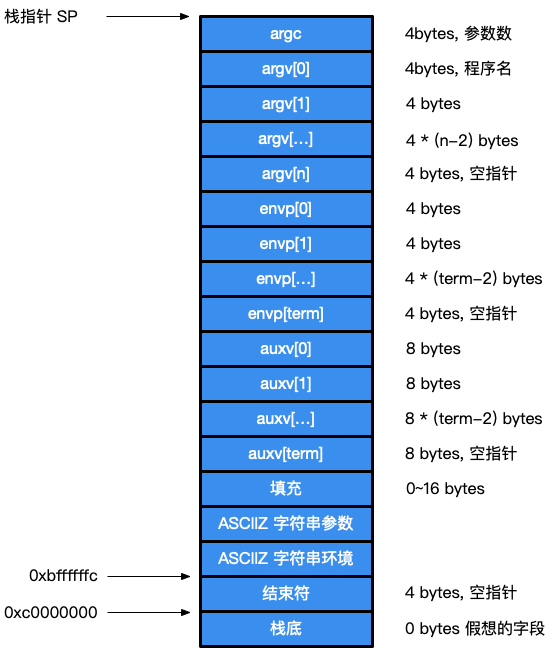

# Go 程序生命周期：程序引导

[TOC]

本节讨论 Go 程序的引导流程。

## 入口

首先，我们需要寻找程序的入口，一个通常的做法是编写一个非常基本的程序：

```go
package main

func main() {
	println("hello, world!")
}
```

然后编译：

```bash
go build -gcflags "-N -l" -ldflags=-compressdwarf=false -o main main.go
```

> `-gcflags "-N -l"` 用于关闭编译器代码优化与函数内联。
> 
> 此外还需注意，Go 1.11 开始将调试信息压缩为 DWARF，macOS 下的 gdb 不能解释 DWARF。
因此需要使用 GDB 调试需要增加 `-ldflags=-compressdwarf=false`。

并使用通过 gdb 调试来确定程序的入口地址：

```gdb
$ gdb main
(...)
(gdb) info files
Symbols from "/Users/changkun/dev/go-under-the-hood/demo/1-boot/main".
Local exec file:
        `/Users/changkun/dev/go-under-the-hood/demo/1-boot/main', file type mach-o-x86-64.
        Entry point: 0x1049e20
        0x0000000001001000 - 0x000000000104dfcf is .text
        (...)
(gdb) b *0x1049e20
Breakpoint 1 at 0x1049e20: file /usr/local/Cellar/go/1.11/libexec/src/runtime/rt0_darwin_amd64.s, line 8.
```

可以看到，程序的入口在 `rt0_darwin_amd64.s` 第八行，即：

```asm
TEXT _rt0_amd64_darwin(SB),NOSPLIT,$-8
	JMP	_rt0_amd64(SB)
```

进而跳转到 `asm_amd64.s`：

```asm
// _rt0_amd64 是 amd64 系统上使用内部链接时候常见的引导代码。
// 这是该程序从内核到普通 -buildmode=exe 程序的入口。
// 栈保存了参数的数量以及 C 风格的 argv
TEXT _rt0_amd64(SB),NOSPLIT,$-8
	MOVQ	0(SP), DI	// argc
	LEAQ	8(SP), SI	// argv
	JMP	runtime·rt0_go(SB)
```

从汇编的 `JMP` 指令可以看出，程序会立即跳转到 `runtime.rt0_go`，它便完成了整个
运行时的调用：

```asm
TEXT runtime·rt0_go(SB),NOSPLIT,$0
	// 将参数向前复制到一个偶数栈上
	MOVQ	DI, AX		// argc
	MOVQ	SI, BX		// argv
	SUBQ	$(4*8+7), SP		// 2args 2auto
	ANDQ	$~15, SP
	MOVQ	AX, 16(SP)
	MOVQ	BX, 24(SP)

	// 从给定（操作系统）栈中创建 istack。
	// _cgo_init 可能更新 stackguard
	MOVQ	$runtime·g0(SB), DI
	LEAQ	(-64*1024+104)(SP), BX
	MOVQ	BX, g_stackguard0(DI)
	MOVQ	BX, g_stackguard1(DI)
	MOVQ	BX, (g_stack+stack_lo)(DI)
	MOVQ	SP, (g_stack+stack_hi)(DI)

	// 寻找正在运行的处理器信息
	MOVL	$0, AX
	CPUID
	MOVL	AX, SI
	
	// CPU 相关的一些检测
	(...)

#ifdef GOOS_darwin
	// 跳过 TLS 设置 on Darwin
	JMP ok
#endif

	LEAQ	runtime·m0+m_tls(SB), DI
	CALL	runtime·settls(SB)

	// 使用它进行存储，确保能正常运行
	get_tls(BX)
	MOVQ	$0x123, g(BX)
	MOVQ	runtime·m0+m_tls(SB), AX
	CMPQ	AX, $0x123
	JEQ 2(PC)
	CALL	runtime·abort(SB)
ok:
	// 程序刚刚启动，此时位于主 OS 线程
	// 设置 per-goroutine 和 per-mach 寄存器
	get_tls(BX)
	LEAQ	runtime·g0(SB), CX
	MOVQ	CX, g(BX)
	LEAQ	runtime·m0(SB), AX

	// 保存 m->g0 = g0
	MOVQ	CX, m_g0(AX)
	// 保存 m0 to g0->m
	MOVQ	AX, g_m(CX)

	CLD				// 约定 D 总是被清除
	CALL	runtime·check(SB)

	MOVL	16(SP), AX		// 复制 argc
	MOVL	AX, 0(SP)
	MOVQ	24(SP), AX		// 复制 argv
	MOVQ	AX, 8(SP)
	CALL	runtime·args(SB)
	CALL	runtime·osinit(SB)
	CALL	runtime·schedinit(SB)

	// 创建一个新的 goroutine 来启动程序
	MOVQ	$runtime·mainPC(SB), AX		// 入口
	PUSHQ	AX
	PUSHQ	$0			// 参数大小
	CALL	runtime·newproc(SB)
	POPQ	AX
	POPQ	AX

	// 启动这个 M
	CALL	runtime·mstart(SB)

	CALL	runtime·abort(SB)	// mstart 应该永不返回
	RET

	(...)
	RET

DATA	runtime·mainPC+0(SB)/8,$runtime·main(SB)
GLOBL	runtime·mainPC(SB),RODATA,$8
```

对于 Linux 而言，这个过程基本类似，这里不再赘述。

## 引导

从上面的汇编代码我们可以看出，整个准备过程按照如下顺序进行：

`runtime.g0`、`runtime.m0` 是一组全局变量，在程序运行之初就已经存在。
除了程序参数外，会首先将 m0 与 g0 互相关联（在[调度器：基本结构](../../part2runtime/ch06sched/basic.md)中讨论 M 与 G 之间的关系）。

### 步骤1：runtime.check

`runtime.check` 位于进行类型检查，
基本上属于对编译器翻译工作的一个校验，确保运行时类型正确。
这里粗略展示整个函数的内容：

```go
// runtime/runtime1.go

func check() {
	var (
		a     int8
		b     uint8
		(...)
	)
	(...)

	// 校验 int8 类型 sizeof 是否为 1，下同
	if unsafe.Sizeof(a) != 1 {
		throw("bad a")
	}
	if unsafe.Sizeof(b) != 1 {
		throw("bad b")
	}
	(...)
}
```

### 步骤2：runtime.args

接下来我们看到 `argc, argv` 作为参数传递给 `runtime.args` 处理程序参数的相关事宜。

```go
// runtime/runtime1.go

func args(c int32, v **byte) {
	argc = c
	argv = v
	sysargs(c, v)
}
```

`runtime.args` 函数将参数指针保存到了 `argc` 和 `argv` 这两个全局变量中，供其他初始化函数使用。
而后调用了平台特定的 `runtime.sysargs`。

在 darwin 平台中，只负责获取程序的 `executable_path`：

```go
// runtime/os_darwin.go

//go:nosplit
func argv_index(argv **byte, i int32) *byte {
	return *(**byte)(add(unsafe.Pointer(argv), uintptr(i)*sys.PtrSize))
}

// 链接到 os 包
//go:linkname executablePath os.executablePath
var executablePath string

func sysargs(argc int32, argv **byte) {
	// 跳过 argv, envv 与第一个字符串为路径
	n := argc + 1
	for argv_index(argv, n) != nil {
		n++
	}
	executablePath = gostringnocopy(argv_index(argv, n+1))

	// 移除 "executable_path=" 前缀（OS X 10.11 之后存在）
	const prefix = "executable_path="
	if len(executablePath) > len(prefix) && executablePath[:len(prefix)] == prefix {
		executablePath = executablePath[len(prefix):]
	}
}
```

这个参数用于设置 `os` 包中的 `executablePath` 变量。

而在 Linux 平台中，这个过程就变得复杂起来了。
与 darwin 使用 `mach-o` 不同，Linux 使用 ELF 格式 [4, 6]。

ELF 除了 argc, argv, envp 之外，会携带辅助向量（auxiliary vector）将某些内核级的信息
传递给用户进程。具体结构如图 1 所示。



***图1：进程栈结构***

对照词表，我们能够很容易的看明白 `runtime.sysargs` 在 Linux amd64 下作的事情：

```go
// runtime/os_linux.go

// physPageSize 是操作系统的物理页字节大小。内存页的映射和反映射操作必须以
// physPageSize 的整数倍完成
var physPageSize uintptr

func sysargs(argc int32, argv **byte) {
	n := argc + 1

	// 跳过 argv, envp 来获取 auxv
	for argv_index(argv, n) != nil {
		n++
	}

	// 跳过 NULL 分隔符
	n++

	// 现在 argv+n 即为 auxv
	auxv := (*[1 << 28]uintptr)(add(unsafe.Pointer(argv), uintptr(n)*sys.PtrSize))

	// 如果此时 auxv 读取成功，则直接返回，sysauxv 函数见下方。
	if sysauxv(auxv[:]) != 0 {
		return
	}
	// 某些情况下，我们无法获取装载器提供的 auxv，例如 Android 上的装载器
	// 为一个库文件。这时退回到 /proc/self/auxv
	// 使用 open 系统调用打开文件
	fd := open(&procAuxv[0], 0 /* O_RDONLY */, 0)

	// 若 /proc/self/auxv 打开也失败了
	if fd < 0 {
		// 在 Android 下，/proc/self/auxv 可能不可读取（见 #9229），因此我们再回退到
		// 通过 mincore 来检测物理页的大小。
		// mincore 会在地址不是系统页大小的倍数时返回 EINVAL。
		const size = 256 << 10 // 需要分配的内存大小

		// 此时内存管理尚未启动，直接走系统调用
		// 使用 mmap 系统调用分配内存
		p, err := mmap(nil, size, _PROT_READ|_PROT_WRITE, _MAP_ANON|_MAP_PRIVATE, -1, 0)
		if err != 0 {
			return
		}
		var n uintptr
		for n = 4 << 10; n < size; n <<= 1 {
			err := mincore(unsafe.Pointer(uintptr(p)+n), 1, &addrspace_vec[0])
			if err == 0 {
				// 如果没有出现错误，则说明此时的 n 是系统内存页的整数倍，我们便已第一次拿到的 n 作为 go 运行时的
				// 物理页的大小
				physPageSize = n
				break
			}
		}
		// 如果遍历完后仍然无法得到物理页的大小，则直接以 size 的大小作为物理页的大小。
		if physPageSize == 0 {
			physPageSize = size
		}
		// 使用 munmap 释放分配的内存，这时已经确定好系统页的大小，直接返回。
		munmap(p, size)
		return
	}

	// 打开文件成功，我们从文件中读取 auxv 信息。
	var buf [128]uintptr
	n = read(fd, noescape(unsafe.Pointer(&buf[0])), int32(unsafe.Sizeof(buf)))
	closefd(fd)
	if n < 0 {
		return
	}
	// 即便我们无法读取整个文件，也要确保 buf 已经被终止
	buf[len(buf)-2] = _AT_NULL
	sysauxv(buf[:]) // 调用并确定物理页的大小
}

func sysauxv(auxv []uintptr) int {
	var i int
	// 依次读取 auxv 键值对
	for ; auxv[i] != _AT_NULL; i += 2 {
		tag, val := auxv[i], auxv[i+1]
		switch tag {
		case _AT_RANDOM:
			// 内核提供了一个指针，指向16字节的随机数据
			startupRandomData = (*[16]byte)(unsafe.Pointer(val))[:]

		case _AT_PAGESZ:
			// 读取内存页的大小
			physPageSize = val
			// 这里其实也可能出现无法读取到物理页大小的情况，但后续再内存分配器初始化的时候还会对
			// physPageSize 的大小进行检查，如果读取失败则无法运行程序，从而抛出运行时错误
		}

		(...)
	}
	return i / 2
}
```

其中涉及 mmap、mincore、munmap 等系统调用 [7, 8]。

### 步骤3：runtime.osinit

`runtime.osinit`（`runtime/os_darwin.go`）在不同平台上实现略有不同，
但所有的平台都会做的一件事情是：获得 CPU 核心数，这与调度器有关。
darwin 上由于使用的是 `mach-o` 格式，在此前的 `runtime.sysargs` 上还没有确定内存页的大小，
因而在这个函数中，还会额外使用 `sysctl` 完成物理页大小的查询。

```go
var ncpu int32

// linux
func osinit() {
	ncpu = getproccount()
}

// darwin
func osinit() {
	ncpu = getncpu()
	physPageSize = getPageSize()
}
func getPageSize() uintptr {
	// 使用 sysctl 来获取 hw.pagesize.
	mib := [2]uint32{_CTL_HW, _HW_PAGESIZE}
	out := uint32(0)
	nout := unsafe.Sizeof(out)
	ret := sysctl(&mib[0], 2, (*byte)(unsafe.Pointer(&out)), &nout, nil, 0)
	if ret >= 0 && int32(out) > 0 {
		return uintptr(out)
	}
	return 0
}
```

`darwin` 从操作系统发展来看，是从 NeXTSTEP 和 FreeBSD 2.x 发展而来的后代，
macOS 系统调用的特殊之处在于它提供了两套调用接口，一个是 Mach 调用，另一个则是 POSIX 调用。
Mach 是 NeXTSTEP 遗留下来的产物，BSD 层本质上是堆 Mach 内核的一层封装。尽管用户态进程
可以直接访问 Mach 调用，但出于通用性的考虑，
这里的物理页大小获取的方式是通过 POSIX `sysctl` 这个系统调用进行获取 [9, 10]。

事实上 `linux` 与 `darwin` 下的系统调用如何参与到 Go 程序中去稍有不同，我们暂时不做深入讨论，留到
[参与运行时的系统调用: darwin](../../part2runtime/ch10abi/syscall-darwin.md) 中再统一分析。

### 步骤4：runtime.schedinit

`runtime.schedinit` 来进行各种初始化工作，这包括我们的内存分配器、垃圾回收与调度器的初始化，
我们在 [初始化概览](./init.md) 中进行详细讨论。

### 步骤5：runtime.newproc

`runtime.mainPC` 在数据段中被定义为 `runtime.main` 保存主 goroutine 入口地址：

```c
DATA	runtime·mainPC+0(SB)/8,$runtime·main(SB)
```

其具体过程我们放在 [主 goroutine 生命周期](./main.md) 中详细讨论。

简单来说，`runtime.newproc` 则负责根据主 goroutine 入口地址创建 G 并放至 G 队列中，
这一过程我们在 [调度器：初始化](../../part2runtime/ch06sched/init.md) 中详细讨论。

### 步骤6：runtime.mstart

`runtime.mstart` 开始启动调度循环，我们在 [调度器：调度循环](../../part2runtime/ch06sched/exec.md) 中详细讨论。

`runtime.abort` 这个使用 INT 指令执行中断，最终退出程序，loop 后的无限循环永远不会被执行。
  
```c
TEXT runtime·abort(SB),NOSPLIT,$0-0
	INT	$3
loop:
	JMP	loop
```

在整个准备过程中，对于 Go 运行时而言，下面这四个函数及其后续调用关系完整
实现了整个 Go 程序的全部运行时机制：

1. `runtime.schedinit`
2. `runtime.newproc`
3. `runtime.mstart`
4. `runtime.main`

## 总结

Go 程序既不是从 `main.main` 直接启动，也不是从 `runtime.main` 直接启动。
相反，我们通过 GDB 调试寻找 Go 程序的入口地址，在 `darwin/amd64` 上发现实际的入口地址
位于 `runtime._rt0_amd64_darwin`。随后经过一系列的跳转最终来到 `runtime.rt0_go`。

而在这个过程中会完成整个 Go 程序运行时的初始化、内存分配、调度器以及垃圾回收的初始化。
进而开始由调度器转为执行主 goroutine。

## 进一步阅读的参考文献

1. [A Quick Guide to Go's Assembler](https://golang.org/doc/asm)
2. [A Manual for the Plan 9 assembler](https://9p.io/sys/doc/asm.html)
3. [Debugging Go Code with GDB](https://golang.org/doc/gdb)
4. [System V Application Binary Interface: AMD64 Architecture Processor Supplement](https://www.uclibc.org/docs/psABI-x86_64.pdf)
5. [About ELF Auxiliary Vectors](http://articles.manugarg.com/aboutelfauxiliaryvectors.html)
6. [Comparison of executable file formats](https://en.wikipedia.org/wiki/Comparison_of_executable_file_formats)
7. [mmap - Linux Programmer's Manual](http://man7.org/linux/man-pages/man2/mmap.2.html)
8. [mincore - Linux Programmer's Manual](http://man7.org/linux/man-pages/man2/mincore.2.html)
9. [sysctl - freebsd](https://www.freebsd.org/cgi/man.cgi?sysctl(3))
10. [UNIX family tree](https://www.cl.cam.ac.uk/teaching/0708/OSFounds/P04-4.pdf)

## 许可

[Go under the hood](https://github.com/changkun/go-under-the-hood) | CC-BY-NC-ND 4.0 & MIT &copy; [changkun](https://changkun.de)