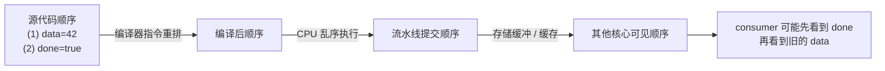
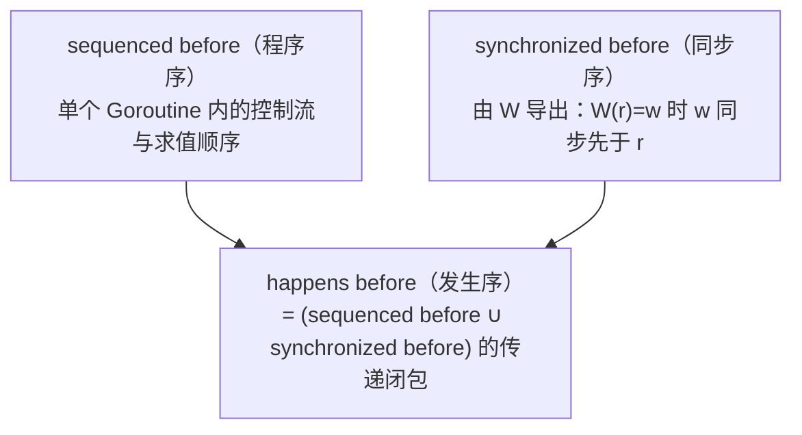
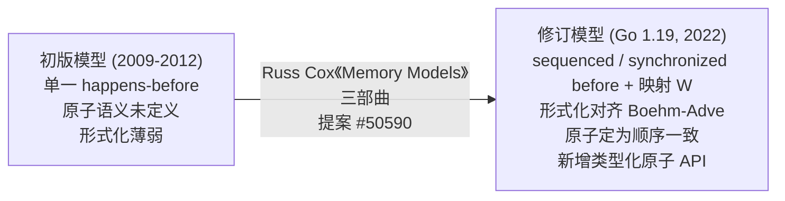

# 5.9 内存一致模型

> 本节内容对标 Go 1.26。Go 的内存模型在 2022 年随 Go 1.19 做过一次重要修订，
> 本节在讲清当前模型之后，会专门交代这次修订的来龙去脉（见 [5.9.7](#597-设计的演进)）。

读者或许注意到，在此前关于 Go 运行时与编译器的讨论中，我们一直回避着一个话题：
Go 的内存模型。回避并非无故。要讲清楚它，需要并发、同步原语乃至硬件层面的铺垫，
而这些铺垫至此方才齐备。作为本章的收尾，亦是全书对 Go 同步原语与同步模式的总结，
我们在此展开这一话题，回答读者心中那个尚未解开的疑问：两个 Goroutine 同时读写同一变量时，
一方的写入在何种条件下才保证为另一方所见。

## 5.9.1 内存模型的重要性

内存一致模型，或称内存模型，是一份契约，立于语言用户与语言自身、语言与操作系统平台、
操作系统平台与硬件平台之间。它界定并行之下读写时序得以确定的条件，回答这样一个问题：
某个共享变量是否具备足够的同步，使一个线程的写入能为另一个线程的读取所见。

一份 Go 程序写成之后，要先后经过编译器的转换与优化、运行其上的操作系统或虚拟机等动态优化器，
以及 CPU 对指令流的优化，方能执行。其中任何一个环节，都可能调整某个变量读写的次序，
使其偏离程序员写下的顺序。没有内存模型作保障，便无从推演程序最终执行时是否正确。

内存模型的取舍影响深远，关乎程序的可移植性与可维护性。过强的模型压缩硬件与编译器的优化空间，
压低性能上限；一种已选定强模型的硬件体系结构，又难以在不破坏兼容性的前提下转向更弱的模型，
而破坏兼容性的代价，是要求其上的程序重写源码。

横跨用户、软件与硬件三方，使内存模型的设计格外棘手，至今仍是开放的研究问题。
讨论 Go 的内存模型之前，我们先了解既有的内存模型，以及软硬件之间历次立约的经验与教训。

为使「顺序被调整」一事具体可见，考虑一段最小的生产者与消费者程序。它们共享 `data` 与
`done`，一个写入数据并置位标志，另一个等待标志置位后读取数据：

```go
var data int
var done bool

func producer() {
	data = 42      // (1)
	done = true    // (2)
}

func consumer() {
	for !done {    // (3)
	}
	print(data)    // (4)
}
```

源代码中 (1) 写在 (2) 之前，直觉上 `consumer` 一旦读到 `done == true`，便应当读到
`data == 42`。然而这段程序并不保证打印 42，也可能停在循环中不再退出。前文所说的三道优化，
在此各显其形：编译器可将无依赖的 (1) 与 (2) 互换，或将循环中对 `done` 的读取提升至循环外，
使其反复读取同一寄存器中的旧值；CPU 以乱序方式发射指令，只为单个核心维持其自身可见的数据
依赖；写入还会先停留在核心私有的存储缓冲（store buffer）中，何时对其他核心可见，
由缓存一致性协议决定，与写入的先后未必一致。



这三道优化共享同一条底线：它们都不改变单个 Goroutine 自身可观测的行为。一旦引入第二个
Goroutine，「可观测」需要一份跨 Goroutine 的规则重新界定，这份规则便是内存模型。

## 5.9.2 强序与弱序

令同步模型为对内存访问的一组约束，这些约束指定了需要如何以及何时完成同步，则当且仅当硬件与遵循该同步模型的所有软件顺序一致时，称该同步模型对于硬件而言满足弱序（Weak Ordering）。

这一定义出自 Adve 与 Hill 于 1990 年的工作。它的含义是，现实硬件默认允许对普通读写重排，
仅在程序显式使用同步操作（内存屏障、原子指令）时，才保证这些同步点之间的先后。强序硬件
对程序员更友好，弱序硬件则把更多优化机会留给编译器与处理器。代价由此转移：在弱序之上写出
正确的并发程序，要求程序员在恰当之处布置同步。

## 5.9.3 免数据竞争范式

若对同一内存位置存在两个并发访问，其中至少一个为写，且二者之间没有同步操作建立先后，
便构成一次数据竞争。一个在其全部执行中都不含数据竞争的程序，称为免数据竞争
（Data-Race-Free, DRF）。现代内存模型据此在软硬件与程序员之间立下一笔交易：

> 硬件与编译器承诺：只要程序没有数据竞争，就让它表现得如同顺序一致；
> 对于存在数据竞争的程序，不做承诺，或只做有限承诺。

这笔交易称为 DRF-SC（Data-Race-Free implies Sequential Consistency）。它将「读懂弱内存模型」
这一难题，转化为「消除数据竞争」这一相对明确、且可由工具检测的义务。Go 正是站在这一侧，
后文的发生序关系即为它落地的具体形式。

## 5.9.4 历史实践

在内存模型的工程实践上，C++ 是一个值得参照的例子。下面借助几种典型的一致性，
由强到弱地勾勒出这条谱系。

线性一致性，又称强一致性或原子一致性。它要求每一次读都能读到该数据最近一次写入的值，
并且所有线程的操作次序与全局时钟下的次序一致。

```mermaid
gantt
    title 线性一致性：store(1) 先于 store(2) 先于 load，全局实时有序
    dateFormat X
    axisFormat %s
    section G1
    x.store(1)      :milestone, 1, 0
    x.load() 读到 2 :milestone, 3, 0
    section G2
    x.store(2)      :milestone, 2, 0
```



此时 `G1`、`G2` 对 `x` 的两次写都是原子的，`x.store(1)` 严格发生在 `x.store(2)` 之前，
`x.store(2)` 又严格发生在 `x.load()` 之前。线性一致性对全局时钟的要求难以实现，
人们研究更弱一致性的算法，动力多半来自这里。

顺序一致性，同样要求每次读都能读到数据最近一次写入的值，但不要求与全局时钟的次序一致。

```mermaid
gantt
    title 顺序一致性（其一）：load 读到最近写入 3
    dateFormat X
    axisFormat %s
    section G1
    x.store(1)      :milestone, 1, 0
    x.store(3)      :milestone, 3, 0
    x.load() 读到 3 :milestone, 5, 0
    section G2
    x.store(2)      :milestone, 2, 0
```



或者



```mermaid
gantt
    title 顺序一致性（其二）：store(2) 排在 store(1) 之前亦可
    dateFormat X
    axisFormat %s
    section G1
    x.store(1)      :milestone, 2, 0
    x.store(3)      :milestone, 3, 0
    x.load() 读到 3 :milestone, 5, 0
    section G2
    x.store(2)      :milestone, 1, 0
```

在顺序一致性之下，`x.load()` 须读到最近一次写入的值，而 `x.store(2)` 与 `x.store(1)`
之间并无先后保障，只要 `G2` 的 `x.store(2)` 排在 `x.store(3)` 之前即可。

因果一致性，要求进一步放低：只为有因果关系的操作保序，无因果关系的操作则不作要求。

```mermaid
gantt
    title 因果一致性（其一）：c 依赖 a、b，故排在二者之后
    dateFormat X
    axisFormat %s
    section G1
    a = 1 :milestone, 1, 0
    b = 2 :milestone, 2, 0
    section G2
    x.store(3) :milestone, 1, 0
    c = a + b  :milestone, 3, 0
    y.load()   :milestone, 4, 0
```



或者



```mermaid
gantt
    title 因果一致性（其二）：y.load() 与 c 无因果关系，可换序
    dateFormat X
    axisFormat %s
    section G1
    a = 1 :milestone, 1, 0
    b = 2 :milestone, 2, 0
    section G2
    x.store(3) :milestone, 1, 0
    y.load()   :milestone, 3, 0
    c = a + b  :milestone, 4, 0
```

亦或者

```mermaid
gantt
    title 因果一致性（其三）：a、b 写序可换，只需 c 在二者之后
    dateFormat X
    axisFormat %s
    section G1
    b = 2 :milestone, 1, 0
    a = 1 :milestone, 2, 0
    section G2
    y.load()   :milestone, 1, 0
    c = a + b  :milestone, 4, 0
    x.store(3) :milestone, 5, 0
```



以上三种排布都满足因果一致，因为整个过程中只有 `c` 依赖 `a` 与 `b`，而 `x` 与 `y` 在此例中
互不相关（在真实场景里，要断定 `x` 与 `y` 确实无关，往往还需更多信息）。

最终一致性，是其中最弱的要求，它只保障某个操作在未来某一时刻会被观察到，却不约束观察到的
时间。这一条还可稍作加强，例如规定观察到的时间总是有界，不过那已离本节的话题较远。

```mermaid
gantt
    title 最终一致性：写入终将可见，但时机不定
    dateFormat X
    axisFormat %s
    section T1
    x.store(3) :milestone, 1, 0
    x.store(4) :milestone, 2, 0
    section T2
    read 1 :milestone, 1, 0
    read 2 :milestone, 3, 0
    read 3 :milestone, 5, 0
    read 4 :milestone, 6, 0
```



设 `x` 的初始值为 0，则 T2 中四次 `x.read()` 的结果可能是下列各种，且不限于此：

```
3 4 4 4 // x 的写操作被很快观察到
0 3 3 4 // x 的写操作被观察到的时间存在一定延迟
0 0 0 4 // 最后一次读操作读到了 x 的最终值，但此前的变化并未观察到
0 0 0 0 // 在当前时间段内 x 的写操作均未被观察到，但未来某个时间点上一定能观察到 x 为 4 的情况
```

## 5.9.5 硬件的内存模型与芯片差异

回到 5.9.1 那段会出错的程序。我们说过，写入 `data` 与置位 `done` 的次序，可能被硬件打乱。
这一节把「硬件」这个笼统的说法摊开：不同的芯片，对次序的承诺并不一样，有的严，有的松。
理解这些差异不是为了让读者去背它们，恰恰相反，是为了说明 Go 为什么要用一套统一的模型，
把它们一并挡在身后。

### 先分清两件事：缓存一致与内存一致

多核之间有一套缓存一致性（cache coherence）协议，保证对**同一个**变量，所有核心最终会
就「这些写入按什么次序发生」达成一致。这件事常被误当成内存模型，其实不是。缓存一致只管
单个变量，内存一致性（memory consistency）管的则是跨多个变量时，一个核心的读写次序在别的
核心眼里是什么样子。前者是后者的基础，却替代不了后者（参见 Sorin、Hill 与 Wood 的教材，
以及 Adve 与 Gharachorloo 1996 年的综述）。我们要操心的是后者。

### 次序是怎么被打乱的

设想每个 CPU 核心都有一个发件箱，即存储缓冲（store buffer）。核心写一个变量时，并不等它
真正抵达内存，而是把它丢进发件箱就接着做下一件事。这样核心不必停下来等待，代价是别的核心
要等发件箱里的信件实际寄出，才看得见这次写入。于是「我先写 `data`、后写 `done`」在别人眼里，
完全可能变成先看到 `done`。接收端也有对称的一幕：失效队列（invalidation queue）会让一个
核心暂时读到旧值；乱序执行与推测执行则让指令不按书写次序完成。这些机制都只为一个目的，
让单个核心跑得更快。它们对单线程透明，对多线程则需要规则来约束。

### 从强到弱：你的代码会跑在哪种芯片上

把真实硬件按约束的松紧从强到弱排开，大致是这样一条谱系。


**顺序一致（SC）**是理论基准。它最好懂，却几乎没有商用通用 CPU 真的采用，因为它要求放弃
发件箱一类的优化，性能代价太大（Lamport 1979）。

**x86-TSO**（Intel 与 AMD）处在强的一端。它只允许一种重排：写之后的读，可以抢在这个写真正
寄出之前完成（store→load），此外核心还能提前读到自己发件箱里的写。除此之外，所有写以一个
全局次序对所有核心同时生效，因此它是**多副本原子**的（Sewell 等人 2010 年给出了严谨的
x86-TSO 模型）。日常在 x86 上「碰巧没出错」的并发代码，多半沾了 TSO 的光。

**ARMv8 / AArch64** 落在弱的一端，四种重排都可能发生。一个值得讲的细节是，早期 ARMv8 并非
多副本原子，后来 Arm 在 2017 年前后把架构修订为多副本原子，确切说是 other-multi-copy-atomic：
一个核心可以提前看到自己的写，但任何写一旦被某个别的核心看到，就同时对所有别的核心可见。
这次修订让模型简单了不少（Pulte 等人 2018）。

**POWER**（IBM）同样是弱序，并且**不是**多副本原子：两个写可以被不同的读者以不同次序看到。
这正是它与修订后 ARMv8 最大的分野（Sarkar 等人 2011）。

**DEC Alpha** 是历史上的异类。它松到连有地址依赖的载入都能重排：哪怕 `p` 是刚读出来的指针，
`*p` 也可能读到比 `p` 更旧的内容。Linux 内核为此专门设过一个 `read_barrier_depends` 屏障
（在所有别的架构上都是空操作），后来把它并入了 `READ_ONCE`（v4.15），并最终删除了这个显式
接口（v5.9）。

**RISC-V** 的默认模型 RVWMO 属于弱序，规范同时定义了可选的 Ztso 扩展，为需要 TSO 的实现提供
更强的次序。

| 模型 | 允许的重排 | 多副本原子 | 代表平台 |
| --- | --- | --- | --- |
| 顺序一致 SC | 无 | 是 | 理论基准 |
| x86-TSO | 仅 store→load（含发件箱转发） | 是 | Intel、AMD |
| ARMv8（修订后） | 四种皆可 | 是 | Arm 移动 / 服务器 |
| POWER | 四种皆可 | 否 | IBM POWER |
| Alpha | 四种皆可，且依赖载入亦可重排 | 否 | DEC Alpha（历史） |
| RISC-V RVWMO | 四种皆可（可选 Ztso 提供 TSO） | 见正文 | RISC-V |

### 给硬件做体检：石蕊测试

怎么判断一颗芯片到底允许哪些重排？研究者用一组很小的并发程序来做体检，称为石蕊测试
（litmus test）。每个测试只有寥寥几行，却能精准地把某一种重排逼出来。几个最常用的如下。

| 测试 | 形态 | 考察 | 出现反直觉结果的模型 |
| --- | --- | --- | --- |
| SB 存储缓冲 | 两线程各自先写、再读对方的变量 | store→load 与发件箱 | x86-TSO、ARMv8、POWER、RISC-V（仅 SC 禁止） |
| MP 消息传递 | 一方写数据再置标志，另一方见标志后读数据 | store→store 与 load→load | ARMv8、POWER、RISC-V（SC、x86-TSO 禁止） |
| LB 载入缓冲 | 两线程各自先读、再写 | load→store | ARMv8、POWER、RISC-V（SC、x86-TSO 禁止） |
| IRIW 独立读独立写 | 两个写者两个读者，问读者是否对两写的次序达成一致 | 多副本原子性 | POWER、修订前 ARM（SC、x86-TSO、修订后 ARMv8 禁止） |
| 依赖载入 | MP，且读方解引用所载入的指针 | 地址依赖是否定序 | 仅 Alpha |

其中 IRIW 尤其关键，它专门考察多副本原子性，干净地把会出现分歧的 POWER 与修订前 ARM，
同不会分歧的 SC、x86-TSO 与修订后 ARMv8 区分开。而依赖载入那一项，几乎只为 Alpha 而设。

> 想再深入一步：上面这些模型并非口头约定，而是被写成了可以机器检验的形式。给硬件建模有两条
> 路，一条是操作化（operational），描述一台带发件箱、队列的抽象机器一步步执行；另一条是公理化
> （axiomatic），把一次执行看成事件之间的关系图，用若干无环条件约束哪些结果合法。Alglave、
> Maranget 与 Tautschnig 的《Herding Cats》（2014）给出了一个统一的公理化框架，配套的 herd、
> litmus、diy 工具既能在模型上模拟，又能在真实芯片上跑石蕊测试，甚至借此发现过 ARM 硬件的实现
> 缺陷。这一脉工作，是今天 Arm 与 RISC-V 官方内存模型的方法论来源。

### 这对 Go 意味着什么

读到这里，读者或许有点发怵：难道要把这些差异都记住，才能写对并发吗？答案恰恰相反。

Go 支持 amd64、arm64、ppc64、riscv64 等多种架构，它们分布在上面谱系的不同位置。Go 的承诺是，
无论底层是哪一种，同一套 Go 内存模型都成立。兑现它的是编译器与运行时，它们在每个目标架构上
生成相应的屏障与原子指令，把硬件的强弱差异吸收掉。换句话说，5.9.3 那笔「以免数据竞争换取
顺序一致」的交易，正是由工具链在这一层兑现的。读者只需面对一套模型，芯片的众声喧哗，
到不了你的代码面前。这就是内存模型存在的意义。

## 5.9.6 发生序关系

Go 的 Goroutine 以并发的形式运行在多个并行的线程之上，其内存模型要回答的，正是
**对一个 Goroutine 而言，一个变量被写入之后，在何种条件下一定能被读取到**。为此，
模型引入事件时序，定义 **happens before**，用以刻画 Go 程序中内存操作之间的一个偏序关系。

我们不妨用 $<$ 表示 happens before，则若事件 $e_1 < e_2$，便有 $e_2 > e_1$；
若 $e_1 \not< e_2$ 且 $e_2 \not< e_1$，则称 $e_1$ 与 $e_2$ 并发（happen concurrently）。
在单个 Goroutine 内，happens-before 次序即程序定义的次序。

我们稍微学院派地描述一下偏序的概念。happens before 是一个严格偏序（strict partial order），
即满足反自反、非对称、传递三条性质的二元关系。设事件全体为 $E$，则对 $<$ 有：

1. 反自反性：$\forall e \in E,\ \lnot\,(e < e)$；
2. 非对称性：$\forall e_1, e_2 \in E,\ (e_1 < e_2) \Rightarrow \lnot\,(e_2 < e_1)$；
3. 传递性：$\forall e_1, e_2, e_3 \in E,\ (e_1 < e_2) \wedge (e_2 < e_3) \Rightarrow (e_1 < e_3)$。

这套事件时序的偏序，初看像是只在谈并发模型，与内存无关。它之所以叫内存模型，恰因它与内存
紧密相连：并发操作之间的时序偏序，界定的正是内存操作的可见性。

自 Go 1.19 起，内存模型把这一偏序拆解得更为精细，便于严谨地讨论可见性。它将 happens before
分解为两个更基础的关系之并集的传递闭包：

- *sequenced before*（程序序）：同一个 Goroutine 内部，由语言规范为控制流与表达式求值规定的偏序；
- *synchronized before*（同步序）：由一个映射 `W` 导出。`W` 为每个读型操作指明它读自哪个
  写型操作；当同步读 `r` 观察到同步写 `w`（即 `W(r) = w`）时，称 `w` 同步先于 `r`。



可见性据此判定：一个普通读 `r` 能读到某个写 `w`，须满足 `w` happens before `r`，且不存在
另一个对同一位置的写 `w'` 使得 `w` happens before `w'` happens before `r`。换言之，`r` 读到的
是发生序上离它最近、未被更晚的写覆盖的那个写入。当该位置无数据竞争时，这样的 `w` 唯一确定，
程序的结果也就能由某个顺序一致的交错执行解释，这正是 5.9.3 所说的 DRF-SC（其证明与 Boehm
和 Adve 于 PLDI 2008 提出的 C++ 内存模型框架一致）。

编译器和 CPU 通常会产生各种优化来影响程序原本定义的执行顺序，这包括：编译器的指令重排、 CPU 的乱序执行。
除此之外，由于缓存的关系，多核 CPU 下，一个 CPU 核心的写结果仅发生在该核心最近的缓存下，
要想被另一个 CPU 读到则必须等待内存被置换回低级缓存再置换到另一个核心后才能被读到。

Go 中的 happens before（在 1.19 之后表述为 synchronized before）有以下保证：

1. 初始化：被导入包的 `init` 完成 < 导入方的 `init` 开始；所有 `init` 完成 < `main.main` 开始；
2. Goroutine 创建：`go` 语句 < 该 Goroutine 开始执行；
3. Goroutine 销毁：Goroutine 退出不与任何事件构成保证的先后；
4. channel：一次发送 < 对应接收的完成（对任意 channel 均成立）；
5. channel：`close(ch)` < 因 channel 关闭而返回零值的接收；
6. channel：对无缓冲 channel，一次接收 < 对应发送的完成；
7. channel：对容量为 $C$ 的缓冲 channel，第 $k$ 次接收 < 第 $k+C$ 次发送的完成；
8. mutex：对锁 `l` 与 $n < m$，第 $n$ 次 `l.Unlock()` < 第 $m$ 次 `l.Lock()` 的返回；
9. mutex：对 `l.RLock`，存在 $n$ 使其在第 $n$ 次 `l.Unlock` 之后返回，且与之匹配的 `l.RUnlock` < 第 $n+1$ 次 `l.Lock` 的返回；
10. once：`once.Do(f)` 中 `f()` 的完成 < 任意 `once.Do(f)` 的返回；
11. atomic：若原子操作 A 的效果被原子操作 B 观察到，则 A < B，且所有原子操作存在一个顺序一致的全序。

第 11 条是 1.19 修订新增的正式条款。在此之前，`sync/atomic` 的内存序长期没有明文承诺，
这也是下一节要讲的修订背景之一。

那么在 Go 语言发展的这十余年间，内存模型的设计是否就此尘埃落定？

## 5.9.7 设计的演进

回答这个问题，要回到 Go 内存模型走过的路。它如何一步步成形，与今日的条文同样值得了解。

最早的 Go 内存模型文档与语言规范同期问世，只立了单独一个 happens before 关系，配上 init、
goroutine、channel、mutex、once 等几条规则。方向是对的，也足够简单，却留下几道缺口。其一，
原子操作的语义悬而未定，`sync/atomic` 长期没有正式的内存序承诺，早期文档甚至建议不要以
atomic 作同步，而需要无锁数据结构的库作者，事实上一直依赖一份未写入文档的契约。其二，
单一的 happens before 关系，既难严谨刻画竞争之下的行为，也难与硬件、编译器的真实行为对齐。
其三，双重检查锁定一类写法是否合法，缺乏可据以判断的明确说法。

2021 年，Russ Cox 发表三篇《Memory Models》系列长文，依次为《Hardware Memory Models》
《Programming Language Memory Models》《Updating the Go Memory Model》，系统梳理了硬件与
C/C++、Java 各家内存模型的来路与教训，并就 Go 的修订方向展开讨论。与之配套的是提案
golang/go#50590。

2022 年，随 Go 1.19，这次修订正式落地，文档版本标注为「Version of June 6, 2022」。



修订动了三处。其一，重整词汇与形式化，将单一的 happens before 拆为 sequenced before 与
synchronized before，happens before 退为二者并集的传递闭包，整套形式化对齐 Boehm-Adve 框架，
以 DRF-SC 为目标，并声明与 C、C++、Java、JavaScript、Rust、Swift 的 DRF-SC 保证看齐。其二，
正式定下原子操作的内存序，将 `sync/atomic` 钉为顺序一致原子，语义对齐 C++ 的 SC 原子与
Java 的 `volatile`，库作者由此获得明文契约。其三，新增类型化原子 API（Go 1.19，提案 #50860），
即 `atomic.Int32/Int64/Uint32/Uint64/Bool/Pointer[T]/Uintptr/Value`，将「该字段须以原子方式
访问」编入类型，既减少裸用 `atomic.AddInt64(&x, …)` 时在别处漏掉原子访问的隐患，也保证内存
对齐。

这次修订并未改变 Go 程序的可观测行为，也未给用户的承诺松绑或加码。它所做的，是把一份长期
默默遵守的契约，写成严谨而可验证的条文。实现会变，写明的设计原理却能留存。

## 5.9.8 工程权衡与忠告

Go 内存模型中最见设计性格的一笔，是只把顺序一致原子交给用户，而未暴露弱序原子。C++ 备有
`memory_order_relaxed/acquire/release/seq_cst` 一整套档位，可将硬件性能压榨到极致，代价是把
「读懂弱内存模型」这桩难事原样交给应用开发者，稍有不慎便会出错。Go 的判断是，对多数程序，
SC 原子的性能已足够，它换来的可推理性比那一点峰值性能更值得。这与 Go 在调度、垃圾回收等处
的取向一致：以可控的性能让渡，换取语义的简单与稳妥。

那么在 Go 语言发展的这十余年间，真正解决了内存模型的设计吗？答案是审慎的。Go 没有追求最强
或最快的模型，而是选了一个用户最不易出错的点站定。因此，Go 语言对其用户的忠告可以归结为
五个字：别自作聪明。落到手上只有一条：用同步原语消除数据竞争，能用 channel 就用 channel，
要共享内存就用 `sync` 与 `sync/atomic`，并以 `-race` 持续检测。

为帮助读者亲手体会 5.9.1 中存储缓冲带来的反直觉一幕，下面给出一个交互演示。它模拟内存模型
所允许的结果。需要说明的是，JavaScript 顺序一致且单线程，并不触发真正的硬件重排序，此处仅作
示意；若运行环境不支持脚本，阅读上文的文字说明即可。

<div class="reorder-sandbox" style="border:1px solid #ccc;border-radius:8px;padding:12px;margin:12px 0;font-size:14px;">
  <div style="display:flex;gap:24px;flex-wrap:wrap;">
    <div>
      <strong>核心 1（producer）</strong>
      <pre style="margin:6px 0;">data = 42   进入 store buffer
done = true 尚未刷新到内存</pre>
    </div>
    <div>
      <strong>核心 2（consumer）</strong>
      <pre style="margin:6px 0;">while(!done){}
print(data)</pre>
    </div>
  </div>
  <div style="margin:8px 0;">
    <button type="button" class="rs-step" style="padding:4px 10px;">单步执行</button>
    <button type="button" class="rs-reset" style="padding:4px 10px;">重置</button>
  </div>
  <div class="rs-log" style="font-family:monospace;white-space:pre-wrap;background:#f6f8fa;padding:8px;border-radius:6px;min-height:6em;"></div>
</div>

<script>
(function () {
  document.querySelectorAll(".reorder-sandbox").forEach(function (box) {
    var log = box.querySelector(".rs-log");
    var steps = [
      "初始: 内存 data=0, done=false。",
      "核心1: 把 done=true 先刷出 store buffer（与 data 写入无依赖）。",
      "核心2: 读到 done=true，跳出循环。",
      "核心2: 读 data。此刻 data=42 仍滞留在核心1的 store buffer，读到旧值 0。",
      "核心1: data=42 才刷新到内存，为时已晚。",
      "结论: 没有同步序时，consumer 打印了 0 而非 42。加一次 channel 收发即可避免。"
    ];
    var i = 0;
    function render() {
      log.textContent = steps.slice(0, i).map(function (s, k) {
        return (k + 1) + ". " + s;
      }).join("\n");
    }
    box.querySelector(".rs-step").addEventListener("click", function () {
      if (i < steps.length) { i++; render(); }
    });
    box.querySelector(".rs-reset").addEventListener("click", function () {
      i = 0; render();
    });
    render();
  });
})();
</script>

## 延伸阅读的文献

1. The Go Authors. *The Go Memory Model* (Version of June 6, 2022).
   https://go.dev/ref/mem
2. Russ Cox. *Memory Models* (series, 2021): *Hardware Memory Models*,
   *Programming Language Memory Models*, *Updating the Go Memory Model*.
   https://research.swtch.com/mm
3. Hans-J. Boehm and Sarita V. Adve. "Foundations of the C++ Concurrency Memory Model."
   *PLDI 2008*.
4. Leslie Lamport. "Time, Clocks, and the Ordering of Events in a Distributed System."
   *Communications of the ACM*, 21(7), 1978.
5. Leslie Lamport. "How to Make a Multiprocessor Computer That Correctly Executes
   Multiprocess Programs." *IEEE Transactions on Computers*, C-28(9), 1979.
6. Sarita V. Adve and Kourosh Gharachorloo. "Shared Memory Consistency Models:
   A Tutorial." *IEEE Computer*, 29(12), 1996.
7. Sarita V. Adve and Mark D. Hill. "Weak Ordering: A New Definition." *ISCA 1990*.
8. Jeremy Manson, William Pugh, and Sarita V. Adve. "The Java Memory Model." *POPL 2005*.
9. Peter Sewell, Susmit Sarkar, Scott Owens, Francesco Zappa Nardelli, Magnus O. Myreen.
   "x86-TSO: A Rigorous and Usable Programmer's Model for x86 Multiprocessors."
   *Communications of the ACM*, 53(7), 2010. https://doi.org/10.1145/1785414.1785443
10. Christopher Pulte, Shaked Flur, Will Deacon, Jon French, Susmit Sarkar, Peter Sewell.
    "Simplifying ARM Concurrency: Multicopy-atomic Axiomatic and Operational Models for
    ARMv8." *POPL 2018*. https://doi.org/10.1145/3158107
11. Susmit Sarkar, Peter Sewell, Jade Alglave, Luc Maranget, Derek Williams.
    "Understanding POWER Multiprocessors." *PLDI 2011*.
    https://doi.org/10.1145/1993498.1993520
12. Jade Alglave, Luc Maranget, Michael Tautschnig. "Herding Cats: Modelling, Simulation,
    Testing, and Data Mining for Weak Memory." *ACM TOPLAS*, 36(2), 2014.
    https://doi.org/10.1145/2627752 ；herd / litmus / diy 工具：http://diy.inria.fr
13. Daniel J. Sorin, Mark D. Hill, David A. Wood. *A Primer on Memory Consistency and
    Cache Coherence.* Morgan & Claypool, 2011（第 2 版 2020）。
14. Go proposal #50590（*Go Memory Model clarifications*）；
    proposal #50860（*typed atomic types in sync/atomic*）。

## 许可

&copy; 2018-2026 The [golang.design](https://golang.design) Initiative Authors. Licensed under [CC-BY-NC-ND 4.0](https://creativecommons.org/licenses/by-nc-nd/4.0/).
