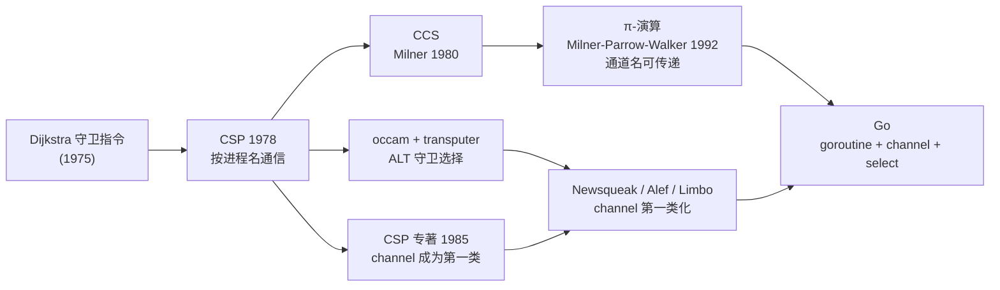

# 1.3 顺序进程通讯

> 本节内容提供一个线上演讲：[YouTube 在线](https://www.youtube.com/watch?v=Z8ZpWVuEx8c)，[Google Slides 讲稿](https://changkun.de/s/csp/)。

Go 并发模型的思想源头，是 Hoare 于 1978 年在 CACM 上提出的**顺序进程通讯**（Communicating
Sequential Processes, CSP）。这一节从思想史的角度交代这份血脉，它解释了 goroutine 与
channel 为何是今天这个样子。channel 与 select 的实现细节（hchan 的环形缓冲、`gopark` 与
`goready` 的配对、`selectgo` 的两轮加锁），留待 [第 10 章](../../part3concurrency/ch10chan/readme.md)
展开；这里关心的是「为什么是 CSP」，以及这份选择如何塑造了 Go 程序的样貌。

## 1.3.1 CSP 的核心主张

上个世纪七十年代，多核处理器还是科研主题，尚未进入普通程序员的视野。彼时协调并发实体的手段
已经不少：信号量（Dijkstra, 1965）、监控（Hoare, 1974）、锁与互斥、消息传递。Lauer 与
Needham 1979 年还证明了「消息传递」与「共享内存加锁」在表达力上彼此等价，二者只是同一件事的
两副面孔。Hoare 在这片图景里做出的选择，是把通信（即输入输出）当作编程语言的基本要素，并以
此为唯一的协调手段。

CSP 的核心是一句反直觉的主张：**进程之间不共享状态，只通过传递消息来协调。** 在共享内存的
世界里，多个线程读写同一块内存，靠锁来防止彼此踩踏，这既危险（数据竞争、死锁），又难以推理。
CSP 反其道而行：每个顺序进程守着自己的状态，要协作就**发消息**，通过一次同步的通信动作来交接
数据与控制权。Go 把这条主张凝成那句广为人知的格言：「**不要以共享内存的方式通信，而要以通信的
方式共享内存。**」

这里有一处需要澄清的史实，它常被一笔带过，却恰恰是理解 Go 与 CSP 关系的关键。

## 1.3.2 1978 年的 CSP：按进程名通信，没有 channel

读者若翻开 Hoare 1978 年的原始论文，会发现一件出乎意料的事：那门语言里**没有第一类的
channel**。通信不是把数据投进某条匿名管道，而是**直接指名某个进程**。两个基本算符是：

- `p!value`：向名为 `p` 的进程**发送**一个值；
- `q?var`：从名为 `q` 的进程**接收**一个值，存入 `var`。

发送方写下接收方的名字，接收方也写下发送方的名字，只有当双方在对应的语句上**会合**
（rendezvous）时，这次通信才发生，值被复制过去，两边各自继续。整门语言由几个算符撑起：顺序
`;`、并行 `||`、赋值 `:=`、输入 `?`、输出 `!`、守卫 `→`、选择 `□`、重复 `*`。比如

```
[west::DISASSEMBLE || X::COPY || east::ASSEMBLE]
```

就启动了三个并行进程，进程间用名字互相寻址。这种「按进程名通信」的设计有一个朴素的优点：
语言里不必引入 channel 这种额外概念。但它的代价也很直接，子过程必须知道使用它的过程的名字，
难以封装成可复用的库；而并行组合 `[a::P || b::Q]` 是一个参数个数可变的运算，无法进一步代数化
约简。Hoare 本人在 1985 年的专著里就修正了这两处。

把通信实体**抽象成一条可独立命名、可作为值传递的 channel**，是后来才发生的事：它在 1980 年代
初的 **occam** 语言（运行于 transputer 处理器）中确立，并由 **1985 年的 CSP 专著**配上一套
修订后的进程代数。Go 继承的，正是这条后期的、以 channel 为中心的脉络，而非 1978 年的进程名
寻址。所以当我们在 Go 里写下 `make(chan int)`，把它存进变量、塞进结构体、甚至从一个 channel
里收到另一个 channel 时，依据的是 occam 与 1985 年专著的传统，不是那篇萌芽论文。

## 1.3.3 进程代数的谱系：从 CCS 到 π-演算

CSP 不是孤峰。在它周围，Robin Milner 几乎同时发展出另一支**进程代数**，**CCS**（Calculus of
Communicating Systems, Milner 1980）。CCS 与 CSP 关心同一个问题（如何形式化地描述并刻画并发
进程的行为与等价），手法各有侧重，CCS 把「双方在一个动作上同步」作为代数的原子，并发展出
**互模拟**（bisimulation）这一刻画进程等价的工具。

CCS 真正与 Go 血脉相关的一步，是它的后继 **π-演算**（Milner, Parrow, Walker 1992）。π-演算
给进程代数加进了**移动性**（mobility）：通道的名字本身可以作为消息在通道上传递。一个进程把某条
通道的名字发给另一个进程，后者于是获得了在那条通道上通信的能力，通信的**拓扑结构因此能在
运行时改变**。这正是 Go 里 `chan chan T`（通道的通道）所表达的东西，也是「channel 是第一类值」
这一设计在理论上的对应物。下面这段把一个「回信通道」随请求一起发出去，就是 π-演算式移动性最
常见的 Go 形态：

```go
type request struct {
    arg   int
    reply chan int // 把回信的通道一并发过去
}

func server(reqs <-chan request) {
    for r := range reqs {
        r.reply <- r.arg * r.arg // 沿对方给的通道回送结果
    }
}
```

把整条谱系画在一起，Go 的位置便清楚了：



中间这条 Newsqueak / Alef / Limbo，是 Rob Pike 等人在贝尔实验室二十年间一脉相承的实验语言，
它们把 occam 的 channel 与守卫选择逐步「第一类化」，Go 的 `<-` 通信算符、`select` 语句都从
这里继承而来（[1.1](./history.md)）。Go 因此不是凭空套用一篇论文，而是站在这条工程谱系的末端。

## 1.3.4 occam 的 ALT 与 Go 的 select

CSP 还有一件遗产值得单独点出：**守卫选择**。它源自 Dijkstra 的守卫指令，到 occam 里成了
`ALT`，在 Go 里就是 `select`。它要解决的问题是：一个进程同时面对多路通信，哪一路先就绪就先
处理哪一路，而不必预先规定顺序。在 1978 年的 CSP 里，它写作

```
*[X?V() → val := val+1 □ val > 0; Y?P() → val := val-1]
```

`□` 分隔几个守卫分支，每个分支以一次输入为守卫；若多个守卫同时就绪，则**随机**择一执行。这个
「随机」不是偷懒，而是为了提供**公平性**，避免某一路通信被长期饿死。Go 的 `select` 原封不动地
继承了这条语义：多个 case 同时就绪时，运行时伪随机地选一个（[第 10 章](../../part3concurrency/ch10chan/readme.md)）。

## 1.3.5 Go 的并发模型：用代码说话

谱系讲清了，落到 Go 本身，模型只有两件东西：**goroutine**（顺序进程）与 **channel**（通信）。
一个 `go` 关键字起一个 goroutine，一个 `<-` 完成一次通信。

最基本的形态是一次发送与一次接收：

```go
ch := make(chan int)
go func() { ch <- 42 }() // 一个 goroutine 发送
v := <-ch                // 另一个 goroutine 接收，得到 42
```

channel 是否带缓冲，决定了这次通信是**同步会合**还是**异步投递**，这正对应 CSP 1978 的两种
形态。无缓冲 channel 是纯粹的 rendezvous，发送方会一直阻塞，直到某个接收方就位，两者在通信点
上严格会合；带缓冲 channel 则允许发送方在缓冲未满时先走一步，把一次同步松弛成一个有界队列
（1978 年的 CSP 并未把带缓冲通信作为原语，Hoare 是用一个无缓冲进程**模拟**出缓冲来的，
「以有界队列松弛同步」这一**概念**，正是带缓冲 channel 的思想先声）：

```go
unbuffered := make(chan int)    // 容量 0：发送阻塞到接收就位（会合）
buffered := make(chan int, 4)   // 容量 4：未满即可发送，无需等待接收
```

`select` 让一个 goroutine 在多路通信间择一而动，并可借 `default` 做非阻塞尝试、借 `time.After`
做超时：

```go
select {
case v := <-in:
    handle(v)
case out <- result:
    // 成功发出
case <-time.After(time.Second):
    // 超时退出，避免永久阻塞
}
```

有了这三样，CSP 的经典模式就是顺理成章的写法。Hoare 1978 年论文里那个 DISASSEMBLE →
COPY → ASSEMBLE 的例子（从 80 列卡片读入、逐字符流转、再排成 125 列打印），本质上是一条
**流水线**（pipeline）：每个进程顺序地做一件小事，用 channel 把上下游接起来，数据沿 channel
流动。翻成 Go，它就是几个 goroutine 串成一串：

```go
// COPY：把上游字符原样转给下游，读到尽头就关闭下游
func copyStage(west <-chan rune, east chan<- rune) {
    for c := range west {
        east <- c
    }
    close(east) // 关闭即「我说完了」，下游的 range 随之结束
}

// 把三段接成流水线：上游关闭逐级传播，整条管线自然收束
func reformat(cardfile <-chan []rune, lines chan<- string) {
    west, east := make(chan rune), make(chan rune)
    go disassemble(cardfile, west)
    go copyStage(west, east)
    assemble(east, lines) // 末段在当前 goroutine 同步执行
}
```

这里有一个 Go 化的关键约定：用 `close` 表达「数据流结束」，下游的 `for range` 会在 channel
关闭且取空后自然退出，关闭信号于是沿流水线逐级传播。同一手法的另一面，是用一个专门的
**done channel** 来广播取消，一旦关闭，所有监听它的 goroutine 都会在 `<-done` 上立刻解除阻塞：

```go
func worker(in <-chan int, done <-chan struct{}) {
    for {
        select {
        case v := <-in:
            process(v)
        case <-done: // 上游一关闭 done，这里立即返回
            return
        }
    }
}
```

这套「以 channel 流转数据、以 close 传播信号」的写法，是 Go 并发代码反复出现的骨架，也是
`context` 包取消机制的底层形态。

## 1.3.6 CSP 与 Actor 模型

与 CSP 同代、却走向另一条路的，是 Hewitt 等人 1973 年提出的 **Actor 模型**，它在 Erlang
（Armstrong 等，1980 年代）里得到了最完整的工程化。两者都主张「不共享状态、靠消息协作」，
分野在于**消息寄给谁、何时送达、实体有没有身份**：

| 维度 | CSP / Go | Actor / Erlang |
| --- | --- | --- |
| 通信媒介 | 匿名的 channel，是「值」 | 有身份的 actor，靠地址（PID）寻址 |
| 发送方指名什么 | 一条 channel | 一个接收者 |
| 实体身份 | goroutine 无对外暴露的身份 | 每个 actor 有唯一地址，可被引用、监督 |
| 默认时序 | 无缓冲即同步会合（rendezvous） | 异步投递，落入接收方的 mailbox |
| 缓冲 | channel 容量显式有界 | mailbox 概念上无界 |
| 多路选择 | `select` 在多个 channel 间择一 | 接收端按模式匹配从 mailbox 取信 |
| 失败模型 | 无内建语义，靠惯例（panic/done） | 监督树、「let it crash」、链接与监控 |

一句话概括：CSP 让你**给通信的管道命名**，Actor 让你**给通信的对端命名**。Go 选了前者，于是
goroutine 彼此不知道对方是谁，只共同持有一条 channel；channel 在谁手里，谁就能参与这场通信。
Erlang 选了后者，于是每个进程有地址、有 mailbox，并在此之上长出了 CSP 没有对应物的**容错
体系**：进程可以互相链接、监督，一个崩溃可以让监督者按策略重启它。两条路各有所长，Go 没有
照搬任何一条到底。

## 1.3.7 Go 对 CSP 的取舍，与这份血脉为何重要

Go 没有把 CSP 当教条，每一处改动都体现它的工程口味：

- **不是纯 CSP。** Go **保留**了共享内存与锁（[11 同步](../../part3concurrency/ch11sync)）。
  它把 CSP 作为**首选**而非**唯一**，该用 channel 表达流转时用 channel，该用一把锁护住一小块
  状态时就用锁。这种不教条，正是 Go 的风格。
- **channel 是第一类值。** 可传递、可存储、可经 channel 发送 channel，让通信拓扑能在运行时
  变化（即 1.3.3 的 π-演算式移动性）。
- **goroutine 极廉价。** CSP 的「进程」在 Go 里是 goroutine
  （[9.3](../../part3concurrency/ch09sched/mpg.md)），起步仅 2KB 栈，可同时存在百万计，让
  「为每件并发的事开一个进程」从理论上的优雅变成实践中的可行。
- **`select` 即守卫选择。** occam 的 `ALT` 在 Go 里成了 `select`。

选择 CSP 这条血脉，深刻塑造了 Go 程序的样貌。它鼓励我们把并发程序想象成「一组各自顺序执行、
彼此用 channel 连接的小进程」：数据沿 channel 流动，所有权随之转移，于是「同一块数据同一时刻
只被一个 goroutine 持有」成了自然结果，竞争与锁的心智负担因此大为减轻。这与 Go 整体「显式、
简单」的哲学（[1.2](./go.md)）一脉相承，通信是显式的（你看得见每一条 channel），并发单元是
廉价而独立的。理解了这份从 1978 年的进程名、经 occam 与 π-演算、到贝尔实验室实验语言的思想
血脉，再去读 [9 调度器](../../part3concurrency/ch09sched/readme.md) 与
[10 通道与 select](../../part3concurrency/ch10chan/readme.md)，就能既见树木（实现细节），
又见森林（为何如此设计）。

## 延伸阅读的文献

1. C. A. R. Hoare. "Communicating Sequential Processes." *Communications of the ACM*,
   21(8): 666-677, 1978. https://doi.org/10.1145/359576.359585 （CSP 萌芽论文，按进程名通信）；
   专著：*Communicating Sequential Processes.* Prentice-Hall, 1985.（channel 第一类化、代数修订）
2. Robin Milner. *A Calculus of Communicating Systems.* LNCS 92, Springer, 1980.（CCS）
3. Robin Milner, Joachim Parrow, David Walker. "A Calculus of Mobile Processes, I & II."
   *Information and Computation*, 100(1): 1-77, 1992.（π-演算，通道名可传递的移动性）
4. Carl Hewitt, Peter Bishop, Richard Steiger. "A Universal Modular ACTOR Formalism for
   Artificial Intelligence." *IJCAI*, 1973.（Actor 模型）
5. Joe Armstrong. *Making Reliable Distributed Systems in the Presence of Software Errors.*
   PhD thesis, KTH, 2003. https://erlang.org/download/armstrong_thesis_2003.pdf（Erlang 与监督树）
6. INMOS Ltd. *occam Programming Manual.* Prentice-Hall, 1984.（occam 的 channel 与 ALT）
7. Rob Pike. *Concurrency Is Not Parallelism.* 2012. https://go.dev/blog/waza-talk
8. The Go Authors. *Share Memory By Communicating.* https://go.dev/blog/codelab-share ；
   本书 [10 通道与 select](../../part3concurrency/ch10chan/readme.md)（hchan/select 的实现）。
