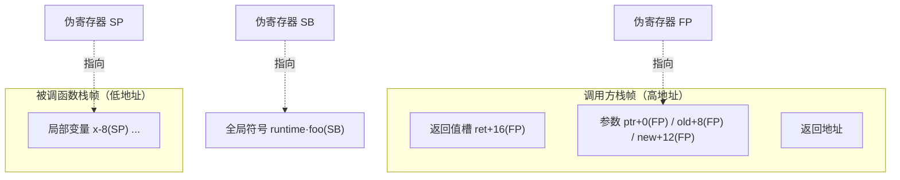

# 2.1 Plan 9 汇编语言

读 Go 运行时的源码，迟早会撞见一种看起来既像汇编、又不太像任何熟悉汇编的代码，那是 Go 的
**Plan 9 风格汇编**。剖析调度器、栈切换、原子操作时我们会反复回到它：`gogo`、`mcall`、
`morestack`、`asyncPreempt` 都是汇编例程。本节解释它是什么、为何存在、以及读懂它需要的几个
关键概念。我们不求让读者会写 Plan 9 汇编，那是另一本书的内容，但求把它变成一份**阅读词汇表**：
当后文提到某个汇编例程时，读者知道它身处的是怎样一个抽象层，每个符号各指向什么。

本节示例取自 `runtime/asm_amd64.s` 与 `internal/runtime/atomic`。这些例程在各版本间相当稳定，
为聚焦设计，我们对个别与本节无关的实验性分支（如 `GOEXPERIMENT` 守卫）做了裁剪，完整定义
请对照对应源文件。

## 2.1.1 为什么 Go 要有自己的汇编

Go 的汇编源自 **Plan 9 操作系统**的汇编器传统。Plan 9 是贝尔实验室在 Unix 之后的研究型系统，
Go 的几位设计者（Ken Thompson、Rob Pike、Russ Cox）正是从那里走来，把那套工具链的思路一并带进了
Go。它的关键特征是：**它不是某一种 CPU 的原生汇编，而是一种半抽象、跨架构统一的中间汇编**。
同一套语法、同一批伪指令与伪寄存器，由工具链 `cmd/asm` 翻译到 amd64、arm64、riscv64 等各目标
架构的真实指令。这与 GNU as 那种「每个架构一套方言」的设计截然不同。

这个选择服务于 Go 最初的一个硬目标：**一套工具链、交叉编译开箱即用**。当汇编层本身就是跨架构的，
为新架构移植运行时就退化成「为这套统一语法补一个后端」，而不是「重学一门汇编再重写一遍运行时」。
代价同样真实：Go 要自己维护汇编器、链接器与目标文件格式（`cmd/internal/obj`），多养一整套基础设施。
买到的是对代码生成、调用约定、与运行时协同的**完全掌控**，这条「自己造而非复用现成件」的取舍，
会在 [2.3 调用约定](./callconv.md) 的自定义 ABI 与 [6.1](../../part2lang/ch06func/func.md) 的函数调用里
再次出现，是理解 Go 运行时的一条主线。

那么 Go 为什么**需要**下到汇编？绝大多数 Go 代码当然不碰它，但运行时有少数地方编译器无能为力，
必须由人手写机器层的胶水：

- **栈切换**。`gogo` 与 `mcall`（[9.4](../../part3concurrency/ch09sched/schedule.md)）要直接把 SP、PC
  从一个 goroutine 的现场换到另一个，这是高级语言里没有的操作。
- **栈增长的序言**。`morestack` 在栈不够时被调用，它要在切到 g0 栈之前精确保存当前函数的现场。
- **原子操作**。CAS、原子加等要发特定的 CPU 指令（如带 `LOCK` 前缀的 `CMPXCHG`），编译器不会
  凭空生成。
- **信号与系统调用入口**。信号处理时的现场保存与恢复（[9.6](../../part3concurrency/ch09sched/signal.md)）、
  syscall 的进出，都需要绕过编译器精确摆布寄存器。

这些地方的共同点是：它们操作的对象正是「执行的现场」本身（栈指针、程序计数器、寄存器），
而高级语言恰恰把这些藏了起来。汇编是运行时与硬件之间那最后一层薄薄的、不可省略的胶水。

## 2.1.2 四个伪寄存器

Plan 9 汇编最容易让人困惑、也最该先弄懂的，是它的**伪寄存器**。它们不一定对应某个真实的物理
寄存器，而是工具链提供的抽象：你用它们表达意图（「第一个参数」「第二个局部变量」「某全局符号」），
由 `cmd/asm` 负责把这套意图落到各架构真实的寄存器与寻址方式上。正是这层抽象，让同一份汇编能跨
架构复用。共有四个：

- **FP**（Frame Pointer，帧指针）：访问函数的**输入参数与返回值**，以符号加偏移给出，如
  `ptr+0(FP)`、`ret+16(FP)`。参数位于调用方栈帧中，FP 指向它们的基址。
- **SP**（Stack Pointer，栈指针）：访问当前函数的**局部变量**，如 `x-8(SP)`。注意这是**伪寄存器**
  SP，与硬件 SP 含义不同，见下文的陷阱。
- **PC**（Program Counter，程序计数器）：当前指令地址，用于跳转与分支。
- **SB**（Static Base，静态基址）：访问**全局符号**，如 `runtime·gogo(SB)`。所有函数名、全局变量名
  都作为 SB 的偏移给出，可以把 SB 理解为「整个地址空间的起点」。

一句话记法：**FP 管参数、SP 管局部、SB 管全局、PC 管跳转**。这四者把一个函数运行时要触及的
三类数据（传进来的、自己临时的、外部全局的）和控制流分别命了名。下图画出前三者在一次调用中
各指向何处：

栈在多数架构上向低地址生长：参数与返回值由调用方备好，落在**较高**的地址，用 FP 加正偏移访问；
被调函数的局部变量落在**较低**的地址，用 SP 加负偏移访问。理解了这张图，运行时里那些汇编例程
就从天书变成了「对栈与寄存器的精确读写」。

### 一个反复绊倒读者的陷阱：伪 SP 与硬件 SP

Plan 9 里有**两个 SP**，它们写法不同、含义不同：

- **带符号名**的 `sym+offset(SP)`，如 `x-8(SP)`，指的是**伪寄存器 SP**，相对当前栈帧的局部变量区。
- **不带符号名**的 `offset(SP)`，如 `0(SP)`、`8(SP)`，指的是**硬件栈指针 SP**，是真实的机器寄存器。

二者的偏移基准不同，混淆会读出完全错误的地址。一个实用的判别法是看有没有符号名：有名字（`x-8(SP)`）
就是伪 SP，访问的是局部变量；裸偏移（`8(SP)`）就是硬件 SP，多用在压栈传参或在 `morestack`
这类直接摆布机器栈的例程里。这正是「阅读词汇表」要替读者拆掉的第一个雷。

掌握了伪寄存器与寻址语法之后，下一步是把它们用在一段完整例程上：一个手写汇编函数如何声明
自己的符号、如何申明栈帧大小。这正是 [2.2 汇编中的栈帧与符号](./frame.md) 要做的事，那里会用
`Cas`、`gogo`、`morestack` 三段真实例程把这些约定逐处对上号。

## 延伸阅读的文献

1. The Go Authors. *A Quick Guide to Go's Assembler.* https://go.dev/doc/asm
   （伪寄存器、寻址、`TEXT`/`DATA`/`GLOBL` 与帧大小说明的权威参考）
2. Rob Pike. *A Manual for the Plan 9 Assembler.* https://9p.io/sys/doc/asm.html
   （Go 汇编语法的直接源头）
3. Rob Pike. *How to Use the Plan 9 C Compiler.* http://doc.cat-v.org/plan_9/2nd_edition/papers/comp
   （Plan 9 工具链与寄存器约定的背景）
4. The Go Authors. *cmd/asm、cmd/internal/obj.* https://github.com/golang/go/tree/master/src/cmd/asm
   （把统一汇编翻译到各架构后端的实现）
5. 本书 [2.2 汇编中的栈帧与符号](./frame.md)（`Cas`/`gogo`/`morestack` 例程）、
   [2.3 调用约定与寄存器 ABI](./callconv.md)（自定义 ABI）、
   [6.1 函数调用](../../part2lang/ch06func/func.md).
