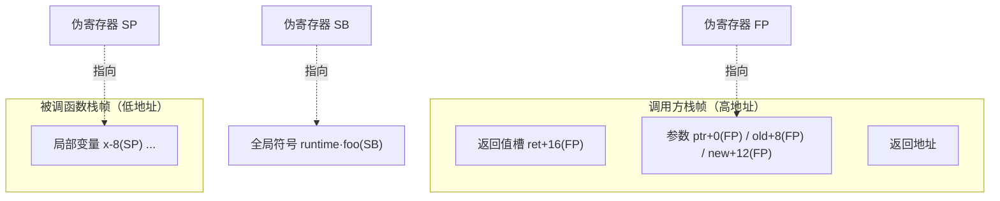

# 2.1 Plan 9 汇编语言

读 Go 运行时的源码，迟早会撞见一种看起来既像汇编、又不太像任何熟悉汇编的代码，那是 Go 的
**Plan 9 风格汇编**。剖析调度器、栈切换、原子操作时我们会反复回到它：`gogo`、`mcall`、
`morestack`、`asyncPreempt` 都是汇编例程。本节解释它是什么、为何存在、以及读懂它需要的几个
关键概念。我们不求让读者会写 Plan 9 汇编，那是另一本书的内容，但求把它变成一份**阅读词汇表**：
当后文提到某个汇编例程时，读者知道它身处的是怎样一个抽象层，每个符号各指向什么。

本节示例取自 `runtime/asm_amd64.s` 与 `internal/runtime/atomic`。这些例程在各版本间相当稳定，
为聚焦设计，我们对个别与本节无关的实验性分支（如 `GOEXPERIMENT` 守卫）做了裁剪，完整定义
请对照对应源文件。

## 2.1.1 为什么 Go 要有自己的汇编

Go 的汇编源自 **Plan 9 操作系统**的汇编器传统。Plan 9 是贝尔实验室在 Unix 之后的研究型系统，
Go 的几位设计者（Ken Thompson、Rob Pike、Russ Cox）正是从那里走来，把那套工具链的思路一并带进了
Go。它的关键特征是：**它不是某一种 CPU 的原生汇编，而是一种半抽象、跨架构统一的中间汇编**。
同一套语法、同一批伪指令与伪寄存器，由工具链 `cmd/asm` 翻译到 amd64、arm64、riscv64 等各目标
架构的真实指令。这与 GNU as 那种「每个架构一套方言」的设计截然不同。

这个选择服务于 Go 最初的一个硬目标：**一套工具链、交叉编译开箱即用**。当汇编层本身就是跨架构的，
为新架构移植运行时就退化成「为这套统一语法补一个后端」，而不是「重学一门汇编再重写一遍运行时」。
代价同样真实：Go 要自己维护汇编器、链接器与目标文件格式（`cmd/internal/obj`），多养一整套基础设施。
买到的是对代码生成、调用约定、与运行时协同的**完全掌控**，这条「自己造而非复用现成件」的取舍，
会在 [2.2 调用规约](./callconv.md) 的自定义 ABI 与 [6.1](../../part2lang/ch06func/func.md) 的函数调用里
再次出现，是理解 Go 运行时的一条主线。

那么 Go 为什么**需要**下到汇编？绝大多数 Go 代码当然不碰它，但运行时有少数地方编译器无能为力，
必须由人手写机器层的胶水：

- **栈切换**。`gogo` 与 `mcall`（[9.4](../../part3concurrency/ch09sched/schedule.md)）要直接把 SP、PC
  从一个 goroutine 的现场换到另一个，这是高级语言里没有的操作。
- **栈增长的序言**。`morestack` 在栈不够时被调用，它要在切到 g0 栈之前精确保存当前函数的现场。
- **原子操作**。CAS、原子加等要发特定的 CPU 指令（如带 `LOCK` 前缀的 `CMPXCHG`），编译器不会
  凭空生成。
- **信号与系统调用入口**。信号处理时的现场保存与恢复（[9.6](../../part3concurrency/ch09sched/signal.md)）、
  syscall 的进出，都需要绕过编译器精确摆布寄存器。

这些地方的共同点是：它们操作的对象正是「执行的现场」本身（栈指针、程序计数器、寄存器），
而高级语言恰恰把这些藏了起来。汇编是运行时与硬件之间那最后一层薄薄的、不可省略的胶水。

## 2.1.2 四个伪寄存器

Plan 9 汇编最容易让人困惑、也最该先弄懂的，是它的**伪寄存器**。它们不一定对应某个真实的物理
寄存器，而是工具链提供的抽象：你用它们表达意图（「第一个参数」「第二个局部变量」「某全局符号」），
由 `cmd/asm` 负责把这套意图落到各架构真实的寄存器与寻址方式上。正是这层抽象，让同一份汇编能跨
架构复用。共有四个：

- **FP**（Frame Pointer，帧指针）：访问函数的**输入参数与返回值**，以符号加偏移给出，如
  `ptr+0(FP)`、`ret+16(FP)`。参数位于调用方栈帧中，FP 指向它们的基址。
- **SP**（Stack Pointer，栈指针）：访问当前函数的**局部变量**，如 `x-8(SP)`。注意这是**伪寄存器**
  SP，与硬件 SP 含义不同，见下文的陷阱。
- **PC**（Program Counter，程序计数器）：当前指令地址，用于跳转与分支。
- **SB**（Static Base，静态基址）：访问**全局符号**，如 `runtime·gogo(SB)`。所有函数名、全局变量名
  都作为 SB 的偏移给出，可以把 SB 理解为「整个地址空间的起点」。

一句话记法：**FP 管参数、SP 管局部、SB 管全局、PC 管跳转**。这四者把一个函数运行时要触及的
三类数据（传进来的、自己临时的、外部全局的）和控制流分别命了名。下图画出前三者在一次调用中
各指向何处：



栈在多数架构上向低地址生长：参数与返回值由调用方备好，落在**较高**的地址，用 FP 加正偏移访问；
被调函数的局部变量落在**较低**的地址，用 SP 加负偏移访问。理解了这张图，运行时里那些汇编例程
就从天书变成了「对栈与寄存器的精确读写」。

### 一个反复绊倒读者的陷阱：伪 SP 与硬件 SP

Plan 9 里有**两个 SP**，它们写法不同、含义不同：

- **带符号名**的 `sym+offset(SP)`，如 `x-8(SP)`，指的是**伪寄存器 SP**，相对当前栈帧的局部变量区。
- **不带符号名**的 `offset(SP)`，如 `0(SP)`、`8(SP)`，指的是**硬件栈指针 SP**，是真实的机器寄存器。

二者的偏移基准不同，混淆会读出完全错误的地址。一个实用的判别法是看有没有符号名：有名字（`x-8(SP)`）
就是伪 SP，访问的是局部变量；裸偏移（`8(SP)`）就是硬件 SP，多用在压栈传参或在 `morestack`
这类直接摆布机器栈的例程里。这正是「阅读词汇表」要替读者拆掉的第一个雷。

## 2.1.3 从 Go 源码到 Plan 9 汇编：CAS 的逐槽对应

把抽象落到实处。运行时的原子比较交换 `Cas` 在 amd64 上是手写汇编，它的 Go 原型与汇编实现
逐字段对得上，是观察「Go 源码如何映射到 Plan 9 汇编」的好样本。Go 这一侧只有声明（函数体在
`.s` 文件里）：

```go
// internal/runtime/atomic：仅声明，实现在 atomic_amd64.s
//
//	if *ptr == old { *ptr = new; return true } else { return false }
func Cas(ptr *uint32, old, new uint32) bool
```

对应的 amd64 实现：

```asm
// internal/runtime/atomic/atomic_amd64.s
TEXT ·Cas(SB), NOSPLIT, $0-17
	MOVQ	ptr+0(FP), BX      // BX = ptr        （指针 8 字节，偏移 0）
	MOVL	old+8(FP), AX      // AX = old        （int32 4 字节，偏移 8）
	MOVL	new+12(FP), CX     // CX = new        （int32 4 字节，偏移 12）
	LOCK
	CMPXCHGL	CX, 0(BX)  // 原子：若 *ptr==AX 则 *ptr=CX
	SETEQ	ret+16(FP)         // 相等则把 1 写回返回值槽（偏移 16）
	RET
```

逐处对照即可读通这段代码，也能体会 FP 的作用：

- `TEXT ·Cas(SB)` 用 SB 声明全局符号 `Cas`，`·` 是包名分隔符，工具链会补全为
  `internal/runtime/atomic.Cas`。函数名以 SB 偏移给出，正是 2.1.2 里 SB 的职责。
- `$0-17` 是帧大小说明：**局部帧 0 字节，参数加返回值共 17 字节**。`17 = 8 + 4 + 4 + 1`，恰是
  `*uint32`（8）、两个 `uint32`（各 4）、`bool` 返回值（1）之和。`NOSPLIT` 表示这段代码不插入
  栈增长检查，本身不会触发 `morestack`。
- 三条 `MOVx ...(FP)` 把三个**参数**从调用方栈帧搬进寄存器，偏移 0、8、12 与 Go 签名里参数的
  排布一一对应。`MOVQ` 搬 8 字节（指针），`MOVL` 搬 4 字节（int32），后缀编码了操作宽度
  （B/W/L/Q 对应 1/2/4/8 字节）。
- `LOCK` 不是一条指令，而是修饰下一条指令的**前缀**，它令 `CMPXCHGL` 在多核上原子地独占目标
  缓存行。`CMPXCHGL` 隐式以 AX 为比较基准：若 `*ptr == AX` 则写入 CX，并置标志位。
- `SETEQ ret+16(FP)` 据标志位把 1 或 0 写回**返回值槽**，偏移 16 紧接在 17 字节区的末尾。

值得记住的是这份汇编只写一遍语法、却为多架构各有一份后端实现：386、arm64、riscv64 各自的
`atomic_*.s` 用同样的 `·Cas(SB)`、同样的 `ptr+0(FP)` 写法，落到各家真实的原子指令上。这就是
2.1.1 所说「一套语法、多个后端」在最小尺度上的样子。

## 2.1.4 运行时下到汇编的两处现场：gogo 与 morestack

CAS 展示了「调用约定 + 一条特殊指令」，调度器里的栈切换则展示了汇编**唯一能做**的事：把执行
现场整体搬走。Go 用一个 `gobuf` 结构保存 goroutine 的现场（SP、PC、g 指针等），`gogo` 的职责
就是把某个 `gobuf` 恢复进真实寄存器，从而「跳进」那个 goroutine：

```asm
// runtime/asm_amd64.s（裁剪：省去 g != nil 校验与实验性分支）
TEXT gogo<>(SB), NOSPLIT, $0
	get_tls(CX)
	MOVQ	DX, g(CX)            // 把目标 g 写回 TLS
	MOVQ	DX, R14              // R14 恒为当前 g（regabi 约定）
	MOVQ	gobuf_sp(BX), SP     // 恢复栈指针：换栈在此一句完成
	MOVQ	gobuf_bp(BX), BP     // 恢复帧基址
	MOVQ	gobuf_pc(BX), BX     // 取出目标 PC
	JMP	BX                       // 跳过去，从此 CPU 在新 goroutine 上执行
```

关键就在 `MOVQ gobuf_sp(BX), SP` 与末尾的 `JMP BX`：一句换掉栈指针，一句换掉程序计数器，CPU
的执行现场便从一个 goroutine 整体迁移到另一个。这种「把 SP/PC 当普通数据来读写」的操作，
高级语言里根本没有对应物，只能下到汇编。顺带一提，`R14` 恒等于当前 g 是 `<ABIInternal>`
寄存器调用约定的一部分，调用约定本身由 [2.2](./callconv.md) 详述，这里只需知道它解释了汇编里
为何能直接用 `R14` 取到当前 goroutine。

另一处是栈增长的序言 `morestack`。Go 的栈是按需增长的（[14](../../part4memory/ch14stack)），
编译器在函数入口插入检查，发现栈不够就跳来这里。`morestack` 必须在切到 g0 系统栈之前，把
**当前函数的现场**存进 `g.sched`，否则栈一搬走现场就丢了：

```asm
// runtime/asm_amd64.s（裁剪要点）
TEXT runtime·morestack(SB), NOSPLIT|NOFRAME, $0-0
	get_tls(CX)
	MOVQ	g(CX), DI                       // DI = 当前 g
	MOVQ	g_m(DI), BX                      // BX = m
	MOVQ	0(SP), AX                        // 取被增长函数的 PC（裸 0(SP)：硬件 SP）
	MOVQ	AX, (g_sched+gobuf_pc)(DI)       // 存进 g.sched.pc
	LEAQ	8(SP), AX                        // 算出其 SP
	MOVQ	AX, (g_sched+gobuf_sp)(DI)       // 存进 g.sched.sp
	// ...切到 m.g0 栈，最终 CALL runtime·newstack(SB) 完成扩容与重新调度
```

注意这里 `0(SP)`、`8(SP)` 都是**裸偏移**，用的是硬件 SP（2.1.2 的陷阱）：`morestack` 直接在机器
栈上读返回地址，所以必须用真实栈指针而非伪 SP。它常以 `morestack_noctxt` 的形式出现，那不过是
先把上下文寄存器清零、再跳进 `morestack` 的两行薄包装：

```asm
TEXT runtime·morestack_noctxt(SB), NOSPLIT, $0
	MOVL	$0, DX
	JMP	runtime·morestack(SB)
```

读懂这两段，调度与栈管理章节里反复出现的「保存/恢复现场」就不再神秘：它们都是在汇编层精确
摆布 PC、SP 与少数约定寄存器。

## 2.1.5 它在本书中的角色与取舍

本节是一份阅读词汇表，不是汇编教程。Go 选择维护自己的、Plan 9 风格的跨架构汇编器，而不复用
GNU as 这类现成工具，这是一处清晰的工程取舍：**成本**是又多养了一套汇编器、链接器与目标文件
格式，每加一个架构都要补一个后端；**收益**是对代码生成、调用约定、栈布局、与运行时的协同握有
完全控制权，并让「一套工具链交叉编译到所有架构」成为可能。性能与可控从不白来，它们的对价正是
这套自有基础设施的长期维护负担。这与 [2.2 调用规约](./callconv.md) 选择自定义 ABI、
[6.1](../../part2lang/ch06func/func.md) 自管函数调用的取舍同出一辙，三者是同一种「为掌控而自造」的
设计姿态。

把本节当作后续阅读的脚手架即可。当 [9.4](../../part3concurrency/ch09sched/schedule.md) 用 `gogo`/`mcall`
切换 goroutine、[9.6](../../part3concurrency/ch09sched/signal.md) 在信号里保存现场、
[14](../../part4memory/ch14stack) 谈栈增长时，读者知道那些汇编符号身处怎样一个抽象层：FP 取参数、
SP 取局部、SB 取全局、PC 管跳转，由 Go 自有工具链翻译到真实硬件。带着这份词汇表，运行时最底层
的那几页就读得动了。

## 延伸阅读的文献

1. The Go Authors. *A Quick Guide to Go's Assembler.* https://go.dev/doc/asm
   （伪寄存器、寻址、`TEXT`/`DATA`/`GLOBL` 与帧大小说明的权威参考）
2. Rob Pike. *A Manual for the Plan 9 Assembler.* https://9p.io/sys/doc/asm.html
   （Go 汇编语法的直接源头）
3. Rob Pike. *How to Use the Plan 9 C Compiler.* http://doc.cat-v.org/plan_9/2nd_edition/papers/comp
   （Plan 9 工具链与寄存器约定的背景）
4. The Go Authors. *cmd/asm、cmd/internal/obj.* https://github.com/golang/go/tree/master/src/cmd/asm
   （把统一汇编翻译到各架构后端的实现）
5. The Go Authors. *runtime/asm_amd64.s、internal/runtime/atomic.* https://github.com/golang/go/tree/master/src/runtime
   （本节 `gogo`/`morestack`/`Cas` 的出处）
6. The Go Authors. *Debugging Go Code with GDB.* https://go.dev/doc/gdb
   （把汇编与运行时现场对照调试）
7. 本书 [2.2 调用规约](./callconv.md)、[6.1 函数调用](../../part2lang/ch06func/func.md)（自定义 ABI）、
   [9.4 调度循环](../../part3concurrency/ch09sched/schedule.md)（gogo/mcall 栈切换）、
   [14 栈管理](../../part4memory/ch14stack)（morestack 与栈增长）.
