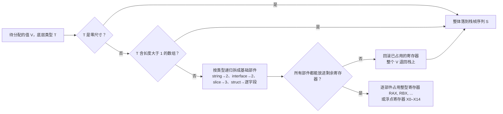

# 2.3 调用约定与寄存器 ABI

> 文中的寄存器名、栈帧布局与序言代码以 amd64 为例，
> 其余体系结构（arm64、riscv64 等）结构相同而寄存器名不同，可对照
> `src/cmd/compile/abi-internal.md` 的「Architecture specifics」一节。

一次函数调用，在机器层面要回答一连串具体的问题：参数放哪里，返回值放哪里，谁负责保存哪些
寄存器，栈帧怎样布局，返回地址压在何处。把这些问题的答案固定下来，就是调用规范（calling
convention），它也常被称作 ABI（application binary interface）。ABI 不是某一段代码，而是一份
**契约**：编译器生成的代码、手写的 Plan 9 汇编（[2.1](./asm.md)）、运行时里的底层例程，三方各自
独立编写，却要在调用的那一刻严丝合缝地对接。契约一旦写定，三方就都按它来摆放数据，谁也不必
知道对方的内部细节。

[6.1](../../part2lang/ch06func/func.md) 已从语言视角讲过函数调用从栈到寄存器的演进，那里关心的是
「一次 `f(a, b)` 在 Go 语义上发生了什么」。本节与 [2.4 参数传递与栈帧布局](./args.md) 补足它在汇编与
运行时层面的另一半：同一次调用，落到机器指令上是如何约定的。两者合起来，函数调用这件事才算讲完整。

## 2.3.1 两套 ABI：ABI0 与 ABIInternal

Go 同时维护着两套调用规范，理解它们的分工是读懂运行时里那些奇怪符号标注的钥匙。

**ABI0** 是早期的、**基于栈**的规范：所有参数与返回值一律通过栈内存传递，调用方在自己的栈帧里
按顺序摆好参数，被调用方从固定偏移处取用。它的好处是布局稳定、可预测，人脑能算清每个参数的
偏移。手写汇编因此一律遵循 ABI0，`go.dev/doc/asm` 描述的就是这套稳定 ABI。ABI0 还有一个常被
忽略的性质：它是 Go 唯一**承诺稳定**的 ABI，是汇编与 Go 之间唯一可靠的接缝。

**ABIInternal** 是 Go 1.17 引入的、**基于寄存器**的内部规范：尽量把参数与返回值放进寄存器，省去
大量进出栈内存的读写。所有由 Go 源码编译出的函数都走 ABIInternal。它的名字里「Internal」二字是
郑重的警告：这套 ABI **不稳定**，会随 Go 版本变化，任何外部代码都不应依赖它的细节。换来的是
约 5% 的整体提速，且这份提速对用户代码完全透明，源码一字不改，重新编译即享。

在 amd64 上，ABIInternal 用如下 9 个整数寄存器顺序传递整型参数与返回值，浮点用 `X0`–`X14`：

```
RAX, RBX, RCX, RDI, RSI, R8, R9, R10, R11
```

参数的分配是**递归**的：一个值按其类型拆成基础部件，每个部件占一个寄存器。一个 `string` 拆成
指针与长度两个寄存器，一个 `[]T` 拆成三个，一个小结构体按字段逐个铺开。装不下的（寄存器用尽，
或含有非平凡数组的值）整个退回栈上传递。这条规则有一个值得记住的边界：**含数组的参数一律走栈**，
因为按下标访问数组要算偏移，而偏移没法落在寄存器里；Go 1.15 标准库里只有 0.7% 的函数签名含数组，
为这极少数破例不值得，于是干脆全栈传。

把这套递归判定画成一张决策图，每个参数（或返回值）独立走一遍：



要点在那条「回滚」边：分配是**全有或全无**的，一个值若有任何部件放不进寄存器，已经试探占用的
寄存器要全部退还，整个值改走栈，绝不允许「一半在寄存器、一半在栈」。这正是为了应对被调用方对参数
**取地址**的情形，若值被劈成两半，取址时还得在内存里把它重新拼回去，代价与值的大小成正比，得不偿失
（见 `abi-internal.md` 的 Rationale 一节）。返回值走同一套算法，只是分配前把寄存器计数从头重置，故
入参与返回值可以复用同一批寄存器而互不干涉。

两套并存，意味着边界处需要**桥接**。当 ABIInternal 的 Go 代码调用 ABI0 的汇编函数，或反过来，
两边对「参数在哪」的理解并不一致，链接器会自动插入一小段**包装代码**（ABI wrapper）做参数的
搬运：把寄存器里的实参摆到栈上对应位置，或反向搬回。这层桥接由内部 ABI 提案（27539）规定，
对调用双方透明。它在符号表里露出马脚，运行时里同一个名字常带 ABI 标注后缀：

```
runtime.morestack_noctxt.abi0       // ABI0 版本
runtime.systemstack<ABIInternal>    // ABIInternal 版本
```

读运行时反汇编时，看到 `·f<ABIInternal>` 与 `·g.abi0` 这类标注，便知道链接器在此处可能架了一座
桥。多数情况下你不必关心桥的存在；只有在手写汇编里直接调用 Go 函数，或反过来被 Go 调用时，
才需要清楚自己站在哪一侧 ABI。

讲清了两套 ABI 与参数分配的算法，接下来 [2.4 参数传递与栈帧布局](./args.md) 用一个混合例子把它落到
具体的栈帧上，并补足溢出槽、序言里的栈增长检查，以及「为何自定义 ABI」这个总账。

## 延伸阅读的文献

1. The Go Authors. *Go internal ABI specification (ABIInternal).*
   https://github.com/golang/go/blob/master/src/cmd/compile/abi-internal.md
   （ABIInternal 的权威说明：参数分配算法、溢出槽、各体系结构寄存器映射）
2. Austin Clements et al. *Proposal: Register-based Go calling convention*（40724，Go 1.17）.
   https://go.googlesource.com/proposal/+/master/design/40724-register-calling.md
   （为何用统一的自定义 ABI 而非平台 ABI，以及约 5% 提速的来由）
3. The Go Authors. *Proposal: Create an undefined internal calling convention*（27539）.
   https://go.googlesource.com/proposal/+/master/design/27539-internal-abi.md
   （ABI0 与 ABIInternal 之间透明 wrapper 的设计）
4. The Go Authors. *A Quick Guide to Go's Assembler*（ABI0、伪寄存器、稳定汇编 ABI）.
   https://go.dev/doc/asm
5. 本书 [2.1 Plan 9 汇编语言](./asm.md)、[2.4 参数传递与栈帧布局](./args.md)、
   [6.1 函数调用](../../part2lang/ch06func/func.md).
