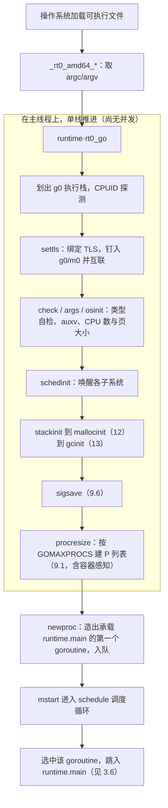

# 3.5 Go 程序启动引导

> 本节内容对标 Go 1.26。

读者写下的 `main` 函数，并不是程序真正的第一条指令。当操作系统把控制权交给一个 Go
可执行文件时，跑起来的是运行时（runtime）：它要在主线程上铺好执行栈、绑定线程本地存储、
量出 CPU 核心数与内存物理页大小，把内存分配器、垃圾回收器、调度器逐一唤醒，最后才创建那个
承载 `main` 的 goroutine，交由调度循环去运行。换言之，一个 Go 二进制文件里随身带着一个
微型操作系统（[1.2](../../ch01intro/go.md)），它先于用户代码自行启动。本节顺着这条引导链走一遍，
从操作系统的入口符号，到第一个 goroutine 被调度，看清楚「在 `main` 之前」究竟发生了什么。

引导链的脉络可以先记住三段：汇编入口在主线程上手工搭出 `g0` 与 `m0`（[3.5.1](#351-汇编入口g0m0-与-tls)），
`schedinit` 按依赖次序点亮各个子系统（[3.5.2](#352-schedinit按次序唤醒运行时)），随后
`newproc` 造出第一个 goroutine、`mstart` 进入调度循环把它跑起来（[3.5.3](#353-第一个-goroutine-与调度循环)）。

## 3.5.1 汇编入口：g0、m0 与 TLS

运行时的真正入口由 runtime 包以汇编写就。以 AMD64 为例，Linux 与 macOS 的入口符号分别位于
`runtime/rt0_linux_amd64.s` 与 `runtime/rt0_darwin_amd64.s`，两者都只是一跳，转入共用的
`_rt0_amd64`：

```asm
TEXT _rt0_amd64_linux(SB),NOSPLIT,$-8
	JMP	_rt0_amd64(SB)
TEXT _rt0_amd64_darwin(SB),NOSPLIT,$-8
	JMP	_rt0_amd64(SB)
```

为何按「架构 + 操作系统」两维拆分入口？因为程序编译为机器码后，指令集只取决于 CPU 架构，
而操作系统的差异体现在系统调用等系统级操作上。一份 `_rt0_amd64` 可被多个操作系统共用，
各操作系统再以自己的入口符号跳进来。`rt0` 是 `runtime0` 的缩写，意指运行时的创生，
此后所有派生出来的同类对象都以 `1` 为后缀，`g0`、`m0` 即得名于此。

`_rt0_amd64` 先从栈上取出操作系统传入的参数，再跳进真正干活的 `rt0_go`。程序刚启动时，
栈指针 SP 的前两个槽分别是 `argc` 与 `argv`：

```asm
TEXT _rt0_amd64(SB),NOSPLIT,$-8
	MOVQ	0(SP), DI	// argc
	LEAQ	8(SP), SI	// argv
	JMP	runtime·rt0_go(SB)
```

`rt0_go` 是整段引导的主干。它先把参数搬到对齐后的栈上，随后做引导的第一件实事：在主线程
当前这段操作系统栈上「认领」出 `g0` 的执行栈。`g0` 是每个线程的调度栈，运行时自身的代码
（调度、栈增长、垃圾回收的部分阶段）都跑在它上面，而非用户 goroutine 的栈上：

```asm
TEXT runtime·rt0_go(SB),NOSPLIT|NOFRAME|TOPFRAME,$0
	MOVQ	DI, AX			// argc
	MOVQ	SI, BX			// argv
	SUBQ	$(5*8), SP		// 对齐到偶数栈
	ANDQ	$~15, SP
	MOVQ	AX, 24(SP)
	MOVQ	BX, 32(SP)

	// 用操作系统给的这段栈，划出 g0 的执行栈
	MOVQ	$runtime·g0(SB), DI
	LEAQ	(-64*1024)(SP), BX
	MOVQ	BX, g_stackguard0(DI)		// g0.stackguard0
	MOVQ	BX, g_stackguard1(DI)		// g0.stackguard1
	MOVQ	BX, (g_stack+stack_lo)(DI)	// g0.stack.lo = SP - 64KB
	MOVQ	SP, (g_stack+stack_hi)(DI)	// g0.stack.hi = SP

	// 通过 CPUID 探测处理器信息
	MOVL	$0, AX
	CPUID
	(...)
```

`g0` 与 `m0` 是一对全局变量，在程序运行之初就静态存在，无需分配。`g0` 是 `m0` 的调度栈，
`m0` 则代表主线程。接下来要让二者互相认识，而认识的前提是：线程能在任意时刻找到「当前正在
运行的 goroutine」是谁。这件事由线程本地存储（Thread Local Storage, TLS）承担。

TLS 让每个线程拥有一份独立的 `g` 指针。运行时大量代码靠 `getg()` 取当前 goroutine，
其底层就是一次 TLS 读取。在 Linux 上，设置 TLS 要落到一次系统调用，把 FS 段寄存器的基址
指向 `m0.tls`：

```asm
TEXT runtime·settls(SB),NOSPLIT,$32
	ADDQ	$8, DI			// ELF 约定使用 -8(FS)
	MOVQ	DI, SI
	MOVQ	$0x1002, DI		// 0x1002 == ARCH_SET_FS
	MOVQ	$SYS_arch_prctl, AX
	SYSCALL
	(...)
	RET
```

不同操作系统在这一步分道扬镳：Darwin、OpenBSD、Plan 9、Solaris、illumos 各有自己安放 TLS
的机制，`rt0_go` 用条件编译跳过通用的 `settls`，由平台代码自理。TLS 就绪后，运行时写入一个
魔数再读回校验，确保这条「找到当前 g」的通路真的可用，随后才把 `g0`、`m0` 钉进 TLS 并完成
互相绑定：

```asm
ok:
	get_tls(BX)
	LEAQ	runtime·g0(SB), CX
	MOVQ	CX, g(BX)		// TLS 中的当前 g = g0
	LEAQ	runtime·m0(SB), AX
	MOVQ	CX, m_g0(AX)	// m0.g0 = g0
	MOVQ	AX, g_m(CX)		// g0.m  = m0
```

至此主线程有了调度栈、有了 `getg()` 通路、`g0` 与 `m0` 也彼此相认。运行时这才有资格调用
Go 代码，去做后面那些用 Go 写的初始化。`rt0_go` 接着依次调用 `check`、`args`、`osinit`，
做正式初始化前的体检与系统级取数：

```asm
	CALL	runtime·check(SB)		// 校验编译器对类型尺寸的假设
	(...)
	CALL	runtime·args(SB)		// 保存 argc/argv，解析 auxv
	CALL	runtime·osinit(SB)		// 取 CPU 核心数、物理页大小
	CALL	runtime·schedinit(SB)	// 唤醒各运行时组件
```

`check` 是对编译器的一次自检，逐一核对 `int8` 占 1 字节、指针宽度等假设是否成立，编译器若
译错，运行时的一切推断都将失准，故宁可在此当场 `throw`。`args` 把 `argc/argv` 存入全局变量，
并在 Linux 上顺着栈往后读辅助向量（auxiliary vector），从 `_AT_PAGESZ` 取出内存物理页大小。
`osinit` 取 CPU 核心数（关乎下文 P 的数量），Darwin 上由于此前未能从 auxv 拿到页大小，会在
此另用 `sysctl` 补上。这两个系统级常量，CPU 核心数与物理页大小，是后续内存与调度初始化的
地基。

## 3.5.2 schedinit：按次序唤醒运行时

`schedinit` 名为「调度器初始化」，实则是整个运行时的总装车间：内存、栈、垃圾回收、信号、
调度，几乎所有子系统都在此点亮。它们之间存在硬性的先后依赖，次序不能乱。裁剪掉锁初始化与
诊断分支后，主干次序如下：

```go
// runtime/proc.go（裁剪后的速写，仅保留承重的调用次序）
func schedinit() {
	gp := getg()

	sched.maxmcount = 10000   // 限制最大系统线程数
	worldStopped()            // 引导期间「世界」处于停止态

	stackinit()    // 栈分配器（栈缓存、栈池）
	randinit()     // 随机源，须早于 mallocinit
	mallocinit()   // 内存分配器（见 12）
	cpuinit(godebug)
	mcommoninit(gp.m, -1) // 初始化 m0 的公共字段
	modulesinit()         // 模块、类型链接信息
	typelinksinit()
	itabsinit()

	sigsave(&gp.m.sigmask) // 信号掩码（见 9.6）
	goargs()
	goenvs()
	gcinit()       // 垃圾回收器（见 13）

	// 依 CPU 核心数与 GOMAXPROCS 决定 P 的数量
	var procs int32
	if n, err := strconv.ParseInt(gogetenv("GOMAXPROCS"), 10, 32); err == nil && n > 0 {
		procs = n
		sched.customGOMAXPROCS = true
	} else {
		procs = defaultGOMAXPROCS(numCPUStartup)
	}
	if procresize(procs) != nil { // 创建 P 列表（见 9.1）
		throw("unknown runnable goroutine during bootstrap")
	}
	worldStarted() // P 可运行，世界正式启动
}
```

这串调用的次序本身就是一份依赖说明书。`stackinit` 先于一切，因为后续初始化自身也要用栈；
`randinit` 须排在 `mallocinit` 之前，分配器的某些随机化要用它；`mallocinit`
（[12](../../part4memory/ch12alloc/)）建起 mcache、mcentral、mheap 那套分层结构，它又必须
先于 `gcinit`，因为垃圾回收器（[13](../../part4memory/ch13gc/)）要在分配器划好的 arena 与
位图之上运作。`sigsave` 记下初始信号掩码，为后面的信号处理机制
（[9.6](../../part3concurrency/ch09sched/signal.md)）留底。这种「谁依赖谁就排在谁后面」的
线性次序，是引导代码区别于普通运行时代码的鲜明特征：此刻还没有并发，一切都在主线程上单线
推进，次序即正确性。

整段初始化的收尾是 `procresize(procs)`，它按 `procs` 的数量创建处理器 P 的列表
（[9.1](../../part3concurrency/ch09sched/model.md)）。`procs` 怎么定？显式设了
`GOMAXPROCS` 环境变量就用它；否则取 `defaultGOMAXPROCS(numCPUStartup)`。这里有一处值得点出的
演进：早期版本直接以机器的 CPU 核心数为默认值，在容器里却常常「看见」的是宿主机的全部核心，
而非 cgroup 给本进程划定的 CPU 配额，于是 P 开得过多、调度与 GC 反而受损。自 Go 1.25 起，
Linux 上的默认值改为感知 cgroup：运行时在启动时读取 `/proc/self/cgroup` 与 `cpu.max`，
按 CPU 配额向上取整算出一个更贴合容器实况的默认 P 数（见 `runtime/cgroup_linux.go`）。
这正是「默认值要贴合部署实况」的一处具体修补。

`procresize` 返回前，调度器的本地运行队列、每 P 的 mcache 等都已就位。它返回了一个非 `nil`
的可运行 goroutine 本不该发生（此刻还没创建任何 goroutine），故以 `throw` 兜底。随后
`worldStarted` 宣告「世界」启动，P 已具备运行 goroutine 的条件。运行时的躯干，到这里已经
组装完毕，只差第一个被调度的执行单元。

## 3.5.3 第一个 goroutine 与调度循环

`schedinit` 返回后，`rt0_go` 只剩三步，却完成了从「运行时就绪」到「用户代码运行」的惊险一跃：

```asm
	CALL	runtime·schedinit(SB)

	// 创建承载 runtime.main 的第一个 goroutine
	MOVQ	$runtime·mainPC(SB), AX	// 入口地址
	PUSHQ	AX
	CALL	runtime·newproc(SB)
	POPQ	AX

	// 启动本 M，进入调度循环，正常情况下永不返回
	CALL	runtime·mstart(SB)
```

`mainPC` 是一个数据段符号，存放 `runtime.main` 的入口地址，由它充当第一个 goroutine 的
起点：

```asm
DATA	runtime·mainPC+0(SB)/8,$runtime·main(SB)
GLOBL	runtime·mainPC(SB),RODATA,$8
```

注意第一个 goroutine 的入口不是用户的 `main.main`，而是 `runtime.main`。这层间接是有意为之：
`runtime.main` 要先做一批只有「在 goroutine 上下文里」才方便做的收尾工作（启动系统监控线程
sysmon、执行各包的 `init`、开放 GC 等），再去调用用户的 `main.main`。这部分是
[3.6 主 Goroutine 的生与死](./main.md) 的主题。

`newproc` 把入口地址包装成一个新的 goroutine 并入队，等候调度：

```go
// runtime/proc.go（速写）
func newproc(fn *funcval) {
	gp := getg()
	pc := sys.GetCallerPC()
	systemstack(func() {
		newg := newproc1(fn, gp, pc, false, waitReasonZero)
		pp := getg().m.p.ptr()
		runqput(pp, newg, true) // 放入当前 P 的本地运行队列
		if mainStarted {
			wakep() // 必要时唤醒空闲 P 去抢活
		}
	})
}
```

`newproc1` 申请一个 `g` 结构（能复用就从空闲列表取），为它分配执行栈、填好程序计数器与栈帧，
置为 `_Grunnable`，再由 `runqput` 投进当前 P 的本地运行队列
（[9.1](../../part3concurrency/ch09sched/model.md)）。此刻它只是「可运行」，尚未真正运行。

最后一步 `mstart` 把主线程交给调度器。`mstart` 切到 `g0` 栈，进入 `schedule` 调度循环：
循环从本地或全局运行队列中挑出一个可运行的 goroutine，`execute` 之，把控制权交给它的栈与
程序计数器。队列里此刻唯一的成员，正是刚入队的、承载 `runtime.main` 的那个 goroutine。
于是调度器选中它、跳入 `runtime.main`，用户世界的序幕由此拉开。`mstart` 在正常情况下永不
返回，这条主线程从此长居调度循环中。

把整条链连起来，便是下面这张引导调用图：



回到开头那句话：当调度器第一次跳入 `runtime.main` 时，分配器、回收器、调度器、信号处理、
一组 P 与它们的本地缓存，全都已经在运行。读者的 `main` 不过是这个微型操作系统启动完毕后，
被它调度执行的第一个用户任务。理解了引导，也就理解了 Go「运行时与用户代码同居一个二进制」
这一根本特征：你写下的程序从不孤身运行，它始终运行在一层已经醒来的运行时之上。各组件内部
究竟如何初始化，留待它们各自的章节展开；下一节 [3.6](./main.md) 接着看 `runtime.main`
如何把这场启动收尾，又如何在用户 `main` 返回后让整个程序谢幕。

## 延伸阅读的文献

1. The Go Authors. *runtime/asm_amd64.s（`runtime·rt0_go`）、rt0_linux_amd64.s、rt0_darwin_amd64.s.*
   https://github.com/golang/go/tree/master/src/runtime （汇编入口、g0/m0/TLS 的设置）
2. The Go Authors. *runtime/proc.go（`schedinit`、`newproc`、`mstart`、`schedule`）.*
   https://github.com/golang/go/blob/master/src/runtime/proc.go
3. The Go Authors. *runtime/cgroup_linux.go（cgroup 感知的 `GOMAXPROCS` 默认值，Go 1.25+）.*
   https://github.com/golang/go/blob/master/src/runtime/cgroup_linux.go
4. The Go Authors. *Package runtime 文档.* https://pkg.go.dev/runtime
5. Michael Matz, Jan Hubička, Andreas Jaeger, Mark Mitchell. *System V Application Binary
   Interface: AMD64 Architecture Processor Supplement.* 2014.
   https://www.uclibc.org/docs/psABI-x86_64.pdf （ELF 进程栈与辅助向量 auxv 的布局）
6. 本书 [1.2 Go 语言综述](../../ch01intro/go.md)（二进制内含微型操作系统的视角）、
   [9.1 调度问题与 GMP 模型](../../part3concurrency/ch09sched/model.md)（P 列表与调度循环）、
   [9.6 信号处理机制](../../part3concurrency/ch09sched/signal.md)。
7. 本书 [第 12 章 内存分配器](../../part4memory/ch12alloc/)、
   [第 13 章 垃圾回收器](../../part4memory/ch13gc/)（`mallocinit`、`gcinit` 所建起的结构）、
   [3.6 主 Goroutine 的生与死](./main.md)。

## 许可

&copy; 2018-2026 The [golang.design](https://golang.design) Initiative Authors. Licensed under [CC-BY-NC-ND 4.0](https://creativecommons.org/licenses/by-nc-nd/4.0/).
