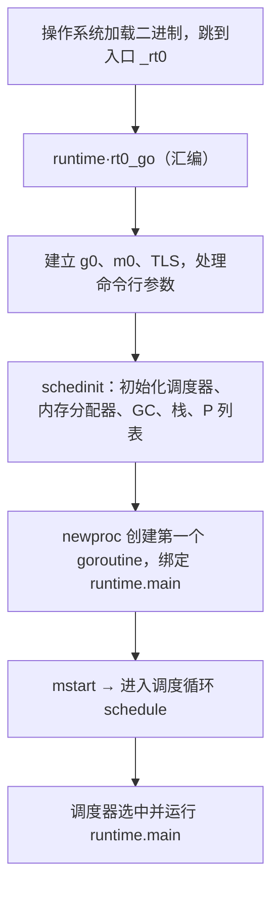

# 3.5 Go 程序启动引导

链接好的二进制（[3.4](./link.md)）被操作系统加载、跳到入口后，控制权并不会立刻交给你的
`main`。在此之前，Go 运行时要先把自己"开机":建立最初的执行环境、初始化调度器与内存系统、
然后才创建那个运行 `main` 的 goroutine。这一节看这段从机器入口到运行时就绪的引导过程。

## 3.5.1 从入口到 schedinit

操作系统加载二进制后，跳到运行时的汇编入口（如 `_rt0_amd64`），它转入
`runtime·rt0_go`（[2.1](../ch02asm/asm.md) 的 Plan 9 汇编）。这段汇编做的是最底层的奠基工作：

汇编先建立起 `m0`（第一个 OS 线程的代身）和它的 `g0`（系统栈，
[9.3](../../part3concurrency/ch09sched/mpg.md)）、设置线程本地存储、处理命令行参数与环境，
然后调用 **`schedinit`**。

## 3.5.2 schedinit：运行时的总初始化

`schedinit`（`runtime/proc.go`）是运行时的总装配线。它按依赖顺序初始化各大子系统：内存分配器
（`mallocinit`，[12 内存分配器](../../part4memory/ch12alloc)）、垃圾回收器
（[13 垃圾回收](../../part4memory/ch13gc)）、栈分配、信号处理
（[9.6](../../part3concurrency/ch09sched/signal.md)）、以及调度器自身,包括根据
`GOMAXPROCS`（[9.1](../../part3concurrency/ch09sched/model.md)，含容器感知）创建 P 的列表。
这一步跑完，运行时的"五脏六腑"就都就位了，但还没有任何用户代码运行。

## 3.5.3 创建第一个 goroutine

初始化完成后，引导代码用 `newproc`（[9.4](../../part3concurrency/ch09sched/schedule.md)）创建
**第一个 goroutine**，让它绑定到 `runtime.main` 这个函数。然后 `mstart` 让 `m0` 进入调度循环
`schedule`,调度器选中这个刚创建的 goroutine 并运行它。至此，引导阶段结束，控制权交给了
`runtime.main`,而它，才是真正通向你的 `main.main` 的那扇门（[3.6](./main.md)）。

这段引导揭示了一个常被忽视的事实：**在你的 `main` 函数运行之前，一整套运行时已经悄然启动并
运转起来了**,调度器在转、内存系统就绪、GC 待命。Go 程序"开箱即用的并发与自动内存管理"，
正是这段看不见的引导铺好的路。理解了这一点，就能体会 Go 二进制"自带一个微型操作系统"
（[1.2](../ch01intro/go.md)）这句话的分量。

## 延伸阅读的文献

1. The Go Authors. *runtime/asm_amd64.s（rt0_go）、runtime/proc.go（schedinit）.*
   https://github.com/golang/go/blob/master/src/runtime/proc.go
2. Go Authors. *runtime: package documentation（启动与调度）.* https://pkg.go.dev/runtime
3. 本书 [9.1 工作窃取调度](../../part3concurrency/ch09sched/model.md)、
   [12 内存分配器](../../part4memory/ch12alloc)、[13 垃圾回收](../../part4memory/ch13gc).
4. 本书 [3.6 主 Goroutine 的生与死](./main.md).

## 许可

&copy; 2018-2026 The [golang.design](https://golang.design) Initiative Authors. Licensed under [CC-BY-NC-ND 4.0](https://creativecommons.org/licenses/by-nc-nd/4.0/).
