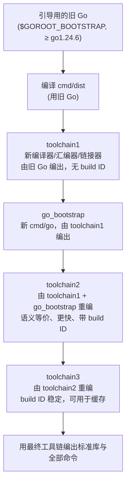

# 3.3 语言的自举

一个问题听起来像悖论：Go 的编译器、汇编器、链接器与运行时如今都用 Go 写成，那么第一个能编译
Go 的程序是从哪里来的？没有 Go 编译器，怎么编译出 Go 编译器？这就是**自举**（bootstrapping）。
它既是「先有鸡还是先有蛋」的经典困局，也是 Go 工具链演化史上一段可被精确复述的工程。本节
回答三件事：这只蛋最初是怎么孵出来的；自举之后，构建一个新版 Go 的链条如何运转，以及它对
引导版本的要求为何逐年抬升；最后，为什么一门语言「用自己实现自己」值得郑重对待。

## 3.3.1 先有蛋：从 C 写的工具链到 Go 写的工具链

自举的前提，是先有一个不依赖自身的起点。Go 工具链最初（到 **Go 1.4**，2014 年）的编译器、
汇编器、链接器与 `cmd/dist` 都是用 **C** 写的，编译器沿用了 Plan 9 的命名（`5c`、`6c`、`8c`、
`9c` 等，数字对应不同的目标架构）。这套 C 程序由系统自带的 `gcc` 或 `clang` 编译，于是构建
Go 不需要任何已存在的 Go,这便是那只「蛋」。

从 **Go 1.5（2015 年 8 月）**起，Go 完成了一次里程碑式的转变：编译器与运行时被**整体用 Go
重写**，C 工具链被删除，工具链从此可以自我引导。这步棋的代价与收益都很实在。收益是，编译器
开发者从此用 Go 这门内存安全、并发友好、自带测试与剖析工具的语言来维护工具链，编译器里的
bug 可以用 Go 自己的调试手段去查；运行时与编译器共用一套语言，跨边界的协作（如逃逸分析与
栈管理）也更顺。代价是，构建 Go 不再像编译一段 C 那样自给自足，它现在需要「另一个已经能用的
Go」。如何用一个旧的 Go 造出一个新的 Go，就成了此后每个版本都要回答的问题。

> 这次重写分两步落地，可对照 Cox 的两份设计文档：`go13compiler` 记录了把 C 写的编译器机械
> 转译为 Go 的过程，`go15bootstrap` 则给出了删除 C、改用旧版 Go 引导的完整方案，`make.bash`
> 至今在注释里指向后者。

## 3.3.2 自举链：用旧 Go 编译新 Go

自举之后，构建新版 Go 的起点变成一个**较旧的、已经能运行的 Go 工具链**，记在环境变量
`$GOROOT_BOOTSTRAP` 中（默认在 `$HOME` 下寻找 `sdk/go1.24.6` 一类的目录）。整个引导过程由
`cmd/dist` 驱动,它本身是一段刻意写得「克制」的 Go 程序，只用得起引导版本里就有的语言特性，
从而能被那个旧 Go 直接编译出来。

引导不是「编译一次」就完事，而是连编三轮，每一轮都有它非编不可的理由。把链条画出来：



三轮的分工是这套设计的核心，值得逐级说清：

1. **toolchain1**,`cmd/dist` 先把编译器、汇编器、链接器等的**新源码**，用引导版旧 Go 的
   `go` 命令编译出来。这一版工具链行为上已是新版，但它由旧 `go` 命令构建，二进制里没有 build
   ID。
2. **go_bootstrap**,再用 toolchain1 编出一个临时的 `go` 命令。从这一步起，构建的主导权
   从 `cmd/dist` 交回给 `go` 命令本身。
3. **toolchain2**,用 toolchain1 加 go_bootstrap，把同一套工具链**再编一遍**。它与
   toolchain1 语义等价，但因为是用新编出的编译器（而非旧引导编译器）构建的，跑得更快，且
   这一版带上了 build ID。
4. **toolchain3**,再用 toolchain2 编出最终一版。到这里，工具链已是「由从头构建的新编译器
   编出的新编译器」，其 build ID 准确稳定，适合喂给构建缓存。

为什么不止一轮？关键在 build ID 与可复现性。toolchain1 是「新源码 + 旧编译器」的产物，足以
自举，但带着旧引导环境的痕迹（无 build ID）。多走两轮，让最终工具链完全脱离引导版 Go 的影响,
toolchain3 是用新工具链构建的新工具链，与构建它的旧 Go 再无瓜葛。这也顺带是一道自检：若新
编译器自身有缺陷，往往在 toolchain2 或 toolchain3 这一轮就会暴露。

这里藏着一个微妙但要紧的判断：toolchain2 与 toolchain3 在源码层面完全相同，理想情况下两者
应当**逐字节一致**。它们之所以分作两版，是因为 toolchain2 是「旧编译器编出的新编译器又编了
一遍」，而 toolchain3 是「新编译器编它自己」,只有当后两版趋于一致，才能确信新编译器没有把
某种依赖于「是谁编译了它」的隐性差异带进产物。这正是经典的**编译器不动点**：一个正确的自举
编译器，从某一轮之后再编自己，输出应当稳定下来。Go 用 build ID 与发布构建里的版本标识来逼近
这个不动点，让最终二进制可被缓存、可被复现。

一个容易被忽略的实现细节：`cmd/dist` 并不直接在原地编译，而是把引导所需的源码（`cmd/compile`、
`cmd/asm`、`cmd/link` 及其依赖）拷进 `$GOROOT/pkg/bootstrap` 工作区，并把它们的导入路径统一
改写成 `bootstrap/...` 前缀。这样旧 Go 编译的是一份与最终标准库**隔离**的副本，新旧两套同名
包不会在引导期间彼此污染。

整条链的入口是 `make.bash`（`all.bash` 在它之外多跑一轮测试）。粗略地看，一次 `make.bash`
依次做的是：检查并定位 `$GOROOT_BOOTSTRAP`,用它编出 `cmd/dist`,由 `cmd/dist` 走完上面
toolchain1 至 toolchain3 三轮，最后用最终工具链编出其余标准库与命令。这几步在终端上是肉眼
可见的，它的输出几乎就是上图的文字版：

```shell
$ GOROOT_BOOTSTRAP=$HOME/sdk/go1.24.6 ./make.bash
Building Go cmd/dist using /Users/you/sdk/go1.24.6. (go1.24.6 darwin/arm64)
Building Go toolchain1 using /Users/you/sdk/go1.24.6.
Building Go bootstrap cmd/go (go_bootstrap) using Go toolchain1.
Building Go toolchain2 using go_bootstrap and Go toolchain1.
Building Go toolchain3 using go_bootstrap and Go toolchain2.
Building packages and commands for darwin/arm64.
---
Installed Go for darwin/arm64 in /Users/you/go
```

每一行对应链上的一环：先用引导版旧 Go 编出 `cmd/dist`，再由它顺次抬出 toolchain1、临时
`go` 命令（go_bootstrap）、toolchain2、toolchain3，最后用站稳的最终工具链铺开标准库与命令。
读这段输出，自举就不再是抽象概念,它是终端里几行可被复述的状态迁移。

## 3.3.3 不断抬升的引导版本

自举给工具链开发者松了绑：他们可以用越来越新的 Go 特性来写 Go 自己。代价随之而来,工具链
源码一旦用上某个新版才有的特性（典型如泛型），能引导它的最低 Go 版本就得跟着上抬。这条引导
版本线一路走高，本身就是 Go 语言自我演化的一份侧写：

| 目标 Go 版本 | 引导所需最低版本 |
|---|---|
| Go ≤ 1.4 | C 工具链（`gcc` / `clang`） |
| Go 1.5 ~ 1.19 | Go 1.4 |
| Go 1.20 ~ 1.21 | Go 1.17（具体为 1.17.13） |
| Go 1.22 ~ 1.23 | Go 1.20 |
| Go 1.24 起 | 由公式给出 |

从 Go 1.20（2023 年）起，引导基准正式告别了沿用近八年的 Go 1.4,背后的取舍记录在 issue
44505 与 54265 里：继续钉死在 Go 1.4，意味着工具链永远不能用 Go 1.5 之后的任何语言特性来
写自己，这个束缚越来越不划算。从 Go 1.24 起，要求不再逐版手写，而是收敛成一条规则：构建
Go 1.N 需要 Go 1.M，其中 $M = N - 2$ 再向下取到偶数。于是 Go 1.24 与 1.25 都要 Go 1.22，
Go 1.26 与 1.27 都要 Go 1.24。这条公式正是 `cmd/dist` 里的 `requiredBootstrapVersion`：

```go
// 构建 Go 1.N 需要 Go 1.M，M = N-2 向下取偶（N ≥ 22）
// 例：Go 1.24、1.25 需 Go 1.22；Go 1.26、1.27 需 Go 1.24
requiredMinor := minor - 2 - minor%2
```

落到 Go 1.26，最低引导版本被进一步钉到补丁号 **go1.24.6**。若有人拿更旧的 Go 去跑
`make.bash`，构建会在编译 `cmd/dist` 时就失败,源码树里专门放了一个文件，仅在
`//go:build !go1.24` 时参与编译，包名是 `building_Go_requires_Go_1_24_6_or_later`,
用一条「找不到合法 main 包」的报错，把版本不足这件事尽早地、显眼地告诉构建者。

公式留出的「N-2 再取偶」这道余量并非随意：它保证任一发布版总能被两到三个发布周期之前的、
已经广泛分发的稳定版引导，下游打包者不必为了构建新 Go 而先去弄一个过于新的 Go。这是工具链
对生态体贴的一处具体体现，下一节再展开。

## 3.3.4 自举为何重要

自举不止是一段技术趣闻，它有三层实在的意义。

**它是语言成熟的信号。** 一门语言能用自己实现自己，尤其是实现编译器、运行时这类对性能和
底层控制要求苛刻的系统软件，说明它的抽象能力与运行效率都已堪当重任。这条路 Go 不是孤例。
自托管（self-hosting）几乎是系统级语言成熟的通过仪式：Rust 的 `rustc` 同样以前一版 Rust
引导，并和 Go 一样要管理「能用多旧的版本引导」这道约束；GCC 与 LLVM 也都长期用一轮自编译
来确保编译器能编译它自己。差别在于各家对「起点」的安置,Go 选择把起点钉在一个公开分发的
旧发布版上，而非像某些工具链那样保留一条可回溯到汇编的最初引导路径。两种选择各有取舍：前者
简单、可复现，但要求引导版本随之滚动；后者在「可从最朴素的起点重建」上更彻底，代价是维护
那条古老路径的成本。

**它统一了开发体验。** 工具链作者与普通用户用的是同一门语言、同一套工具。编译器里的问题可以
用 Go 的测试、竞态检测与性能剖析直接排查，新语言特性也能第一时间被工具链自己「吃下去」试用,
泛型进入引导要求，正是这种自我消化的结果。

**它也压上了一份责任。** 工具链必须始终能被一个**合理旧**的 Go 引导出来，不能为图方便而依赖
过新的特性，否则「从源码构建 Go」会变得困难,这正是上一节那条 N-2 公式存在的理由。这份责任
也牵出一个更深的话题：Thompson 在《Reflections on Trusting Trust》里指出，一个自我编译的工具链
理论上可以把后门一代代传下去而不留源码痕迹。Go 用多轮可复现构建、公开的引导链与可校验的二进制，
把这种信任建立在可被独立检验的基础上,自举的便利与可信，需要靠工程纪律一同守住。

从用 C 写的那只蛋，到用 Go 写的、靠一条公式约束着引导版本、连编三轮以求可复现的工具链，这段
自举史是 Go「用自己证明自己」的最佳注脚。

## 延伸阅读的文献

1. The Go Authors. *Go 1.5 Release Notes*（编译器与运行时用 Go 重写，工具链实现自举）.
   https://go.dev/doc/go1.5
2. Russ Cox. *Go 1.5 Bootstrap Plan*（`go15bootstrap`，删除 C、用旧版 Go 引导的完整方案）.
   https://go.googlesource.com/proposal/+/master/design/go15bootstrap.md
3. Russ Cox. *Go 1.3+ Compiler Overhaul*（`go13compiler`，C 编译器机械转译为 Go）.
   https://go.googlesource.com/proposal/+/master/design/go13compiler.md
4. The Go Authors. *Installing Go from source / Bootstrap toolchain*（引导版本要求与 N-2 规则）.
   https://go.dev/doc/install/source
5. The Go Authors. *cmd/dist：`buildtool.go`（`minBootstrap`、导入路径改写）与 `build.go`
   （`requiredBootstrapVersion`、toolchain1~3）*.
   https://github.com/golang/go/tree/master/src/cmd/dist
6. Go issue #44505、#54265：*为何从 Go 1.4 引导基准迁移到更新的版本*.
   https://go.dev/issue/44505 ，https://go.dev/issue/54265
7. Ken Thompson. *Reflections on Trusting Trust.* Communications of the ACM, 1984.
   https://dl.acm.org/doi/10.1145/358198.358210

## 许可

&copy; 2018-2026 The [golang.design](https://golang.design) Initiative Authors. Licensed under [CC-BY-NC-ND 4.0](https://creativecommons.org/licenses/by-nc-nd/4.0/).
