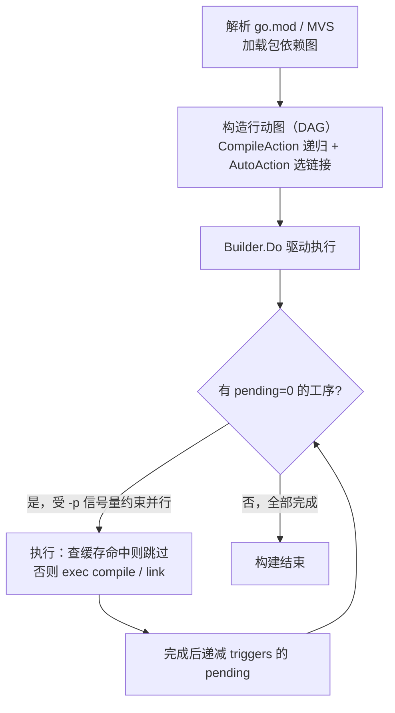

# 3.1 从 `go` 命令谈起

Go 程序的生命周期要从执行 `go` 命令开始谈起。读者每天敲下的 `go build`、`go test`、`go run`，
看上去只是「把源码变成二进制」，背后却藏着一个常被误解的事实：`go` 本身并不是编译器。它是一个
**构建编排器**（build orchestrator），负责把一次构建分解成许多道工序，安排它们的先后与并行，
再逐道调用真正的工具，编译器 `compile`（[3.2](./compile.md)）、汇编器 `asm`、链接器 `link`
（[3.4](./link.md)）。本节先把这层编排关系讲清楚，它是后续几节的总纲：读懂了 `go` 如何把一次
构建拆成一张图、如何用内容寻址的缓存避免重复劳动，再去看编译与链接的细节，就有了落脚的框架。

## 3.1.1 `go` 是构建编排器，不是编译器

把一个最小程序的构建过程摊开，最直接的办法是 `go build -x`，它会打印出 `go` 实际执行的每一条
子命令。对一个只有一行 `fmt.Println` 的 `main` 包，输出的骨架是这样：

```shell
$ go build -x -o /dev/null .
WORK=/tmp/go-build1449454186
mkdir -p $WORK/b001/
cat >$WORK/b001/importcfg << 'EOF' # internal
# import config
packagefile fmt=/Users/.../go-build/7d/7d74...-d
packagefile runtime=/Users/.../go-build/60/60cb...-d
EOF
# 调用编译器，把 main.go 编成归档 _pkg_.a
.../pkg/tool/darwin_arm64/compile -o $WORK/b001/_pkg_.a -p main -lang=go1.26 \
    -complete -buildid ... -importcfg $WORK/b001/importcfg -pack ./main.go
.../pkg/tool/darwin_arm64/buildid -w $WORK/b001/_pkg_.a # internal
cp $WORK/b001/_pkg_.a /Users/.../go-build/82/8256...-d # internal
# 写出链接配置，再调用链接器
cat >$WORK/b001/importcfg.link << 'EOF' # internal
packagefile demo=$WORK/b001/_pkg_.a
packagefile fmt=/Users/.../go-build/7d/7d74...-d
...
EOF
.../pkg/tool/darwin_arm64/link -o $WORK/b001/exe/a.out -importcfg ... $WORK/b001/_pkg_.a
```

`go` 自己做的事，是建一个临时工作目录、写出一份份 `importcfg`（告诉编译器与链接器每个依赖包的
归档在磁盘何处），然后 `exec` 出 `compile` 与 `link` 这两个独立的可执行文件。源文件到目标代码
的真正翻译，发生在 `go` 之外的工具里。这种「主程序只负责编排、把脏活交给独立工具」的结构，在
`go` 命令的内部用两个数据类型承载：`Builder` 持有整次构建的共享状态（工作目录、各类缓存、并行度
控制），`Action` 则是构建图上的一个节点，描述「一道要做的工序」：

```go
// Action：构建图上的一道工序（速写，只留与编排相关的字段）
type Action struct {
    Mode    string         // 这道工序做什么："build" / "link" ...
    Actor   Actor          // 真正执行它的函数（调用 compile、link 等）
    Deps    []*Action      // 必须先于本工序完成的工序
    Package *load.Package   // 本工序处理的包

    actionID cache.ActionID // 由全部输入算出的缓存键（见 3.1.3）
    buildID  string         // 输出的内容标识：actionID + 输出内容的哈希
    triggers []*Action      // Deps 的逆向边：本工序完成后可解锁谁
    pending  int            // 还有多少个 Dep 未完成，归零即就绪
    priority int            // 执行优先级，供就绪队列排序
}
```

`Action` 的 `Mode`、`Deps`、`Actor` 三者合起来回答了「这道工序是什么、依赖谁、由谁执行」。一次
`go build` 不是一条直线，而是把这些节点连成一张图，再驱动它运转。下一节就来看这张图如何从
`go.mod` 与源码长出来。

## 3.1.2 从 go.mod 到行动图

构建的第一步是搞清楚「要编译哪些包、它们之间谁依赖谁」。这由模块系统回答：`go` 解析 `go.mod`，
按最小版本选择（MVS）算法定下每个依赖的确切版本，加载出一张包依赖图（模块解析的细节见
[第 17 章](../../part5toolchain/ch17modules/readme.md)）。包依赖图是输入，`go` 要把它翻译成一张
**行动图**（action graph），即由 `Action` 节点构成的有向无环图（DAG）。

翻译的规则朴素得近乎机械。对每个待构建的包，递归地为它的每个导入建一个编译工序，作为本包工序的
依赖；遇到 `main` 包则改建链接工序：

```go
// 为包 p 建一个编译工序，并递归地把它的导入也建成依赖
func (b *Builder) CompileAction(mode, depMode BuildMode, p *load.Package) *Action {
    a := &Action{Mode: "build", Package: p, Actor: &buildActor{}}
    for _, p1 := range p.Internal.Imports {
        a.Deps = append(a.Deps, b.CompileAction(depMode, depMode, p1))
    }
    return a
}

// 顶层入口：main 包要链接成可执行文件，其余包只需编译成归档
func (b *Builder) AutoAction(mode, depMode BuildMode, p *load.Package) *Action {
    if p.Name == "main" {
        return b.LinkAction(mode, depMode, p)   // 链接工序，依赖编译工序
    }
    return b.CompileAction(mode, depMode, p)
}
```

递归一展开，整张行动图便成形：叶子是无依赖的包（编译它们只需源码），根是链接工序，链接依赖
`main` 包的编译，`main` 包的编译又依赖它导入的每个包的编译，层层向下。`AutoAction` 里那个对
`main` 的判断，正是 [3.2 编译](./compile.md) 与 [3.4 链接](./link.md) 两节在构建图上的分界。

图建好后，由 `Builder.Do` 驱动执行。这里的核心约束是**拓扑序**：一道工序只有在它的全部依赖都
完成后才能开始。`go` 没有做完整的拓扑排序，而是给每个 `Action` 记一个 `pending` 计数（尚未完成
的依赖数），依赖一旦完成就递减对应 `triggers` 的 `pending`，归零的工序进入一个按 `priority` 排序
的就绪队列。多个互不依赖的工序可以并行，并行度由 `-p`（默认取 `GOMAXPROCS`）经一个信号量
`readySema` 控制。整个调度可以这样勾勒：



值得点出的是图中「查缓存命中则跳过」这一步：行动图上的大多数节点，在多数构建里其实并不真的去
调用编译器。它们会先去问构建缓存，「这道工序的输入和上次一模一样吗」，一样就直接取回上次的产物。
这套缓存是 `go` 命令快得不像在编译的根本原因，也是下一节的主题。

## 3.1.3 内容寻址的构建缓存

一次干净的 `go build` 要编译成百上千个包，第二次却往往一秒返回。秘密在于一个**内容寻址**
（content-addressed）的构建缓存：每道工序的产物，用「算出这件产物的全部输入」的哈希作为键存进
缓存（默认在 `$GOCACHE`，即 `go env GOCACHE`）。下次构建时，若同一道工序的输入哈希不变，就断定
产物必然相同，直接复用，连编译器都不必启动。

关键全在「输入哈希」如何构成。`go` 用 `buildActionID` 把一道编译工序的所有输入喂进一个 SHA-256：

```go
// 计算一道编译工序的缓存键（速写，省略 cgo 等分支）
func (b *Builder) buildActionID(a *Action) cache.ActionID {
    p := a.Package
    h := cache.NewHash("build " + p.ImportPath) // 起手即混入 Go 版本号作为 salt
    fmt.Fprintf(h, "compile\n")
    fmt.Fprintf(h, "goos %s goarch %s\n", cfg.Goos, cfg.Goarch)  // 目标平台
    fmt.Fprintf(h, "import %q\n", p.ImportPath)
    // 编译器本身的 ID（编译器换了，缓存即失效）与编译参数
    fmt.Fprintf(h, "compile %s %q %q\n", b.toolID("compile"), forcedGcflags, p.Internal.Gcflags)
    // 每个源文件的内容哈希
    for _, file := range inputFiles {
        fmt.Fprintf(h, "file %s %s\n", file, b.fileHash(filepath.Join(p.Dir, file)))
    }
    // 每个依赖包的 buildID（即依赖的产物内容标识）
    for _, a1 := range a.Deps {
        fmt.Fprintf(h, "import %s %s\n", a1.Package.ImportPath, contentID(a1.buildID))
    }
    return h.Sum()
}
```

把 `GODEBUG=gocachehash=1` 打开，就能看到这些输入被逐条喂进哈希的真实过程。对前面那个 demo 包，
末行那串十六进制就是最终的 `actionID`：

```shell
$ GODEBUG=gocachehash=1 go build -o /dev/null .
HASH[build demo]
HASH[build demo]: "go1.26.1"                                   # salt：Go 版本号
HASH[build demo]: "compile\n"
HASH[build demo]: "goos darwin goarch arm64\n"                 # 目标平台
HASH[build demo]: "import \"demo\"\n"
HASH[build demo]: "compile compile version go1.26.1 [...] []\n" # 编译器 ID + 参数
HASH[build demo]: "file main.go KUKxlydUIi2I-10EjTIw\n"        # 源文件内容哈希
HASH[build demo]: "import fmt a-nQ4YX2Z0xMeqSMWW55\n"          # 依赖 fmt 的产物标识
HASH[build demo]: "import runtime 8asGqFcOH5UKoaTdthA0\n"      # 依赖 runtime 的产物标识
HASH[build demo]: e783bda8414d9313a775eb0d5a6eb354559cb647a628acb64782f2359965759b
```

注意倒数几行：依赖 `fmt`、`runtime` 是以它们各自的 `buildID`（产物内容标识）参与本包哈希的，而
`buildID` 又是由它们自己的 `actionID` 加上其产物内容算出的。于是整个缓存键沿着行动图层层嵌套，
构成一棵 **Merkle 哈希树**：任何一处源文件、编译参数、依赖产物、乃至编译器版本发生改变，其上方
所有工序的键都随之改变，缓存自然失效；反过来，一棵未被触碰的子树，键恒定不变，整片复用。这是
内容寻址相较「按时间戳判新旧」（如传统 `make`）的根本优势，它判的是**内容**而非**时间**，因此
`git checkout` 来回切换分支、文件 mtime 乱跳，都不会误判。

这套设计要正确，依赖一条不变式：**凡是会影响产物的输入，必须无一遗漏地进入 `buildActionID`**。
源码对此立有明文戒律，`exec.go` 中那道工序的执行函数旁写着「任何对本逻辑的新影响，都必须同样在
上面的 `buildActionID` 中登记」。遗漏一项，就意味着输入变了而键没变，构建会错误地复用陈旧产物，
这是缓存类系统最隐蔽的一类 bug。为给这条不变式上一道保险，`go` 提供了 `GODEBUG=gocacheverify=1`：
它令缓存形同失效，强制每道工序重新执行，再把新产物与缓存中的旧产物逐字节比对，一旦不符即报错，
等于在运行时核对「相同的键是否真的对应相同的产物」。

## 3.1.4 可复现构建

内容寻址缓存能成立，前提是构建**可复现**（reproducible）：同样的输入，必须产出逐字节相同的输出。
若编译产物里掺进了构建时的绝对路径、时间戳或随机数，同一份源码在两台机器上就会产出不同二进制，
缓存命中率崩塌，更谈不上让第三方独立核验「这个二进制确实由这份源码编出」。Go 在工具链层面为此
做了多处约束。

最直接的一处是缓存键里的 Go 版本 salt：`cache.NewHash` 起手就混入 `runtime.Version()`，使不同
版本的 `go` 命令绝不共用同一批缓存条目，一个版本的 bug 不会污染另一个版本的构建。另一处是
`-trimpath`：默认情况下，调试信息里会嵌入源码的绝对目录（前面哈希轨迹中省略的 `dir /tmp/...`
一类输入正源于此），换一台机器、换一个目录，产物就不同；加上 `-trimpath` 后，路径被改写为模块
路径加版本，构建便不再依赖它在文件系统中的具体位置。再加上 Go 编译器本身刻意不引入构建时间戳、
对 map 遍历等不确定性做了消除，最终使「同源同版同参 → 同二进制」成为可达成的目标。模块校验
（`go.sum`、校验和数据库）则从依赖一侧封住了输入，相关机制详见
[第 17 章](../../part5toolchain/ch17modules/semantics.md)。可复现既服务于缓存的正确，也服务于
软件供应链的可验证，这正是 Reproducible Builds 项目多年倡导的方向。

## 3.1.5 统一工具链与碎片化的对照

回头看 [3.1.2](#312-从-gomod-到行动图) 提到的命令列表，会发现 `go` 远不止 `build` 一个子命令。
解析、构建、测试、格式化、静态检查、文档、性能剖析，在 Go 里全部收束于同一个 `go` 命令之下：

```shell
go build      # 编译包与依赖
go test       # 编译并运行测试（测试结果同样进缓存）
go run        # 编译并直接运行
go fmt        # 格式化源码（gofmt）
go vet        # 静态检查可疑构造
go doc        # 查看文档
go tool pprof # 性能剖析
go mod        # 模块维护（tidy / download / verify ...）
```

把这一面与 C/C++ 世界并置，差异便显出来。在 C/C++ 那边，编译靠 `gcc`/`clang`，构建编排靠 `make`
或 `CMake`、`autotools`、`ninja`，跨版本与跨平台还要 `pkg-config` 周旋；为了不每次全量重编，社区
另造了 `ccache` 这一类「编译器外挂缓存」；格式化是 `clang-format`，静态检查是 `clang-tidy`，依赖
管理则长期没有公认答案。这些工具各自为政，配置彼此独立，一个项目要把它们凑齐、调通、在团队里
保持一致，本身就是一门手艺。Go 把它们做进同一个二进制，缓存、依赖解析、跨平台交叉编译都内建且
零配置：换台机器 `git clone` 后 `go build` 即可，无需先理解一套构建脚本。

这种统一并非没有代价。`go` 的构建模型是固定的，它假定「包即目录、导入即依赖」，不像 `make` 那样
能表达任意的、跨语言的、带自定义规则的构建逻辑；需要在构建期生成代码、嵌入资源、串接非 Go 工具
链时，`go generate` 与 `//go:embed` 只能覆盖常见情形，更复杂的场景仍要外部脚本兜底。这是一次
**以灵活性换一致性**的取舍：放弃「能描述任何构建」的表达力，换来「无需描述构建」的一致体验。
对绝大多数 Go 项目，后者远比前者值得，这也与 Go 在语言设计上一贯的取向相合，把选择收窄，让多数
人无需选择。

把视野再放大一层，Google 内部的 Bazel 走的是另一条路：它同样以内容寻址的 action cache 为核心，
但把构建规则显式化、语言无关化，并支持把缓存与执行分发到远端集群，以服务超大规模的多语言单体
仓库。`go` 的构建缓存可看作这一思想在单语言、零配置约束下的轻量化身。两者的距离正在缩小，Go 1.21
引入的 `GOCACHEPROG` 协议（提案 #59719，Brad Fitzpatrick）允许把构建缓存的读写委托给一个外部
程序，经由 JSON 协议接管 `get`/`put`，从而接入远端、共享乃至 P2P 的缓存后端。这是 `go` 在保持
零配置默认的同时，向 Bazel 式可扩展缓存试探的一步，目前仍是相对前沿、面向构建基础设施作者的能力，
日常使用并不需要它。

至此，`go` 命令作为编排器的全貌已经清楚：它从 `go.mod` 与源码长出一张行动图，按拓扑序并行驱动，
用内容寻址的缓存挡掉重复劳动，再把每个节点的真正工作交给 `compile` 与 `link`。下一节
[3.2 编译](./compile.md) 就走进这两道工序中的第一道，看一个包的源码如何被翻译成目标代码。

## 延伸阅读的文献

1. The Go Authors. *Command go*（`go` 命令参考，含 Build and test caching、各子命令）。
   https://pkg.go.dev/cmd/go ；亦见 `go help build`、`go help cache`。
2. The Go Authors. *Go Modules Reference*（`go.mod`、MVS、`go.sum` 与可验证构建）。
   https://go.dev/ref/mod
3. The Go Authors. *cmd/go/internal/work/{action.go, exec.go}、cmd/go/internal/cache/hash.go.*
   https://github.com/golang/go/tree/master/src/cmd/go（`buildActionID`、行动图与 `Builder.Do`）。
4. Brad Fitzpatrick 等. *proposal: cmd/go: support a GOCACHEPROG to use an alternative build cache.*
   golang/go#59719（Go 1.21 起）。https://go.dev/issue/59719
5. The Reproducible Builds Project. https://reproducible-builds.org/
   （从源码到二进制的可独立验证路径，对照 `-trimpath` 与版本 salt 的设计动机）。
6. The Bazel Authors. *Bazel: Remote Caching.*
   https://bazel.build/remote/caching （内容寻址 action cache 的工业级形态）。
7. 本书 [3.2 编译](./compile.md)、[3.4 链接](./link.md)、[第 17 章 模块](../../part5toolchain/ch17modules/readme.md)。
