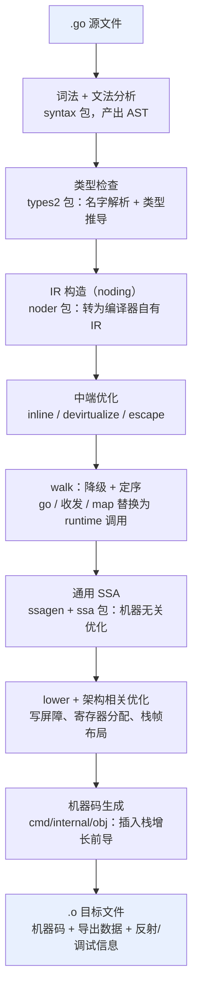

# 3.2 Go 程序编译流程

[3.1](./cmd.md) 说 `go build` 背后真正干活的是 `compile` 与 `link` 两支程序。这一节把镜头推近到
`compile`，给出它从一份 `.go` 源文件到一个 `.o` 目标文件之间走过的全程：每个阶段拿到什么、
吐出什么、为什么这样切分。本节是编译流水线的**全景图**，每个阶段的内部机理（文法如何设计、
类型检查用什么算法、SSA 的优化规则）留给 [第 15 章](../../part5toolchain/ch15compile/readme.md)
逐一展开，这里只负责把它们串成一条线，并指出两条贯穿始终的暗线。

为避免落回逐字翻译编译器目录结构的窠臼，下文用**一个贯穿全程的小例子**来串起所有阶段。
请记住这段函数，它会被流水线反复揉捏，直到变成机器码：

```go
func send(ch chan int) {
	go work() // 启动一个新 goroutine
	ch <- 1   // 向 channel 发送
}
```

它只有两行，却恰好藏着本节要强调的第二条暗线：`go` 与 `<-` 这样的语言关键字，最终都不是
靠 CPU 指令直接实现的，而是被编译器**翻译成对运行时的函数调用**。先把流水线看完，再回头
解剖这两行。

## 3.2.1 两条暗线：为何要先讲它们

把流水线的细节铺开之前，先点明两个贯穿全程的设计取向，后面每个阶段都在为它们服务。

第一条暗线是**编译速度本身是一等约束**。Go 从设计之初就把「编译要快」当作语言目标而非事后
优化（[1.1](../ch01intro/history.md)）。这个目标渗进了语法、依赖管理与编译器结构的每一层：
文法被设计成可以不回溯地快速解析，依赖以编译期产出的**紧凑导出数据**而非源码传递，且不存在
C/C++ 那种会层层传染的 `#include`。Rob Pike 在《Go at Google》里把这一点列为 Go 诞生的直接
动机，当年 Google 一次大型 C++ 构建动辄以小时计，而 Go 要做到「按一下回车就编译完」。

第二条暗线是**编译器与运行时的合谋**。Go 的许多语言特性并非编译器独力实现，而是编译器生成
一段**调用运行时的代码**，由运行时在程序运行时兜底。`go f()` 被降级为 `runtime.newproc`，
`<-ch` 被降级为 `runtime.chanrecv`，每个函数入口被插入一段**栈增长前导**，含指针的类型被配上
**GC 指针位图**与类型描述符，写指针的地方被插入**写屏障**。可以说，编译器为运行时埋下一个个
约定的接口，二者合起来才构成完整的语义。这条暗线会在 [3.2.6](#326-暗线一编译速度作为一等约束)
与 [3.2.7](#327-暗线二编译器与运行时的合谋) 集中兑现。

## 3.2.2 流水线全景

go1.26 的 `compile` 在逻辑上可分为前端、中端、后端三段，细分为下面这条流水线。它的代码散落在
`cmd/compile/internal` 的若干子包里，但读者不必记目录，只需记住数据形态的变化：源码 → 语法树
→ 类型化的语法树 → 编译器自有 IR → SSA → 机器相关的 SSA → 机器码。



横在前端与后端之间的那段（中端加 walk）常被称作「middle-end」，是优化最密集、也最能体现 Go
设计取舍的地方。下面顺着这条线，看 `send` 函数在每一站发生了什么。

## 3.2.3 前端：从字符流到类型化的语法树

**词法与文法分析**（`cmd/compile/internal/syntax`）是第一站。源码先被切成 token 流（词法），
再按文法规则组装成一棵**抽象语法树**（AST，语法分析）。`send` 的函数体被解析成两个语句节点：
一个 `go` 语句、一个发送语句，每个节点都挂着精确的源码位置，供后续报错与生成调试信息。
Go 的文法是为速度而设计的，可以单遍、不回溯地解析，这正是 [3.2.6](#326-暗线一编译速度作为一等约束)
要细说的第一笔（文法细节见 [15.1](../../part5toolchain/ch15compile/parse.md)）。

**类型检查**（`cmd/compile/internal/types2`）随后接手。`types2` 是 `go/types` 的一个移植版，
改用 `syntax` 包的 AST。它做两件事：名字解析（每个标识符指向哪个声明）与类型推导（每个表达式
是什么类型），并在此基础上施加额外检查，例如「声明却未使用」。泛型的类型推导与约束求解也在
这一阶段完成，是全编译器最精巧的部分之一（[8.3](../../part2lang/ch08generics/checker.md)）。
对 `send` 而言，这一步确认 `ch` 是 `chan int`、`ch <- 1` 中的 `1` 可赋给 `int`、`work` 是个
无参函数。检查通过后，AST 上每个表达式都带上了确定的类型。

值得一提的是，`go/parser`、`go/types` 这套公开包**并不**被编译器使用。编译器最初用 C 写成，
`go/*` 系列是后来为 `gofmt`、`vet` 等工具单独发展出来的，二者同源而分流。

## 3.2.4 中端：IR、内联与逃逸分析

类型检查后的表示还不便于优化，于是有 **IR 构造**（noding，`cmd/compile/internal/noder`）：把
`syntax` 加 `types2` 的表示转换成编译器自有的 IR（`ir` 包）与类型系统（`types` 包）。这套 IR
是编译器还用 C 写时留下的血脉，中端与后端的全部代码都以它为基础。go1.26 的 noding 走的是
**Unified IR**：它把类型检查后的代码序列化成一份中间产物，再据此重建 IR，这份产物同时也是
包导入/导出与内联的载体。这一点对暗线一至关重要，[3.2.6](#326-暗线一编译速度作为一等约束)
会回到它。

IR 就位后，**中端**在其上跑几趟优化：死代码消除、（早期的）去虚化、函数内联（`inline` 包）、
逃逸分析（`escape` 包）。**逃逸分析**尤其关键，它判定每个变量能否安全地放在栈上，还是必须
分配到堆上。这一步直接决定了对象由谁来管：留在栈上的对象随函数返回自动回收，逃逸到堆上的
对象才进入垃圾回收的视野（[13.1](../../part4memory/ch13gc/basic.md)）。在 `send` 中，传给
`go work()` 的函数与任何被新 goroutine 捕获的变量都会被判为逃逸，因为新 goroutine 的生命周期
超出了 `send` 的栈帧。

## 3.2.5 walk 与后端：降级、SSA 与机器码

中端之后是 **walk**（`cmd/compile/internal/walk`），它是 IR 上的最后一趟，做两件事。其一是
**定序**（order）：把复合语句拆成带临时变量的简单语句，固定求值次序。其二是**降级**
（desugar）：把高级语言构造翻译成更原始的形式。本节的第二条暗线正是在这里第一次显形，
`switch` 被改写成二分查找或跳转表，而对 **map 与 channel 的操作、`go` 语句，被替换成对运行时
的调用**。`send` 的两行到这一步变成了大致这样：

```go
// walk 之后（示意）：go / <- 被降级为 runtime 调用
func send(ch chan int) {
	newproc(work)          // go work()  -> runtime.newproc
	var tmp int = 1
	chansend1(ch, &tmp)    // ch <- 1    -> runtime.chansend1
}
```

接着进入**通用 SSA**（`ssagen` 把 IR 转成 SSA，`ssa` 包承载之）。SSA（静态单赋值）是一种
低级中间表示，每个值只被赋值一次，这个性质让数据流分析与优化变得简洁（细节见
[15.2](../../part5toolchain/ch15compile/ssa.md)）。转换中会应用**内建函数 intrinsic**（编译器
对某些函数硬编码了高度优化的实现），并把更多构造继续降级（例如 `copy` 换成内存移动、range
循环改写成 for）。随后跑一连串**机器无关**的优化：死代码消除、去掉多余的 nil 检查、常量
折叠、把乘法与浮点运算重写得更高效。这些规则不涉及任何具体架构，在所有 `GOARCH` 上一致运行。

最后是**机器相关**的后端。它以 **lower 趟**开篇，把通用 SSA 值重写成目标架构的专用变体（例如
在 amd64 上把多个 load-store 合并进一条带内存操作数的指令）。lower 之后再跑一轮优化与几项
关键工作：**寄存器分配**、**栈帧布局**（给局部变量分配栈偏移）、**指针活性分析**（算出每个
GC 安全点上哪些栈上指针存活，这是精确 GC 的前提，见 [4.1](../../part2lang/ch04type/type.md)、
[13 垃圾回收](../../part4memory/ch13gc/readme.md)），以及插入**写屏障**（`ssa` 包中专门的
`writebarrier` 趟）。至此函数被转成一串 `obj.Prog` 指令，交给汇编器（`cmd/internal/obj`）。
汇编器把它们变成真正的机器码，**并在每个函数入口插入栈增长前导**（`cmd/internal/obj` 的
`stacksplit`），写出最终目标文件。目标文件里除了机器码，还含导出数据、反射数据与调试信息。

想亲眼看 `send` 在 SSA 各趟之间的变化，可以用一行命令导出可视化的 SSA：
`GOSSAFUNC=send go build`，它会生成一个 `ssa.html`，逐趟列出每个值的演化。

## 3.2.6 暗线一：编译速度作为一等约束

回到第一条暗线。Go 把「快」做进了流水线的三个层面，每一层都对应上文的某一站。

**文法层。** Go 的文法可不回溯地单遍扫描，词法分析甚至简单到接近正则。这把
[3.2.3](#323-前端从字符流到类型化的语法树) 的第一站压成线性时间，与 C++ 那种需要无界前瞻、
解析与语义纠缠的文法形成鲜明对比。

**依赖层。** 这是最见功力的一笔。编译包 P 时，[3.2.4](#324-中端ir内联与逃逸分析) 提到的
Unified IR 会顺带写出一份**导出数据**：把 P 中所有导出声明的类型信息、可内联函数的函数体、
泛型函数的函数体，以及逃逸分析对参数的结论，序列化进目标文件。当包 Q 导入 P 时，编译器只读
P 的这份导出数据，**不碰 P 的源码**。更关键的是，这份导出数据通常是「深」的：它已经把 P 间接
依赖的、Q 可能用到的信息一并打包，于是 Q 只需读它每个直接依赖的一份文件，无需递归展开整个
依赖图。这恰好消除了 C/C++ 中 `#include` 的致命缺陷，头文件会沿依赖链层层传染，一个被广泛
引用的头文件会被成百上千个翻译单元反复重新解析。Go 用一份编译期产出的紧凑二进制，换掉了这场
重复劳动。

**结构层。** Go 以**包**为编译单位并行编译，包之间只通过导出数据这一窄接口耦合，使整个构建
可以高度并行（[3.1](./cmd.md) 已述 `go build` 如何调度这些并行编译）。

代价并非没有。深导出数据有「随依赖图上行而膨胀」的倾向：一组被广泛使用、API 庞大的类型，会让
几乎每个包的导出数据都带一份它的拷贝。正是这个问题催生了「indexed」与「shallow」等更省的导出
格式（后者被 gopls 采用，以按需随机读取换取体积）。性能的取舍从不白来，这里用一点冗余，换来
构建系统的简单与单遍可读。

## 3.2.7 暗线二：编译器与运行时的合谋

第二条暗线，是理解 Go 运行时的钥匙。许多读者会以为 goroutine、channel、GC 是「运行时的事」，
与编译器无关，其实二者是**合谋**的：运行时定义了一组约定接口，编译器在恰当的位置生成对它们的
调用或配套的元数据，缺了任何一方，语义都不完整。把上文散落各处的几处合谋汇总：

| 语言特性 | 编译器做的事 | 发生的阶段 | 运行时一侧 |
| --- | --- | --- | --- |
| `go f()` | 降级为 `runtime.newproc(f)` | walk | 调度器创建并排入 goroutine（[9.4](../../part3concurrency/ch09sched/schedule.md)） |
| `ch <- v` / `<-ch` | 降级为 `runtime.chansend` / `chanrecv` | walk | channel 收发与阻塞唤醒（[第 10 章](../../part3concurrency/ch10chan/readme.md)） |
| 函数入口 | 插入栈增长前导（`stacksplit`） | obj 汇编 | `morestack` 触发栈扩容（[2.2](../ch02asm/callconv.md)、[第 14 章](../../part4memory/ch14stack/readme.md)） |
| 写指针 `*p = q` | 插入写屏障 | SSA `writebarrier` 趟 | GC 据屏障记录维持三色不变式（[13.2](../../part4memory/ch13gc/barrier.md)） |
| 含指针的类型 | 生成类型描述符 + GC 指针位图 | 后端 / 反射数据 | GC 据位图精确扫描对象（[4.1](../../part2lang/ch04type/type.md)、[13.1](../../part4memory/ch13gc/basic.md)） |

这张表把 `send` 那两行的归宿讲完了：`go work()` 成了一次 `newproc`，由调度器接管；`ch <- 1`
成了一次 `chansend`，由 channel 的运行时实现接管。而那段不可见的**栈增长前导**，是每个 Go
函数都背着的：它在入口处比较栈指针与栈边界，若本次调用会撑破当前栈，就先跳到 `morestack`
扩容再继续，这正是 goroutine 能从几 KB 小栈起步、按需增长的实现基础。

把两条暗线合起来看，编译器在 Go 里扮演的角色就清晰了：它一面被「快」这个约束逼着精简（暗线
一），一面又承担着为运行时铺设接口的重活（暗线二）。这两股力量的拉扯，塑造了从文法到目标文件
的每一处取舍。下一节（[3.3](./bootstrap.md)）会追问一个更基本的问题：这个用 Go 写成的编译器
自己，最初又是从哪里来的。

## 延伸阅读的文献

1. The Go Authors. *Introduction to the Go compiler* (`cmd/compile/README.md`).
   https://github.com/golang/go/blob/master/src/cmd/compile/README.md
   （本节流水线划分的一手依据，含导出数据 §7a。）
2. The Go Authors. *Introduction to the Go compiler's SSA backend*
   (`cmd/compile/internal/ssa/README.md`).
   https://github.com/golang/go/blob/master/src/cmd/compile/internal/ssa/README.md
3. Rob Pike. *Go at Google: Language Design in the Service of Software Engineering.* 2012.
   https://go.dev/talks/2012/splash.article （把编译速度列为 Go 的设计动机。）
4. Ron Cytron, Jeanne Ferrante, et al. "Efficiently Computing Static Single Assignment Form
   and the Control Dependence Graph." *ACM TOPLAS*, 13(4), 1991.
   https://doi.org/10.1145/115372.115320 （SSA 的理论原点。）
5. The Go Authors. *Unified IR* (`cmd/compile/internal/noder/README.md`).
   https://github.com/golang/go/blob/master/src/cmd/compile/internal/noder/README.md
   （IR 构造与导出数据格式。）
6. 本书 [15.1 词法与文法](../../part5toolchain/ch15compile/parse.md)、
   [15.2 中间表示](../../part5toolchain/ch15compile/ssa.md)、
   [8.3 类型检查技术](../../part2lang/ch08generics/checker.md)。
7. 本书 [1.1 编程语言的发展](../ch01intro/history.md)、
   [13.2 写屏障技术](../../part4memory/ch13gc/barrier.md)、
   [第 14 章 执行栈管理](../../part4memory/ch14stack/readme.md)。
