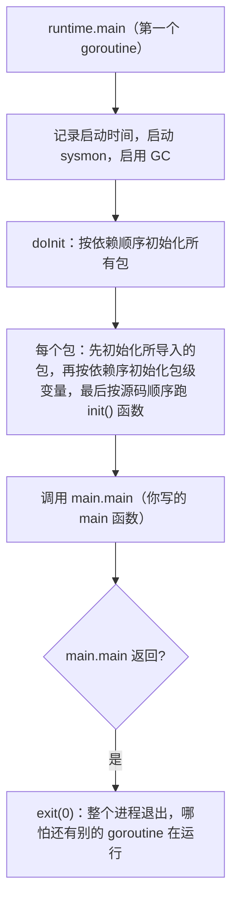

# 3.6 主 Goroutine 的生与死

引导阶段（[3.5](./boot.md)）创建的第一个 goroutine，运行的是 `runtime.main`,它才是你
`main.main` 的直接母体。这一节看这个"主 goroutine"从诞生到死亡的完整一生：它如何在调用你的
`main` 之前完成全部包初始化，又如何在你的 `main` 返回时让整个程序谢幕。

## 3.6.1 runtime.main：调用你的 main 之前

`runtime.main`（`runtime/proc.go`）在调用你的代码前，还做了几件要紧事：记录运行时启动时间;
启动系统监控线程 **`sysmon`**（[9.8](../../part3concurrency/ch09sched/sysmon.md)，它不依赖普通
调度，独立运转）;启用垃圾回收器。然后才是最关键的一步,**包初始化**。

## 3.6.2 包初始化的顺序

`runtime.main` 通过 `doInit` 触发**所有包的初始化**，其顺序由语言规范严格规定，理解它能消除
许多"为什么这个变量还没初始化"的困惑：

1. **导入优先**：初始化一个包之前，先初始化它**导入**的所有包,递归地、按依赖关系深度优先。
   每个包只会被初始化**一次**，即便被多处导入。
2. **包内顺序**：在一个包内部，先按**依赖关系**初始化包级变量（一个变量若依赖另一个，被依赖者
   先来），再按它们在源码中出现的顺序执行 `init()` 函数（一个包可以有多个 `init`，跨多个文件时
   按文件名顺序）。

于是整个程序的初始化是一棵自底向上的依赖树：最底层、不依赖别人的包先初始化，逐层向上，
最后才轮到 `main` 包。所有包都就绪后，`doInit` 完成，`runtime.main` 才调用 `main_main`,
也就是你写的 `main.main`。在此之前，你的 `main` 一行都还没跑，但整个依赖图的初始化已经
默默完成。

## 3.6.3 主 goroutine 之死即程序之死

主 goroutine 有一个其他 goroutine 都没有的特权与宿命：**当 `main.main` 返回时，`runtime.main`
直接调用 `exit(0)`，整个进程立即终止,哪怕此刻还有别的 goroutine 正在运行。** 这是一个关键的
不对称：普通 goroutine 结束只是它自己退场（[9.4](../../part3concurrency/ch09sched/schedule.md)
的 `goexit` 把它回收复用），而**主 goroutine 一死，全场散场**。

这个语义有实际后果。它意味着你不能"启动一些后台 goroutine 然后让 `main` 返回"并指望它们继续
跑,`main` 一返回，它们就被连根带走。要等待后台工作完成，必须显式同步（`sync.WaitGroup`、
channel，[11 同步](../../part3concurrency/ch11sync)）。它也呼应了 Go 没有"杀死某个 goroutine"
的 API（[11.8](../../part3concurrency/ch11sync/context.md)）：goroutine 的生命周期要么自己结束、
要么随主 goroutine 一同谢幕，而非被外部强杀。

从机器入口到 `schedinit`，到第一个 goroutine，到包初始化，再到 `main.main` 与最终的 `exit`,
这条贯穿本章的生命线，把"一个 Go 程序如何诞生、运行、死亡"完整地串了起来。理解了它，本书后续
对运行时各子系统的深入，就都有了一个"它们在程序的哪一刻、为何被唤起"的全局坐标。

## 延伸阅读的文献

1. The Go Programming Language Specification：*Package initialization / Program execution.*
   https://go.dev/ref/spec#Package_initialization
2. The Go Authors. *runtime/proc.go：runtime.main / doInit.*
   https://github.com/golang/go/blob/master/src/runtime/proc.go
3. The Go Authors. *Effective Go：The init function.* https://go.dev/doc/effective_go#init
4. 本书 [3.5 启动引导](./boot.md)、[9.4 调度循环](../../part3concurrency/ch09sched/schedule.md)、
   [9.8 系统监控](../../part3concurrency/ch09sched/sysmon.md).

## 许可

&copy; 2018-2026 The [golang.design](https://golang.design) Initiative Authors. Licensed under [CC-BY-NC-ND 4.0](https://creativecommons.org/licenses/by-nc-nd/4.0/).
