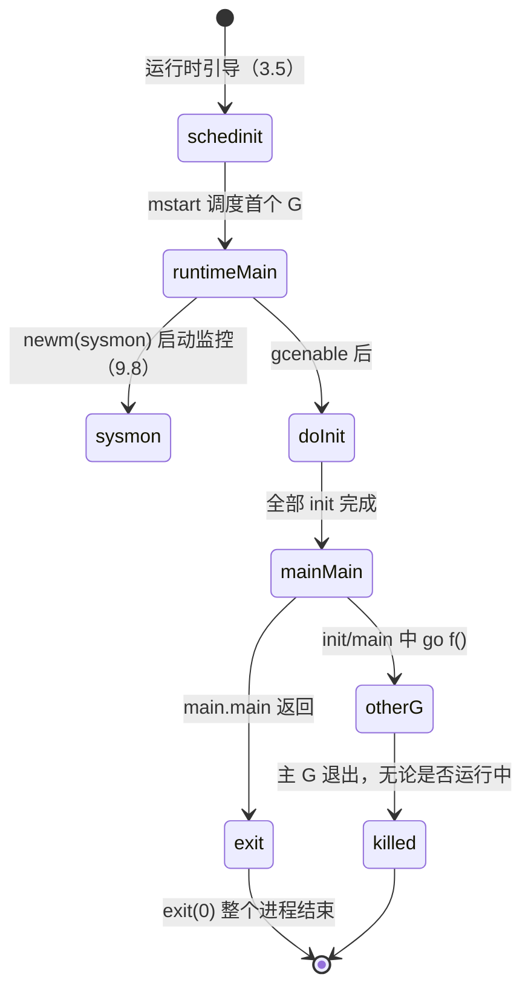

# 3.6 主 Goroutine 的生与死

[3.5](./init.md) 里 `schedinit` 把运行时的家底备齐之后并不直接调用 `runtime.main`，而是把它
的入口地址压栈、交给 `newproc` 造出第一个 Goroutine，再由 `mstart` 启动调度循环、把这个
Goroutine 挑出来执行。调度的细节留到 [9 调度器](../../part3concurrency/ch09sched) 详谈，本节
只把镜头对准一个时刻：**第一个 Goroutine 已经在跑，它正要执行 `runtime.main`**。

这只 Goroutine 与众不同。它是程序里诞生的第一个，承载着用户的 `main.main`，也独自掌握着整个
进程的生杀大权：它一返回，进程就结束，哪怕别处还有上千个 Goroutine 正忙。理解它做了什么、
以及它何时收手，是理解「一个 Go 程序如何开始、又如何整体退出」的最后一块拼图。

## 3.6.1 `runtime.main`：用户代码之前的铺垫

运行时包里的 `main` 函数（即 `runtime.main`）与用户的 `main.main` 跑在同一个 Goroutine 上，
但在把控制权交给用户之前，它先料理了几桩只能由「第一个 Goroutine」来做的事。下面是裁剪后的
速写，只留与生命周期相关的骨架：

```go
// 主 Goroutine 入口（裁剪自 runtime/proc.go）
func main() {
	mp := getg().m

	// 执行栈上限：64 位 1GB，32 位 250MB（用十进制，崩溃信息里更好看）
	if goarch.PtrSize == 8 {
		maxstacksize = 1000000000
	} else {
		maxstacksize = 250000000
	}

	mainStarted = true            // 允许 newproc 启动新的 M

	if haveSysmon {               // 启动系统监控线程（见 9.8）
		systemstack(func() {
			newm(sysmon, nil, -1)
		})
	}

	lockOSThread()                // 初始化期间把主 G 锁在主 OS 线程上
	if mp != &m0 {
		throw("runtime.main not on m0")
	}

	runtimeInitTime = nanotime()  // 记下「世界开始」的时刻，须在 doInit 之前

	doInit(runtime_inittasks)     // 运行运行时自身的 init（含 GC、defer 类型等）

	gcenable()                    // 启用垃圾回收器（见 13）

	// 按依赖顺序运行所有模块（含用户包）的 init 任务
	last := lastmoduledatap
	for m := &firstmoduledata; true; m = m.next {
		doInit(m.inittasks)
		if m == last {
			break
		}
	}

	unlockOSThread()

	fn := main_main               // 间接调用：链接器此时不知道 main 包的地址
	fn()

	exit(0)                       // 主 G 一返回，整个进程退出
}
```

这段骨架里有几处值得停下来看。

`runtimeInitTime = nanotime()` 是给整个运行时盖上的第一个时间戳，「世界从此刻开始」。后续
GC 的触发节奏、调度统计、`init` 追踪（`GODEBUG=inittrace=1` 打印的 `@x ms`）都以它为零点，
所以它必须早于任何 `init` 落定。

`newm(sysmon, nil, -1)` 在系统栈上拉起一个不绑定 P 的监控线程 `sysmon`。它是运行时的「后台
管家」，周期性地抢占长跑的 Goroutine、回收闲置资源、按需触发 GC，工作细节见
[9.8 系统监控](../../part3concurrency/ch09sched/sysmon.md)。注意它被 `haveSysmon` 守着：在
单线程的 wasm 等平台上并不存在这条线程。

`gcenable()` 之前，垃圾回收器是「关」的，初始化期间不希望它来打扰。这一步把 GC 真正接上，
之后堆增长才会按 GC 步调被回收，机制见 [13 垃圾回收](../../part4memory/ch13gc)。

至于 `lockOSThread()`/`unlockOSThread()` 这对，是因为某些平台要求初始化期间的某些调用必须发生
在主 OS 线程上；用户若在 `init` 里 `runtime.LockOSThread`，便可让 `main.main` 也留在主线程。

铺垫做完，真正的主角登场分两步：先 `doInit` 跑遍所有 `init`，再 `main_main` 跑用户的
`main.main`。这意味着一个常被忽略的事实：**用户的所有 `init` 函数与 `main.main` 都在同一个
Goroutine 上、严格先后地执行**。`init` 里若起了别的 Goroutine，它们可以与后续 `init` 并发，
但 `init` 之间、以及 `init` 到 `main.main` 的次序，始终是串行的。

## 3.6.2 包初始化的顺序：`doInit` 与依赖图

「`init` 到底按什么顺序跑」是读者最常困惑、也最该讲清的一处（本节回应所追踪的 issue #75）。
答案由两层规则叠成：**包与包之间**按依赖图定序，**包之内**按变量依赖与源码顺序定序。两层都由
Go 语言规范明确规定，而非实现细节。

### 包之间：导入在前，每包一次

规范在 *Program initialization* 中写得很直白：若一个包有导入，则被导入的包先于它初始化；
多个包导入同一个包时，那个包只初始化一次。更精确地说，给定按导入路径排序的全部包，每一步
选出「尚未初始化、且其所有导入都已初始化」的第一个包来初始化，重复至全部就绪。导入关系天然
构成有向无环图，因此这套定序总能完成，不存在循环初始化。

链接器把这套依赖顺序固化成每个模块（moduledata）的 `inittasks` 列表，运行时只需照单全收。
`runtime.main` 里那个 `for m := &firstmoduledata` 循环，正是「按依赖顺序遍历模块、逐个
`doInit`」。`doInit` 本身只是把一串 `initTask` 交给 `doInit1` 逐个执行：

```go
// 每个包的初始化任务（裁剪自 runtime/proc.go）
type initTask struct {
	state uint32 // 0 未初始化，1 进行中，2 已完成
	nfns  uint32 // 紧随其后的 nfns 个 init 函数指针
}

func doInit1(t *initTask) {
	switch t.state {
	case 2:                 // 已完成：直接返回，保证「每包只跑一次」
		return
	case 1:                 // 进行中又被进入：依赖图本不该出现，说明链接器错乱
		throw("recursive call during initialization - linker skew")
	default:
		t.state = 1
		firstFunc := add(unsafe.Pointer(t), 8)
		for i := uint32(0); i < t.nfns; i++ {  // 顺序调用本包的每个 init
			p := add(firstFunc, uintptr(i)*goarch.PtrSize)
			f := *(*func())(unsafe.Pointer(&p))
			f()
		}
		t.state = 2         // 标记完成
	}
}
```

`state` 三态恰好把规范的两条约束落进代码：`case 2` 让任何包至多初始化一次（即便被多处导入），
`case 1` 的 `throw` 则是对「不存在循环初始化」的运行期断言，一旦触发说明链接器排序出了错。

### 包之内：变量依赖在前，`init` 按源码顺序

进入单个包后，规范要求先完成**所有包级变量**的初始化，再依次调用本包的 `init` 函数。变量的
次序不是简单的从上到下，而是按依赖逐步推进：每一步选出「声明顺序最靠前、且其初始化表达式
不依赖任何未初始化变量」的那个变量。规范给的例子很能说明问题：

```go
var (
	a = c + b  // 结果 9
	b = f()    // 结果 4
	c = f()    // 结果 5
	d = 3      // 初始化完成后为 5
)
func f() int { d++; return d }
// 初始化顺序为 d, b, c, a
```

`a` 虽写在最前，却因依赖 `b`、`c` 而最后才定；`d` 无依赖且被 `f` 引用，故最先。依赖分析只看
源码中的词法引用（并做传递闭包），不看运行期取值，因此 `a = c + b` 与 `a = b + c` 给出相同
的顺序。跨文件时，变量的「声明顺序」由文件呈交给编译器的顺序决定，规范建议构建系统按文件名
字典序呈交，以求可复现。

变量就绪之后，本包的 `init` 函数按**它们在源码中出现的顺序**依次调用，可以跨多个文件，同一
文件里也可声明多个。`init` 不能被引用，也无参数无返回值，它存在的唯一意义就是「初始化时被跑
一次」。这正对应 `doInit1` 里那个朴素的 `for i` 循环，链接器已按源码顺序把指针排好，运行时
照序调用即可。

把两层规则合起来，一个程序的初始化就是下面这样一棵深度优先、每个节点只访问一次的树：

```go
// 示意：导入关系决定 init 的整体顺序
package main

import (
	"fmt"        // 先初始化 fmt 及其依赖
	_ "net/http" // 再初始化 net/http 及其依赖
)

var x = compute() // 包级变量先于 main.init 就绪

func init() { fmt.Println("main init") } // 变量就绪后调用

func main() { fmt.Println("main") }
```

`fmt` 与 `net/http` 各自的依赖会先被深度优先地初始化干净，被多个包共享的底层包（如 `runtime`、
`internal/*`）只初始化一次；轮到 `main` 包，先让 `x` 就绪，再跑 `init`，最后才进入
`main.main`。整个过程串行发生在主 Goroutine 上。

## 3.6.3 关键的不对称：主 Goroutine 一死，进程即终

`main_main` 返回后，`runtime.main` 不做任何「等别的 Goroutine 收尾」的事，径直走向 `exit(0)`，
进程随之消失。这里藏着 Go 并发模型中一处必须铭记的不对称：

> **主 Goroutine 与普通 Goroutine 地位不等。普通 Goroutine 跑完只是自己退场，主 Goroutine
> 跑完则带走整个进程。`main.main` 一返回，所有仍在运行的 Goroutine 都被就地终止，没有清理、
> 没有告别。**

下图把这条单向的生命周期画出来：



这条规则的直接后果是：**若 `main.main` 不主动等待，后台 Goroutine 可能一行都没跑完就被带走**。
所以并发程序里要让主 Goroutine 显式同步，常见手段是 `sync.WaitGroup` 或 channel，机制见
[11 同步模式](../../part3concurrency/ch11sync)。下面两段代码的差别，正是「等」与「不等」：

```go
func main() {
	go func() { fmt.Println("可能永远不会打印") }()
	// main 立刻返回，子 Goroutine 多半还没被调度，进程已退出
}
```

```go
func main() {
	var wg sync.WaitGroup
	wg.Add(1)
	go func() { defer wg.Done(); fmt.Println("一定会打印") }()
	wg.Wait() // 主 G 在此等待，子 Goroutine 完成后才返回
}
```

这条不对称还与另一处设计相互印证：Go 不提供「从外部杀死某个 Goroutine」的 API（见
[11.8](../../part3concurrency/ch11sync/goexit.md)）。一个 Goroutine 何时结束，只能由它自己
决定（正常返回或 `runtime.Goexit`），唯一的例外就是主 Goroutine 退出时对全体的「连坐」终止。
换言之，进程级的退出是 Go 里唯一一种「外部强制结束 Goroutine」的途径，它粗暴而彻底，正因
如此，把何时退出的决定权交给主 Goroutine、并要求开发者显式同步，是这套模型的取舍所在：换来
了 Goroutine 自身状态的简单（没有「被异步杀死」这种中间态要处理），代价是开发者必须自己管好
退出时机。

至此，一个 Go 程序从引导、初始化到整体退出的主线就走完了。读者或许还存着几个疑问：`mstart`
究竟如何把主 Goroutine 调度起来？`sysmon` 在后台具体做什么？`gcenable` 接上的 GC 又如何运转？
这些都留到各自的章节展开（[9 调度器](../../part3concurrency/ch09sched)、
[13 垃圾回收](../../part4memory/ch13gc)）。

## 延伸阅读的文献

1. The Go Authors. *The Go Programming Language Specification: Package initialization & Program initialization.*
   https://go.dev/ref/spec#Package_initialization
2. The Go Authors. *runtime/proc.go (`func main`, `doInit`, `doInit1`, `initTask`).*
   https://github.com/golang/go/blob/master/src/runtime/proc.go
3. The Go Authors. *Effective Go: The init function.*
   https://go.dev/doc/effective_go#init
4. Russ Cox. *`main_init_done` can be implemented more efficiently.* Go issue #15943.
   https://github.com/golang/go/issues/15943
5. The Go Authors. *Command compile.* https://go.dev/cmd/compile/
6. 本书 [3.5 运行时的初始化](./init.md)、[9.8 系统监控](../../part3concurrency/ch09sched/sysmon.md)、
   [11 同步模式](../../part3concurrency/ch11sync)。

## 许可

&copy; 2018-2026 The [golang.design](https://golang.design) Initiative Authors. Licensed under [CC-BY-NC-ND 4.0](https://creativecommons.org/licenses/by-nc-nd/4.0/).
