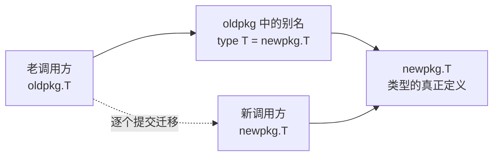

# 4.3 类型别名

`type A = B`（类型别名）与 `type A B`（定义新类型）只差一个等号，语义却根本不同。前者只是
给一个已存在的类型取个新名字，后者会造出一个全新的、有独立标识的类型。这个区别看似细微，却
牵动着类型相等、方法集、可赋值性（[4.1](./type.md)）这一整套规则，也牵动着一个 Go 一贯关心的
工程问题：当一份代码不再由原作者维护、却仍要在不破坏兼容的前提下演化时，类型该如何在包之间
迁移。这一节先把别名与定义类型的语义讲清，再交代别名为何在 Go 1.9 被引入，最后看它在 Go 1.24
迎来的泛型能力。

## 4.3.1 别名 vs 定义类型

按语言规范，类型声明分两种形式：别名声明（alias declaration）与类型定义（type definition）。
二者的分界就是那个等号。

`type Celsius float64` 是类型定义，它「创建出一个新的、不同的类型，与给定类型有相同的底层
类型与操作」。`Celsius` 与 `float64` 从此是两个不同的名义类型（[4.1](./type.md)）：各有自己的
标识，可以挂自己的方法，彼此之间不能直接赋值，只能显式转换。

`type byte = uint8` 是别名声明，它只是「把一个标识符绑定到给定类型」。在该标识符的作用域内，
`byte` 就「充当 uint8 的别名」，二者是**同一个类型**的两个名字，完全可以互换。标准库里
`byte`（`= uint8`）、`rune`（`= int32`），以及 Go 1.18 起 `any`（`= interface{}`），正是这样
定义的预声明别名。

别名与定义类型最容易混淆、也最能体现差别的地方，是**方法集**。看一段会编译失败的代码：

```go
import "bytes"

type AliasBuf = bytes.Buffer  // 别名：就是 bytes.Buffer 本身
type DefBuf    bytes.Buffer   // 定义类型：底层相同，但方法集为空

func demo() {
	var a AliasBuf
	a.WriteString("x")        // OK：AliasBuf 与 bytes.Buffer 是同一类型，方法集完全相同

	var d DefBuf
	d.WriteString("x")        // 编译错误：DefBuf 未继承 bytes.Buffer 的任何方法
	_ = bytes.Buffer(d)       // 但可显式转换回去：二者底层类型相同
}
```

`DefBuf` 与 `bytes.Buffer` 底层类型相同，因此可以互相显式转换，但 `DefBuf` 是一个**新类型**，
它不继承 `bytes.Buffer` 的方法集，`d.WriteString` 找不到接收者。`AliasBuf` 则压根不是新类型，
它**就是** `bytes.Buffer`，方法集自然一模一样。一句话：定义类型造出**新东西**（新标识、空方法
集、需自行定义方法），别名只给旧东西**取个新名**（同一标识、同一方法集）。

## 4.3.2 别家怎么做：类型同义词与新类型

别名与定义类型的这条分界，在带名义类型的语言里几乎处处可见，名字不同而已。把 Go 放进这个
谱系，能看清它不是孤例，而是一个被反复发现的设计抉择。

- **Haskell** 的 `type` 声明就是类型同义词（type synonym），且天生可带参数，例如
  `type Assoc k v = [(k, v)]`，与 Go 的别名（含 1.24 起的泛型别名）一一对应；要造出有独立
  标识的新类型则用 `newtype` 或 `data`，对应 Go 的定义类型。
- **C++** 里 `using Name = T;` 与 `typedef T Name;` 是非泛型别名，而 C++11 的**别名模板**
  （alias template）`template<class T> using Vec = std::vector<T>;` 正是 Go 1.24 泛型别名的
  直接先例。
- **Rust** 的 `type Km = i32;` 是别名（不产生新类型），要新标识则用 newtype 模式
  `struct Km(i32);`。

可见「同义词 vs 新类型」是名义类型系统的一个通用抉择：是想换个称呼，还是想换个身份。Go 把
它落成「等号的有无」，并在很长时间里只允许同义词侧不带参数，这正是下一节的故事。

## 4.3.3 别名为何被引入：大规模渐进式重构

别名是 Go 1.9（2017）才加入的，提案出自 Russ Cox 与 Robert Griesemer，动机写得很直白：
「支持大规模重构期间的渐进式代码修复，尤其是把一个类型从一个包搬到另一个包。」这正是 Go 的
工程取向。

设想一份大代码库要把 `oldpkg.T` 搬到 `newpkg.T`。在没有别名的年代，这是一次「全有或全无」的
破坏性改动：所有引用 `oldpkg.T` 的地方必须在同一次提交里全部改成 `newpkg.T`，否则编译不过。
对超大代码库（提案的背景正是 Google 内部的单体仓库）几乎无法操作。Go 早已能用 `const`、`var`、
`func` 的转发声明搭起这种过渡桥，唯独类型没有对应手段，别名补的就是这个缺口。

有了别名，迁移就能拆成几步。先在新包里安家，再在旧包里留一个别名做转发垫片：

```go
// newpkg/t.go：类型的新家
package newpkg

type T struct { /* ... */ }

// oldpkg/t.go：旧包只留一个别名，转发到新包
package oldpkg

import "path/to/newpkg"

type T = newpkg.T   // oldpkg.T 与 newpkg.T 是同一个类型
```

关键在于 `oldpkg.T` 与 `newpkg.T` 此刻**是同一个类型**，而非两个仅仅底层相同的类型。于是新旧
代码可以混用、互相传值而毫无摩擦：

```go
package caller

import (
	"path/to/oldpkg"
	"path/to/newpkg"
)

func use() {
	var a oldpkg.T   // 老代码：仍引用旧名，照常编译
	var b newpkg.T   // 新代码：已改用新名
	a = b            // OK：同一类型，可直接赋值
}
```

调用方得以**分批、逐步**地把 `oldpkg.T` 改成 `newpkg.T`，每改一处都能独立提交、独立通过 CI，
不必等所有引用一齐就位。等到再无代码引用旧名，删掉那行别名即可。整个迁移过程，代码库始终
处于可编译、可发布的状态。

这条迁移链可以画成下面这样，别名是新旧两侧之间的那座临时桥：



别名解决的，本质上是一个**软件工程**问题（如何在不破坏兼容的前提下移动类型），而非一个类型论
问题。这与本书反复强调的「软件工程发生在代码被非原作者维护之时」一脉相承。也正因如此，别名
被刻意定位成重构的脚手架，而不是日常建模手段：它不引入新类型、不改变类型标识，只在**命名**
层面做文章，安全、可预测，却不该被滥用成给类型起一堆花名。

## 4.3.4 Go 1.24：泛型类型别名

别名落地之后，有一个缺口悬置了很久：不能带类型参数。泛型在 Go 1.18 落地时，出于类型推断与
实现复杂度的考量，刻意把泛型别名推迟了。直到 Go 1.24（2025），提案
「spec: generics: permit type parameters on aliases」（golang/go#46477）才把它补齐，
**泛型类型别名**自此默认可用：

```go
type Set[T comparable] = map[T]bool   // 带类型参数的别名

func demo() {
	s := Set[string]{"a": true}   // 使用前必须实例化
	_ = s
}
```

与非泛型别名一样，`Set[string]` 与 `map[string]bool` 是同一个类型，可以互换。规范规定泛型别名
**使用时必须实例化**：写 `Set` 而不带类型实参是不允许的，只能写 `Set[string]` 这样的具体形态。
这让别名能在泛型代码（[8 泛型](../ch08generics/readme.md)）里同样发挥「取个简短新名」与「渐进
重构」的作用，把别名机制与泛型这两条 Go 后期演进的主线接到了一起。

泛型别名也带来一处需要留意的边界：它不能作为方法的接收者。规范明确，若接收者类型是（指向）
一个别名，该别名**不得是泛型的，也不得指向某个已实例化的泛型类型**，无论经由多少层别名或指针：

```go
type GPoint[P any] = Point
type HPoint        = *GPoint[int]

func (*GPoint[P]) Draw(P) { /* ... */ }  // 非法：接收者别名不得是泛型的
func (HPoint) Draw()      { /* ... */ }  // 非法：接收者别名不得指向已实例化的泛型类型
```

道理仍在 4.3.1 那条线上：方法属于**定义类型**，而别名只是别名，它本身没有自己的方法集可挂。
泛型别名扩展了别名的表达力，却没有改变它「只是别名」的本质。从实现看，编译器与 `go/types`
为别名建了一个独立的 `Alias` 类型节点，其中 `tparams`/`targs` 承载泛型别名的类型参数与实参，
而 `Unalias` 则用于把一串别名解开、拿到背后真正的类型。这层间接性是别名能「换名不换身」的
内部依据，但它对使用者是透明的。

## 4.3.5 取舍

别名是一件刻意保持「小」的特性。理解「别名只是别名、定义类型才是新类型」这一条，就能避开
许多关于类型相等、方法集、可赋值性的困惑，这些困惑的根，都在 [4.1](./type.md) 的名义类型
标识规则上。它的代价也正是它的克制：别名不能挂方法、不造新标识，因此无法用来做「给一个旧
类型加一层语义约束」这类建模，那是定义类型的活。选别名还是定义类型，问的始终是同一个问题：
你要的是换个称呼，还是换个身份。Go 1.24 的泛型别名把这件小工具的适用范围延伸进了泛型，却
始终守着这条边界，没有让它越界去做定义类型该做的事。

## 延伸阅读的文献

1. Russ Cox, Robert Griesemer. *Proposal: Type Aliases.* 2016（Go 1.9 别名的提案与动机，
   「渐进式代码修复」一节即出处）.
   https://go.googlesource.com/proposal/+/master/design/18130-type-alias.md
2. Russ Cox. *Codebase Refactoring (with help from Go).* GopherCon 2016（上述提案引用的背景
   讲稿，大规模重构动机的一手来源）. https://talks.golang.org/2016/refactor.article
3. *spec: generics: permit type parameters on aliases.* golang/go#46477（Go 1.24 泛型别名提案）.
   https://github.com/golang/go/issues/46477
4. The Go Programming Language Specification：*Type declarations / Alias declarations*
   （含 byte/rune/any 别名、Go 1.9 与 Go 1.24 的标注、泛型别名作接收者的限制）.
   https://go.dev/ref/spec#Type_declarations
5. Go 1.9 Release Notes（类型别名）. https://go.dev/doc/go1.9 ；
   Go 1.24 Release Notes（泛型类型别名）. https://go.dev/doc/go1.24
6. The Go Authors. *src/go/types/alias.go*（`Alias` 类型节点、`tparams`/`targs` 与 `Unalias`）.
   https://github.com/golang/go/blob/master/src/go/types/alias.go
7. 本书 [4.1 运行时类型系统](./type.md)、[8 泛型](../ch08generics/readme.md).
