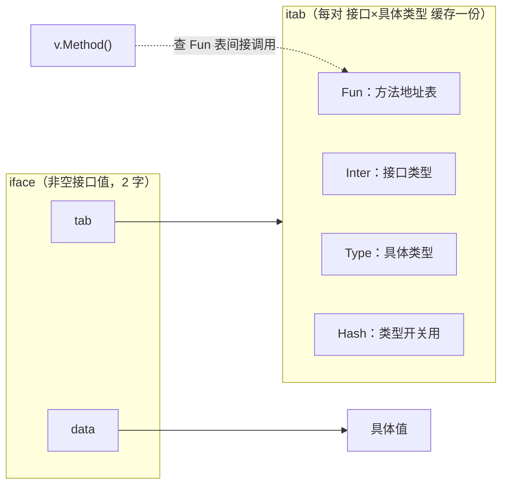

# 4.2 接口

接口是 Go 类型系统的灵魂。它让"行为"与"实现"解耦，又用一种与众不同的方式,**结构化、隐式满足**,
区别于绝大多数主流语言。这一节看接口在运行时怎么表示、方法怎么动态分发，以及这套设计在多态
谱系里的位置。

## 4.2.1 两种表示：iface 与 eface

接口值在运行时是**两个字**，但分两种。**非空接口**（带方法的接口）用 `iface`：一个指向 `itab`
的指针，加一个指向具体数据的指针。**空接口** `interface{}`（即 `any`）用 `eface`：一个指向类型
信息 `_type` 的指针，加一个数据指针,因为它没有方法，不需要方法表，直接存类型即可。

```go
type iface struct { tab  *itab;  data unsafe.Pointer } // 非空接口
type eface struct { _type *_type; data unsafe.Pointer } // 空接口 any
```

一个常被误解的点：接口值**非 nil**，当且仅当**类型与数据都为 nil**。把一个值为 nil 的具体指针
赋给接口，接口里 `_type` 非 nil，于是 `iface != nil`,这就是著名的"**带类型的 nil**"陷阱
（函数返回 `error` 时尤其常踩）。理解了两字表示，这个坑就不再神秘。

## 4.2.2 itab：方法表与动态分发

`itab`（interface table）是非空接口的核心：它为**每一对"接口类型 × 具体类型"**缓存一份，
记录接口类型、具体类型、一个类型哈希，以及最关键的 **`Fun` 方法地址表**。

```go
type ITab struct {
    Inter *InterfaceType // 接口类型
    Type  *Type          // 具体类型
    Hash  uint32         // 类型的哈希，类型 switch 用
    Fun   [1]uintptr     // 变长：该具体类型实现接口各方法的地址；Fun[0]==0 表示未实现
}
```



调用 `v.Method()` 时，运行时按方法在接口里的固定序号去 `Fun` 表里取地址，间接调用,这就是
**动态分发**。`itab` 的构造（`getitab`）不便宜（要核对具体类型是否实现了接口的每个方法），所以
运行时用一个全局哈希表 `itabTable` 把构造好的 `itab` 缓存起来，相同的"接口×类型"对只算一次。

## 4.2.3 动态分发与结构化类型

通过方法表做间接调用，本质上就是 C++ 的虚函数表（vtable）那套机制。但 Go 在一个根本点上与众
不同：**接口的满足是结构化、隐式的**。一个类型只要拥有接口要求的方法集，就**自动**满足该接口，
无需像 Java/C# 那样显式 `implements`,这是**结构化类型**（structural typing）对**名义类型**
（nominal typing）的选择。它的好处是解耦：你可以为别人的类型、甚至标准库的类型定义出它们恰好
满足的接口，而不必改动它们;`io.Reader`/`io.Writer` 这种"小接口遍地适配"的生态，正源于此。
代价是隐式满足偶尔让"谁实现了什么"不那么一目了然，且接口调用是间接的、难以跨接口内联,这是
抽象的运行时成本。

## 4.2.4 类型断言与类型 switch

`x.(T)` 断言接口动态类型是否为 `T`。其实现要比较接口内的类型与目标 `T`,对断言到具体类型，
是比指针;对断言到另一个接口（`x.(SomeInterface)`），则要现算或查一个 `itab`。**类型 switch**
`switch v := x.(type)` 则借助 `itab.Hash`（类型哈希）做快速分支。理解这点能解释一个性能直觉：
频繁的接口类型断言/switch 不是零成本，热路径上值得留意。

## 4.2.5 设计取舍：小接口与"接受接口、返回结构体"

Go 的接口哲学浓缩成几条社区箴言。**"接口越小越好"**：单方法接口（`io.Reader` 等）最易被满足、
最易组合,Rob Pike 所谓"The bigger the interface, the weaker the abstraction"。**"接受接口、
返回结构体"**：函数参数用接口以求通用，返回值用具体类型以免过早抽象。还有前面说的**带类型的
nil** 陷阱、以及**接口持有值 vs 指针**的区别（方法集规则决定了指针接收者的方法不在值的方法集里）。
这些都不是语法细节，而是 4.2.1–4.2.2 那套两字表示与方法集规则的直接推论。

## 4.2.6 跨语言对照

多态在各语言里有不同实现：

- **C++ 虚函数**：每个多态对象藏一个 vptr 指向类的 vtable,与 Go 的 itab 机制几乎同构，但 C++ 是
  名义的、侵入式的（要继承基类）。
- **Rust trait**：既支持**静态分发**（泛型单态化，零成本）又支持**动态分发**（`dyn Trait` 胖指针 =
  数据指针 + vtable 指针，与 Go 的 iface 极像）。Rust 的 trait 满足是显式 `impl`，名义的。
- **Haskell 类型类**：用**字典传递**（dictionary passing）实现,一个类型类实例就是一张方法字典，
  在调用处隐式传入。这条线很重要，因为 Go 泛型的实现（[8 泛型](../ch08generics)）也用到了字典，
  类型类与字典是同一思想的两端。
- **Java/C# 接口**：名义的、显式 `implements`，JIT 用内联缓存等手段优化虚调用。

Go 的独特之处，是把"vtable 式的高效动态分发"与"结构化、隐式满足的松耦合"结合在一起,既要
运行时的实在表示，又要写代码时的轻量解耦。理解了 iface/itab，就理解了这份结合是如何落地的。

## 延伸阅读的文献

1. Luca Cardelli, Peter Wegner. "On Understanding Types, Data Abstraction, and
   Polymorphism." *ACM Computing Surveys*, 17(4), 1985.
   https://doi.org/10.1145/6041.6042 （多态与类型抽象的奠基综述）
2. Philip Wadler, Stephen Blott. "How to Make ad-hoc Polymorphism Less ad hoc."
   *POPL 1989*. https://doi.org/10.1145/75277.75283 （类型类与字典传递）
3. Russ Cox. *Go Data Structures: Interfaces.* 2009.
   https://research.swtch.com/interfaces
4. The Go Authors. *runtime/iface.go、internal/abi/iface.go*（iface/eface/itab、getitab）.
   https://github.com/golang/go/blob/master/src/runtime/iface.go
5. Rob Pike. *Go Proverbs*（"The bigger the interface, the weaker the abstraction"）.
   https://go-proverbs.github.io/

## 许可

&copy; 2018-2026 The [golang.design](https://golang.design) Initiative Authors. Licensed under [CC-BY-NC-ND 4.0](https://creativecommons.org/licenses/by-nc-nd/4.0/).
