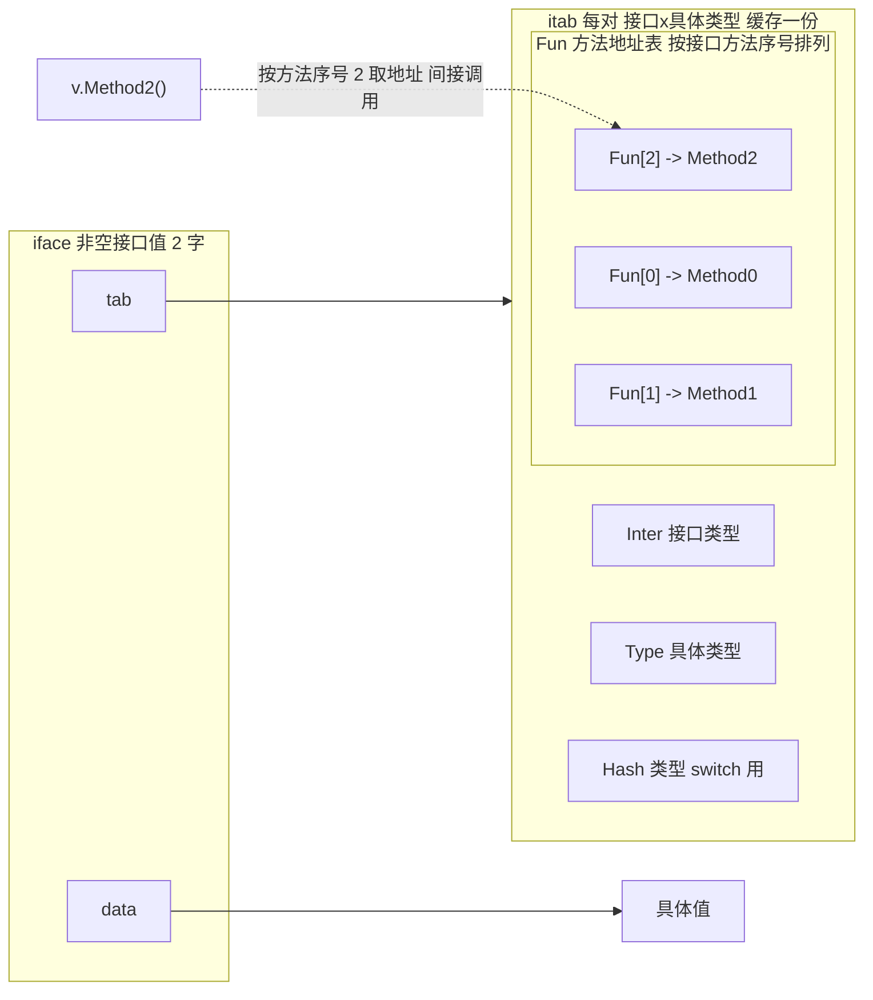

# 4.2 接口

接口是 Go 类型系统的灵魂。它让「行为」与「实现」解耦，又用一种与众不同的方式做这件事：
结构化、隐式的满足，区别于绝大多数主流语言。这一节看接口在运行时怎么表示、方法怎么动态
分发、类型断言怎么落地，以及这套设计放进多态的谱系里处在哪个位置。沿用前几节的做法，下文
给出的结构体都是**裁剪后的速写**：只留与设计相关的字段，注释说明它为何存在。完整定义可对照
`runtime/runtime2.go`、`internal/abi/iface.go` 与 `runtime/iface.go`。

## 4.2.1 两种表示：iface 与 eface

接口值在运行时一律是**两个字宽**，但分两种。带方法的接口（**非空接口**）用 `iface`：一个指向
`itab` 的指针，加一个指向具体数据的指针。空接口 `interface{}`（即 `any`）用 `eface`：一个指向
类型信息 `_type` 的指针，加一个数据指针。空接口没有方法，不需要方法表，于是直接存类型即可，
省下一层间接：

```go
// 非空接口：带方法，故需方法表 itab（速写）
type iface struct {
    tab  *itab          // 接口类型 × 具体类型 的方法表（含动态类型与 Fun 表）
    data unsafe.Pointer // 指向具体值（大于一字或需取址时为堆/栈上副本的指针）
}

// 空接口 any：无方法，直接挂类型信息（速写）
type eface struct {
    _type *_type        // 具体值的动态类型
    data  unsafe.Pointer
}
```

`data` 存的是指针而非值本身。把一个 `int` 放进接口，运行时会把它装箱（boxing）到一处可寻址
的内存，再让 `data` 指过去，这也是「接口会引入一次分配」这一性能直觉的来源。两字表示是理解
后续一切的地基：动态分发、类型断言、乃至下面的 nil 陷阱，都是它的直接推论。

## 4.2.2 带类型的 nil：一个两字表示的直接推论

接口值**等于 nil**，当且仅当**类型与数据两个字都为 nil**。只要动态类型那一字被填上，哪怕数据
指针为 nil，接口也不等于 nil。这条规则单看抽象，落到代码上就是著名的「带类型的 nil」陷阱：

```go
type MyErr struct{}
func (*MyErr) Error() string { return "boom" }

func do() error {
    var p *MyErr = nil // 一个值为 nil 的具体指针
    return p           // 装进 error 接口：类型字 = *MyErr，数据字 = nil
}

func main() {
    if err := do(); err != nil {
        // 会进这里！err 的类型字非 nil，故 err != nil，
        // 即便它包裹的指针是 nil。
        fmt.Println("non-nil:", err)
    }
}
```

`do` 返回的 `error` 里，`tab` 指向「`error` × `*MyErr`」的 itab（非 nil），`data` 才是那个 nil
指针。接口于是非 nil。函数签名返回 `error` 时尤其常踩这个坑：正确的做法是显式 `return nil`，
而不是返回一个恰好为 nil 的具体指针。理解了 4.2.1 的两字表示，这个坑就不再神秘，它不是特例，
而是规则的必然。

## 4.2.3 itab：方法表与动态分发

`itab`（interface table）是非空接口的核心。它为**每一对「接口类型 × 具体类型」**缓存一份，
记录接口类型、具体类型、一个类型哈希，以及最关键的 **`Fun` 方法地址表**：

```go
// itab：一对「接口×具体类型」的方法表（速写，对照 internal/abi/iface.go）
type ITab struct {
    Inter *InterfaceType // 接口类型（要求哪些方法、按什么顺序）
    Type  *Type          // 具体类型（动态类型）
    Hash  uint32         // Type.Hash 的副本，供类型 switch 用（见 4.2.5）
    Fun   [1]uintptr     // 变长：具体类型实现接口各方法的地址；Fun[0]==0 表示未实现
}
```



`Fun` 表的排列顺序由**接口**固定（按接口声明的方法字典序），与具体类型怎么写无关。这正是动态
分发的机关：编译器在编译期就知道某个方法在接口里的序号，调用时只需照序号去 `Fun` 取地址、
间接跳转。设接口 `I` 的第 2 个方法是 `Method2`，则

```go
var v I = concrete{}
v.Method2(args)
// 大致等价于（伪代码）：
//   fn := v.tab.Fun[2]          // 编译期定好的序号 2，运行期才知道地址
//   call fn(v.data, args)       // data 作为隐式接收者传入
```

序号是静态的、地址是动态的，这就是**动态分发**：同一处调用点，`v` 装的具体类型不同，跳到的
代码就不同。`itab` 的构造（`getitab`）并不便宜：要逐一核对具体类型是否实现了接口要求的每个
方法，并填好整张 `Fun` 表。所以运行时用一个全局哈希表 `itabTable` 把构造好的 itab 缓存起来，
相同的「接口×类型」对只算一次。`getitab` 的快路径是**无锁**的：先用 `inter.Type.Hash ^ typ.Hash`
作哈希去 `itabTable.find`，命中即返回（绝大多数情况）；找不到才加锁、构造、`itabAdd` 写回。
另有一类 itab 由编译器静态生成（程序里出现的类型 switch 用到的「接口×类型」对），在
`itabsinit` 时就预先填进表里。

## 4.2.4 结构化满足：解耦的代价与收益

通过方法表做间接调用，本质上就是 C++ 虚函数表（vtable）那套机制。Go 真正与众不同的，是
**接口的满足是结构化、隐式的**：一个类型只要拥有接口要求的方法集，就**自动**满足该接口，无需
像 Java/C# 那样显式 `implements`。这是**结构化类型**（structural typing）对**名义类型**（nominal
typing）的选择。

它的收益是解耦。你可以为别人的类型、甚至标准库的类型，定义出它们恰好满足的接口，而不必
改动那些类型一行代码。`io.Reader`/`io.Writer` 这种「小接口遍地适配」的生态，正源于此：
`bytes.Buffer`、`os.File`、`net.Conn` 谁都没声明自己实现 `io.Reader`，却都能被任何接受
`io.Reader` 的函数接住。接口与实现在两端各自演化，中间靠方法集自然对齐。

代价有两面。其一，隐式满足让「谁实现了什么」不再一目了然，得靠工具或阅读才能确认（这也是
`var _ io.Reader = (*T)(nil)` 这种编译期断言惯用法存在的原因）。其二，接口调用是间接的：
4.2.3 那次 `Fun[n]` 取址加间接跳转，编译器通常无法跨接口边界内联，于是失去内联本可带来的
优化。热路径上一个频繁调用的小方法，走接口和走具体类型，性能可能差出可观的一截。抽象从不
白来，它把灵活性买到手，付出的是这点运行时的间接成本。

## 4.2.5 类型断言与类型 switch

`x.(T)` 断言接口的动态类型。它的实现取决于 `T` 是什么：

- `T` 是**具体类型**时，断言退化成「比较接口里的动态类型字与 `T` 是否同一个 `_type`」，一次
  指针比较即可。
- `T` 是**另一个接口**（`x.(SomeInterface)`）时，要的是「`x` 的动态类型是否满足 `SomeInterface`」，
  这需要现算或查一个 itab，正是 4.2.3 的 `getitab` 那条路（带 `canfail` 标志，失败返回 nil 而
  非 panic）。

**类型 switch** `switch v := x.(type)` 借助 `itab.Hash`（即动态类型哈希的副本）做快速分支：先
按哈希粗筛 case，再精确比对类型。这里要分清两个不同的哈希：`itab.Hash` 是 `Type.Hash` 的副本，
服务于**类型 switch**，由编译器为程序中出现的 switch 静态生成的 itab 携带；而 `itabTable` 自己
查表用的是另一个哈希 `inter.Type.Hash ^ typ.Hash`。运行期动态构造的 itab 其 `Hash` 字段
被置 0，因为它们从不参与类型 switch。这点解释了一个性能直觉：频繁的接口断言、尤其是断言到
接口的那一类，以及大型 type switch，都不是零成本，热路径上值得留意。

## 4.2.6 方法集：值还是指针

接口持有的是值还是指针，由**方法集规则**决定，这也是 4.2.1 两字表示的延伸：指针接收者的方法
**不在**值的方法集里。

```go
type T struct{}
func (t T)  Read() {}   // 值接收者：T 和 *T 都有
func (t *T) Write() {}  // 指针接收者：只有 *T 有

type ReadWriter interface { Read(); Write() }

var _ ReadWriter = &T{} // 可以：*T 同时拥有 Read 与 Write
var _ ReadWriter = T{}  // 编译错误：T 的方法集缺 Write
```

原因不难想：调用指针接收者的方法要拿到接收者的地址，而接口里装的若是一份值的副本，它未必
可寻址，于是语言索性把这类方法排除在值的方法集之外。这条规则不是语法细节，而是「接口里到底
能装什么」的边界，和带类型的 nil 一样，都是底层表示的直接推论。

## 4.2.7 设计取舍：小接口与「接受接口、返回结构体」

Go 的接口哲学浓缩成几条社区箴言，它们都不是风格偏好，而是上面这套机制的工程结论。

**「接口越小越好」**：单方法接口（`io.Reader` 等）最易被满足、最易组合。Rob Pike 的说法是
「The bigger the interface, the weaker the abstraction」，接口越大，能满足它的类型越少，解耦
的收益越薄。**「接受接口、返回结构体」**：函数参数用接口以求通用，让调用方自由替换实现；返回
值用具体类型，避免过早抽象、也让调用方拿到完整能力而非被接口裁剪过的视图。再加上 4.2.2 的
带类型的 nil、4.2.6 的值与指针方法集，这几条凑在一起，构成了写 Go 接口时绕不开的常识。它们
共同的底色是：接口是用来解耦的轻量抽象，能小就小，能晚抽象就晚抽象。

## 4.2.8 跨语言对照

多态在各语言里有不同的落地方式，把 Go 放进这张表里，它的取舍就清楚了：

| 语言/机制 | 分发方式 | 满足关系 | 运行时表示 | 备注 |
|---|---|---|---|---|
| Go interface | 动态（itab 方法表） | 结构化、隐式 | iface = 2 字（itab 指针 + 数据指针） | 与 vtable 同构，但非侵入 |
| C++ 虚函数 | 动态（vtable） | 名义、侵入（须继承基类） | 对象内嵌 vptr 指向类的 vtable | itab 机制的近亲 |
| Rust trait | 静态（泛型单态化，零成本）或动态（`dyn Trait`） | 名义、显式 `impl` | `dyn` 为胖指针 = 数据指针 + vtable 指针 | `dyn Trait` 与 Go 的 iface 极像 |
| Haskell type class | 字典传递（dictionary passing） | 名义、`instance` 声明 | 实例 = 一张方法字典，调用处隐式传入 | 与 Go 泛型的实现同源（见下） |
| Java/C# 接口 | 动态（接口方法表） | 名义、显式 `implements` | 对象头 + 方法表；JIT 用内联缓存优化 | 虚调用靠运行期反优化/内联缓存提速 |

Haskell 这条线值得单独点出：类型类用**字典传递**实现，一个实例就是一张方法字典，在调用处
隐式传入。这正是接口 itab 的「编译期版本」，也是 Go 泛型（[8 泛型](../ch08generics)）实现里
用到的同一思想，类型类与字典是同一概念的两端，一端在运行期（接口 itab），一端在编译期（泛型
字典）。Go 的独特之处，是把「vtable 式的高效动态分发」与「结构化、隐式满足的松耦合」结合在
一起：既要运行时的实在表示，又要写代码时的轻量解耦。理解了 iface/itab，就理解了这份结合是
如何落地的。

## 延伸阅读的文献

1. Russ Cox. *Go Data Structures: Interfaces.* 2009.
   https://research.swtch.com/interfaces （iface/itab 表示的经典讲解）
2. The Go Authors. *runtime/iface.go、internal/abi/iface.go、runtime/runtime2.go*
   （iface/eface/itab、getitab、itabTable）.
   https://github.com/golang/go/blob/master/src/runtime/iface.go
3. Luca Cardelli, Peter Wegner. "On Understanding Types, Data Abstraction, and
   Polymorphism." *ACM Computing Surveys*, 17(4), 1985.
   https://doi.org/10.1145/6041.6042 （多态与类型抽象的奠基综述）
4. Philip Wadler, Stephen Blott. "How to Make ad-hoc Polymorphism Less ad hoc."
   *POPL 1989*. https://doi.org/10.1145/75277.75283 （类型类与字典传递）
5. Rob Pike. *Go Proverbs*（"The bigger the interface, the weaker the abstraction"）.
   https://go-proverbs.github.io/
6. The Go Authors. *The Go Programming Language Specification: Interface types.*
   https://go.dev/ref/spec#Interface_types （结构化满足与方法集的规范定义）
7. The Rust Project. *The Rust Reference: Trait objects (`dyn Trait`).*
   https://doc.rust-lang.org/reference/types/trait-object.html （动态分发的胖指针表示）

## 许可

&copy; 2018-2026 The [golang.design](https://golang.design) Initiative Authors. Licensed under [CC-BY-NC-ND 4.0](https://creativecommons.org/licenses/by-nc-nd/4.0/).
