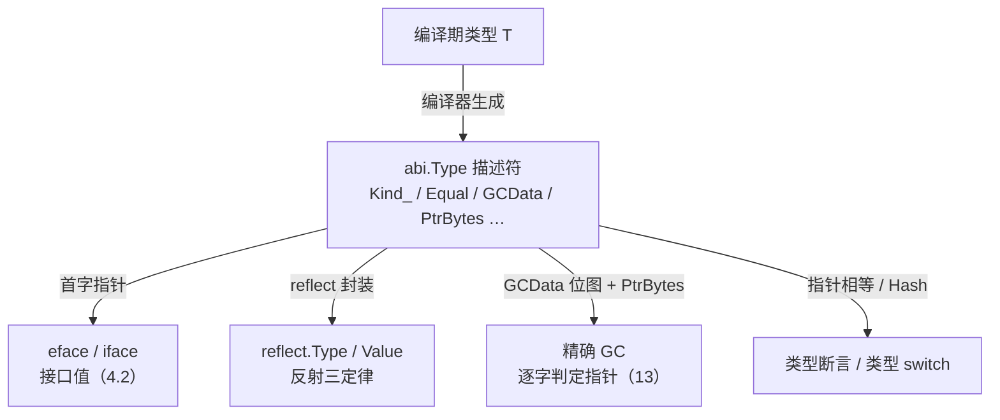

# 4.1 运行时类型系统

Go 是静态类型语言，类型检查发生在编译期。但 Go 又保留了相当一部分**运行时类型信息**（runtime
type information, RTTI），正是它支撑起了接口（[4.2](./interface.md)）、类型断言、类型 switch、
反射，以及垃圾回收对指针的精确识别。这一节回答一个看似简单的问题：编译期那套类型，到了运行时
还剩下什么、以什么形式留存、又撑起了哪些能力。读懂这一节里那个叫**类型描述符**的小结构，
后面的接口（[4.2](./interface.md)）、反射与精确 GC（[13](../../part4memory/ch13gc)）就都有了共同的
落脚点。

下文给出的结构体都是**裁剪后的速写**：只保留与设计相关的字段，并在注释里说明它为何存在。
完整定义可对照 go1.26 的 `internal/abi/type.go` 与 `reflect` 包。

## 4.1.1 每个类型都有一个描述符

编译器为程序里用到的**每一个类型**生成一份**类型描述符**，在 go1.26 的源码里它叫 `abi.Type`，
运行时内部沿用旧名 `_type`。描述符被编进只读数据段，整个程序运行期间常驻不变。同一个类型
在一个程序里通常只有一份描述符，这一点后面判断「类型是否相同」时会用到。

```go
// abi.Type：一个类型在运行时的表示（裁剪后的速写）
type Type struct {
    Size_       uintptr // 该类型一个值占多少字节，分配与拷贝都要它
    PtrBytes    uintptr // 值的前若干字节里可能含指针，GC 只需扫到这里
    Hash        uint32  // 类型的哈希，类型 switch、接口表查找时避免重算
    TFlag       TFlag   // 标志位：是否具名、是否带 UncommonType、GC 位图是否按需生成
    Align_      uint8   // 该类型变量的对齐
    FieldAlign_ uint8   // 作为结构体字段时的对齐
    Kind_       Kind    // 种类：int、struct、slice、chan… 决定如何解释这块内存
    // 比较该类型两个值是否相等：(指向 A, 指向 B) -> ==?
    // 编译器按类型结构合成，map、接口比较、== 运算都落到它身上
    Equal func(unsafe.Pointer, unsafe.Pointer) bool
    // GC 指针位图：标出该类型哪些字（word）是指针，精确 GC 据此扫描
    GCData    *byte
    Str       NameOff // 类型名在名字表里的偏移（按需解出可读名字）
    PtrToThis TypeOff // 指向「*T」描述符的偏移，构造指针类型时复用
}
```

每个字段都为某种运行时能力而存在，挑几样要紧的说。`Size_` 是分配器（[12](../../part4memory/ch12alloc)）
和值拷贝的依据。`Kind_` 是一个枚举，告诉运行时「这块内存按哪种类型解释」，它的取值是有限的
二十余种基础种类：

```go
type Kind uint8

const (
    Invalid Kind = iota
    Bool
    Int
    Int8
    // … 省略其余整型、浮点、复数 …
    Array
    Chan
    Func
    Interface
    Map
    Pointer
    Slice
    String
    Struct
    UnsafePointer
)
```

`Kind` 只区分到「种类」，并不区分具体类型：`type Celsius float64` 与 `float64` 的 `Kind` 都是
`Float64`，但它们是两份不同的描述符（[4.1.3](#413-名义类型与类型标识)）。`Equal` 是编译器为该类型
合成的相等函数，map 的键比较、接口值比较、`==` 运算都最终落到它身上；当 `TFlagRegularMemory`
置位时，整个值是一段无内部填充的连续内存，比较退化成一次 `memequal`，无需逐字段递归。

带方法的具名类型还在描述符之后紧跟一段 `UncommonType`（由 `TFlagUncommon` 标记），记录方法表；
而 struct、slice、map、func 等各自还有把 `Type` 内嵌在首部的「扩展描述符」（如 `StructType`、
`SliceType`），多出元素类型、字段列表等信息。换言之，`abi.Type` 是所有类型描述符共享的**公共
前缀**，运行时先读 `Kind_` 判明种类，再把指针强转成对应的扩展类型去读更多字段。

## 4.1.2 从编译期到运行时的桥

类型描述符的意义，在于它是把「编译期的类型」搬到运行时的唯一载体。最直接的用处是空接口。
`any`（即 `interface{}`）在运行时就是一对指针：

```go
// 空接口的运行时布局（abi.EmptyInterface 速写）
type EmptyInterface struct {
    Type *Type          // 指向动态类型的描述符
    Data unsafe.Pointer // 指向实际数据（指针型类型则其值即存于此字，详见 4.2）
}
```

把一个具体值装进 `any`，编译器做的事就是：把该类型的描述符地址填进 `Type`，把数据地址填进
`Data`。于是「这个接口里装的到底是什么类型」这个运行时问题，化简为「读出 `Type` 指针、看它指向
哪份描述符」。类型断言 `x.(T)`、类型 switch 都建立在这次读取之上：拿 `Type` 指针（或它的 `Hash`）
去与目标类型比对。带方法的非空接口多一层 `ITab`（接口方法表），其分发机制留到
[4.2](./interface.md) 详谈，这里只需记住：无论空接口还是非空接口，第一个字最终都通向一份
`abi.Type`。

这条桥是单向收窄的。编译期，类型是一套丰富的、可推导可检查的静态信息；过桥之后，运行时手里只
剩这份描述符，外加接口值里的一个数据指针。Go 能在运行时做的一切类型相关的动作，类型断言、
反射、GC 扫描，本质上都是在这有限的两样东西上做文章。

## 4.1.3 名义类型与类型标识

Go 的具体类型是**名义的**（nominal）：类型的身份由它的声明决定，而非由它的结构决定。

```go
type Celsius float64
type Fahrenheit float64

var c Celsius = 100
var f Fahrenheit = c // 编译错误：不能把 Celsius 赋给 Fahrenheit
var x float64 = c    // 同样错误：Celsius 不是 float64
```

`Celsius` 与 `Fahrenheit` 底层都是 `float64`，三者的 `Kind` 也都是 `Float64`，却是**三份不同的
描述符**，互相不能直接赋值。这道屏障不是运行时检查出来的，而是编译期就拒绝的；它的价值在于让
「温度」这个语义无法被悄悄当成「另一种温度」或「裸浮点」误用。类型标识的精确规则，何时两个类型
相同、可赋值、可转换，由语言规范的 Types 与 Type identity 两节定义。

名义身份在运行时的兑现方式格外简洁：因为同一类型在程序里通常只有一份描述符，判断两个值是否
同一类型，只需比较它们描述符指针是否相等，一次指针比较即可，无需逐字段比对结构。类型 switch
为加速还先比 `Hash`（`uint32`），哈希不等则类型必不同，省去指针解引用。

把这一点和接口对照，能看出 Go 在类型系统上的一处刻意分工。具体类型用**名义**身份，`Celsius`
不会被误当 `float64`；而接口的满足是**结构化**的（[4.2](./interface.md)），一个类型只要具备接口要求
的方法集，就自动满足该接口，无需显式声明「我实现了它」。名义保证了具体类型的边界清晰，结构化
保证了接口的解耦与可组合。两种身份规则各管一段，是 Go 类型系统简单而够用的来由之一。

## 4.1.4 反射：建立在描述符之上的自省

`reflect` 包让程序在运行时检视、操作任意类型的值。它不是魔法，而是对 [4.1.2](#412-从编译期到运行时的桥)
那两个字的一层包装：`reflect.Type` 封装了 `*abi.Type`，`reflect.Value` 同时握住类型描述符与数据
指针。Russ Cox 在《The Laws of Reflection》中把这层关系提炼为三条定律，对照接口的布局，每条都
能落到具体的字上。

```go
var x float64 = 3.4

// 定律一：反射对象由接口值得来。
// TypeOf/ValueOf 的入参是 any，本质是读出 EmptyInterface 的 Type 与 Data。
t := reflect.TypeOf(x)  // t.Kind() == reflect.Float64，读的是描述符的 Kind_
v := reflect.ValueOf(x) // v 同时握有 *abi.Type 与指向数据的指针

// 定律二：反射对象可还原回接口值。
var i any = v.Interface() // 把 Type 与 Data 重新拼回一个接口

// 定律三：要修改反射对象，它必须可设置（settable）。
p := reflect.ValueOf(&x).Elem() // 经由指针拿到可寻址的 Value
p.SetFloat(7.1)                 // x 变为 7.1；若对不可寻址的 v 调用则 panic
```

第三条定律的「可设置」并非额外规则，而是接口布局的必然：`reflect.ValueOf(x)` 装进接口的是 `x`
的**副本**，改它不会动到原变量，于是反射拒绝设置；只有先取 `&x`、再 `Elem()` 解引用，`Value` 里
握住的才是原变量的地址，设置才有意义。理解了接口那两个字，三定律便从「需要记忆的规则」变回
「布局的推论」。

反射强大，代价也实在：它绕过编译期类型检查、慢于直接代码、写错只在运行时才暴露。Go 的态度是
能不用就不用，把它留给序列化（`encoding/json`）、ORM 等确需泛化处理任意类型的库。Go 1.18 引入
的泛型（[8](../ch08generics)）正是要让一大类「过去只能靠反射」的泛化代码，重新获得编译期类型
安全与零反射开销。

## 4.1.5 GC 指针位图：描述符如何驱动精确扫描

描述符里的 `GCData` 与 `PtrBytes` 是垃圾回收（[13](../../part4memory/ch13gc)）的命脉。Go 用的是**精确**
（precise）GC：扫描一块对象时，回收器必须确切知道哪些字是指针、哪些是普通数据，绝不能把一个
碰巧像地址的整数误当指针去追。这份「哪些字是指针」的信息，正由类型描述符提供。

`GCData` 通常指向一张**指针位图**（ptrmask）：每一位对应该类型的一个字，1 表示指针、0 表示非指针，
位图长度至少覆盖到 `PtrBytes`。回收器扫描某个对象，就是按它的描述符取出这张位图，逐位决定要不要
跟进。`PtrBytes` 给出一个上界：该类型的指针只可能出现在前 `PtrBytes` 个字节内，其后纯是数据，
扫描到此即可收手，无需走完整个值。一个尾部全是大数组的结构体因此能省下可观的扫描。



go1.26 在这里有一处值得记下的演进：`TFlagGCMaskOnDemand` 标志。早先每个类型的指针位图都在编译期
预先算好、编进二进制，对含大量类型的程序会让只读段膨胀。设置该标志后，`GCData` 不再直接指向
位图，而是一个 `**byte`，真正的位图由运行时在首次需要时**按需生成**并缓存（见 `runtime/type.go`
的 `getGCMask`），以一点运行时计算换取更小的二进制。这是「描述符」这一设计仍在被持续打磨的一个
缩影：接口稳定，背后的存储策略却随版本演化。

这张图把前面几节收束到一处：编译期的类型 `T` 收窄成一份 `abi.Type`，而这份描述符同时是接口、
反射、GC、类型断言四条线路的共同源头。一个小小的只读结构，撑起了 Go 全部的运行时类型能力。

## 4.1.6 跨语言对照：RTTI 的浓淡

「运行时还保留多少类型信息」，各语言的取舍差异很大，沿着这条轴排开，能看清 Go 站在何处。

**Java 与 C#** 在浓的一端。每个对象在堆上都带一个指向类元数据的头，运行时可经 `Class` / `Type`
取得字段、方法、注解乃至泛型签名，反射几乎无所不能，这是其框架生态（依赖注入、序列化、ORM、
动态代理）的根基。代价是每个对象的元数据指针开销、以及反射调用的运行时成本。

**C++** 在淡的一端，恪守「不为不用的东西付费」。默认几乎不带运行时类型信息，唯有开启 RTTI 后，
`typeid` 与 `dynamic_cast` 才有限地可用，且仅对带虚函数的多态类型有效；非多态类型在运行时根本
无从查询其真实类型。

**Rust** 走得更远，**没有**通用的运行时反射。`std::any::Any` 只能借一个 `TypeId` 做有限的向下转型，
拿不到字段与方法的结构。Rust 把泛化彻底交给编译期的泛型与 trait，信奉零运行时成本，序列化这类
需求由 `serde` 在编译期用过程宏生成代码，而非运行时反射。

Go 落在中间偏「够用」的一侧：保留足以支撑接口、类型断言、类型 switch、反射与精确 GC 的运行时
类型信息，但不像 Java 那样为每个对象都挂一份富元数据。它把信息集中在按类型唯一的描述符里，
对象本身不背负类型头，普通值在内存里就是裸数据，类型信息经由接口或描述符指针间接获得。这份
取舍呼应 Go 一贯的性格：要简单、要够用，也要为运行时几样实在的能力（精确 GC、接口分发、反射）
留下恰好够用的元数据，不多不少。

## 延伸阅读的文献

1. Russ Cox. *The Laws of Reflection.* The Go Blog, 2011.
   https://go.dev/blog/laws-of-reflection
2. Russ Cox. *Go Data Structures: Interfaces.* 2009.
   https://research.swtch.com/interfaces
   （接口与类型描述符的内存布局原型）
3. The Go Authors. *internal/abi/type.go、internal/abi/iface.go*（go1.26 类型描述符与接口布局）.
   https://github.com/golang/go/blob/master/src/internal/abi/type.go
4. The Go Authors. *runtime/type.go：getGCMask*（GC 指针位图与 `TFlagGCMaskOnDemand` 的按需生成）.
   https://github.com/golang/go/blob/master/src/runtime/type.go
5. The Go Authors. *Package reflect.* https://pkg.go.dev/reflect
6. The Go Authors. *The Go Programming Language Specification：Types / Type identity.*
   https://go.dev/ref/spec#Types
7. Luca Cardelli, Peter Wegner. "On Understanding Types, Data Abstraction, and
   Polymorphism." *ACM Computing Surveys*, 17(4), 1985.
   https://doi.org/10.1145/6041.6042
