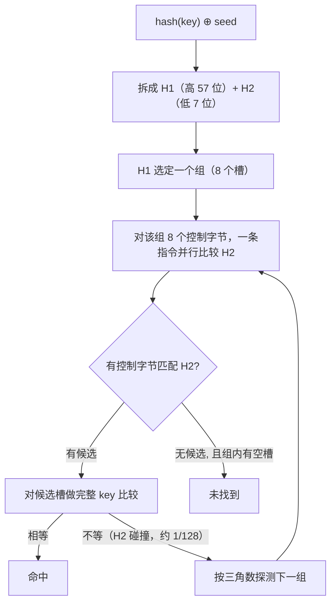

# 5.2 散列表

`map` 是 Go 里最常用的数据结构之一，一行 `m[k]` 背后，是一套要在**速度、内存、抗攻击、并发安全**
之间反复权衡的散列表设计。Go 1.24（2025）还把内置 map 整个换成了基于 **Swiss table** 的实现,
这是本章必须讲清的一处现代变革。我们先建立散列表的理论坐标，再看 Go 的经典设计与这次重写。

## 5.2.1 散列表的两大家族

散列表把键经哈希函数映射到桶（bucket），碰撞（不同键落到同一桶）的处理分两大流派。

**分离链接**（separate chaining）：每个桶挂一条容器（经典是链表），所有哈希到此的键都串在上面。
插入、删除干净，负载因子 α 可以超过 1，碰撞下退化平缓（只是某条链变长）。代价是每次探查要追
指针（缓存不友好）、每个节点有分配与指针开销。

**开放寻址**（open addressing）：所有键就住在桶数组里，碰撞时按确定的**探测序列**去找下一个空槽。
好处是无每节点指针、存储紧凑、缓存局部性极好。代价是 α 必须严格小于 1（数组填满则找不存在的键
时探测无法终止），且 α 趋近 1 时性能急剧恶化,在均匀哈希的理想模型下，线性探测一次未命中查找
的期望探测数约为 $\tfrac12\big(1 + \tfrac{1}{(1-\alpha)^2}\big)$，$\alpha = 0.9$ 时已高达约 50。
这正是开放寻址要在中等负载（Go 的 Swiss table 取 7/8）就扩容的原因。删除也更麻烦:不能简单清空
一个槽（会截断别的键的探测链），需要**墓碑**（tombstone）标记。

探测序列也有讲究：**线性探测**缓存友好但有"主聚集";**二次探测**（Go 用三角数形式，恰好不重不漏
遍历 2 的幂大小的表）缓解主聚集;**双重哈希**用第二个哈希做步长，消除聚集但牺牲局部性。还有一种
插入策略 **Robin Hood 哈希**（Celis 1986）：碰撞时让"离家更远"的键占据槽位，把探测长度的方差
压低,劫富济贫，使近满的表查找时间也很稳定。

## 5.2.2 哈希质量与 hashDoS

散列表的最坏情况是所有键碰撞成 $O(n)$。若攻击者能**构造**碰撞的键，就能用很低的带宽把表打成
链表,这就是 Crosby 与 Wallach 在 2003 年揭示的**算法复杂度拒绝服务攻击**（hashDoS），他们曾
把 Perl、Squid、Bro 的散列表打退化。防御之道是**带种子的随机化哈希**：让哈希依赖一个攻击者
不知道的每进程/每表随机种子，碰撞便无法预先构造。Go 正是如此,每个 map 自带一个随机 `seed`。
业界常用的带密钥短输入哈希是 **SipHash**（Rust 标准库默认即用它）。

## 5.2.3 Swiss table：现代开放寻址

近十年开放寻址最重要的革新，来自 Google abseil 的 **Swiss table**。它把存储拆成槽数组加一个
**独立的元数据/控制数组**（每槽一字节）：空槽、墓碑、或"已占用 + 该键哈希的 7 位"。查找时一条
**SIMD** 指令把一个组（abseil 用 16 槽）的全部控制字节与目标哈希片段**并行比较**，一次顶十几步
探测，且只在约 1/128 的控制字节匹配时才去做完整 key 比较。元数据密集、并行扫描，真正的 key 很少
被触碰,这就是它又快又缓存友好的根源。



## 5.2.4 Go map 的经典设计（1.0–1.23）

Go 早期的 map 是一种**桶内开放寻址、溢出处链接**的混合。每个桶（`bmap`）放最多 **8** 对键值，
另存每个键哈希的**高 8 位**（`tophash`）用于完整比较前的快速排除;一个桶装不下时，**链一个溢出桶**。
平均每桶超过 **6.5** 个键（负载因子）就扩容,扩容不是一次性的，而是在后续写入时**增量迁移**
（evacuation），每次只搬几个旧桶，从而把单次操作的延迟抖动压住。

```go
type hmap struct {       // 经典 map（裁剪）
    count      int            // 元素个数，len() 返回它
    B          uint8          // 桶数 = 2^B
    buckets    unsafe.Pointer // 当前桶数组
    oldbuckets unsafe.Pointer // 扩容时的旧桶数组（增量迁移中）
}
```

## 5.2.5 Go 1.24 的 Swiss table 重写

Go 1.24 把内置 map 换成了基于 Swiss table 的实现（提案 #54766，落地于 `internal/runtime/maps`）。
它沿用 abseil 的思路，又为 Go 的需求做了改造，关键点（均对照 go1.26 源码核实）：

- **组为 8 槽**，控制字用一个 `uint64`,在 AMD64 上用 SIMD 内建函数并行匹配，其他平台用 SWAR
  位技巧;源码注释明言"用 SIMD 可扩展到 16 槽"。
- **负载因子 7/8**，与 abseil 相同（abseil 16 槽留 2 个空，Go 8 槽留 1 个空）。
- **三角数二次探测**，因组数为 2 的幂而不重不漏。
- **删除用墓碑**，插入优先复用墓碑，墓碑只在扩容时彻底清除。
- **增量扩容靠可扩展哈希**（extendible hashing），这是 Go 相对 abseil 的主要添加：一个 map 持有
  一个 `*table` 的**目录**，高位哈希选表;每张表是一个独立的 Swiss table，最多原地翻倍到 1024 槽，
  之后**分裂**成两张表。于是任何一次扩容至多触碰约 1024 槽，像经典 evacuation 那样把延迟抖动
  约束住,只是改成了按表分裂。
- **小 map 优化**：只放过 ≤8 个元素的 map 直接指向单个组，没有目录、没有探测序列维护。

关于性能，需要厘清一处常见说法。Go 1.24 发布说明给出的是**综合**数字："一组代表性基准的 CPU
开销平均下降 2~3%"，且这是 Swiss map、小对象分配、新互斥锁三项**合在一起**的效果，并非 map
单独的提速;"对大 map 尤其快"是设计预期与社区观察，而非发布说明背书的数字，引用时应据实标注。
该实现可用 `GOEXPERIMENT=noswissmap` 在构建时关闭。

## 5.2.6 两条语言规定的由来

**为什么不能取 `&m[k]`。** 语言规范规定 map 元素**不可寻址**。工程上的理由与上面的实现一致：
元素会在扩容时移动（经典 map 迁移桶、Swiss map 重排槽并分裂表），任何指向后备存储的地址都可能
在后续插入后悬空。编译期禁止 `&m[k]`，就杜绝了悬垂指针（也是 `m[k].field = x` 对结构体值会报错
的原因）。

**为什么并发访问会崩。** map 不是并发安全的，运行时用一个写标志做**尽力而为**的竞态检测：
源码里这个 `writing` 标志用**异或**翻转（`m.writing ^= 1`）而非置位/清零，注释解释这样能提高多个
并发写者都侦测到竞争的概率;一旦发现不一致就 `fatal("concurrent map writes")` 直接终止进程
（不可 `recover`）。注意这是尽力检测、非保证,要保证正确请用 `sync.Mutex` 或 `sync.Map`
（[11.7](../../part3concurrency/ch11sync/map.md)）。

## 5.2.7 跨语言对照

| 语言 | 设计 | hashDoS 防御 | 顺序 |
| --- | --- | --- | --- |
| Go (1.24+) | Swiss table + 可扩展哈希目录 | 每 map 随机种子 | 随机化迭代 |
| Rust `std::HashMap` | Swiss table（hashbrown） | 默认 SipHash-1-3 | 无序 |
| C++ `absl::flat_hash_map` | Swiss table（16 槽 SSE2） | 每表种子 | 无序、无指针稳定性 |
| C++ `std::unordered_map` | 分离链接（标准强制） | 无 | 无序 |
| Java `HashMap` | 分离链接 + 长链转红黑树（Java 8） | 无（字符串哈希固定） | 无序 |
| Python `dict` | 开放寻址 + 紧凑有序 | SipHash（PYTHONHASHSEED） | 插入序 |

最值得记取的是 **C++ `std::unordered_map` 的教训**：标准要求元素的引用/指针稳定、并暴露桶接口，
这实际上**锁死**了节点式分离链接的实现，从而把整个 Swiss table 家族挡在门外,这是 2003 年标准化
抉择（当时开放寻址"尚不够成熟"）留下的、谁也绕不开的设计枷锁。Go、Rust、abseil、Python 都
**主动放弃**了元素地址稳定（Go 用"不可寻址"在语言层强制），以此换取速度与紧凑。Java 8 的
"长链转红黑树"则只是把碰撞的最坏情况从 $O(n)$ 降到 $O(\log n)$，是缓解而非杜绝。迭代顺序随机化
（Go 自其经典设计起就有）则是一项有意的可移植性措施，防止程序依赖不该依赖的顺序。

## 延伸阅读的文献

1. Donald E. Knuth. *The Art of Computer Programming, Vol. 3: Sorting and Searching*,
   §6.4 Hashing. 2nd ed., 1998.
2. Pedro Celis. *Robin Hood Hashing.* PhD thesis, University of Waterloo, TR CS-86-14, 1986.
3. Scott A. Crosby, Dan S. Wallach. "Denial of Service via Algorithmic Complexity Attacks."
   *USENIX Security 2003.*
   https://www.usenix.org/legacy/events/sec03/tech/full_papers/crosby/crosby.pdf
4. Matt Kulukundis. "Designing a Fast, Efficient, Cache-friendly Hash Table, Step by Step."
   *CppCon 2017.* https://www.youtube.com/watch?v=ncHmEUmJZf4 ；abseil Swiss Tables：
   https://abseil.io/about/design/swisstables
5. golang/go#54766. *runtime: use SwissTable*；Go 1.24 Release Notes.
   https://github.com/golang/go/issues/54766 ，https://go.dev/doc/go1.24
6. JEP 180《Handle Frequent HashMap Collisions with Balanced Trees》.
   https://openjdk.org/jeps/180

## 许可

&copy; 2018-2026 The [golang.design](https://golang.design) Initiative Authors. Licensed under [CC-BY-NC-ND 4.0](https://creativecommons.org/licenses/by-nc-nd/4.0/).
