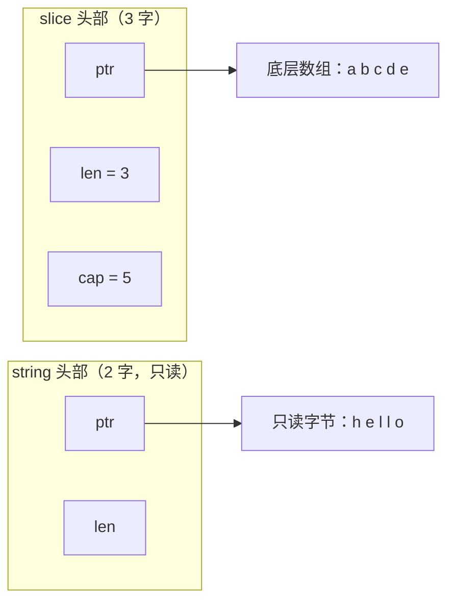

# 5.1 数组、切片与字符串

数组、切片、字符串是 Go 里最基础的三种序列类型。它们看起来相似，内存模型却各不相同,理解这点
能一举解释 append 的种种"惊喜"、切片别名的陷阱、以及字符串为何不可变。三者共享一个主题：
**一个小小的头部，描述一段连续的后备内存**。

## 5.1.1 三种内存布局

**数组**是值：`[5]int` 就是连续的 5 个 int，长度是类型的一部分，赋值与传参**整份拷贝**。正因如此，
数组在 Go 里反而少用,大块数组传来传去太贵。

**切片**是对底层数组一段的视图,一个三字的头部：指向起始元素的 `ptr`、长度 `len`、容量 `cap`。

**字符串**是只读的字节序列,一个两字的头部：`ptr` 与 `len`，没有 `cap`。它**不可变**，这让多个
字符串可以安全共享同一段底层字节、子串无需拷贝。

## 5.1.2 动态数组与摊还分析

切片是**动态数组**的 Go 化身,一个会按需增长的连续数组。它的核心保证是：尽管偶尔要重新分配并
搬迁，`append` 的**摊还**（amortized）代价仍是 $O(1)$。道理在于"成倍增长"：每次满了就把容量
翻一番（或乘一个 >1 的常数因子），于是搬迁 $n$ 个元素的总成本是 $n + n/2 + n/4 + \cdots < 2n$，
平摊到每次 append 就是常数。这是算法导论里**摊还分析**的经典例子,关键在于增长因子必须是
**乘性**的，若每次只加固定个数，append 就退化成 $O(n)$。

## 5.1.3 append 的增长策略

Go 的实际增长（`runtime.growslice` → `nextslicecap`，对照 go1.26 核实）并非简单的"小翻倍、
大 1.25 倍"。当前的策略以 **256** 为界：旧容量小于 256 时翻倍;大于等于 256 时按
`newcap += (newcap + 3*256) >> 2` 平滑增长,这是一个从 2 倍逐渐过渡到约 1.25 倍的连续曲线，
比 Go 1.18 之前那种"1024 处从 2 倍硬跳到 1.25 倍"更圆润，避免了临界点附近的浪费。算出的容量
还会经 `roundupsize` 向上取整到内存分配器的**尺寸类**（[12 内存分配器](../../part4memory/ch12alloc)），
所以实际 `cap` 常略大于你算的值。

这条公式解释了一个常见困惑：**append 后的 `cap` 为什么是这个数**,它是"乘性增长 + 尺寸类对齐"
的合成结果，不必去背，理解机制即可。

## 5.1.4 别名与那些"惊喜"

切片是视图，多个切片可以共享同一段底层数组,这是性能的来源，也是陷阱的来源。

**append 可能共享、也可能不共享底层数组。** 若 `append` 后没超出 `cap`，新切片与原切片**共享**
底层数组，对一方的写会影响另一方;一旦超出 `cap` 触发重新分配，二者就**各走各路**了。这种
"有时共享、有时不共享"是最常见的 bug 源。**完整切片表达式** `a[lo:hi:max]` 能显式限定新切片的
`cap`（到 `max`），从而强制后续 append 触发拷贝、切断别名,是写库时保护内部数组不被调用方
意外篡改的常用手段。

**子切片导致的内存泄漏。** `small := big[:10]` 让 `small` 持有 `big` 的整段底层数组,只要 `small`
活着，那个可能很大的数组就回收不掉。需要时应 `copy` 出一份独立的小切片。Go 1.21 起还提供
`slices` 包（`slices.Clone`、`slices.Delete` 等）让这些操作更安全显式。

## 5.1.5 字符串与 []byte

字符串不可变带来一个代价：`string` 与 `[]byte` 互转默认要**拷贝**（因为 `[]byte` 可变，不能让它
指向只读字符串的字节）。这在热路径上可能可观。编译器对一些模式（如 `m[string(b)]` 的 map 查找、
`for range []byte(s)`）做了免拷贝优化。需要手动零拷贝时，Go 1.20 提供了
`unsafe.String`/`unsafe.StringData`/`unsafe.SliceData`,在你能保证字节此后不被修改时安全地
在二者间转换，取代了过去靠 `reflect.StringHeader` 那种脆弱写法。字符串的不可变还使它天然
适合做 map 键、可被多个变量共享而无需防御性拷贝。

## 5.1.6 跨语言对照

动态数组是普适的：C++ 的 `std::vector`、Rust 的 `Vec`、Python 的 `list`、Java 的 `ArrayList`
都是摊还 $O(1)$ 的成倍增长数组。差别多在**增长因子**与**视图**这两点上。增长因子上，多数实现用
2 倍（Python 约 1.125 倍、稳态更省内存），Go 用上面那条平滑曲线;较小的因子更省内存、较大的
更省搬迁次数，是空间与时间的取舍。视图上，Go 的切片、Rust 的 `&[T]` 切片都是"指向他人数组的
胖指针"，能零拷贝地引用子段;而 C++ `vector` 本身拥有内存（C++20 才有独立的 `std::span` 视图）。
Go 把"拥有的动态数组"（其实是底层数组）与"视图"（切片）统一成了一个类型，简洁，代价正是 5.1.4
那些别名陷阱,又一次的简洁与安全的取舍。

## 延伸阅读的文献

1. Thomas H. Cormen 等. *Introduction to Algorithms*（摊还分析、动态表的成倍扩张）.
2. The Go Authors. *runtime/slice.go：growslice / nextslicecap*（增长策略）.
   https://github.com/golang/go/blob/master/src/runtime/slice.go
3. Go 博客. *Go Slices: usage and internals.* https://go.dev/blog/slices-intro ；
   *Arrays, slices (and strings): The mechanics of 'append'.* https://go.dev/blog/slices
4. Go 1.20 Release Notes（unsafe.String/StringData/SliceData）. https://go.dev/doc/go1.20 ；
   Go 1.21 `slices` 包. https://pkg.go.dev/slices

## 许可

&copy; 2018-2026 The [golang.design](https://golang.design) Initiative Authors. Licensed under [CC-BY-NC-ND 4.0](https://creativecommons.org/licenses/by-nc-nd/4.0/).
