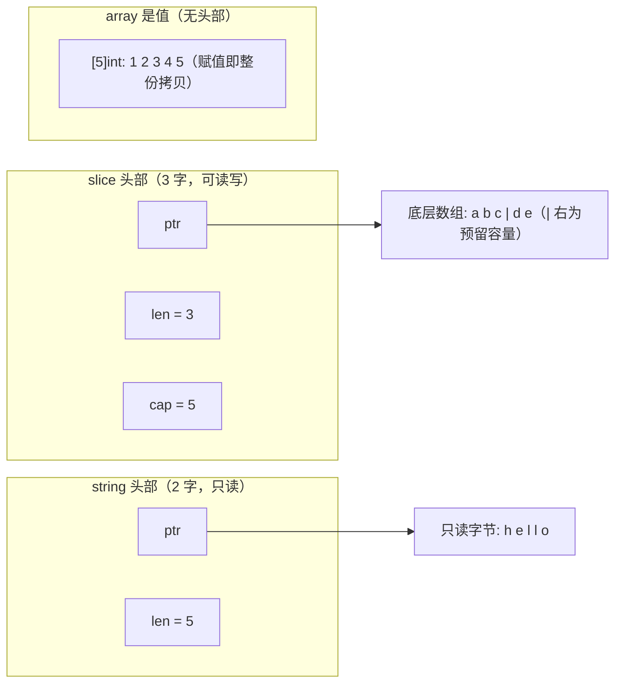

# 5.1 数组、切片与字符串

数组、切片、字符串是 Go 里最基础的三种序列类型。它们看起来相似，内存模型却各不相同，理解这点
能一举解释 append 的种种「惊喜」、切片别名的陷阱、以及字符串为何不可变。三者共享一个主题：
一个小小的**头部**描述一段连续的后备内存。差异全在头部里装了什么、谁拥有那段内存、以及它可不
可写。本节先把三种布局摆清楚，再从「动态数组」这一经典抽象出发，看 Go 的 `append` 如何在摊还
意义下做到 $O(1)$，最后落到别名、字符串转换与跨语言对照这些日常会撞上的角落。

## 5.1.1 三种内存布局

**数组是值。** `[5]int` 就是连续排布的 5 个 `int`，长度是类型的一部分：`[5]int` 与 `[6]int`
是两个不同的类型。赋值、传参、作为 struct 字段，数组都**整份拷贝**。正因如此，大数组在 Go 里
反而少用，传来传去太贵，真要传通常传它的切片或指针。

**切片是对某段底层数组的视图。** 运行时里它就是一个三字的头部，可对照 `runtime/slice.go`：

```go
// runtime: 切片的运行时表示（slice.go）
type slice struct {
    array unsafe.Pointer // 指向底层数组中本切片的首元素
    len   int            // 长度：可见元素个数
    cap   int            // 容量：从 array 起到底层数组末尾的元素个数
}
```

`len` 是你能索引到的范围，`cap` 是「在不重新分配的前提下还能涨到多大」。两者分离正是切片能做
「视图」的关键：`s[1:3]` 只是改头部里的三个字段，不碰底层数组。

**字符串是只读的字节序列。** 它的头部更省，只有两字，没有 `cap`：

```go
// runtime: 字符串的运行时表示（string.go）
type stringStruct struct {
    str unsafe.Pointer // 指向只读字节
    len int            // 字节数（不是 rune 数）
}
```

少掉的那个 `cap` 不是疏忽，而是设计：字符串**不可变**，长度一经确定不再增长，自然无需容量。
不可变换来三件好事：多个字符串可安全共享同一段底层字节，子串 `s[i:j]` 无需拷贝，字符串可直接
做 map 键而不必防御性复制。代价是任何「修改」都得生成新串。

把三者并排画出来，差异一目了然：



数组没有头部，它**就是**那段内存；切片和字符串则是「头部 + 别处的内存」。这一句话是后面所有
行为的根。

## 5.1.2 动态数组与摊还分析

切片是**动态数组**（dynamic array）的 Go 化身：一个会按需增长的连续数组。它给出的核心保证是，
尽管偶尔要重新分配并搬迁全部元素，连续 $n$ 次 `append` 的**摊还**（amortized）代价仍是均摊
$O(1)$。

直觉来自「成倍增长」。设每次容量满了就乘一个常数因子 $g>1$（最简单取 $g=2$，翻倍）。把 $n$
次 append 看成整体，真正昂贵的只有触发搬迁的那几次，且搬迁规模呈几何级数递减。从空到 $n$，各次
搬迁搬动的元素数约为 $\dots, n/4, n/2, n$，倒过来求和：

$$
\sum_{i=0}^{\infty} \frac{n}{2^i} = n + \frac{n}{2} + \frac{n}{4} + \cdots < 2n
$$

总搬迁成本被 $2n$ 封顶，再加上 $n$ 次「写入新元素」本身的 $O(n)$，$n$ 次 append 合计 $O(n)$，
**平摊到每次就是常数**。这是《算法导论》里摊还分析的范例，用聚合法（aggregate method）或势能法
（potential method）都能给出同样的界。

关键在于因子必须是**乘性**的。若改成「每次只多预留固定的 $c$ 个槽」，第 $k$ 次扩容要搬约 $kc$
个元素，总成本 $\sum kc = \Theta(n^2)$，平摊后每次退化成 $O(n)$。一个常数因子，区分了线性与
平方。乘性增长换来的均摊常数，代价是平均约 $g/2$ 倍的空间浪费（翻倍时最坏闲置接近一半），这正是
增长因子那场永恒的空间与时间之争（[5.1.6](#516-跨语言对照) 会看到各家给出的不同答案）。

## 5.1.3 append 的增长策略

理论上「乘个常数因子」就够了，工程上 Go 做得更细。核心在 `runtime.growslice`，它先用
`nextslicecap` 算出一个目标容量，再交给内存分配器对齐。先看算容量这一步（对照 go1.26 的
`runtime/slice.go`）：

```go
// runtime: 计算新容量（slice.go，节选注释）
func nextslicecap(newLen, oldCap int) int {
    newcap := oldCap
    doublecap := newcap + newcap
    if newLen > doublecap {
        return newLen          // 一次 append 太多，直接给到需要的长度
    }
    const threshold = 256
    if oldCap < threshold {
        return doublecap       // 小切片：翻倍
    }
    for {
        // 从 2x 平滑过渡到约 1.25x：大切片更看重省内存
        newcap += (newcap + 3*threshold) >> 2
        if uint(newcap) >= uint(newLen) {
            break
        }
    }
    return newcap
}
```

策略以 **256** 为界。旧容量小于 256 时翻倍，小切片增长激进，图的是少搬几次。到达或超过 256 后，
改用 `newcap += (newcap + 3*256) >> 2`，即每轮约增加 $\tfrac{1}{4}(\text{newcap} + 768)$。
当 `newcap` 还小时，那个 $\tfrac{3}{4}\cdot256$ 的常数项占比大，倍率接近 2；当 `newcap` 很大
时常数项可忽略，倍率趋于 $1 + \tfrac14 = 1.25$。于是得到一条**从 2 倍连续滑向 1.25 倍**的曲线，
比 Go 1.18 之前那种「1024 处从 2 倍硬跳到 1.25 倍」更圆润，避开了临界点附近的容量浪费。

算出的 `newcap` 还没完。`growslice` 接着把「`newcap × 元素大小`」交给 `roundupsize` 向上取整到
内存分配器的**尺寸类**（size class，见 [12 内存分配器](../../part4memory/ch12alloc)），再按对齐
后的字节数反推回元素个数：

```go
// runtime: growslice 中按尺寸类对齐（slice.go，以指针大小元素为例）
capmem = roundupsize(uintptr(newcap)*goarch.PtrSize, noscan)
newcap = int(capmem / goarch.PtrSize) // cap 被「撑大」到尺寸类边界
```

所以一个切片实际的 `cap` 常略大于你心算的值。它是「乘性增长 + 尺寸类对齐」两步合成的结果：
前者保证摊还 $O(1)$，后者顺手把分配器本就要浪费的那点边角料还给你。这解释了那个常见困惑,
**append 之后 `cap` 为什么偏偏是这个数**：不必去背，理解这两步即可。

## 5.1.4 别名与那些「惊喜」

切片是视图，多个切片可以共享同一段底层数组。这是性能的来源，也是 bug 的来源。

**`append` 可能共享、也可能不共享底层数组。** 这是最常被踩的一处。若 append 后没超出 `cap`，
返回的切片与原切片**共享**底层数组，对一方元素的写会穿透到另一方；一旦超出 `cap` 触发重新分配，
两者就此**分家**：

```go
a := make([]int, 3, 5) // len=3, cap=5
b := append(a, 1)      // 没超 cap：b 与 a 共享底层数组
b[0] = 99              // a[0] 也变成 99
c := append(b, 2, 3, 4) // 超过 cap=5：c 重新分配，与 a/b 脱钩
c[0] = 7               // a/b 不受影响
```

「有时共享、有时不共享」让函数边界变得危险：把一个切片传进函数，函数里 append 它，外面的切片
看不看得到改动，取决于当时的 `cap`。**完整切片表达式** `a[lo:hi:max]` 是治本的工具，它显式把新
切片的 `cap` 限到 `max`，于是下一次 append 必然超容、必然拷贝、必然切断别名：

```go
// 库函数返回内部缓冲的一段视图，又不愿被调用方借 append 篡改后续内存：
view := buf[off : off+n : off+n] // cap == len，调用方 append 即触发拷贝
```

**子切片导致的内存泄漏。** 切片头部只要活着，它指向的**整段**底层数组就回收不掉，哪怕你只用得着
开头十个元素：

```go
small := big[:10] // small 的 cap 仍覆盖 big 的整段底层数组
// 只要 small 可达，big 那块（可能很大）就一直被钉住
```

需要长期持有一小段时，应 `copy` 出独立副本，或用标准库的 `slices.Clone` 切断引用。Go 1.21 起的
`slices` 包把这些操作做成了显式、易读的形式，连「删除元素后把尾部清零以便 GC 回收」这种容易
漏掉的细节都替你照顾了：

```go
// slices.Delete 删除 [i,j) 后，会把空出来的尾部清零，避免悬挂引用钉住对象
func Delete[S ~[]E, E any](s S, i, j int) S {
    // ...
    s = append(s[:i], s[j:]...)
    clear(s[len(s):oldlen]) // 关键：零/置空淘汰的元素，利于 GC
    return s
}
```

手写 `s = append(s[:i], s[i+1:]...)` 删元素，少了这一句 `clear`，被「删掉」的指针仍留在底层
数组的尾部、仍被 GC 视为存活，又是一处隐蔽的泄漏。能用 `slices` 就别手写。

## 5.1.5 字符串与 []byte

字符串不可变带来一个直接代价：`string` 与 `[]byte` 互转默认要**拷贝一份字节**。原因正是不可变,
`[]byte` 可写，若让它直接指向某个字符串的底层字节，改 `[]byte` 就等于改了那个「不可变」的字符串，
破坏了一切共享假设。所以运行时老老实实 `memmove` 一份：

```go
// runtime: []byte → string（string.go，节选）
func slicebytetostring(buf *tmpBuf, ptr *byte, n int) string {
    // ...
    p := mallocgc(uintptr(n), nil, false) // 分配新内存
    memmove(p, unsafe.Pointer(ptr), uintptr(n)) // 拷贝字节
    return unsafe.String((*byte)(p), n)
}
```

这份拷贝在热路径上可能可观。好在编译器认得几类「转换后字节立刻被读、不可能被改」的模式，把拷贝
省掉。最常见的两个是用 `[]byte` 临时当 map 键查询，与对 `[]byte(s)` 直接 range：

```go
var m map[string]int
_ = m[string(b)]      // 编译器：临时 string 仅用于查 map，无需拷贝（走 slicebytetostringtmp）
for i, c := range []byte(s) { // 编译器：仅遍历，不持久化，无需真正建切片
    _, _ = i, c
}
```

要在自己代码里手动零拷贝转换，Go 1.20 给了正式工具：`unsafe.String(*byte, len)` 把一段字节当
字符串看，`unsafe.StringData(string) *byte` 取字符串底层指针，`unsafe.Slice` / `unsafe.SliceData`
是切片侧的对应物。它们取代了过去靠 `reflect.StringHeader` / `reflect.SliceHeader` 手工拼头部
的脆弱写法（那种写法在有 GC 移动与字段对齐变化时并不可靠）。代价是你要自己担保**转换之后那段
字节不再被修改**，否则就把不可变契约捅破了：

```go
// 零拷贝、且你能保证 b 此后只读时，才可这样转
s := unsafe.String(unsafe.SliceData(b), len(b))
```

## 5.1.6 跨语言对照

动态数组是普适抽象，C++ 的 `std::vector`、Rust 的 `Vec<T>`、Python 的 `list`、Java 的
`ArrayList`，本质都是摊还 $O(1)$ 的成倍增长数组。差异集中在两点：**增长因子**与**视图**。

增长因子是各家对那场空间与时间之争给出的不同答案。多数 C++ 标准库实现用 2 倍（libstdc++）或
1.5 倍（MSVC，1.5 倍的好处是历次释放的内存之和有机会复用为下一次分配）；Python 的 `list` 用约
1.125 倍，增长保守、稳态更省内存；Java 的 `ArrayList` 是 1.5 倍。Go 用 [5.1.3](#513-append-的增长策略)
那条从 2 滑向 1.25 的曲线。因子越小越省内存、搬迁越频繁，越大越少搬、越费内存，没有普适最优，
只有对各自典型负载的权衡。

视图维度上，Go 的切片与 Rust 的 `&[T]`（slice）是同一类东西：指向他人数组一段的「胖指针」
（ptr + len，Go 还多带个 cap），零拷贝引用子段，自己不拥有内存。而 `std::vector`、`Vec`、
`list`、`ArrayList` 是**拥有型**容器，它们持有并负责释放底层内存。C++ 直到 C++20 才把视图独立成
`std::span`，Rust 则从一开始就把「拥有的 `Vec`」与「借用的 `&[T]`」在类型层面分清，借助借用检查
器在编译期堵住别名写入。Go 选了另一条路：把「拥有的动态数组」（底层数组）与「视图」（切片）
统一成同一个切片类型，换来语言的简洁，代价正是 [5.1.4](#514-别名与那些惊喜) 那些别名陷阱。简洁
与安全之间，Go 这次把砝码放在了简洁一侧，并把别名的纪律交还给了程序员。

## 延伸阅读的文献

1. Thomas H. Cormen, Charles E. Leiserson, Ronald L. Rivest, Clifford Stein.
   *Introduction to Algorithms*, 4th ed., MIT Press, 2022. 第 16 章「摊还分析」与动态表的
   成倍扩张（table doubling），本节摊还界的来源。
2. The Go Authors. *runtime/slice.go：`growslice` / `nextslicecap`*（go1.26 增长策略）.
   https://github.com/golang/go/blob/master/src/runtime/slice.go
3. The Go Authors. *runtime/string.go：`slicebytetostring` / `stringStruct`*（字符串布局与转换）.
   https://github.com/golang/go/blob/master/src/runtime/string.go
4. Andrew Gerrand. *Go Slices: usage and internals.* The Go Blog, 2011.
   https://go.dev/blog/slices-intro
5. Rob Pike. *Arrays, slices (and strings): The mechanics of 'append'.* The Go Blog, 2013.
   https://go.dev/blog/slices
6. The Go Authors. *Go 1.20 Release Notes*（`unsafe.String` / `unsafe.StringData` /
   `unsafe.SliceData`）. https://go.dev/doc/go1.20 ；*`slices` 包文档*（Go 1.21，`Clone` /
   `Delete` / `Insert` / `Grow`）. https://pkg.go.dev/slices
7. The Go Authors. *Go specification: Slice expressions*（含完整切片表达式 `a[lo:hi:max]`）.
   https://go.dev/ref/spec#Slice_expressions

## 许可

&copy; 2018-2026 The [golang.design](https://golang.design) Initiative Authors. Licensed under [CC-BY-NC-ND 4.0](https://creativecommons.org/licenses/by-nc-nd/4.0/).
