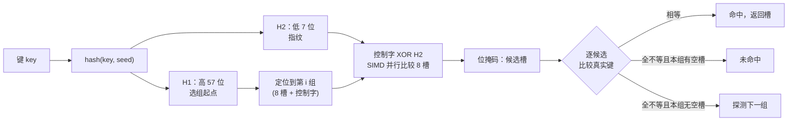
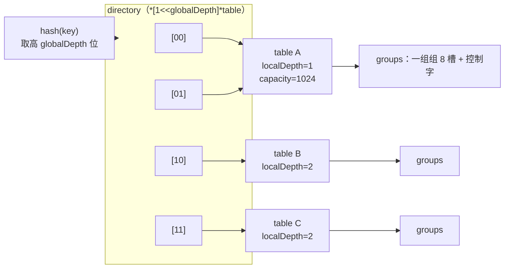

# 5.4 Swiss Table 与 Go 1.24 实现

[5.3](./map.md) 讲清了散列表的一般原理与攻防：两条碰撞处理路线，以及哈希洪水的防御。本节落到
Go 自己的两代实现，先剖开 Swiss Table 这一现代开放定址设计，再看 Go 1.24 如何把它落地、为此
取代了什么，以及由实现倒推出的两条语言规则，最后把 Go 放进各家散列表的更大图景里对照。

## 5.4.1 Swiss Table 设计（abseil）

Swiss Table 由 Google 的 abseil 团队提出，Kulukundis 在 CppCon 2017 上公开。它是开放定址法的
现代化身，核心创新是把「哪个槽是空的、哪个槽该比较」这件事，从逐槽试探变成一次并行操作。

它把哈希值劈成两段：高 57 位 **H1** 决定从哪一组（group）开始探测，低 7 位 **H2** 作为该键的
「指纹」。槽位以 8 个为一组排列，每组配一个 8 字节的**控制字**（control word），其中每个控制
字节对应组内一个槽：

```
空槽    empty    1000 0000   （0x80）
墓碑    deleted  1111 1110   （0xfe）
占用    full     0hhh hhhh   （最高位 0，低 7 位即该键的 H2 指纹）
```

最高位区分「空/墓碑」与「占用」，占用槽的低 7 位直接存指纹。查找一个键时，先算 H1 定位到起始
组，再拿 H2 与整组 8 个控制字节并行比较：在支持 SIMD 的机器上，这是一条 `PCMPEQB` 指令（16
字节甚至能比 16 个槽），一步完成本应 8 步的探测。比较结果是一个位掩码，标出哪些槽的指纹匹配；
逐个核对这些候选槽的真实键即可。指纹只有 7 位，约 $1/128 \approx 0.7\%$ 的概率假阳性，但既然
匹配后总要做一次完整键比较，假阳性只是偶尔多比一次，不影响正确性。



控制字还让另外两个高频判断同样退化成一次位运算：「本组有没有空槽」（`matchEmpty`，决定探测
何时停止）、「哪些槽空或被删」（`matchEmptyOrDeleted`，插入时找落脚点）。这些都是对 8 字节控制
字的 SWAR（SIMD Within A Register）技巧，即便在没有向量指令的平台上，也只是几条普通的整数
加减与位运算。

## 5.4.2 Go 1.24 的 Swiss Table 重写

### 经典桶式设计（1.0 至 1.23）

要理解重写，先看它取代了什么。Go 自 1.0 起用的是一种桶式（bucketed）链地址法。顶层是 `hmap`，
持有 $2^B$ 个桶组成的数组；每个桶 `bmap` 存 8 个键值对，外加 8 个 `tophash`（哈希高 8 位，
充当指纹以加速跳过不匹配槽）；同一桶装满后挂一个溢出桶（overflow bucket），碰撞由溢出链承接。

```go
// runtime/map.go（go1.23）：经典桶式 map 的顶层结构（速写）
type hmap struct {
	count     int            // 元素数，len() 直接读它
	B         uint8          // 桶数 = 2^B
	hash0     uint32         // 哈希种子
	buckets    unsafe.Pointer // 2^B 个桶的数组
	oldbuckets unsafe.Pointer // 扩容时的旧桶数组，渐进搬迁的来源
	nevacuate  uintptr        // 搬迁进度：下标小于它的旧桶已迁完
	extra     *mapextra       // 溢出桶簿记等
}

type bmap struct {
	tophash [8]uint8 // 每槽哈希高 8 位，兼作搬迁状态标记
	// 紧随其后是 8 个 key、8 个 elem，最后是 *overflow 指针（由编译器按类型排布）
}
```

它的装填因子上限是 $6.5/8 \approx 0.81$（源码以 `loadFactorNum/loadFactorDen` 即 $13/2$ 表示，
对 8 槽桶即「平均每桶 6.5 个」）。一旦超过就翻倍扩容，并采用**渐进式搬迁**：不一次性重排全部
元素，而是把旧桶数组留在 `oldbuckets`，每次写操作顺手迁移一两个桶，把扩容成本摊到后续操作里，
避免单次插入的长暂停。这套设计稳健服役了十四年，痛点也清楚：键值与指纹分离存放，比较时先扫
`tophash` 再跳到键，访存不连续；溢出链在高负载下退化；以及链表式的溢出桶对缓存不友好。

### Swiss Table 的落地：从一张表到一个目录

Go 1.24 的新实现位于 `internal/runtime/maps`，照搬了 abseil 的控制字与并行探测，又针对 Go 的
两条额外要求做了改造：一是要支持像旧版那样的渐进式扩容，避免大 `map` 扩容时的长暂停；二是
`map` 本身要能被 GC 精确扫描。难点在于，开放定址法的探测序列依赖组数，一旦组数翻倍，全表所有
元素都得按新序列重排,这与「渐进」天然冲突。abseil 原版整表扩容，Go 不能照抄。

Go 的解法是**可扩展哈希**（extendible hashing）：把一个大 `map` 拆成多张独立的 `table`，每张
table 是一张完整的小 Swiss Table，只服务哈希空间的一个子段；顶层 `Map` 持有一个指向这些 table
的**目录**（directory）。哈希的最高 `globalDepth` 位作为目录下标，选出该键所属的 table。

```go
// internal/runtime/maps/map.go：顶层 Map（速写）
type Map struct {
	used    uint64        // 元素总数，len() 直接读它
	seed    uintptr       // 本 map 私有的哈希种子（见 5.3.2）

	dirPtr  unsafe.Pointer // 目录：*[1<<globalDepth]*table 的数组
	dirLen  int            // 目录长度；小 map 优化时为 0，dirPtr 直指单个 group

	globalDepth uint8      // 目录下标用哈希的高几位
	globalShift uint8      // = 64 - globalDepth，移位取下标用

	writing uint8          // 写入中标志，并发写检测靠它（见 5.4.3）
	tombstonePossible bool // 是否可能存在墓碑，无墓碑可走快路径
	clearSeq uint64        // Clear 计数，遍历中检测 clear
}
```

每张 table 自带容量与装填上限，独立扩容：

```go
// internal/runtime/maps/table.go：单张 Swiss 表（速写）
type table struct {
	used       uint16 // 本表元素数
	capacity   uint16 // 槽位总数，恒为 2^N
	growthLeft uint16 // 还能填几个槽才需 rehash（含墓碑计入）
	localDepth uint8  // 本表在目录中占用的高位数，可小于 globalDepth
	index      int    // 在目录中的首个下标；-1 表示已失效

	groups groupsReference // 一组组 8 槽 + 控制字的连续数组
}
```

关键常量：每组 `MapGroupSlots = 8` 个槽，装填上限 `maxAvgGroupLoad = 7`，即每组 8 槽最多填 7
个，留一个空槽保证探测序列总能终止（开放定址法的不变量：表永不 100% 填满）。单张 table 的容量
上限 `maxTableCapacity = 1024`，这正是「渐进」的旋钮所在：

- table 容量未达 1024 时，扩容就是把这张表换成一张双倍容量的新表，整表重排,但表小，代价有界。
- 一旦达到 1024 还需扩容，便不再翻倍，而是把这张表**分裂**（split）成两张，各承接原哈希子段的
  一半。分裂时 `globalDepth` 视需要加一、目录翻倍，于是单次扩容触及的元素永远不超过 1024 个，
  大 `map` 的扩容成本被自然摊开。

目录允许多个下标指向同一张 table（当某表的 `localDepth` 小于 `globalDepth` 时），这样目录翻倍
并不强制每张表都立即分裂,只有真正满了的表才分裂。这套结构以可扩展哈希的弹性，换来了开放定址法
所缺的渐进扩容能力。把这三层画出来，目录共享与分裂的关系便清晰了：



A 表的 `localDepth=1` 小于 `globalDepth=2`，于是目录前两项 `[00]`、`[01]` 共享它,只有当 A 真正
填满需要分裂时，才会拆成两张并把 `localDepth` 提到 2。

### 探测序列：三角数与「恰好覆盖」

新版的探测序列写法极简，却暗含一条要紧的数学不变量：

```go
// internal/runtime/maps/table.go：探测序列（速写）
func makeProbeSeq(hash uintptr, mask uint64) probeSeq {
	return probeSeq{mask: mask, offset: uint64(hash) & mask, index: 0}
}
func (s probeSeq) next() probeSeq {
	s.index++
	s.offset = (s.offset + s.index) & s.mask // offset += 1,2,3,...
}
```

每步把递增的 `index` 累加到 `offset`，于是从起点算起的偏移依次是 $0, 1, 3, 6, 10, 15, \dots$，
即三角数 $T_k = \frac{k(k+1)}{2}$。源码与 abseil 都称之为「二次探测」，因为 $T_k$ 是 $k$ 的二次
多项式，两个名字指的是同一序列。它之所以可用，靠的是一条数论事实：当组数为 $2^n$ 时，
$T_k \bmod 2^n$ 在 $k = 0, 1, \dots, 2^n - 1$ 上恰好取遍全部余数，即探测序列不重不漏地走遍每一组。
这正是「组数必须是 2 的幂」这条探测不变量的来由,少了它，探测可能在还有空槽时就开始绕圈，
查找会错判为未命中。

### 控制字的并行匹配

查找的内层就是 [5.4.1](#541-swiss-table-设计abseil) 描述的并行匹配。`matchH2` 是其核心，amd64
上由编译器替换成 SIMD 内建函数，其余平台走 SWAR 软件实现：

```go
// internal/runtime/maps/group.go：H2 并行匹配的可移植实现（速写）
const (
	ctrlEmpty   ctrl = 0b10000000 // 0x80
	ctrlDeleted ctrl = 0b11111110 // 0xfe，墓碑
	bitsetLSB        = 0x0101010101010101
	bitsetMSB        = 0x8080808080808080
)

func ctrlGroupMatchH2(g ctrlGroup, h uintptr) bitset {
	// 把 8 个控制字节同时异或上 H2：相等的字节变成全 0
	v := uint64(g) ^ (bitsetLSB * uint64(h))
	// 经典 SWAR：哪些字节为 0，就在该字节最高位置 1
	return bitset(((v - bitsetLSB) &^ v) & bitsetMSB)
}
```

查找循环据此展开：定位起始组，`matchH2` 拿到候选位掩码，逐位核对真实键；若组内有空槽
（`matchEmpty` 非零）则探测终止、返回未命中；否则 `next()` 到下一组。删除则要小心：从一个已满
的组里删键，不能直接标空,否则探测序列会在此提前断开，让后续本该被找到的键变成「找不到」。
此时该槽改标为 `ctrlDeleted` 墓碑，探测会越过它继续；只有当组内尚有空槽时，删除才可直接标空。
墓碑平时只增不减，统一在扩容重排时清除，以免就地清理打乱正在进行的遍历。

### 小 map 优化与一处工程提醒

当一个 `map` 自始至终不超过 8 个元素时，它整张表恰好就是一个 group，运行时索性省掉目录与 table
两层间接，让 `dirPtr` 直指这唯一的 group（此时 `dirLen == 0`）。绝大多数 `map` 都很小，这条优化
免去了小 `map` 的目录开销。

需要给读者一处提醒：Go 1.24 的发布说明把性能收益表述为「在一组代表性基准上，运行时的若干改进
使 CPU 开销平均降低 2~3%」，而这 2~3% 是 Swiss Table、更高效的小对象分配、新的运行时内部互斥锁
三项改动**合计**的结果，并非 `map` 一项独得，具体到 `map` 还因键类型、负载、访问模式而异。在
1.24 中，可用 `GOEXPERIMENT=noswissmap` 在构建期退回旧实现（该开关于后续版本随旧实现移除而
退役）。把这次重写理解为「一笔会随工作负载浮动的整体收益」，比记住一个具体百分比更贴近事实。

## 5.4.3 两条语言规则的由来

`map` 的两条常被问及的语言规则，其实都是上述实现的直接后果。

**`&m[k]` 不可取址。** Go 规范禁止对 map 元素取地址。原因在实现里一目了然：无论旧版的搬迁还是
新版的扩容与分裂，元素都会在内存中被移动，先前取得的指针随即悬空。语言索性在编译期就禁止取址，
把一个本会在运行时酿成内存安全事故的操作，挡在了门外。要修改一个 struct 类型的元素，只能整体
读出、改完再整体写回。

**并发读写直接致命。** 对同一 `map` 并发地读写或写写，不是数据竞争那样「结果未定义」，而是运行时
主动 `fatal("concurrent map ...")` 终止进程。检测靠 `Map.writing` 这个标志：每个写操作进入时把它
**异或翻转**（`writing ^= 1`），完成时再翻转回去。

```go
// internal/runtime/maps/map.go：写操作的并发检测（速写）
func (m *Map) PutSlot(...) unsafe.Pointer {
	if m.writing != 0 {
		fatal("concurrent map writes") // 进门发现已有写者，立即终止
	}
	m.writing ^= 1 // 翻转，标记自己正在写
	// ... 真正的插入 ...
	if m.writing == 0 {
		fatal("concurrent map writes") // 出门发现标志被别人动过
	}
	m.writing ^= 1 // 翻回
}
```

读操作则只检查、不修改这个标志：进门若发现 `writing != 0`，说明有写者在场，立即终止。用异或
而非简单置 1，是一个刻意的概率设计：若两个 writer 同时闯入，两次翻转可能让标志回到 0，使「出门
检查」一方察觉异常的概率更高。这是一种**尽力而为**（best-effort）的检测，不加锁、不保证必然
抓到每一次竞争，只在几乎零成本的前提下，把绝大多数误用尽早暴露成清晰的崩溃，而非埋成一个日后
难查的诡异 bug。要在多 goroutine 间共享 `map`，仍须由使用者用 `sync.Mutex` 或 `sync.RWMutex`
自行保护，或改用 `sync.Map`（[11](../../part3concurrency/ch11sync)）。

## 5.4.4 别家的散列表

把 Go 的两代设计放进更大的图景，能看清哪些是共识、哪些是取舍。

| 语言 / 库 | 设计 | 碰撞处理 | 要点 |
|---|---|---|---|
| Go ≥ 1.24 | Swiss Table + 可扩展哈希目录 | 开放定址，二次探测 | 控制字并行探测；目录分裂实现渐进扩容 |
| Rust `HashMap` | hashbrown（Swiss Table 移植） | 开放定址，SIMD 组探测 | 标准库直接采用 abseil 设计，默认 SipHash 抗洪水 |
| C++ `absl::flat_hash_map` | Swiss Table 原版 | 开放定址，SIMD 组探测 | 键值内联连续存储，缓存友好 |
| C++ `std::unordered_map` | 链地址 | 桶 + 链表 | 标准规定了节点稳定性与桶接口，锁死了实现，无法换成开放定址 |
| Java `HashMap` | 链地址 + 红黑树化 | 链表，超阈值转树 | 单桶冲突过 8 个即 treeify，把最坏 $O(n)$ 压到 $O(\log n)$（JEP 180） |
| Python `dict` | 紧凑开放定址 | 扰动探测 + 索引表 | 紧凑数组保插入序，索引与数据分离省内存 |

值得点出的对照有两处。其一，`std::unordered_map` 是「标准把实现钉死」的反面教材：C++ 标准要求
桶接口与元素引用在 rehash 间稳定，这等于强制链地址法，使它无法享受 Swiss Table 的缓存收益,
这也正是 abseil 另起 `flat_hash_map` 的原因。Go 没有这层包袱，`map` 的内存布局从不进入语言契约，
于是能在 1.24 整体换血而不破坏任何用户代码。其二，Rust 标准库直接吸纳 hashbrown，与 Go 各自独立
地走向同一个 abseil 设计，是 Swiss Table 成为现代开放定址事实标准的有力旁证。

性能的提升从不白来。Swiss Table 用控制字的额外空间、SIMD/SWAR 的实现复杂度、可扩展哈希的目录
间接，换来了高装填因子下仍连续、仍可并行探测的查找。Go 把这笔复杂度连同渐进扩容、GC 扫描、并发
检测一并咽下，只为给上层留一个依旧朴素的 `m[k]`。这正是运行时存在的意义：把复杂藏在用户看不见的
地方。

## 延伸阅读的文献

- [Kulukundis, M. "Designing a Fast, Efficient, Cache-friendly Hash Table, Step by Step." *CppCon*, 2017.](https://www.youtube.com/watch?v=ncHmEUmJZf4) Swiss Table 设计的公开讲解；另见 [abseil swisstables 设计文档](https://abseil.io/about/design/swisstables)。
- [golang/go#54766: "runtime: use Swiss Tables for maps."](https://github.com/golang/go/issues/54766) Go 采用 Swiss Table 的提案与讨论；落地见 [Go 1.24 Release Notes](https://go.dev/doc/go1.24)。
- [internal/runtime/maps 顶层注释：可扩展哈希、目录与分裂的权威说明。Go source tree, 2024.](https://github.com/golang/go/blob/master/src/internal/runtime/maps/map.go) 新实现的设计文档即写在源码注释里。
- [JEP 180: Handle Frequent HashMap Collisions with Balanced Trees. OpenJDK, 2014.](https://openjdk.org/jeps/180) Java `HashMap` 的链表树化方案，对照另一条最坏情况防御路线。
