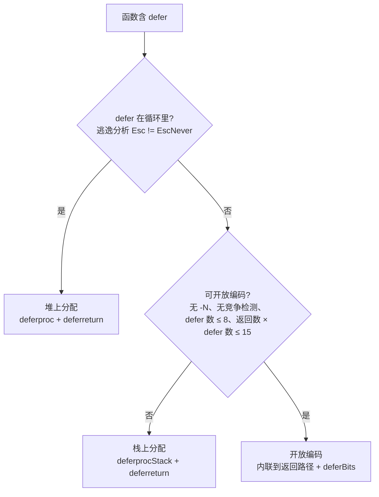

# 6.2 延迟语句

延迟语句 `defer` 在最早期的 Go 设计中并不存在，是后来才单独增补的特性，由 Robert Griesemer
完成语言规范的编写 [Griesemer, 2009]，Ken Thompson 完成最早期的实现 [Thompson, 2009]。
它的语义读起来很短：被 `defer` 的调用会在外层函数返回、发生 panic、或调用 `runtime.Goexit`
时执行。直觉上这像是一个纯编译期特性，类似 C++ 的 RAII（离开作用域自动析构），编译器似乎只需把
延迟的调用「搬」到函数末尾即可，不该有运行时开销。

真实情况要复杂一层。Go 的 `defer` 没有与某个资源的作用域绑定，还允许出现在条件、循环里，于是
它不再是一个静态的作用域概念。一段执行次数取决于运行时的循环，能产生多少个延迟调用在编译期无法
确定：

```go
func randomDefers() {
	for rand.Intn(100) > 42 {
		defer println("golang-design/under-the-hood") // 次数运行时才定
	}
}
```

正因为存在这种不确定性，`defer` 不是免费的午餐。本节先讲清它的语义，再沿着一条贯穿十余年的
性能演进主线，看它如何从「最慢时被劝退出热路径」一路优化到「几乎零成本」。这条主线的终点，也是
理解 [6.3 恐慌与恢复](./panic.md) 的钥匙：在今天的运行时里，正常返回时跑 `defer` 与 panic 展开
时跑 `defer`，走的是同一套机器。

## 6.2.1 语义：LIFO、返回与 panic 都触发、参数在 defer 处求值

`defer` 的可观察语义有三条，记住它们就能解释绝大多数「为什么是这个结果」的疑惑。

第一，**后进先出**。同一函数内多个 `defer` 以逆序执行,这让「打开 A、打开 B」与「关闭 B、关闭 A」
天然对称，正是资源清理想要的顺序。

第二，**返回路径与异常路径都会触发**。无论函数是正常 `return`、还是中途 panic 在向上展开，
登记过的 `defer` 都会被执行。这是 `defer` 能用来做「无论如何都要释放」的清理、以及在
[6.3](./panic.md) 里用 `recover` 拦截 panic 的根基。

第三，**参数在 `defer` 语句处求值，调用被推迟**。被延迟的函数及其实参在写下 `defer` 的那一刻就
确定下来，真正的调用推迟到函数末尾。这条最容易踩坑：

```go
func trace() {
	i := 0
	defer fmt.Println(i) // 此刻 i==0，打印 0，而非后来的 1
	i++
}
```

这不是实现的妥协，而是有意为之的语义。设想 `f, _ := os.Open(...)` 后立刻 `defer f.Close()`，
若参数延后到末尾才求值，中途对 `f` 的重新赋值就会让你关错文件。在求值时机上「就地」，才符合
读者写下这行时的意图。

值得点出的是这条语义的**实现机制**在近年发生了变化，但语义本身始终不变。早期实现把实参 `memmove`
进一条延迟记录里保存；自 go1.18 起，编译器把被延迟的调用连同它当时的实参一起打包成一个无参闭包
`func()`，求值发生在闭包被构造的瞬间，运行时只需在末尾调用这个闭包。语义
没动，记录里却从此不再需要保存参数，这为后文的结构简化埋下了伏笔。

## 6.2.2 三代实现：从堆分配到几乎零成本

`defer` 的开销几乎全部来自一个问题：那条「要执行哪些延迟调用」的记录，存在哪、何时分配、怎么找
回来执行。围绕这个问题，Go 给出了三代答案。它们不是简单的新旧替换,**三者今天同时存在**，编译器
按调用点的形态择优选用。先看一段被延迟函数的内核数据结构,今天的 `_defer` 已经相当精简：

```go
// runtime/runtime2.go：被延迟调用的记录（裁剪后的速写）
type _defer struct {
	heap bool    // 记录本身在堆上还是栈上
	sp   uintptr // 登记 defer 时的 SP，用来认出「是哪一帧的 defer」
	pc   uintptr // 登记 defer 时的 PC
	fn   func()  // 被延迟的调用（已含捕获的实参）；开放编码时为 nil
	link *_defer // 串成挂在 Goroutine 上的链表，指向下一个待执行的 defer
}
// runtime/runtime2.go
type g struct {
	// ...
	_defer *_defer // 本 Goroutine 的延迟调用链表头
}
```

对照本节开头的源码可以发现，今天的 `_defer` 里既没有参数大小 `siz`、也没有参数缓冲区,实参全在
`fn` 这个闭包里。一个函数登记的多个 `_defer` 通过 `link` 串成链表，挂在当前 Goroutine 的 `g._defer`
上，越晚登记的越靠前，自然实现了 LIFO。

### 第一代：堆上分配（`deferproc`）

最朴素的做法：每遇到一个 `defer`，就在运行时向堆要一块 `_defer`，填好 `fn`/`pc`/`sp`，挂到
`g._defer` 链表头。编译器把 `defer expr` 翻译成一个 `deferproc` 调用，并在函数末尾插入
`deferreturn`。这条路径需要最多的运行时支持,登记发生在循环里、或延迟数量太多无法被更高阶优化
吃下时，只能落到这里。

```go
// runtime/panic.go：登记一个堆上的延迟调用（速写）
func deferproc(fn func()) {
	gp := getg()
	d := newdefer()       // 从 per-P 资源池取，池空则向堆分配
	d.link = gp._defer    // 挂到 Goroutine 的延迟链表头
	gp._defer = d
	d.fn = fn             // 实参已被闭包捕获，无需再拷贝
	d.pc = sys.GetCallerPC()
	d.sp = sys.GetCallerSP()
}
```

`newdefer` 不会每次都走 `mallocgc`,它优先从每个 P 的本地 `deferpool` 复用，本地空了再从全局池
批发一半过来，思路与内存分配器的多级缓存（[12.2](../../part4memory/ch12alloc/component.md)）
一脉相承。即便如此，堆分配这代仍是三代里最慢的：登记要碰资源池、归还要回收，最坏还可能触发栈增长
甚至抢占。这正是早年间「热路径里别用 defer」那条建议的由来。

### 第二代：栈上分配（`deferprocStack`，go1.13）

既然 `_defer` 的生命周期不超过它所在的函数帧，何不把记录直接放在栈上？go1.13 落地了这一优化
[Randall, 2013]：当逃逸分析判定某个 `defer` 不会逃逸（不在循环里），编译器就在当前函数帧上预留好
`_defer` 的空间，运行时只需把它初始化、挂上链表，函数返回时随帧一起释放，免去了分配与回收。

```go
// runtime/panic.go：初始化一个栈上的 _defer（速写）
func deferprocStack(d *_defer) {
	gp := getg()
	d.heap = false        // 标记为栈上，deferreturn 末尾无需归还内存
	d.sp = sys.GetCallerSP()
	d.pc = sys.GetCallerPC()
	d.link = gp._defer    // 仍要挂链表，deferreturn 才找得到它
	gp._defer = d
}
```

记录的空间由编译器在栈帧里准备，`deferprocStack` 只承担初始化。这一代把常见简单场景的 `defer`
开销砍掉约 30%,但它仍然要维护链表、仍要在函数末尾走一趟 `deferreturn`，离「零成本」还有距离。

### 第三代：开放编码（open-coded defer，go1.14）

go1.14 引入的开放编码式 defer [Scales, 2019] 才真正逼近零成本。它的想法回到了最初的直觉：既然多数
函数里的 `defer` 数量、位置在编译期就能看清，那就别经过运行时,编译器直接把被延迟的调用**内联**到
每个返回路径的前面，连 `_defer` 记录都不建（此时 `fn` 字段为 `nil`）。一段加锁解锁的常见写法：

```go
var mu sync.Mutex
func f() {
	mu.Lock()
	defer mu.Unlock()
}
```

编译后既没有 `deferproc`/`deferprocStack`，也没有 `deferreturn`,`mu.Unlock()` 被直接铺在
`RET` 之前，与手写一行 `mu.Unlock()` 几乎无异。proposal 给出的基准里，这类 `defer` 相对直接调用
的额外开销降到约 1 ns，不足一个时钟周期，可视作几乎没有开销 [Scales, 2019]。

难点在于条件分支。若某个 `defer` 藏在运行时才能确定的 `if` 里，内联到末尾的那段清理代码怎么知道
该不该执行？Go 的答案是一个 8 位的**延迟比特**（`deferBits`）位图，思路朴素而巧妙：每个开放编码的
`defer` 占一位，登记时把对应位置 1，末尾按位倒序检查、命中才调用。

```go
// 伪代码：开放编码 defer 的展开
deferBits := uint8(0)         // 00000000
deferBits |= 1 << 0           // 遇到第一个 defer，置位 -> 00000001
_f0 := f0                     // 连同实参一并保存到栈槽
if cond {
	deferBits |= 1 << 1       // 第二个 defer 命中 -> 00000011
	_f1 := f1
}
// ... 函数体 ...
exit:                          // 倒序检查，命中才调用
if deferBits & (1 << 1) != 0 { // 00000011 & 00000010 != 0 -> 调用 f1
	deferBits &^= 1 << 1
	_f1()
}
if deferBits & (1 << 0) != 0 { // -> 调用 f0
	deferBits &^= 1 << 0
	_f0()
}
```

可见开放编码并非绝对零成本：仍要为参数留栈槽并就地求值，条件 `defer` 还要付一点位运算。但相比
分配与链表，这点指令开销可以忽略。`deferBits` 用一个字节，这也直接解释了「最多 8 个开放编码
defer」这条上限,一个字节只有 8 位。

### 编译器如何在三代间选择

三代实现共存，编译器在 SSA 构建阶段（`ssagen`）为每个函数挑选。先看一条硬分界：只要 `defer`
出现在循环里（逃逸分析将其标为 `Esc != EscNever`），记录数量无法静态确定，就只能堆上分配。其余
情况默认尝试开放编码，当任一条件破坏了「编译期可静态展开」的前提时，退回到栈上分配。



几条阈值都有具体来历：`maxOpenDefers = 8` 卡住 `deferBits` 的位宽；`返回数 × defer 数 > 15` 是
一条经验剪枝,开放编码要在每个返回点重复铺设清理代码，返回点多、defer 多时代码膨胀得不偿失，
而开放编码本就是为「小函数」准备的优化（源码注释如是说）。这两条以及 `-N`、竞争检测、共享库等
场景会禁用开放编码，但只要不在循环里，记录仍能放在栈上,真正把 `defer` 打回堆上分配的，只有
「出现在循环里」这一条。竞争检测、共享库等特殊场景与日常生产关系不大，此处略去。

## 6.2.3 `deferreturn` 与 panic：同一套展开机器

前两代实现把 `defer` 串在 `g._defer` 链表上，第三代干脆不进链表。这带来一个必须回答的问题：当
panic 沿栈向上展开、要在每一帧执行该帧登记过的 `defer` 时，开放编码的 `defer` 没有记录、不在链表
里，**panic 怎么找到它们？**

答案是编译器为含开放编码 defer 的函数附带一份 `FUNCDATA_OpenCodedDeferInfo` 元数据,记录
`deferBits` 在栈上的位置、以及每个延迟调用的函数与参数槽位。panic 展开到这样一帧时，读出这份
funcdata 与运行时的 `deferBits`，就能精确地补跑那些「本该在正常返回路径上执行、却被 panic 打断」
的延迟调用。换句话说，开放编码省掉了 `_defer` 记录，却付出了「必须让这一帧对 panic 仍然可走查」
的代价。这是这代优化最隐蔽的一笔账。

自 go1.22 起，这套机制被进一步统一 [Cox, 2023]。今天的 `deferreturn` 不再用早年那套 `jmpdefer`
模拟尾递归的技巧，而是直接构造一个标记了 `deferreturn` 的 `_panic`，复用与真正 panic 完全相同的
展开循环：

```go
// runtime/panic.go：正常返回路径，复用 panic 的展开循环（速写）
func deferreturn() {
	var p _panic
	p.deferreturn = true
	p.start(sys.GetCallerPC(), unsafe.Pointer(sys.GetCallerSP()))
	for {
		fn, ok := p.nextDefer() // 链表上的 _defer 与开放编码的 defer 都由它产出
		if !ok {
			break
		}
		fn() // 若 fn 内部 recover，nextDefer 下次会感知到并停止展开
	}
}
```

`nextDefer` 是这套机器的核心：它既会顺着 `g._defer` 链表取出堆上、栈上的延迟调用，也会借助
funcdata 取出开放编码的延迟调用，对调用方屏蔽了三代实现的差异。`runtime.Goexit` 走的也是这同一个
循环。于是「正常返回跑 defer」「panic 展开跑 defer」「Goexit 跑 defer」在 go1.22 后收敛成了一份
代码,这正是 [6.3 恐慌与恢复](./panic.md) 里 `recover` 能在 `defer` 中拦截 panic 的实现底座，留待
那一节展开。

## 6.2.4 别家的确定性清理：RAII、try-finally、with、Drop

把 `defer` 放到跨语言的谱系里看，它解决的是同一个普遍问题：**如何保证「无论从哪条路径离开，清理
都会发生」**。各家的取舍不同。

C++ 的 **RAII** 把清理绑定到对象生命周期,析构函数在对象离开作用域时由编译器确定性地调用，
是纯编译期、零运行时记账的方案，代价是清理必须依附于某个类型，无法像 `defer` 那样把任意一段逻辑
就地登记。Rust 的 **`Drop`** 沿用了 RAII 的思路，并由所有权系统在编译期算清释放时机，确定性更强。
Java 的 **try-finally**（及 try-with-resources）和 Python 的 **`with`**（上下文管理器）则把清理
显式包在语法块里，作用域清晰，但嵌套多个资源时容易缩进成一座金字塔。

Go 选了另一条路：`defer` 不与类型绑定、不需要额外的块缩进，任何一行都能就地登记一段清理，写
`open` 的旁边就能写 `defer close`，可读性极好。代价正是本节的全部内容,因为它脱离了静态作用域、
允许出现在条件与循环里，编译器无法总在编译期把它化解为 RAII 那样的零成本调用，才需要运行时的
参与，也才有了这三代为把开销逼回零而做的努力。便利从不白来，它把成本搬到了编译器与运行时去偿还。

也正因为这三代优化，那条流传已久的「热路径里别用 defer」的经验已经过期。它在堆分配时代是对的，
但开放编码落地后，小函数里的 `defer` 与手写清理几乎无差别。性能经验是有保质期的,在为某个版本调优
之前，先确认你脑中的成本模型还成不成立。

## 6.2.5 演进小结

`defer` 十余年的优化，是一条「把运行时记账逐步搬回编译期」的主线：

| 版本 | 内容 | 作者 |
|:----|:-----|:----|
| 1.0 及之前 | 制定语言规范，首次实现，堆上分配 | Robert Griesemer, Ken Thompson |
| 1.1 | defer 的分配与释放改为 per-G 批量处理 | Russ Cox |
| 1.3 | 改为 per-P 资源池分配，契合工作窃取调度 | Dmitry Vyukov |
| 1.8 | 执行过程切到系统栈，阻止抢占与栈增长开销 | Austin Clements |
| 1.13 | 实现栈上分配，消除常见简单情况的堆分配（约 -30%） | Keith Randall |
| 1.14 | 开放编码 defer，内联到返回路径，近乎零成本 | Dan Scales |
| 1.18 | 实参由闭包捕获，`_defer` 不再保存参数，`deferproc` 失去参数 | Keith Randall 等 |
| 1.22 | 统一 `deferreturn` 与 panic 展开，复用 `nextDefer` 循环 | Russ Cox |

三代实现的取舍可以一句话各自概括：开放编码以「少量栈槽 + 位运算」换近乎零开销，是小函数的首选；
栈上分配以「初始化记录 + 维护链表」换免堆分配，是不能开放编码时的退路；堆上分配以「资源池 +
链表 + 末尾归还」兜底循环、超量等动态场景，开销最大但最通用。理解了这条选择链，再看 [6.3](./panic.md)
里 panic 如何顺着同一条链与同一份 funcdata 展开，便是水到渠成。

## 延伸阅读的文献

1. [Scales, 2019] Dan Scales, Keith Randall, Austin Clements. *Proposal: Low-cost defers through
   inline code, and extra funcdata to manage the panic case.* Sep 2019.
   https://go.googlesource.com/proposal/+/refs/heads/master/design/34481-opencoded-defers.md
2. The Go Authors. *Go 1.13 Release Notes（栈上分配 defer 的性能改进）.*
   https://go.dev/doc/go1.13#performance
3. The Go Authors. *Go 1.14 Release Notes（开放编码 defer 的性能改进）.*
   https://go.dev/doc/go1.14#runtime
4. The Go Authors. *runtime/panic.go（`deferproc`/`deferprocStack`/`newdefer`/`deferreturn`/`_defer`）.*
   https://github.com/golang/go/blob/master/src/runtime/panic.go
5. The Go Authors. *The Go Programming Language Specification: Defer statements.*
   https://go.dev/ref/spec#Defer_statements
6. [Randall, 2013] Keith Randall. *cmd/compile: allocate some defers in stack frames.* Dec 2013.
   https://github.com/golang/go/issues/6980 ；[Cox, 2011] Russ Cox. *runtime: aggregate defer.*
   Oct 2011. https://github.com/golang/go/issues/2364 ；[Vyukov, 2014] Dmitry Vyukov.
   *runtime: per-P defer pool.* Jan 2014.
   https://github.com/golang/go/commit/1ba04c171a3c3a1ea0e5157e8340b606ec9d8949 ；
   [Cox, 2023] Russ Cox. *runtime: rewrite panic/defer (go1.22 起统一 `deferreturn` 与 panic 展开).*
   src/runtime/panic.go, 2023. https://github.com/golang/go/blob/master/src/runtime/panic.go
7. [Griesemer, 2009] Robert Griesemer. *defer statement.* Jan 2009.
   https://github.com/golang/go/commit/4a903e0b32be5a590880ceb7379e68790602c29d ；
   [Thompson, 2009] Ken Thompson. *defer.* Jan 2009.
   https://github.com/golang/go/commit/1e1cc4eb570aa6fec645ff4faf13431847b99db8

## 许可

&copy; 2018-2026 The [golang.design](https://golang.design) Initiative Authors. Licensed under [CC-BY-NC-ND 4.0](https://creativecommons.org/licenses/by-nc-nd/4.0/).
