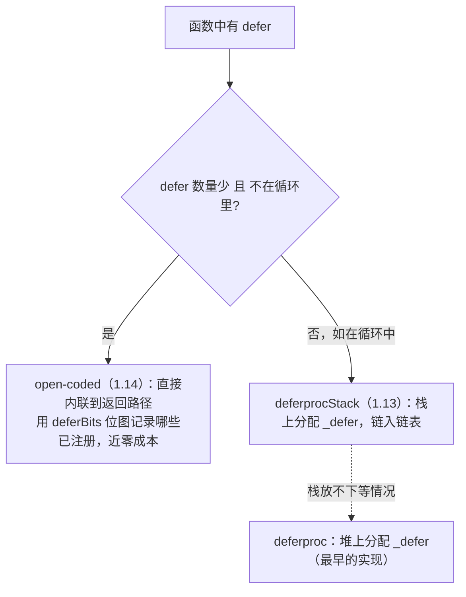

# 6.2 延迟语句

`defer` 把一个函数调用推迟到所在函数返回前执行,用来写解锁、关闭、收尾，让"获取"与"释放"
在代码里紧挨着，不易遗漏。语义简单，实现却经历了三代演进，是 Go 里"性能优化如何悄悄改变一条
旧建议"的绝佳样本。

## 6.2.1 语义

几条要点：被 `defer` 的调用按**后进先出**（LIFO）顺序执行;它在函数**正常返回或 panic 时都会
执行**（这使它能配合 `recover`，见 [6.3](./panic.md)）;它的**参数在 `defer` 那一刻就求值**，
而非执行时,这是初学者常踩的坑（`defer fmt.Println(i)` 打印的是 `defer` 时的 `i`）。最常见的
惯用法是 `mu.Lock(); defer mu.Unlock()` 与 `f, _ := os.Open(...); defer f.Close()`,把释放写在
获取旁边。

## 6.2.2 三代实现：一条性能演进线

`defer` 的代价不是一直如一的，它走过三代：

**第一代（堆上 `_defer`）**：每个 `defer` 在堆上分配一个 `_defer` 记录，链到当前 goroutine 的
defer 链表上，返回时 `deferreturn` 逐个弹出执行。正确但慢,堆分配加链表操作，使 `defer` 比直接
调用慢出一截。这就是早年那条流传甚广的建议"热路径别用 defer"的由来。

**第二代（栈上 `_defer`，Go 1.13）**：`deferprocStack` 把 `_defer` 记录改在**栈上**分配，省掉堆
分配，常见情形下 `defer` 开销下降约三成。

**第三代（open-coded defer，Go 1.14）**：当一个函数里的 `defer` **数量较少（不超过 8 个）且不在
循环中**时，编译器干脆**不生成 `_defer` 记录**，而是把延迟调用**直接内联**到函数的返回路径上，
用一个 `deferBits` 位图记录运行到哪些 `defer` 已经"注册"，返回时据此决定执行哪些。这条路径的
开销已**接近于零**,几乎和手写在返回前调用一样快。不满足条件（如在循环里 `defer`）时，才回退到
栈/堆 defer。

## 6.2.3 一条旧建议的失效

这段演进的现实意义是：**"热路径别用 defer"这条老建议，在 Go 1.14 之后大体不再成立**。对绝大多数
函数（少量、非循环的 defer），open-coded 让 defer 几乎免费，你应当为了正确性与可读性放心使用。
仍需留心的只剩"在循环里大量 defer"这种会退回慢路径、且可能堆积到函数结束才执行的情形,那时
改成显式调用或把循环体抽成独立函数更合适。一条性能建议随实现演进而失效，提醒我们：**关于
性能的"常识"是有保质期的，要回到当前实现去验证**,这正是本书强调对照真实源码的原因。

## 6.2.4 与 panic / recover 的交互

`defer` 链也是 panic 处理的骨架。一个 goroutine panic 时，运行时会沿它的 `_defer` 链
**逆序执行**每个延迟调用;`recover` 只有在被 `defer` 的函数里直接调用才有效,因为只有那时它才
处在"正在展开 panic"的上下文中，能够截住 panic、恢复正常返回。open-coded defer 也为此保留了
回退机制：一旦发生 panic，运行时需要能遍历这些延迟调用，因此 open-coded 的函数会在栈上留下
足够的信息供展开时使用。panic/recover 的完整机制见 [6.3](./panic.md)。

## 6.2.5 跨语言对照：确定性清理的不同答案

"在作用域结束时确定性地清理资源"是个普适需求，各语言答案不同。**C++ 的 RAII**（析构函数）把
清理绑在对象生命周期上，离开作用域自动调析构,最隐式、也最强大（连异常路径都覆盖）。
**Java 的 `try-finally`**（及 `try-with-resources`）显式但啰嗦。**Python 的 `with` / 上下文管理器**
介于其间。**Rust 的 `Drop`** 又回到 RAII 路线。Go 的 `defer` 选了一条折中：比 RAII 显式
（你看得见每一处 `defer`）、比 `try-finally` 简洁（紧挨获取写、自动 LIFO），且函数级而非块级。
它牺牲了一点 RAII 的自动性，换来了显式与简单,又一次 Go 式的取舍。

## 延伸阅读的文献

1. Dan Scales, Keith Randall, Austin Clements. *Proposal: Low-cost defers through
   inlining*（open-coded defer，Go 1.14）.
   https://go.googlesource.com/proposal/+/master/design/34481-opencoded-defers.md
2. Go 1.13 Release Notes（栈上 defer，约 30% 提速）. https://go.dev/doc/go1.13 ；
   Go 1.14 Release Notes（open-coded defer）. https://go.dev/doc/go1.14
3. The Go Authors. *runtime/panic.go：deferproc / deferprocStack / deferreturn.*
   https://github.com/golang/go/blob/master/src/runtime/panic.go
4. The Go Programming Language Specification：*Defer statements.*
   https://go.dev/ref/spec#Defer_statements

## 许可

&copy; 2018-2026 The [golang.design](https://golang.design) Initiative Authors. Licensed under [CC-BY-NC-ND 4.0](https://creativecommons.org/licenses/by-nc-nd/4.0/).
