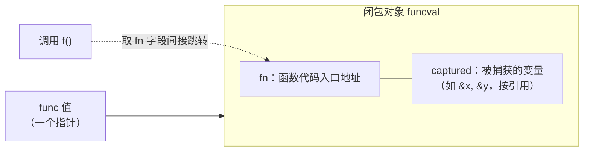
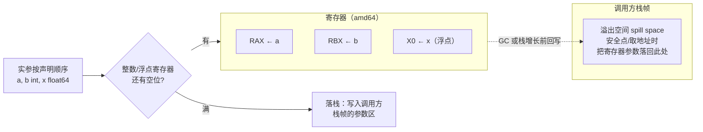

# 6.1 函数调用

函数是 Go 的一等公民，可以赋值、传递、返回、捕获外部变量成为闭包。这背后是两件事的实现：
函数值（闭包）在内存里如何表示，以及一次函数调用在底层如何传参与返回。后者还藏着 Go 1.17
一次悄无声息却影响全局的变革：从栈传参改为寄存器传参。这一节把这两件事讲透，并在它们的接缝处
点出一个关键事实，正是这个事实把「闭包是什么」与「调用怎么发生」焊成同一件事。

## 6.1.1 函数值与闭包

一个 `func` 类型的值，本质是一个指向**闭包对象**的指针。运行时给这个对象起的名字是 `funcval`，
它在 `runtime/runtime2.go` 里的定义短得出奇：

```go
// funcval：函数值在运行时的表示（来自 runtime2.go，已加注释）
type funcval struct {
    fn uintptr
    // 后面紧跟变长的、与具体函数相关的数据，即被捕获的环境
}
```

只有一个固定字段 `fn`,函数代码的入口地址。注释里那句「variable-size, fn-specific data here」
才是闭包的灵魂：紧随 `fn` 之后，编译器排布着这个闭包捕获的外部变量。一个不捕获任何变量的
普通函数，它的 `funcval` 只有 `fn` 一字，全局唯一、只读；一旦它捕获了外部变量，编译器就要为每次
求值在堆上构造一个带捕获数据的 `funcval`。可以把它画成这样：



调用一个函数值，就是取出 `fn` 字段间接跳转过去，与接口的方法分发
（[4.2](../ch04type/interface.md)）异曲同工。关键细节是**捕获按引用**：闭包捕获的是变量本身，
不是它当时的值。下面这段代码里，`counter` 返回的两个闭包共享同一个 `n`，因为它们捕获的是
`n` 这个变量的地址，而非某个快照：

```go
func counter() (inc, get func() int) {
    n := 0
    inc = func() int { n++; return n } // 捕获 &n
    get = func() int { return n }      // 捕获同一个 &n
    return
}
// inc(); inc(); get() == 2，两个闭包看到同一个 n
```

「按引用」既是闭包的表达力，也是那个经典陷阱的根源。在 Go 1.21 及之前，循环变量是**整个循环
共用一个**的，于是：

```go
// Go 1.21 及之前：所有 goroutine 捕获同一个 v
for _, v := range s {
    go func() { use(v) }() // 全部读到循环结束时 v 的终值
}
```

所有 goroutine 捕获的是同一个 `v`,它们启动时循环往往早已结束，于是清一色读到最后一个元素。
十余年间，老练的 Go 程序员靠手写 `v := v` 在每轮迭代里造一个新变量来回避它。Go 1.22 把这条
惯用法升格为语言规则：**`for` 循环的循环变量改为每轮迭代一个新实例**，对三段式 `for` 与
`for range` 一律生效。修复的着眼点值得玩味,它没有改变「捕获按引用」这一捕获**方式**，而是
改变了被捕获的**对象**：既然每轮都是新变量，按引用捕获到的自然也是各轮独立的地址。一个困扰
Go 用户十余年的设计缺陷，最终以最小的语义改动落幕。

这次修改还示范了 Go 改动语言语义的一套审慎做法。它本是一处不向后兼容的语义变更，可能让依赖旧
行为的代码悄悄改变结果，因此 Go 把它与 `go.mod` 里声明的语言版本绑定：仅当模块声明 `go 1.22`
及以上时新语义才生效，旧模块的行为原样保留。在 Go 1.21 的过渡期，它先以 `GOEXPERIMENT=loopvar`
的形式供人预览。对于行为可能因此改变的代码，官方还提供了 `bisect` 工具，能在新旧语义之间二分
搜索，精确定位是哪一处循环受了影响。把语义变更与版本声明挂钩、辅以预览开关与定位工具，是 Go
在「向前演进」与「不破坏既有代码」之间找到的折中,这套机制本身，比循环变量这一处修复影响更深远。

## 6.1.2 调用约定的演进：从栈到寄存器

一次函数调用如何传递参数与返回值，由**调用约定**（calling convention / ABI）规定。Go 1.16 及
之前用的是**基于栈**的约定（现称 ABI0）：所有参数与返回值都通过栈内存传递。调用方把实参逐个
写到栈上约定的位置，被调方再从栈上读出来，返回值同理。这套办法简单、可移植、易于让编译器与
手写汇编对接，代价是每个参数都要经历一次写内存加一次读内存，在调用密集的程序里相当可观。

Go 1.17 引入了**基于寄存器**的内部调用约定 ABIInternal。它的核心规则是「优先用寄存器，放不下
才落栈」：每种架构定义一组整数寄存器与一组浮点寄存器，参数与返回值按声明顺序依次占用，单个
参数要么整个进寄存器、要么整个落栈。在 amd64 上，可用于传递整数参数与返回值的是这 9 个寄存器：

```
RAX, RBX, RCX, RDI, RSI, R8, R9, R10, R11   // amd64：9 个整数参数/返回寄存器
```

arm64 则用 `R0`–`R15` 共 16 个。分配规则可以用一个小例子说清：函数 `func(a, b int, x float64)`
在 amd64 上，`a` 占 `RAX`、`b` 占 `RBX`、`x` 占第一个浮点寄存器，三个参数全在寄存器里，没有一次
访存；而若参数足够多、整数寄存器用满，第 10 个整数参数便落到栈上。聚合类型（结构体、数组）按
其字段递归地展开参与分配，能整体进寄存器就进，否则整个落栈,这条「要么全进、要么全落」的规则
避免了一个值被劈成寄存器加栈两半的复杂账目。把这套「按序占用寄存器、放不下才落栈」的分配，连同
寄存器参数在调用方栈帧里那块溢出空间，画成一张图：



少了大量栈内存读写，这次改动带来约 5% 的整体性能提升与更小的二进制，且对用户**完全透明**：
代码一行不改，重新编译就更快了。值得一提的是，寄存器约定为何到 Go 1.17 才落地：早期 Go 选择
基于栈的 ABI0，是因为它实现简单、跨架构一致、且与 GC 的精确栈扫描天然契合：参数都在栈上有
固定位置，扫描器照常能找到其中的指针。寄存器约定要落地，前提是编译器先有成熟的 SSA 后端来做
寄存器分配，并解决一个随之而来的问题,GC 与栈展开发生时，活在寄存器里的指针参数该如何被找到。
Go 的答案不是去扫描寄存器，而是依靠前面提到的溢出空间：在可能触发 GC 或栈增长的安全点上，
寄存器里的参数会被落回调用方栈帧中那块固定的溢出空间，于是扫描器仍只需扫栈。寄存器约定也并非
全无栈的参与，
调用方仍要在自己的栈帧里为每个寄存器参数预留一块**溢出空间**（spill space），以便栈增长
（[6.1.3](#613-栈帧与可增长栈)）或需要取参数地址时把寄存器里的值落回内存,把溢出空间放在
调用方栈帧而非被调方，是为了让栈增长的代码路径有固定位置可写，简化实现。

这里要接住 [6.1.1](#611-函数值与闭包) 留下的线头。闭包对象是一个指针，被调方要先拿到这个指针，
才能找到自己捕获的变量。ABI 为此专门指定一个**闭包上下文寄存器**：调用闭包前，调用方把
`funcval` 的地址放进这个寄存器，被调方从中取出捕获环境。在 amd64 上它是 `RDX`，在 arm64 上是
`R26`。读者或许已经注意到，`RDX` 恰好不在上面那 9 个整数参数寄存器之列,它被留作上下文专用，
正是为闭包腾出的位置。一句话：闭包之所以能「带着环境被调用」，靠的就是 ABI 在普通传参之外
额外约定的这一个寄存器。

ABI0 并未消失。它仍用在 Go 与汇编的边界上,手写汇编（[2.2](../../part1overview/ch02asm/callconv.md)）
遵循 ABI0，因为汇编作者需要一套稳定、显式、不随版本漂移的传参规则。两套 ABI 之间由编译器生成
的「桥接包装」（ABI wrapper）互相调用：一个 ABIInternal 的函数要调到 ABI0 的汇编例程，中间会经
一层把寄存器里的参数搬到栈上的包装，反之亦然。Go 把内部 ABI 与对外（汇编）ABI 分开，正是为了
能自由演进前者而不惊动后者,从栈到寄存器这场变革之所以能做到对用户透明，根子就在这道分界上。

## 6.1.3 栈帧与可增长栈

每次函数调用在 goroutine 的栈上压入一个**栈帧**，存放局部变量、溢出到栈的参数与溢出空间、
返回地址等。Go 的栈是**可增长的连续栈**：函数序言（prologue）里有一段栈检查，比较当前栈指针
与栈边界，发现剩余空间不足时跳去 `morestack`,它分配一段更大的栈，把旧栈内容整段拷贝过去，
再调整所有指向旧栈的指针。这段栈检查也是抢占（[9.7](../../part3concurrency/ch09sched/preemption.md)）
搭便车的地方。栈的具体管理见 [14 执行栈管理](../../part4memory/ch14stack)。

可增长栈对闭包有一个不容回避的后果。既然栈会**移动**，而 [6.1.1](#611-函数值与闭包) 又说闭包是
**按引用**捕获，那么一旦某个局部变量的地址被闭包捕获、并且这个闭包可能**活得比创建它的栈帧更久**
（比如被返回、被存入全局、被交给一个 goroutine），这个变量就不能再待在会被回收或搬迁的栈上。
解决之道是**逃逸分析**（[15.5](../../part5toolchain/ch15compile/escape.md)）：编译器在编译期判断
一个变量的地址是否「逃逸」出当前函数的生命周期，若是，就把它从栈搬到堆上分配，让闭包捕获的那个
地址在栈搬迁后依然有效。前面 `counter` 里的 `n` 之所以能在 `counter` 返回后继续被 `inc`/`get`
读写，正是因为它逃逸到了堆上。换言之，闭包的「按引用捕获」与栈的「可增长、可搬迁」这两个设计，
是靠逃逸分析这第三方仲裁才得以共存的。

## 6.1.4 方法值、方法表达式与变参

几个由函数一等公民身份派生出来的特性，落到 `funcval` 上都不神秘。

**方法值** `t.M` 把接收者 `t` 绑进一个闭包，得到一个可单独传递的 `func`。它本质就是
[6.1.1](#611-函数值与闭包) 的闭包，被捕获的变量正是接收者 `t`。**方法表达式** `T.M` 则不绑定
任何接收者，得到的是一个把接收者作为第一个显式参数的普通函数：

```go
type T struct{ x int }
func (t T) Add(d int) int { return t.x + d }

f := t.Add        // 方法值：func(int) int，t 被捕获进闭包
g := T.Add        // 方法表达式：func(T, int) int，接收者成为显式首参
f(1)  == t.x+1
g(t, 1) == t.x+1
```

两者形态不同：`f` 是一个携带捕获环境的 `funcval`（故 `t.Add` 这种写法会触发一次闭包分配，
接收者被复制进闭包对象，若接收者是指针类型则复制的是指针），`g` 则是一个不捕获任何东西、签名里
多一个参数的普通函数值。这解释了一个常被问起的现象：在热路径上反复写 `t.M` 取方法值会带来隐性的
堆分配，而 `T.M` 不会。编译器对方法值的处理可以看作一次「自动闭包化」,它合成一个以接收者为唯一
捕获变量的 `funcval`，本质与 [6.1.1](#611-函数值与闭包) 里手写的闭包别无二致。

**变参** `f(args ...int)` 在调用方被打包成一个切片传入：

```go
func sum(xs ...int) (s int) { for _, x := range xs { s += x }; return }

sum(1, 2, 3)        // 编译器构造 []int{1,2,3} 再传入
sum(s...)           // 已是切片，直接传，不再构造
```

变参的本质是「语法糖加一个切片」。理解了 [5.1 切片](../ch05data/slice.md)，就理解了变参的开销
所在：以散列实参调用变参函数，调用方要构造一个底层数组并据此生成切片头；若实参本就是切片并以
`s...` 形式传入，则零额外构造。

## 6.1.5 跨语言对照

闭包如今几乎是现代语言的标配（C++ lambda、Java、Python、Rust 的 `Fn`/`FnMut`/`FnOnce`），
差别在**捕获语义**。Go 一律按引用捕获，简洁但把「何时该复制」的判断交给逃逸分析与程序员的警觉；
C++ 让你在捕获列表里显式选值捕获 `[=]` 还是引用捕获 `[&]`，控制力强但容易写出悬垂引用；Rust 用
`move` 关键字与 `Fn`/`FnMut`/`FnOnce` 三个 trait 同时区分捕获方式与可调用次数，把所有权与可变性
检查提前到编译期。简洁、控制力、安全，各家在这个三角里站在不同位置。

调用约定上，C/C++ 遵循平台的标准 ABI（如 System V AMD64），以便与系统库和他人的目标文件直接
互操作；这份契约一旦公开就难以更改。Go 则**自定义**了内部 ABI，牺牲与外部目标文件的直接互通
（cgo 调用要跨 ABI 边界，有成本，见 [15 编译器](../../part5toolchain/ch15compile)），换来按
自己的需要演进调用约定的自由,从栈到寄存器的平滑切换，正得益于此。又一次，Go 用一点互操作性的
代价，换取了对自身实现的掌控。

## 延伸阅读的文献

1. The Go Authors. *Go internal ABI (ABIInternal) specification.*
   https://github.com/golang/go/blob/master/src/cmd/compile/abi-internal.md
   （amd64 的 9 个整数寄存器、闭包上下文寄存器 RDX/R26、溢出空间的设计与缘由）
2. Austin Clements 等. *Proposal: Register-based Go calling convention*（Go 1.17）.
   https://go.googlesource.com/proposal/+/master/design/40724-register-calling.md
3. The Go Authors. *Go 1.17 Release Notes（新的寄存器调用约定，约 5% 性能提升）.*
   https://go.dev/doc/go1.17
4. Go 1.22 Release Notes（循环变量按迭代作用域）. https://go.dev/doc/go1.22 ；
   David Chase, Russ Cox. *Fixing for loops in Go 1.22.* https://go.dev/blog/loopvar-preview
5. Russ Cox 等. *Proposal: Less error-prone loop variable scoping*（discussion #56010）.
   https://github.com/golang/go/discussions/56010
6. The Go Authors. *runtime/runtime2.go：funcval*（闭包在运行时的表示）.
   https://github.com/golang/go/blob/master/src/runtime/runtime2.go
7. 本书 [4.2 接口](../ch04type/interface.md)、[5.1 切片](../ch05data/slice.md)、
   [14 执行栈管理](../../part4memory/ch14stack)、[15.5 逃逸分析](../../part5toolchain/ch15compile/escape.md).
