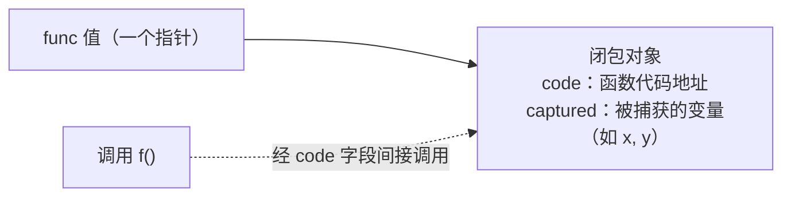

# 6.1 函数调用

函数是 Go 的一等公民,可以赋值、传递、返回、捕获外部变量成为闭包。这背后是两件事的实现：
函数值（闭包）在内存里如何表示，以及一次函数调用在底层如何传参与返回。后者还藏着 Go 1.17
一次悄无声息却影响全局的变革：从栈传参改为寄存器传参。

## 6.1.1 函数值与闭包

一个 `func` 类型的值，本质是一个指向**闭包对象**的指针。闭包对象里第一个字是函数代码的地址，
后面跟着被捕获的外部变量。

调用一个函数值，就是取出 `code` 字段间接跳转过去,与接口的方法分发（[4.2](../ch04type/interface.md)）
异曲同工。关键细节是**捕获按引用**：闭包捕获的是变量本身，不是它当时的值。这正是那个经典陷阱
的根源,在循环里 `for _, v := range s { go func(){ use(v) }() }`，所有 goroutine 过去共享同一个
`v`，往往全打印最后一个值。Go 1.22 把循环变量改为**每轮迭代一个新变量**，从语言层面消除了这个
长期的坑,一个困扰了 Go 用户十余年的设计缺陷，最终以"改变捕获目标"而非"改变捕获方式"修复。

## 6.1.2 调用约定的演进：从栈到寄存器

一次函数调用如何传递参数与返回值，由**调用约定**（calling convention / ABI）规定。Go 1.16 及
之前用的是**基于栈**的约定（现称 ABI0）：所有参数与返回值都通过栈内存传递。这简单、可移植，
但慢,每个参数都要写内存、读内存。

Go 1.17 引入了**基于寄存器**的内部调用约定 ABIInternal：在 amd64 上用最多 9 个整数寄存器加
若干浮点寄存器传参与返回，随后扩展到 arm64 等架构。少了大量栈内存读写，带来约 5% 的整体性能
提升与更小的二进制。这是一次对用户**完全透明**的变革,你的代码一行不改，重新编译就更快了。
ABI0 并未消失：它仍用在 Go 与汇编的边界上（手写汇编遵循 ABI0），两套 ABI 之间由编译器生成的
"桥接包装"互相调用。Go 把内部 ABI 与对外（汇编）ABI 分开，正是为了能自由演进前者而不破坏后者。

## 6.1.3 栈帧与可增长栈

每次函数调用在 goroutine 的栈上压入一个**栈帧**，存放局部变量、溢出到栈的参数、返回地址等。
Go 的栈是可增长的连续栈：函数序言里的栈检查（也是 [9.7 抢占](../../part3concurrency/ch09sched/preemption.md)
搭便车的那个检查）发现空间不足时，会分配更大的栈并把内容拷贝过去。栈的具体管理见
[14 执行栈管理](../../part4memory/ch14stack)。这里要点出的是：正因为栈会移动，闭包捕获、
取地址等操作都必须经得起栈被搬迁,这也是逃逸分析（决定变量放栈还是堆）存在的背景之一。

## 6.1.4 方法值、方法表达式与变参

几个由函数一等公民身份派生的特性。**方法值** `t.M` 把接收者 `t` 绑进一个闭包，得到一个可单独
传递的 `func`,本质就是 6.1.1 的闭包，捕获的变量是接收者。**方法表达式** `T.M` 则得到一个把
接收者作为第一个显式参数的普通函数。**变参** `f(args ...int)` 在调用方被打包成一个切片传入,
所以变参的本质是"语法糖 + 一个切片"，理解了 [5.1 切片](../ch05data/slice.md)就理解了变参的开销
（一次切片构造）。

## 6.1.5 跨语言对照

闭包如今几乎是现代语言标配（C++ lambda、Java、Python、Rust 的 `Fn`/`FnMut`/`FnOnce`），
差别在**捕获语义**：Go 一律按引用捕获，C++ 让你显式选值捕获还是引用捕获，Rust 用 `move` 与
trait 区分捕获方式与可调用次数,各是简洁与控制力的不同取舍。调用约定上，C/C++ 遵循平台的
标准 ABI（如 System V AMD64），以便与系统和他人的目标文件互操作;Go 则**自定义**了内部 ABI，
牺牲与外部目标文件的直接互通（cgo 调用要跨 ABI 边界，有成本，见 [15 编译器](../../part5toolchain/ch15compile)），
换来按自己的需要演进调用约定的自由,从栈到寄存器的平滑切换，正得益于此。又一次，Go 用一点
互操作性的代价，换取了对自身实现的掌控。

## 延伸阅读的文献

1. The Go Authors. *Go internal ABI (ABIInternal) specification.*
   https://github.com/golang/go/blob/master/src/cmd/compile/abi-internal.md
2. Austin Clements 等. *Proposal: Register-based Go calling convention*（Go 1.17）.
   https://go.googlesource.com/proposal/+/master/design/40724-register-calling.md
3. Go 1.22 Release Notes（循环变量按迭代作用域）. https://go.dev/doc/go1.22 ；
   *Fixing for loops in Go 1.22.* https://go.dev/blog/loopvar-preview
4. The Go Authors. *runtime/runtime2.go：funcval*（闭包表示）.
   https://github.com/golang/go/blob/master/src/runtime/runtime2.go

## 许可

&copy; 2018-2026 The [golang.design](https://golang.design) Initiative Authors. Licensed under [CC-BY-NC-ND 4.0](https://creativecommons.org/licenses/by-nc-nd/4.0/).
