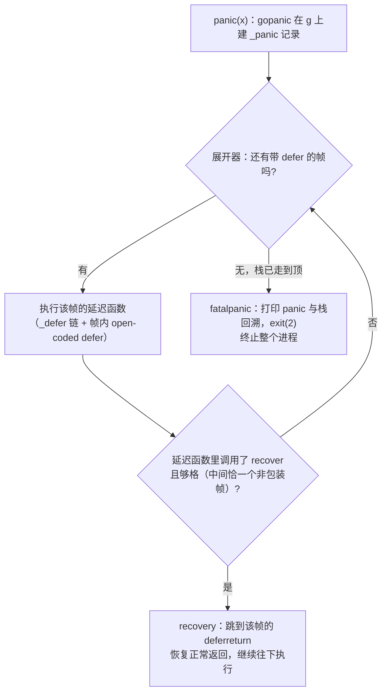

# 6.3 恐慌与恢复内建函数

`defer`（[6.2](./defer.md)）已经把「函数退出时要做什么」交代清楚，留下的悬念是「函数被
异常地打断时又会发生什么」。`panic` 与 `recover` 这对内建函数回答的正是这个问题：前者中断
当前的正常控制流并开始沿调用栈向上展开，后者在展开途中把它截住。这一节先讲清它们的语义，
再落到 go1.26 运行时里 `gopanic`、`gorecover` 的实现，最后回到一个更要紧的问题：panic
究竟该被当作什么，以及为什么 Go 没有把它做成 C++ 或 Java 那样的异常机制。

## 6.3.1 语义：展开、拦截与进程终止

`panic` 做三件事，顺序固定。它先停下当前函数余下的语句，转而按后进先出的次序执行当前
goroutine 已经登记的 `defer` 链；每执行一个延迟函数，控制权都短暂回到用户代码，给它一次
拦截的机会；若整条链走完仍无人拦截，panic 会逐层弹出调用栈，到达 goroutine 栈顶后终止
**整个进程**，并打印 panic 值与栈回溯。

`recover` 是拦截的唯一手段，但它的生效条件很窄：只有**直接**被某个延迟函数调用时才有效。
直接的意思是，调用 `recover` 的那一帧，必须正是发生 panic 的那一帧用 `defer` 登记的延迟
函数本身，多一层嵌套或少一层都不算。一次成功的 `recover` 会让 panic 停止展开，返回当时
传给 `panic` 的值，随后控制流如同那个延迟函数正常返回一般，继续往下走。

这条「同一调用链、且直接位于延迟函数中」的约束，是后文一切实现细节的根。先用三段代码把它
落实。第一段，`recover` 写错了位置，拦不住：

```go
func A() {
	B()
	C()
}
func B() {
	defer func() { recover() }() // 拦不住 C 的 panic：B 已经返回，不在展开路径上
	println("B")
}
func C() { panic("boom") }
```

`A` 先调用 `B`，`B` 正常返回、它的 `defer` 也早已执行完毕；随后 `A` 调用 `C`，`C` 发生
panic 时展开的是 `C → A` 这条路径，`B` 根本不在其上。第二段，把 `recover` 放到调用链上游
的 `A` 里，就拦得住：

```go
func A() {
	defer func() { recover() }() // 拦得住：A 在 C 的展开路径上
	B()
}
func B() { C() }
func C() { panic("boom") }
```

panic 沿 `C → B → A` 向上展开，途经 `A` 登记的延迟函数时，`recover` 直接位于其中，生效。
第三段说明「直接」二字的分量。下面两种写法都拦不住，尽管看起来都「在 defer 里调用了
`recover`」：

```go
defer func() { func() { recover() }() }() // 多一层匿名函数：recover 不在延迟函数本身
defer recover()                            // 少一层：recover 自己成了延迟函数，gopanic 是其调用者
```

前者多了一层闭包，`recover` 的调用者不再是被 `defer` 登记的那一帧；后者把 `recover` 本身
登记成了延迟函数，它由运行时的 `gopanic` 直接调用，同样不满足条件。这两个反例并非语言的
随意规定，下一小节会看到，它们恰好对应运行时检查里「中间帧数恰为一」这条判据的两侧边界。

## 6.3.2 gopanic：在 g 上建一条 _panic 记录

编译器把关键字 `panic(x)` 直接翻成一次 `runtime.gopanic(x)` 调用，把 `recover()` 翻成
`runtime.gorecover()`。语义的实现因此全在运行时这两个函数里。

`gopanic` 拿到 panic 值后，先排除几种「无从恢复」的场合，例如在系统栈、在 `mallocing`、
在禁止抢占或持有锁期间发生的 panic，这些都直接 `throw` 掉，因为此刻再去执行任意用户代码
并不安全。越过这些检查，它在**当前栈上**建立一条 `_panic` 记录，挂到 goroutine 的 `_panic`
链表头，然后开始驱动一台小状态机沿栈展开。go1.26 的 `_panic` 是这样一个裁剪后的速写：

```go
// _panic：一次正在进行的 panic（速写，仅保留设计相关字段）
type _panic struct {
	arg  any     // 传给 panic 的值，recover 成功时原样返回
	link *_panic // 链到更早的 panic，支持 panic 中再 panic

	startPC uintptr        // gopanic 自身的 PC/SP，作为「展开起点」的身份标记
	startSP unsafe.Pointer // recover 据此判断某次调用是否够格

	pc uintptr        // 展开状态机当前所在的帧
	sp unsafe.Pointer
	fp unsafe.Pointer

	retpc uintptr // 若被 recover，应跳回的 PC（指向该帧的 deferreturn）

	// open-coded defer 的回放状态：这些 defer 不在 _defer 链上，
	// 其登记位图与闭包槽都在函数帧内，gopanic 借这两个指针亲自遍历它们
	deferBitsPtr *uint8
	slotsPtr     unsafe.Pointer

	recovered bool // 本次 panic 是否已被 recover 截住
}
```

与旧版相比，go1.26 的 `_panic` 已不再用 `argp` 记参数指针，而是改用 `startPC`/`startSP`
标定展开的起点，并多出 `pc`/`sp`/`fp` 与 `deferBitsPtr`/`slotsPtr`,后者直接关系到
open-coded defer（[6.2](./defer.md)）的可遍历性，下一小节细说。建好记录后，主循环极简，
反复向状态机要下一个该执行的延迟函数并执行：

```go
// gopanic 的主干（伪代码）
var p _panic
p.arg = e
p.start(callerPC, callerSP) // 挂上 g._panic 链，找到第一个带 defer 的帧
for {
	fn, ok := p.nextDefer() // 取下一个延迟函数；顺带检查是否已被 recover
	if !ok {
		break // 延迟链耗尽，无人拦截
	}
	fn()
}
preprintpanics(&p) // 冻结世界前先把 Error/String 方法都调好
fatalpanic(&p)     // 不可恢复，终止进程
```

这里有一处与早期实现的重要分野。早先运行时是顺着 goroutine 的 `_defer` 链一个个
`reflectcall`；go1.21 之后，`nextDefer` 借助一台**栈展开器**（unwinder）逐帧前进，
每到一个带延迟调用的帧，就把该帧的 open-coded defer（按帧内位图 `deferBitsPtr` 取出闭包槽）
和挂在 `_defer` 链上的堆/栈 defer 一并取出执行。换言之，panic 路径上的展开不再依赖
`_defer` 链独自承载全部延迟调用,正常返回时由函数尾声内联执行的那些 open-coded defer，
在 panic 时改由 `gopanic` 亲自从帧里捞出来执行。这正是 [6.2.4](./defer.md) 所说「open-coded
defer 必须在 panic 时仍可被运行时遍历」的来由：它们在栈上不留 `_defer` 记录，运行时只能
凭函数帧里的位图与闭包槽自行回放。

## 6.3.3 gorecover：凭栈形判定「够不够格」

`recover` 的全部难处在于判定调用者是否够格。go1.26 的 `gorecover` 已不接受任何参数，
它取出当前 goroutine 上活跃的 `_panic`，若不存在、或已被恢复、或来自 `Goexit`，直接返回
`nil`;否则用一台栈展开器从 `gorecover` 往外走，数一数 `gopanic` 与 `gorecover` 之间
夹着几个**非包装帧**（wrapper frame 会被跳过）。判据是:中间恰好一个非包装帧，且那帧的
`gopanic` 的栈指针与活跃 `_panic` 的 `startSP` 相符,此时才把 `p.recovered` 置位并返回
`p.arg`。源码注释把三种栈形画得很清楚：

```
正常可恢复：             多一层包装仍可恢复：       defer recover() 不可恢复：
  foo                     foo                        foo
  runtime.gopanic         runtime.gopanic            runtime.gopanic
  bar      ← 1 个非包装帧  wrapper                    wrapper
  runtime.gorecover       bar    ← 仍是 1 个          runtime.gorecover  ← 0 个非包装帧
                          runtime.gorecover
```

「恰好一个非包装帧」这条判据，正是 [6.3.1](#631-语义展开拦截与进程终止) 那两个反例的形式化：
`defer recover()` 之间夹零帧，太少;`defer func(){ func(){recover()}() }()` 之间夹两帧，
太多;只有 `defer func(){ recover() }()` 恰好一帧，够格。把语义约束编码成一道对栈形的检查，
是这套实现的巧妙之处。

`recover` 一旦置位 `recovered`，主循环里的 `nextDefer` 会察觉它并通过 `mcall(recovery)`
切走，不再返回。`recovery` 做的事是把 goroutine 的执行现场改写成「那个延迟函数所在的帧
正常返回」的样子：它沿 `_panic` 链向上弹出已被跨越的 panic 记录，然后把 `gp.sched` 的
`pc` 指向**该帧的 `deferreturn`**（而非普通返回点），再 `gogo` 跳回去。为什么是
`deferreturn` 而不是普通的 `RET`?因为那个帧里可能还有尚未执行的 defer,跳到
`deferreturn` 才能把它们补完。这也解释了 [6.2](./defer.md) 里的一个细节：凡含 defer 的
编译后函数，其尾声都以 `CALL deferreturn; RET` 收口,正是为了给 panic 后的恢复留一个
可跳入的、能继续跑完剩余 defer 的入口。

## 6.3.4 fatalpanic：无人拦截时的收场

若延迟链走到尽头仍无人 `recover`，`gopanic` 落到 `fatalpanic`。它在打印之前先调
`preprintpanics`,趁世界尚未冻结，把 panic 值上的 `Error`、`String` 方法都调用一遍，
得到可打印的字符串，避免冻结之后再执行用户代码。随后 `fatalpanic` 切到系统栈，
`startpanic_m` 冻结其余线程、打印 panic 与栈回溯，最后 `exit(2)` 终止进程。

整条路径可以画成一台状态机。每到一帧，先跑完该帧的延迟调用，期间任一次 `recover` 都会
经 `recovery` 跳出循环、恢复正常控制流；唯有走到栈顶仍无人拦截，才落入 `fatalpanic`：



值得强调的是右下角那条路径：**未被拦截的 panic 杀死的是整个进程，而非单个 goroutine**。
一个后台 goroutine 里漏掉的 panic，会带走与它毫不相干的整个服务。这一点决定了下文要谈的
工程姿态。

## 6.3.5 panic 不是异常处理

读到这里，容易把 `panic`/`recover` 类比成 C++、Java、Python 的 `try`/`catch`,语法上确实
都「抛出、向上传播、在某处捕获」。但 Go 在设计上刻意没有把它做成异常机制，这一区别贯穿语言
的性格，也直接决定了你该在什么时候用它。

Go 处理「预期之内的失败」的正路是**错误即值**（errors as values）：函数把错误作为一个普通
返回值 `error` 交回给调用者，由调用者用普通的 `if err != nil` 显式处置（[第 7 章](./../ch07errors/readme.md)）。
文件打不开、网络断了、输入不合法,这些是程序正常运行中**意料之中**会遇到的情况，它们是值，
不是事件。`panic` 留给另一类东西：**真正异常、本不该发生**的情形,数组越界、解引用空指针、
违反了某个不变量。换句话说，panic 标记的是 bug 或环境已崩坏到无法继续的地步，而不是一种
错误处理的备选风格。Rob Pike 在《Effective Go》里把这条原则写成一句话：「Don't panic.」

这种取舍是 Go「显式优于隐式」性格的延伸。异常机制的代价在于它**隐藏了控制流**：一行看似
平平无奇的函数调用，可能就此把控制权抛到几层之外某个你看不见的 `catch`,调用点本身读不出
这种可能。错误即值则把每一处可能失败的地方都摆到明面上,代码因此更啰嗦，却也更难骗过读者。
Go 与 Rust 在这一点上同道：Rust 用 `Result<T, E>` 把可恢复错误编进类型，把 `panic!` 留给
不可恢复的 bug，二者都把「错误是值、要显式处理」立为默认，把展开栈这件事留给真正的异常路径。
C++、Java、Python 走的是另一条路，异常是错误处理的主干，代价是控制流的隐式与 `try` 块的弥散。
两条路各有取舍，没有一边「正确」,但选了哪条，语言读起来的样子就此不同。

panic 唯一被广泛接受的工程用法，是**在边界上恢复**。一个长期运行的服务，不该因某次请求处理
中的一个 bug 而整个崩掉。标准库的 `net/http` 就在每个请求的处理 goroutine 外层包了一层
`recover`：某个 handler panic 了，服务器截住它、给这一条连接回个 500，其余请求照常。这是
recover 的正当场景,**在一个清晰的边界上，把「一次操作的崩溃」隔离成「一次操作的失败」**，
而不是散落在业务逻辑里拿 recover 当 `catch` 用。判断准则很简单：你是在隔离一个边界，
还是在掩盖一个本该作为 `error` 返回的失败?

最后一笔落在成本上，它从另一面印证了「panic 属于异常路径」。panic 的展开不是免费的：它要
逐帧走栈、回放每一帧的 defer，还连累了优化,一个可能 panic 并被 recover 的函数，其调用关系
难以被内联与做激进的逃逸分析（这也是 [6.2](./defer.md) 里 open-coded defer 要在栈上额外
留位图、好让 panic 时仍可遍历的代价所在）。正因为这条路慢且复杂，它才只配留给真正罕见的
异常情形。把它当成日常错误处理的手段，等于让每一次寻常失败都去付一笔本该专属于异常的账。

## 延伸阅读的文献

1. Andrew Gerrand. *Defer, Panic, and Recover.* The Go Blog, 2010.
   https://go.dev/blog/defer-panic-and-recover （panic/recover 语义的权威入门）
2. The Go Authors. *Effective Go: Panic / Recover / "Don't panic".*
   https://go.dev/doc/effective_go#panic （何时该用、何时不该用 panic 的官方建议）
3. The Go Authors. *The Go Programming Language Specification: Handling panics.*
   https://go.dev/ref/spec#Handling_panics （panic/recover 的规范定义）
4. The Go Authors. *runtime/panic.go（gopanic / gorecover / recovery / fatalpanic）与
   runtime/runtime2.go（_panic、_defer 结构）.*
   https://github.com/golang/go/tree/master/src/runtime
5. Russ Cox 等. *Go 1.21 中 panic/defer 改用栈展开器逐帧处理的重构.*
   https://github.com/golang/go/issues/57261 （nextDefer / nextFrame 的设计背景）
6. The Rust Project. *Error Handling: `Result` vs `panic!`.*
   https://doc.rust-lang.org/book/ch09-00-error-handling.html （错误即值与不可恢复错误的同构取舍）
7. 本书 [6.2 延迟调用](./defer.md)、[第 7 章 错误处理](./../ch07errors/readme.md).
