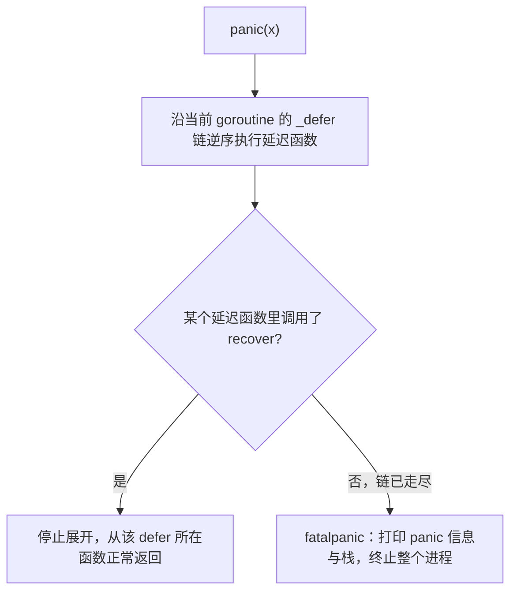

# 6.3 恐慌与恢复内建函数

`panic` 与 `recover` 是 Go 处理"真正异常"的机制,注意是真正异常，而非日常错误。它们与 `defer`
（[6.2](./defer.md)）紧密咬合，也与 Go"错误即值"（[7 错误处理](../ch07errors)）的主张划清了
界限。理解这对内建函数，关键是看清它的机制，以及 Go 为何刻意把它和普通错误分开。

## 6.3.1 语义

`panic(x)` 中断当前函数的正常执行，开始**沿调用栈向上展开**，逐层执行沿途的延迟函数
（[6.2](./defer.md)）。若展开过程中某个延迟函数调用了 `recover`，展开就**停下**，程序从那个
`defer` 所在的函数正常返回，panic 被"接住";若一路到栈顶都没人 `recover`，程序**崩溃**,打印
panic 值与栈轨迹后终止整个进程。

两条铁律：`recover` **只有在被 `defer` 的函数里直接调用才有效**,因为只有那一刻它才处在"正在
展开 panic"的上下文;以及，未被接住的 panic 会**终止整个进程**，而不只是当前 goroutine。

## 6.3.2 实现机制

运行时里，`panic(x)` 调用 `gopanic`：它创建一个 `_panic` 记录，挂到当前 goroutine 上，然后沿
`_defer` 链（[6.2](./defer.md)）逆序执行每个延迟函数。`recover` 调用 `gorecover`：它检查当前是否
正有一个 panic 在展开、且调用位置恰好是该 panic 正在执行的那个延迟函数,满足则把 panic 标记为
已恢复，展开随之停止。一路无人恢复时，`fatalpanic` 打印信息并终止进程。这套机制也解释了
open-coded defer（[6.2](./defer.md)）为何仍要保留可被遍历的信息:panic 展开时必须能找到并执行
那些被内联掉的延迟调用。

## 6.3.3 panic 不是异常处理

这是理解 Go 错误哲学的关键一节。许多语言用 `try/catch` 异常作为**常规**的错误处理控制流;Go
**刻意不这样**。Go 的主张是：**普通的、预期内的错误用返回值传递**（`error`，[7 错误处理](../ch07errors)），
`panic` 只留给**真正异常、通常意味着程序 bug 或无法继续**的情形,数组越界、空指针解引用、
向已关闭 channel 发送，这些运行时本身就会 panic。官方建议浓缩成一句"Don't panic":库不应把
panic 当作向调用方报告普通错误的手段。

`recover` 的正当用途因此很窄，最典型的是**在边界处兜底**：一个服务器为每个请求起一个 goroutine，
用 `defer recover()` 防止单个请求的意外 panic 拖垮整个进程(标准库 `net/http` 正是如此)。这是
"把 panic 关在尽量小的笼子里"的模式，而非用它做流程控制。

## 6.3.4 两种错误哲学的对照

如何处理错误，是语言设计的一道分水岭。**异常派**（C++、Java、Python）用 `try/catch` 把错误
处理与正常逻辑分离,代码主干干净，但错误路径变得隐式、容易被忽略，且异常可能从任何调用点
抛出，控制流难以一眼看清。**值派**（Go、Rust、以及 C 的返回码传统）把错误作为普通返回值
显式传递,啰嗦（满屏 `if err != nil`），但错误路径白纸黑字、无处可藏。Go 选了值派，并只为
"真正异常"保留一个轻量的 panic/recover,Rust 的取舍几乎相同（`Result` 处理常规错误、`panic!`
处理不可恢复情形）。这场"异常 vs 值"之争没有绝对赢家，但 Go 的选择与它"显式优于隐式"的整体
性格（[11.8 上下文](../../part3concurrency/ch11sync/context.md) 的显式 ctx、[11.9 内存模型](../../part3concurrency/ch11sync/mem.md)
的拒绝未定义行为）完全一致。

## 6.3.5 取舍

把错误处理一分为二（普通错误走值、真正异常走 panic），代价是要求程序员**判断**何者属于哪一类，
也带来 `if err != nil` 的冗长。收益是：正常错误处处可见、可被编译器与 linter 检查，而展开栈这种
昂贵操作只在真正异常时才发生。`panic` 的展开要逐层走 defer 链、不可内联，本就不该在热路径上
频繁触发,把它限定在"异常"语义里，恰好也避开了它的性能代价。一个设计决策同时服务了语义清晰
与性能,这正是好取舍的样子。

## 延伸阅读的文献

1. The Go Authors. *Defer, Panic, and Recover.* Go 博客, 2010.
   https://go.dev/blog/defer-panic-and-recover
2. The Go Authors. *Effective Go：Errors / Panic / Recover；以及 "Don't panic" 准则.*
   https://go.dev/doc/effective_go#panic
3. The Go Authors. *runtime/panic.go：gopanic / gorecover / fatalpanic.*
   https://github.com/golang/go/blob/master/src/runtime/panic.go
4. The Go Programming Language Specification：*Handling panics.*
   https://go.dev/ref/spec#Handling_panics

## 许可

&copy; 2018-2026 The [golang.design](https://golang.design) Initiative Authors. Licensed under [CC-BY-NC-ND 4.0](https://creativecommons.org/licenses/by-nc-nd/4.0/).
