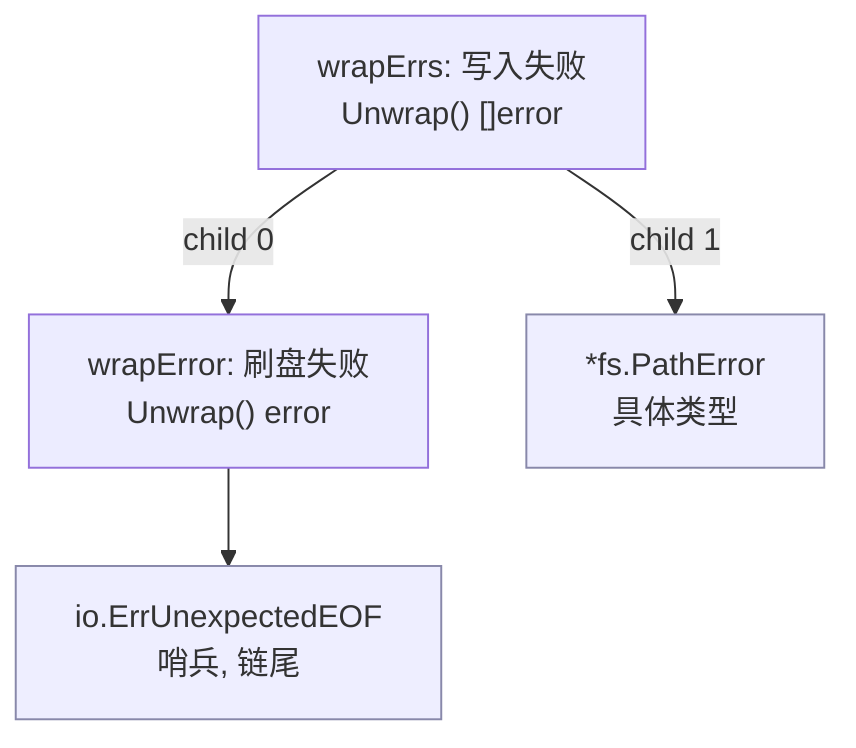

# 7.2 错误值检查

错误一旦在调用链里向上传播，处理它的代码与产生它的代码往往隔着许多层。这就带来一个
朴素却棘手的问题：拿到一个层层传上来的 `error`，调用方如何判断「它到底是不是某个特定的错误」，
又如何从中取回当初那个携带了上下文的具体错误值？这一节回答的就是这件事，以及 Go 为此
在 `errors` 包里立下的那套约定。

最朴素的错误就是一句话。`errors.New` 把一个字符串包成 `error`，内部只是 `errorString`
这一极简实现：

```go
package errors

type errorString struct              { s string }
func (e *errorString) Error() string { return e.s }

func New(text string) error { return &errorString{text} }
```

实践中常把它和 `fmt.Sprintf` 拼起来用，凑出一句带变量的错误消息。可一旦错误被压成字符串，
它的「可处理性」便几乎归零：调用方只能拿这句话去和别的字符串比对，无从知道它的来源，
也无从取回原始的错误值。Go 1.13 在 `errors` 包里补上的 `Unwrap`、`Is`、`As`，
以及 go1.26 新增的泛型 `AsType`，要解决的正是这个「错误一旦上浮便不可追问」的困境。
它们的共同前提，是先把错误串成一条可以回溯的链。

## 7.2.1 错误传播链：从单层包装到错误树

要让上层能追问下层，错误就不能在传播时丢掉来历。`fmt.Errorf` 用 `%w` 动词做到这一点：
它在生成新错误消息的同时，把被包装的原始错误存了下来，使新错误「记得」自己是从谁来的。
单个 `%w` 产出的是一个实现了 `Unwrap() error` 的 `wrapError`，多个 `%w` 则产出实现了
`Unwrap() []error` 的 `wrapErrs`：

```go
package fmt

// 裁剪后的 Errorf：只保留「按 %w 个数选择包装类型」这一与设计相关的分支
func Errorf(format string, a ...any) error {
	p := newPrinter()
	p.wrapErrs = true       // 允许 %w 把对应实参记入 p.wrappedErrs
	p.doPrintf(format, a)   // 格式化；%w 退化为 %v 拼接，并记录其位置
	s := string(p.buf)
	switch len(p.wrappedErrs) {
	case 0:
		return errors.New(s)              // 没有 %w，就是一条普通错误
	case 1:
		return &wrapError{msg: s, err: …} // 单个 %w：链上的一个节点
	default:
		return &wrapErrs{msg: s, errs: …} // 多个 %w：一个节点指向多个子错误
	}
}

type wrapError struct{ msg string; err error }
func (e *wrapError) Error() string { return e.msg }
func (e *wrapError) Unwrap() error { return e.err }   // 单链

type wrapErrs struct{ msg string; errs []error }
func (e *wrapErrs) Error() string   { return e.msg }
func (e *wrapErrs) Unwrap() []error { return e.errs } // 分叉
```

`%w` 与 `%v` 的差别正在于此。`%v` 只把错误格式化成字符串拼进消息，来历就此丢失；
`%w` 在拼字符串之外额外保留了对原始错误的引用，把它接到链上。这条引用也是一种 API 承诺：
一旦用 `%w` 暴露了内层错误，调用方就可能依赖 `errors.Is`/`As` 去匹配它，于是内层错误
便成了你对外契约的一部分。若只想在消息里提一句而不愿暴露内部错误类型，应当用 `%v`。

`Unwrap() []error` 是 Go 1.20 引入的第二种拆包形态（见延伸阅读）。
标准库的 `errors.Join` 正是用它把若干并列的错误合成一个：

```go
err := errors.Join(errClose, errFlush) // err.Unwrap() 返回 []error{errClose, errFlush}
```

于是错误不再只是一条线，而可能是一棵树：`Unwrap() error` 的节点有一个子节点，
`Unwrap() []error` 的节点有多个子节点，叶子则是不再实现任何 `Unwrap` 的原始错误（哨兵或某个具体类型）。
检查一个错误，就是在这棵树上做一次遍历。



上图里 `errors.Is(e3, io.ErrUnexpectedEOF)` 会沿 child 0 一路 Unwrap 到链尾命中；
`errors.As(e3, &pe)`（`pe` 为 `*fs.PathError`）则在 child 1 这一支上按类型匹配到。
二者走的都是同一棵树，只是「命中」的判据不同。

## 7.2.2 Unwrap：拆开一层

`Unwrap` 是这套机制的地基，它只做一件事：若错误实现了 `Unwrap() error`，就调用它取出内层；
否则返回 `nil`。它有意只认 `Unwrap() error` 这一种形态，不处理 `Unwrap() []error`，
遍历整棵树的职责留给了 `Is`/`As`：

```go
func Unwrap(err error) error {
	u, ok := err.(interface{ Unwrap() error })
	if !ok {
		return nil
	}
	return u.Unwrap()
}
```

## 7.2.3 Is：链感知的哨兵比较

判断「这是不是某个特定错误」，传统写法是 `err == io.ErrUnexpectedEOF`。一旦错误被包装过，
`==` 就失效了，因为顶层是个 `wrapError`，并不等于链尾的哨兵。`errors.Is` 把这次比较
变成在整棵树上的查找：从 `err` 自身开始逐层下探，任一节点与 `target` 相等便算命中。

实现上，导出的 `Is` 只做参数校验，真正的遍历在递归的 `is` 里。它在每个节点上依次尝试两种
判据，再按节点的拆包形态决定下一步往哪走，遇到 `Unwrap() []error` 便对每个子节点递归
（深度优先）：

```go
func is(err, target error, targetComparable bool) bool {
	for {
		// 判据一：直接相等（target 可比较时）
		if targetComparable && err == target {
			return true
		}
		// 判据二：err 自定义了 Is 方法，交给它判
		if x, ok := err.(interface{ Is(error) bool }); ok && x.Is(target) {
			return true
		}
		// 按拆包形态决定如何继续下探
		switch x := err.(type) {
		case interface{ Unwrap() error }:
			if err = x.Unwrap(); err == nil {
				return false
			}
		case interface{ Unwrap() []error }:
			for _, e := range x.Unwrap() { // 多路：逐子树递归
				if is(e, target, targetComparable) {
					return true
				}
			}
			return false
		default:
			return false // 到了叶子仍未命中
		}
	}
}
```

第二条判据是 `Is` 的精巧之处：错误类型可以自定义 `Is(error) bool`，声明自己「等价于」某个哨兵。
`syscall.Errno` 便用它让一个系统调用错误码匹配 `fs.ErrExist` 这类抽象哨兵。于是从

```go
if err == io.ErrUnexpectedEOF { /* ... */ }
```

改用

```go
if errors.Is(err, io.ErrUnexpectedEOF) { /* ... */ }
```

后者既穿透了包装层，又给了错误类型自定义等价关系的余地，而前者只认严格相等。

## 7.2.4 As 与泛型 AsType：按类型取回错误值

`Is` 回答「是不是」，`As` 回答「是哪个具体类型，把它给我」。它同样在树上遍历，但命中的判据
换成「当前错误的动态类型可赋值给目标类型」，命中后通过反射把该错误写进调用方提供的指针：

```go
func as(err error, target any, targetVal reflectlite.Value, targetType reflectlite.Type) bool {
	for {
		if reflectlite.TypeOf(err).AssignableTo(targetType) { // 类型匹配
			targetVal.Elem().Set(reflectlite.ValueOf(err))    // 写回 target
			return true
		}
		if x, ok := err.(interface{ As(any) bool }); ok && x.As(target) {
			return true // 错误自定义了 As，自己负责赋值
		}
		switch x := err.(type) {
		case interface{ Unwrap() error }:
			if err = x.Unwrap(); err == nil {
				return false
			}
		case interface{ Unwrap() []error }:
			for _, e := range x.Unwrap() {
				if e != nil && as(e, target, targetVal, targetType) {
					return true
				}
			}
			return false
		default:
			return false
		}
	}
}
```

由此，从脆弱的类型断言

```go
if e, ok := err.(*fs.PathError); ok { /* 用 e.Path */ }
```

改写为穿透包装层的

```go
var e *fs.PathError
if errors.As(err, &e) { /* 用 e.Path */ }
```

`As` 的签名有两处长期为人诟病的别扭：`target` 是 `any`，类型安全靠运行时 panic 兜底；
取值要先声明变量、再传地址、再读回来，绕了一圈。go1.26 用泛型把这条路捋直，新增了
`AsType[E error]`（见延伸阅读，提案 #51945）：

```go
func AsType[E error](err error) (E, bool) // 返回匹配到的错误值与是否命中
```

于是上面的例子可写成一行，类型在编译期就钉死，不再需要中间变量，也不再有「传错指针类型」
这一类只能在运行时崩出来的错误：

```go
if e, ok := errors.AsType[*fs.PathError](err); ok { /* 用 e.Path */ }
```

`AsType` 与 `As` 共用同一套树遍历，差别仅在出口：`As` 把结果写进指针并要求 `target`
是非空指针，`AsType` 直接返回值，并以类型参数 `E` 取代运行时的类型检查。官方文档因此
建议新代码优先用 `AsType`，`As` 保留给目标类型在编译期未知的少数场景。

## 7.2.5 为何是「值 + 类型在链上」，而非异常类层级

把 `Is`/`As` 放进语言史里看，会更明白这套设计在回避什么。Java、C++、Python 走的是另一条路：
错误是异常对象，按其所属的类去 `catch`，子类异常被父类的 `catch` 捕获，靠的是一棵继承树。
这套机制优雅，但它把「错误是什么」和「错误的类型层级」绑死了：要表达「这个错误也算那一类」，
往往得新开一个子类；跨库的错误难以互相归类，因为各自的继承树彼此独立。

Go 选择把错误当作普通的值与类型，在一条由 `Unwrap` 显式串起的链（树）上做检查，由此换来三点：

- **哨兵与具体类型可以共处一链。** 同一条链上，`Is` 按值比对哨兵，`As`/`AsType` 按类型取回
  具体错误，两种判据互不干扰。异常体系里这两件事都得挤进「类型」这一个维度。
- **等价关系可由错误自己定义。** `Is(error) bool` 与 `As(any) bool` 让一个错误声明自己等价于
  某个哨兵、或可被当作另一类型，无需修改继承关系。`syscall.Errno.Is` 即如此。
- **包装是组合而非继承。** `%w` 与 `Join` 把错误像积木一样叠起来，链的形状由数据决定，
  而非由编译期就固定的类层级决定。代价是检查从「一次 `catch` 分派」变成了「一次树遍历」，
  慢一些，也要求调用方主动写 `Is`/`As`，而非依赖语言的捕获机制兜底。

表达力的获得同样有代价：Go 把异常体系免费提供的「按类型分派」挪到了库与调用约定里，
换来的是错误值的可组合与可追问。

## 7.2.6 惯用法与陷阱

几条经验，多数是对前面机制的直接推论：

- **包装时带上下文。** `fmt.Errorf("读取配置 %s: %w", path, err)` 让链尾的根因配上每一层的
  来龙去脉，排错时一条错误消息就讲清了整条路径。
- **`%w` 暴露 API，`%v` 隐藏。** 用 `%w` 即承诺内层错误可被 `Is`/`As` 匹配，它成了你的对外契约；
  若内层错误属于实现细节，不愿被调用方依赖，就用 `%v` 把它降级为一句文字。
- **不要过度包装。** 每一层都 `%w` 一遍会让链冗长、消息重复。只在「这一层确实添了有用上下文」时包装。
- **哨兵错误 vs 类型错误。** 只需判断「是不是某个固定错误」用哨兵（`var ErrNotFound = errors.New(...)`，配 `Is`）；
  需要从错误里取出字段（路径、状态码）则用具体类型（配 `As`/`AsType`）。先想清楚调用方要问什么，再决定导出哪种。
- **自定义 `Is`/`As` 要浅。** 这两个方法只应比较 `err` 与 `target` 自身，不要在里面再调 `Unwrap`，
  遍历整棵树是 `errors` 包的职责，重复遍历会让复杂度失控。

## 7.2.7 小结

`errors` 包用一套很小的约定撑起了错误检查：`%w`/`Join` 把错误串成可回溯的链与树，
`Unwrap` 拆开一层，`Is` 在树上做链感知的哨兵比较以取代脆弱的 `==`，`As` 与 go1.26 的泛型
`AsType` 按类型取回具体错误以取代脆弱的类型断言。它们合起来，把「错误一旦上浮便不可追问」
变成了「沿链可查、按值可比、按类型可取」，而这一切建立在错误是普通的值与类型、
靠组合而非继承叠起来这一根本选择之上。

## 延伸阅读的文献

1. Damien Neil, Jonathan Amsterdam. *Working with Errors in Go 1.13.* The Go Blog, 2019.
   https://go.dev/blog/go1.13-errors （`%w`/`Unwrap`/`Is`/`As` 的设计动机与用法）
2. The Go Authors. *Package errors.* https://pkg.go.dev/errors
   （`New`/`Unwrap`/`Is`/`As`/`AsType`/`Join` 的权威文档）
3. Jonathan Amsterdam, et al. *Proposal: Error Values (#29934).* 2018-2019.
   https://go.googlesource.com/proposal/+/master/design/29934-error-values.md
   （`Is`/`As`/`Unwrap` 的设计提案，记录了被否决的替代方案）
4. The Go Authors. *Go 1.20 Release Notes: Wrapping multiple errors.*
   https://go.dev/doc/go1.20#errors （`Unwrap() []error` 与 `errors.Join`）
5. The Go Authors. *proposal: errors: add AsType (#51945).*
   https://go.dev/issue/51945 （go1.26 泛型 `AsType` 的提案与讨论）
6. The Go Authors. *src/errors/wrap.go、join.go、src/fmt/errors.go.*
   https://github.com/golang/go/tree/master/src/errors （本节实现的一手来源）
7. 本书 [7.1 问题的演化](./value.md)、[7.5 错误处理的未来](./future.md)。

## 许可

&copy; 2018-2026 The [golang.design](https://golang.design) Initiative Authors. Licensed under [CC-BY-NC-ND 4.0](https://creativecommons.org/licenses/by-nc-nd/4.0/).
