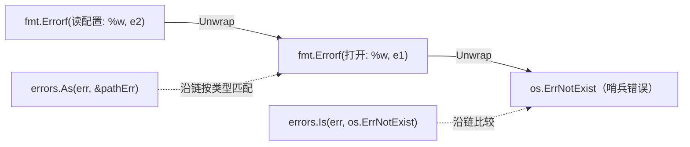

# 7.2 错误值检查

[7.1](./value.md) 讲了"错误即值"以及 Go 1.13 的错误包装。这一节深入包装之后最常用的操作：
如何**穿过错误链**去检查一个错误"是不是某种错误"或"含不含某个类型的错误"。这套
`Unwrap`/`Is`/`As` 机制，是 Go 错误处理真正好用起来的关键。

## 7.2.1 错误链与 Unwrap

用 `%w` 包装错误，会形成一条**错误链**：外层错误记得它的内层错误。`errors.Unwrap(err)` 取出
下一层，沿链可一直挖到最底层。

一个错误若想成为链上一环，只需提供 `Unwrap() error` 方法（`fmt.Errorf` 用 `%w` 时自动生成）。
Go 1.20 起还支持 `Unwrap() []error`,一个错误可以包装**多个**子错误（配合 `errors.Join`），
于是错误链推广成了**错误树**。直接手动 `Unwrap` 逐层判断很少用,真正常用的是基于它的 `Is`
与 `As`。

## 7.2.2 errors.Is：哨兵错误的可靠比较

很多错误是**哨兵**（sentinel）,预先定义的、用于比较的固定值，如 `io.EOF`、`os.ErrNotExist`。
包装之前，只能 `if err == io.EOF`,可一旦中间有人 `%w` 包了一层，这个 `==` 就失效了。
`errors.Is(err, target)` 解决此问题：它**沿整条链**逐层比较，任一层等于 `target`（或实现了
`Is(target) bool` 方法并返回真）就算命中。于是 `errors.Is(err, os.ErrNotExist)` 无论错误被包了
几层都能正确判断。这把脆弱的 `==` 升级成了健壮的、链感知的比较。

## 7.2.3 errors.As：按类型提取

有时调用方想要的不是"是不是某个值"，而是"链上有没有某个**类型**的错误，并把它取出来读字段"。
`errors.As(err, &target)` 沿链查找第一个可赋给 `*target` 类型的错误，找到就赋值并返回真,典型
如从一条链里捞出 `*os.PathError` 去读它的 `Path`。go1.26 还提供了泛型版的 `errors.AsType[E]`
（[8 泛型](../ch08generics)），写法更顺：`pathErr, ok := errors.AsType[*os.PathError](err)`,
是泛型让标准库 API 更符合人体工学的又一例。

## 7.2.4 为何是 Is/As 而非异常类型层级

这套设计与异常语言形成鲜明对比。在 Java/C++ 里，你用 `catch (SpecificException e)` 按**异常类的
继承层级**来分派,错误的"种类"靠类型层级表达。Go 没有异常、也不鼓励为错误建庞大的类型树，
它用两条正交的轴：**值**（哨兵 + `Is`）与**类型**（`As`），都建立在普通接口与一条可组合的链上。
好处是灵活,你可以混用哨兵与类型错误、可以包装任意层、可以让一个错误同时"是"多个东西
（多重 `Unwrap`）;代价是没有 `catch` 那种集中式的分派点，错误检查散落在各处的 `if` 里。这又一次
体现了 Go"用普通的值与接口去表达，而非引入专门的语言机制"的取向。

## 7.2.5 惯用法与陷阱

几条经验。**包装要带上下文**：`fmt.Errorf("read config %s: %w", name, err)`,每层加一句"我在做
什么"，最终的错误信息就是一条清晰的因果链。**想暴露才用 `%w`**：用 `%w` 等于把内层错误纳入
你的 API 契约（调用方可以 `Is`/`As` 到它）;若不想让调用方依赖内部错误，用 `%v` 仅记录文字、
不暴露链。**别过度包装**：每层都包一遍会让链冗长、信息重复,只在跨越有意义的边界时包装。
**定义哨兵还是类型错误**：固定的、无需携带数据的用哨兵（`var ErrNotFound = errors.New(...)`）;
需要携带字段（如出错的路径、行号）的用自定义错误类型，配 `As` 取用。理解了 `Is`/`As` 沿链
工作的机制，这些惯用法就都顺理成章。

## 延伸阅读的文献

1. The Go Authors. *Working with Errors in Go 1.13.* 2019. https://go.dev/blog/go1.13-errors
2. The Go Authors. *errors 包文档（Is / As / Unwrap / Join / AsType）.*
   https://pkg.go.dev/errors
3. Go 1.20 Release Notes（多重 Unwrap、errors.Join）. https://go.dev/doc/go1.20
4. Russ Cox 等. *Error Values 设计文档（Go 1.13）.*
   https://go.googlesource.com/proposal/+/master/design/29934-error-values.md

## 许可

&copy; 2018-2026 The [golang.design](https://golang.design) Initiative Authors. Licensed under [CC-BY-NC-ND 4.0](https://creativecommons.org/licenses/by-nc-nd/4.0/).
