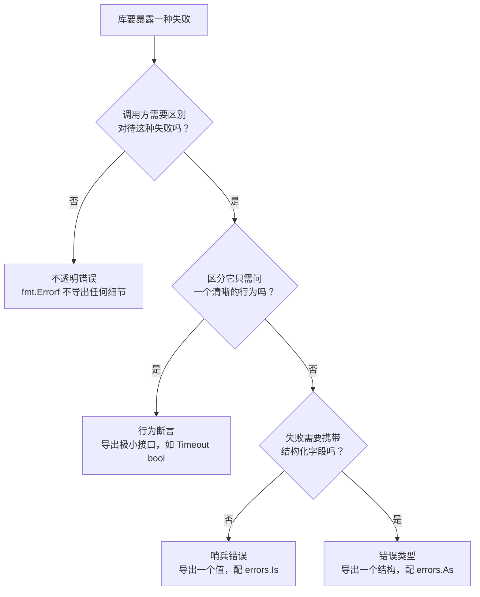

# 7.4 错误语义

[7.2](./inspect.md) 与 [7.3](./context.md) 站在错误的调用方一侧，讲清了拿到一个 `error`
之后如何沿链检查、如何叠加上下文。这一节把视角调到另一侧，站在库作者一侧问一个先于检查的问题：
当一个包要把失败暴露给外界时，它应当把错误做成什么**形式**？是导出一个可比较的值，
还是导出一个带字段的类型，抑或什么都不导出？

这并非纯粹的风格之争。错误的形式一旦发布，就成了包的公开契约的一部分，和函数签名一样难以更改。
调用方会照着这个形式写下分支逻辑，而这些分支逻辑反过来把调用方与库**耦合**在了一起。
不同的形式，承诺给契约的东西不同，因而日后能改动的自由度也不同。本节把社区里成型的几种做法
摆在一起，按「向 API 契约承诺了什么」这条线索逐一称量它们的代价，最后给出一个可操作的取舍次序。

## 7.4.1 哨兵错误：向契约承诺一个值

最直接的做法是导出一个预先创建好的错误值，让调用方拿它做相等比较。标准库里这样的例子俯拾皆是：

```go
package io

// EOF 是 Read 在没有更多输入时返回的错误。
var EOF = errors.New("EOF")
```

```go
package sql

// ErrNoRows 在 QueryRow 没有命中任何行时由 Row.Scan 返回。
var ErrNoRows = errors.New("sql: no rows in result set")
```

调用方据此分支：

```go
row := db.QueryRow("select ...")
if err := row.Scan(&x); errors.Is(err, sql.ErrNoRows) {
    // 查无此行，走业务上的「不存在」分支
}
```

这类预置的错误值称为**哨兵错误**（sentinel error）。它简单到近乎透明，是表达「成功之外的一种确定结局」
的最省力手段。`io.EOF` 之所以不算真正的「错误」而更像一个信号，正因为它表达的是「正常读到了流的末端」。

简单的代价藏在「向契约承诺了一个值」这句话里，而且承诺的东西比初看时要多。`io.EOF` 的文档写得
直白：

> Read 必须返回 EOF 本身，而不能返回一个包装了 EOF 的错误，因为调用方会用 `==` 来检测它。

这一句道出了哨兵的隐性成本。这个值与契约焊得太死，以至于库自己都不能再用 [7.3](./context.md) 的
`%w` 去包装它，否则 `==` 比较就失败了。`errors.Is`（[7.2](./inspect.md)）缓和了这一点，让沿链比较成为
可能，但它要求库与调用方都升级到知晓错误链的写法，且哨兵作为导出变量始终是可被外部重新赋值的可变状态。

更深一层的问题，Dave Cheney 在《Constant errors》中点破：哨兵是「不可代换的」。两个内容完全相同的
`errors.New("EOF")` 并不相等，因此哨兵这个**唯一的实例**本身成了契约。这把两个本不相关的包绑定到了
一起，调用方为了写 `errors.Is(err, io.EOF)`，就必须在源码里 `import "io"`。哨兵适合用在「结局种类少、
语义稳定、不需要携带任何上下文」的场合；一旦失败需要带上参数（哪个文件、哪个字段），它就力不从心了。

## 7.4.2 错误类型：向契约承诺一个结构

当失败需要携带数据时，自然的做法是定义一个实现了 `error` 接口的具体类型，把数据放进字段：

```go
// PathError 记录一次失败的文件操作，以及导致失败的路径与底层错误。
type PathError struct {
    Op   string // 操作名，如 "open"
    Path string // 涉及的路径
    Err  error  // 底层错误
}

func (e *PathError) Error() string {
    return e.Op + " " + e.Path + ": " + e.Err.Error()
}
```

调用方用 `errors.As`（[7.2](./inspect.md)）沿链取出这个类型，再读它的字段：

```go
var perr *fs.PathError
if errors.As(err, &perr) {
    log.Printf("操作 %s 在路径 %s 上失败", perr.Op, perr.Path)
}
```

错误类型比哨兵能传递的信息多得多，这是它的价值。代价是耦合更深了一层：哨兵只承诺一个值，
类型则把整个**结构**承诺给了契约。`As` 的目标必须是这个具体类型，于是调用方代码里写死了
`*fs.PathError`，连同它的字段名一起。库日后想重命名字段、改变字段语义，乃至换一个实现类型，
都会惊动每一个做过断言的调用方。导出的类型越大、字段越多，能改动而不破坏兼容的余地就越小。

这里有一个常被忽视的设计纪律：被导出供 `As` 断言的类型，其导出字段就是 API。给一个错误类型添字段
是安全的，改名或删字段则是破坏性变更。因此值得把暴露的字段压到最小，只保留调用方确实需要分支的那些。

## 7.4.3 不透明错误：什么都不承诺

走到光谱的另一端，是只返回 `error` 接口本身，不导出任何哨兵、任何类型，调用方除了「成功或失败」
之外无从对错误做结构化的判断：

```go
func (c *Config) Load(path string) error {
    f, err := os.Open(path)
    if err != nil {
        return fmt.Errorf("加载配置 %s: %w", path, err)
    }
    defer f.Close()
    // ...
    return nil
}
```

Cheney 称之为**不透明错误**（opaque error），并把它列为多数场合下的首选。它的好处恰恰是哨兵与类型的
代价的反面：调用方能做的只有「`if err != nil` 然后向上传递」，于是它什么也没承诺给契约，
库内部如何实现失败、用什么类型、带什么字段，全是私事，日后可以随意重构而不惊动任何人。耦合降到了最低。

代价同样清楚：调用方失去了对错误分门别类的能力。这个代价并不总是值得付出。有些失败调用方确实需要区别
对待，超时该重试、查无此行该走默认值。把这些场景一律压成不透明错误，等于把本该由库表达的语义推给调用方
去靠匹配错误字符串猜测，那是更糟的耦合。问题于是变成：能不能既让调用方分支，又不把一个值或一个类型
钉进契约？

## 7.4.4 断言行为，而非类型

答案是断言**行为**，而非具体类型。让错误类型实现一个小到只描述「它能回答某个问题」的接口，
调用方去断言这个小接口，而不是断言某个具体类型。标准库 `net` 包给出了这一手法的范本：

```go
package net

// Error 是网络错误的通用接口。
type Error interface {
    error
    Timeout() bool // 这个错误是否由超时引起？
}
```

调用方甚至无须 `import "net"` 去引用这个命名接口，只要就地声明一个结构相同的匿名接口即可：

```go
// 只关心「这个错误能不能告诉我它是超时」
if ne, ok := err.(interface{ Timeout() bool }); ok && ne.Timeout() {
    // 是超时，可以重试
}
```

这一行断言里没有出现任何具体类型，也没有出现任何包名。它问的是「你能回答 `Timeout()` 吗」，
而非「你是不是 `*net.OpError`」。任何愿意实现 `Timeout() bool` 的错误都满足它，无论来自哪个包、
叫什么名字。承诺给契约的，从一个值（哨兵）或一个结构（类型），收缩成了一个**极小的接口**。

值得留意库一侧如何让这个接口在错误链上工作。`net.OpError` 是一个会包装底层错误的类型，
它的 `Timeout()` 并不自己判断，而是把问题转发给被包装的错误：

```go
// 速写：OpError 把「是否超时」转发给它包装的底层错误
func (e *OpError) Timeout() bool {
    if ne, ok := e.Err.(interface{ Timeout() bool }); ok {
        return ne.Timeout()
    }
    return false
}
```

于是「是否超时」这个行为能穿过 `OpError` 这一层包装传到外层，调用方在链顶做一次断言即可。
（真实的 `net.OpError.Timeout` 还为 `*os.SyscallError` 多留了一跳特判，此处略去以见主干。）
要让行为穿过任意深度的包装，需要链上**每一个**会包装他人的错误类型都自觉地这样转发，
这正是上一节说的「库作者承担内务」的具体内容：解耦的便利落在调用方一侧，维持它的功夫落在库一侧。
这与 [7.2](./inspect.md) 里 `errors.Is`/`As` 沿链查找是同一种思路，区别在于 `Is`/`As` 的遍历由
标准库统一完成，而行为的转发要靠每个中间类型各自实现。两相对照，也能看出标准库为何最终把
`Unwrap` 收编为一等约定：把「沿链」这件事从各包的自觉，变成语言层面的统一机制。

这正是 [4.2.7](../ch04type/interface.md) 中「小接口」原则在错误处理上的落点。接口越小，
满足它的类型越多，断言它的调用方与提供它的库之间的耦合就越松。Cheney 把这条原则总结为一句话：
断言错误的行为，而不是它的类型。库保留了几乎全部的实现自由，调用方又拿到了它需要的那一点分支能力，
两端在一个极窄的接口上会合。

行为断言不是免费的午餐，它也有自己的失效方式，而且 `net` 包内部就留着一个活的反例。`net.Error`
早年还有第二个方法 `Temporary() bool`，本意是「这个错误是不是暂时的、值得重试」。它从 Go 1.18 起
被标记为废弃，文档给出的理由是「Temporary errors are not well-defined」：什么样的错误算「暂时」，
始终没有一个各方一致的定义，调用方据此写出的重试逻辑因而并不可靠。教训是：值得断言的行为，
必须是定义清晰、各方共识明确的（如 `Timeout()`），而非一个语义含混的标签（如 `Temporary()`）。
小接口的力量来自它问的那个问题足够锐利，问一个模糊的问题，行为断言的解耦优势也就无从谈起。

## 7.4.5 别家的形式

把视野放到 Go 之外，会看到「错误的形式」其实是各语言在同一个张力上做出的不同选择，
而这张力就是表达力与耦合的权衡。

以异常为主的语言（Java、Python、C++）把错误做成了**类型层级**。`catch (FileNotFoundException e)`
本质上是 [7.4.2](#742-错误类型向契约承诺一个结构) 中的类型断言，只是用继承关系来组织：捕获一个基类
就等于捕获其下所有子类。表达力很强，可携带丰富字段，也能按粗细不同的粒度捕获；代价是整棵异常层级
都进入了契约，且控制流被隐式地从函数签名里抽走，调用方很难从签名看出一个函数会抛出什么。
Go 刻意没有走这条路，[7.1](./value.md) 已述其「错误即值」的取舍。

Rust 走的是另一极：`Result<T, E>` 把错误类型 `E` 写进了类型签名，强迫调用方在编译期处理。
社区用 `thiserror` 为库定义结构化的错误枚举（相当于 Go 的错误类型），用 `anyhow` 把错误装箱成
不透明的 `Box<dyn Error>`（相当于 Go 的不透明错误）。可见「类型」与「不透明」这两种形式并非 Go
独有，而是任何「错误即值」的语言都会面对的选择，区别只在 Go 用接口与运行时断言来表达，
Rust 用枚举与编译期穷尽来表达。把 Go 的四种形式放到这张更大的图上，行为断言是其中最具 Go 特色的
一种：它依赖结构化类型系统（[4.2.4](../ch04type/interface.md)）下「凑齐方法即满足接口」的特性，
在静态名义类型的语言里反而不易复刻。

## 7.4.6 如何取舍

把四种形式按「向契约承诺了什么」排开，取舍的次序就清楚了：

| 形式 | 承诺给契约的 | 耦合 | 调用方能做什么 |
| :-- | :-- | :-- | :-- |
| 不透明错误 | 无 | 最低 | 仅 `err != nil` |
| 行为断言 | 一个极小的接口 | 低 | 断言 `interface{ Timeout() bool }` |
| 哨兵错误 | 一个值 | 中 | `errors.Is(err, ErrX)` |
| 错误类型 | 一个结构 | 高 | `errors.As` 取出并读字段 |

一个可操作的默认次序是：**先做成不透明的**，库不暴露任何内部细节，等到确有调用方需要分支时再说。
当某种失败确实需要被区别对待时，**优先用行为断言**，定义一个尽可能小的接口让调用方去问。
只有当行为不足以表达，譬如失败必须携带结构化的字段供调用方读取时，才退而导出**哨兵或类型**，
并清醒地接受：从这一刻起，这个值或这个结构就是你的 API，它的演化将受 Go 1 兼容性的约束。

把这条次序画成一张判定流程，落到库作者每次设计错误时实际要问自己的几个问题：



这条次序的内在逻辑，是让承诺给契约的东西尽量少。库少承诺一分，日后重构的自由便多一分；
调用方依赖的面越窄，库的内部变动越不容易波及它。这与全书反复出现的一个主题同源：
好的边界不在于暴露得多，而在于暴露得恰到好处，多一分是负担，少一分是失能。错误的形式，
正是这条边界在失败路径上的具体形态。

最后交代一段演进，免得读者把上面的次序当成一成不变的定论。Go 1.13（2019）把 `Unwrap`、`Is`、`As`
纳入标准库（[7.2](./inspect.md)），错误链成为语言层面的约定，这件事悄悄改变了几种形式的相对代价。
在此之前，哨兵一旦被中间层包装就会丢失，`==` 比较失效，这是当年 Cheney 力主不透明错误的重要背景；
`errors.Is` 出现后，哨兵与类型都能穿过包装被识别，它们的实用性回升了一截。但承诺给契约的东西没有
因此变少，哨兵仍是一个值，类型仍是一个结构，`errors.Is`/`As` 改善的是「带上下文」与「可检查」
能否兼得，而非耦合本身。因此本节的次序依旧成立：先少承诺，需要时再多承诺，每多一分都要清楚它换来了什么。
至于把 `if err != nil` 写得更短的种种语法尝试，那是另一个层面的问题，留待 [7.5](./future.md) 详谈。

## 延伸阅读的文献

- [Cheney2016a] Dave Cheney. Don't just check errors, handle them gracefully. GopherCon India, 2016-02; 博文 2016-04-27. https://dave.cheney.net/2016/04/27/dont-just-check-errors-handle-them-gracefully
- [Cheney2016c] Dave Cheney. My philosophy for error handling. GoCon Spring, 2016-04. https://dave.cheney.net/paste/gocon-spring-2016.pdf （哨兵、类型、不透明三种形式取舍的讲稿）
- [Pike2017] Rob Pike. Error handling in Upspin. 2017-12-06. https://commandcenter.blogspot.com/2017/12/error-handling-in-upspin.html （在真实系统里设计错误类型的一手案例）
- [Cheney2014] Dave Cheney. Inspecting errors. 2014-12-24. https://dave.cheney.net/2014/12/24/inspecting-errors
- [Cheney2016b] Dave Cheney. Constant errors. 2016-04-07. https://dave.cheney.net/2016/04/07/constant-errors
- [NetError] The Go Authors. Package net: type Error. https://pkg.go.dev/net#Error
- [IoEOF] The Go Authors. Package io: variable EOF. https://pkg.go.dev/io#EOF
- [GoBlog2019] The Go Blog. Working with Errors in Go 1.13. 2019-10-17. https://go.dev/blog/go1.13-errors
- [Pike2015] Rob Pike. Errors are values. The Go Blog, 2015-01-12. https://go.dev/blog/errors-are-values
