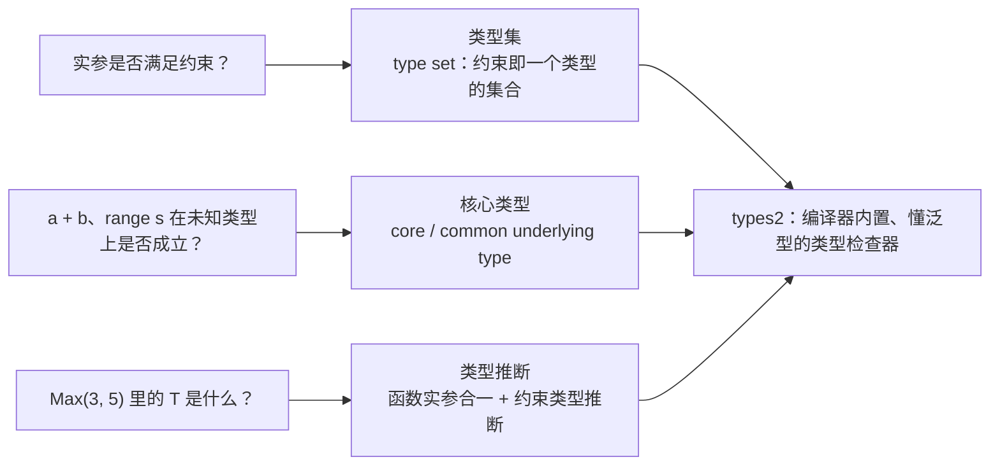

# 8.3 类型检查技术

泛型给类型检查器出了远比从前难的题。从前的判断只有一种形状：「这个值是不是这个类型」。
有了类型参数，检查器还得回答三个新问题：一个类型实参是否满足约束、`a + b` 这样的运算在
未知类型上是否成立、以及调用 `Max(3, 5)` 时那个没写出来的 `T` 到底是什么。这三件事分别对应
本节的三个主题：类型集、核心类型、类型推断。它们是 [8.1](./history.md) 那套设计落到编译期的
具体技术，也是 [15 编译器](../../part5toolchain/ch15compile) 前端的前奏。

贯穿本节的标尺只有一句：泛型让类型系统的复杂度陡增，而 Go 把这份复杂度尽量关在编译器内部，
不让它溢出到用户面前。读完应当能说清，这份「关」是靠哪几样技术做到的。三个新问题与三样技术
一一对应，构成本节的骨架：



## 8.3.1 类型集：约束是一个类型的集合

约束的核心概念是**类型集**（type set）。一个普通接口描述「有哪些方法」，约束接口则进一步描述
「**哪些类型属于我**」。把接口从方法集推广为类型集（[8.1.2](./history.md)），是让既有的接口语法
直接承载约束的关键一步。

类型集由**类型项**（type term）的并集构成。spec 把类型项的语义定得很干净，编译器
`cmd/compile/internal/types2` 里的 `term` 结构原样照搬了这套集合论记号：

```go
// types2/typeterm.go：一个类型项描述一个最基本的类型集（速写）
//
//   ∅:  (*term)(nil)     == ∅                      // 空集
//   𝓤:  &term{}          == 𝓤                      // 全集（所有类型）
//   T:  &term{false, T}  == {T}                    // 恰好是 T 这一个类型
//  ~t:  &term{true, t}   == {t' | under(t') == t}  // 底层类型为 t 的所有类型
type term struct {
    tilde bool // 仅当 typ != nil 时有效
    typ   Type
}
```

于是约束里的三种写法各自对应一种类型项：`int` 是单点集 $\{\texttt{int}\}$；`~int` 是
$\{t \mid \mathrm{under}(t) = \texttt{int}\}$，即所有底层类型为 `int` 的类型（`~` 取的就是
underlying，故 `type Celsius float64` 落在 `~float64` 里）；`A | B` 是并集 $S_A \cup S_B$。
spec 对 `~T` 有两条硬约束：`T` 的底层类型必须是它自己（`~MyInt` 非法），且 `T` 不能是接口
（`~error` 非法）。一个约束接口的最终类型集，是它各类型项并集与各方法所蕴含集合的**交集**：

```go
// types2/typeset.go：一个接口的类型集（速写）
type _TypeSet struct {
    methods    []*Func  // 接口的全部方法，按唯一 ID 排序
    terms      termlist // 类型项列表，其并集描述「哪些类型在集合里」
    comparable bool     // 是否额外要求可比较
}
```

「类型 $T$ 满足约束 $C$」这件事，到这里有了精确定义：$T$ 实现 `methods` 里的全部方法，
**并且** $T$ 落在 `terms` 描述的集合里（若 `comparable` 为真还须可比较）。检查器要做的，
就是计算这些集合、再判断归属。

`comparable` 值得单独一提。它无法写成若干类型项的并集，所以在 `_TypeSet` 里用一个独立的
布尔位表示，是约束体系里一个特殊的内建元素。go1.18 时它严格表示「能在编译期保证 `==` 不会
panic 的类型」，把接口排除在外；go1.20 放宽了规则，普通接口也可满足 `comparable`，代价是
比较两个动态类型不可比的接口值时会在**运行期** panic。这是一处「为了表达力，把一部分检查从
编译期推迟到运行期」的取舍。

## 8.3.2 核心类型：让结构相关的操作有定义

类型集解决了「谁能传进来」，但泛型函数体里还有第二个难题，它分成两类，规则并不相同，这里
要把它们分清楚。

第一类是**运算符**。写下 `func Sum[T Float](a, b T) T` 再写 `a + b`，spec 的规则很直接：
当操作数类型是类型参数时，**该运算符必须对类型集里的每一个类型都成立**，运算按实例化时
具体类型实参的精度进行。所以 `a + b` 在 `interface{ ~float32 | ~float64 }` 上完全成立，
加号对两个底层类型都有定义；`a < b` 在 `constraints.Ordered`（十余个不同底层类型的并集）上
同样成立，正因如此才有 `slices.Sort`。运算符走的是「逐个类型都支持」这条路，**不**要求类型集
有统一的底层类型。

第二类才需要**核心类型**（core type）：那些依赖单一底层**结构**才能定义的操作。`range`、
`append`、切片表达式 `s[i:j]`、`make`、以及元素类型不一致时的 channel 收发，都属此类。
直觉是：若约束的类型集里所有类型共享同一个底层类型，那个底层类型就是核心类型；有了它，
编译器才知道 `range s` 该按什么结构遍历、`s[i:j]` 切出来是什么类型。spec 对这几处的措辞
都是「类型集中所有类型必须有相同的底层类型」。约束 `~[]E` 有核心类型 `[]E`，故 `append`、
`range`、切片都成立；而 `interface{ ~[]int | ~[2]int }` 没有核心类型（一个底层是切片、一个是
数组），`range` 与切片在它上面便无定义。

这条界线画得比直觉细。同是「容器」操作，`len`、`cap` 与**索引** `s[0]` 并不要求核心类型：
只要类型集里每个类型各自支持它们即可，于是这三者在 `~[]int | ~[2]int` 上照样成立（数组与
切片都能取长度、都能索引），尽管它没有核心类型。换言之 Go 把操作按「需不需要统一的底层
结构」精细地分了类,要遍历或切片，得有核心类型；只是取个长度或下标，逐个类型支持就够。
把运算符、`len` 这类「逐个类型」规则与 `range`、切片这类「核心类型」规则混为一谈，是初学
泛型时最常见的误解。

`commonUnder` 的 channel 例外恰好点出核心类型为何不是字面的「底层类型完全相同」。两个方向
不同的 channel（`chan T` 与 `<-chan T`）底层类型并不严格一致，但可归并到受限的那个方向上，
于是 `interface{ chan T | <-chan T }` 仍有可用的核心类型,这类琐碎例外正是当年要专设
「核心类型」这一术语的原因。

这套概念在 go1.18 到 go1.24 的 spec 里叫「core type」。go1.25 起，spec 删去了这个术语，
改用更朴素的说法：**共同底层类型**（common underlying type），即「类型集中所有类型的底层
类型若彼此相同，那个相同的底层类型」。编译器内部对应的函数就叫 `commonUnder`：

```go
// types2/under.go：求一组类型的共同底层类型（速写）
func commonUnder(t Type, cond func(t, u Type) *typeError) (Type, *typeError) {
    var cu Type // 目前为止的共同底层类型
    for t, u := range typeset(t) {
        if cu == nil {            // 见到的第一个类型，记下它的底层类型
            cu = u
            continue
        }
        // 后续每个类型的底层类型都必须与之前的相同，否则没有共同底层类型
        if !Identical(cu, u) {
            return nil, typeErrorf("...have different underlying types")
        }
    }
    return cu, nil
}
```

上面这段速写省去了真实 `commonUnder` 里那段 channel 归并逻辑（§8.3.2 提到的方向例外），
它正是核心类型语义的精确所在。go1.25 简化术语之后，spec 用「共同底层类型」加上 channel 的
单独条款来描述同一件事。有意思的是，编译器内部的 `coreTerm` 注释至今仍写着
「if tpar has a core type」：规范先行改名，实现里的旧称谓往往滞后,这是阅读编译器源码时
常遇到的现象。

## 8.3.3 类型推断：让调用方少写类型实参

若每次调用泛型函数都得显式写全类型实参，`Max[int](3, 5)`、`Map[string, int](...)`，泛型
会沦为一种啰嗦的语法。Go 的检查器实现了**类型推断**（type inference），让绝大多数调用写成
`Max(3, 5)` 即可，缺失的 `T` 由编译器从上下文反推。推断是 Go 泛型「不打扰用户」承诺里
分量最重的一块。

推断在 `types2/infer.go` 里分阶段进行，核心是两路信息来源：

- **函数实参推断**（function argument type inference）：把实参的类型与对应形参的类型做
  **类型合一**（unification），从 `Max(3, 5)` 里 `3`、`5` 是无类型常量、其默认类型为 `int`，
  推出 `T = int`。无类型常量（untyped constant）单独成一个阶段处理：先用有明确类型的实参定
  下能定的类型参数，再用常量补齐剩下的，并为每个仍空缺的类型参数取其「最大无类型类型」。
- **约束类型推断**（constraint type inference）：当函数实参不足以定出全部类型参数时，转而从
  **约束本身的结构**里榨取信息。若某个类型参数 `P` 的约束只有单一类型项、或有核心类型，
  `coreTerm` 就能据此给出 `P` 的候选类型，把已知类型参数沿约束的结构传播到未知的那些上。

```go
// 约束类型推断的入口（签名速写）。已知部分 targs，借约束结构补全其余
//   tparams：全部类型参数      targs：已显式或已推出的实参
//   params/args：形参与实参    返回：补全后的全部类型实参，失败则 nil
func (check *Checker) infer(pos syntax.Pos, tparams []*TypeParam,
    targs []Type, params *Tuple, args []*operand, ...) (inferred []Type)
```

约束类型推断的威力，一个例子最清楚。考虑一个对切片逐元素缩放的函数：

```go
// E 没有出现在任何形参里，单靠函数实参推断无法定出它
func Scale[S ~[]E, E Number](s S, c E) S {
    r := make(S, len(s))
    for i, v := range s {
        r[i] = v * c
    }
    return r
}

var v []int
Scale(v, 2) // 调用方既不写 S 也不写 E
```

第一阶段，函数实参推断从实参 `v []int` 定出 `S = []int`。但 `E` 不出现在任何形参类型里，
函数实参对它无能为力。第二阶段，约束类型推断登场：`S` 的约束是 `~[]E`，把已定出的
`S = []int` 与约束结构 `~[]E` 做合一，立刻得到 `E = int`。一个未在参数列表露面的类型参数，
就这样靠约束自身的结构被反解出来。`constraints` 包里大量「容器加元素」式的签名都依赖这一步。

go1.21 起推断还支持**反向推断**（reverse type inference）：把一个未实例化的泛型函数赋给
一个具名函数类型的变量时，能从那个函数类型反推类型实参。每一版的推断都在变强，但方向始终
克制。

这种克制是 Go 刻意的取舍。推断算法要在两个目标间权衡：「够强」（少写注解）与「可预测」
（不推出意外结果、推断失败时错误信息要好懂）。Go 选择把推断做成**局部的、发生在调用点的、
分阶段的**过程，宁可偶尔要求显式标注，也不让推断行为变得难以捉摸。这与更激进的邻居形成
对照：Haskell 的 Hindley-Milner 在一个绑定组内做全局推断，函数签名常可整个省略；Rust 则在
块内做双向推断，能跨越较长的距离回填类型。Go 的推断不跨越调用边界、不做全局求解，换来的是
错误信息能精确地指向「哪个类型参数没能定出来、为什么」，这对一门以可读性立身的语言是更重要的
属性。表达力的让步，是为了诊断的清晰。

## 8.3.4 types2：编译器自己的、懂泛型的类型检查器

支撑上述一切的，是编译器内部一个名为 **`types2`** 的包
（`cmd/compile/internal/types2`）。它是标准库 `go/types` 的姊妹实现：两者算法同源、行为对齐，
但 `types2` 专为编译器前端而写，直接消费 `cmd/compile/internal/syntax` 的语法树，原生支持
类型参数。泛型落地时，团队选择在 `types2` 里实现这套类型集、核心类型、合一推断的复杂规则，
再让 `go/types` 跟进同样的逻辑。

为什么要维护两份近乎平行的类型检查器？因为它们服务两类截然不同的客户。`types2` 服务编译
本身，要的是与编译流水线紧密咬合、对编译性能敏感。`go/types` 则是一座对外开放的库，`gopls`、
各类 linter、代码生成器都构建在它之上（[16 工具与可观测性](../../part5toolchain/ch16tools)）。
把类型检查独立成可复用的库，意味着编辑器里的跳转、补全、重命名，与编译器对同一段泛型代码的
理解是一致的。这种「编译器与工具共享同一套类型语义」的设计，是 Go 工具生态稳固的一块基石。
代价则是两份实现需要长期保持同步，这份维护负担由 Go 团队承担，对用户不可见。

## 8.3.5 仍未解决的边界

推断的克制是设计选择，也意味着它有意停在若干边界之外，这些边界至今仍在。一是推断是**不完备**
的：存在类型上原本可定、但 Go 的局部分阶段算法不去求解的情形，这时仍需显式写出类型实参，
团队接受这种偶尔的啰嗦，以换取算法可预测。二是**方法不能自带类型参数**：`func (r Recv) M[T any]()`
是非法的，泛型只能加在类型或函数的声明上，这道限制让接口与方法集的语义保持简单，但也挡住了
一类表达（例如一个非泛型接口里放一个泛型方法）。三是推断主要服务于**函数调用**，对泛型**类型**
的实例化，类型实参在多数场合仍需显式给出。这些边界不是 bug，而是「先把保守、可预测的核心
做扎实，再逐版谨慎放宽」策略留下的待办,go1.21 的反向推断就是这样补进来的一块，后续版本仍在
沿同样的节奏推进。

## 8.3.6 取舍：复杂度的重新安置

泛型的类型检查，是 Go 类型系统复杂度的一次显著跃升。类型集的并交运算、核心类型的求解、
合一驱动的多阶段推断，每一项都远比泛型之前的检查繁复。Go 团队接受了这部分复杂度，但把它
几乎完整地关在了**编译器内部**：

- 对用户，约束**就是接口**，无须学习一套新的合约语法（[8.1.2](./history.md)）；
- 调用泛型函数**大多不必写类型实参**，推断替用户补齐；
- 推断与约束检查失败时，错误信息**力求指向具体的类型参数**，而非吐出一堆求解中间态。

这正是 [8.1](./history.md)「破解泛型两难」的另一面。那里讲的是运行期：用 GC 形状 stenciling
加字典，在代码膨胀与运行性能之间取折中。这里讲的是编译期：用类型集加保守推断，在表达力与
认知负担之间取折中。两面合起来，才是 Go 对那道十三年难题的完整回答。复杂度并没有消失，它被
搬到了编译器里这个最不打扰用户的地方。好的语言设计，常常就是这样一次次复杂度的重新安置，
而非复杂度的消除。

## 延伸阅读的文献

1. Ian Lance Taylor, Robert Griesemer. *Type Parameters Proposal.*（类型集、核心类型、
   函数实参推断与约束类型推断的设计依据）
   https://go.googlesource.com/proposal/+/refs/heads/master/design/43651-type-parameters.md
2. Robert Griesemer. *Everything You Always Wanted to Know About Type Inference, And a Little
   Bit More.* The Go Blog, 2023-10-09. https://go.dev/blog/type-inference
3. The Go Programming Language Specification：*Interface types / Type sets / Type constraints.*
   https://go.dev/ref/spec#Interface_types
4. The Go Programming Language Specification：*Type inference.*（含 go1.21 反向推断）
   https://go.dev/ref/spec#Type_inference
5. The Go Authors. go1.25 spec 变更：以「common underlying type」取代「core type」.
   https://go.dev/doc/go1.25 ；规范定义见 https://go.dev/ref/spec#Underlying_types
6. The Go Authors. *cmd/compile/internal/types2*（编译器前端的泛型类型检查器：
   `typeset.go`、`typeterm.go`、`under.go`、`infer.go`）.
   https://github.com/golang/go/tree/master/src/cmd/compile/internal/types2
7. The Go Authors. *go/types* package documentation（驱动 gopls 与 linter 的姊妹实现）.
   https://pkg.go.dev/go/types
