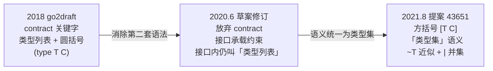

# 8.2 基于合约的泛型

> 本节内容另有一份配套的线上演讲：[YouTube 在线](https://www.youtube.com/watch?v=E16Y6bI2S08)、
> [Google Slides 讲稿](https://changkun.de/s/go2generics/)。讲稿录于合约提案尚在讨论的 2019 年，
> 与本节互为印证。

[8.1](./history.md) 用一句话带过了「先有合约、后转向接口即约束」这段演进。这一节把那句话展开：
合约究竟长什么样、它有多强的表达力、又为何最终被放弃。这段被否决的设计不是历史的废料，它解释了
今天 `[T Ordered]` 语法的由来，也示范了 Go 设计中一个反复出现的动作,先做出一个表达力很强但
偏复杂的方案，再回头追问「这件事能不能用已有的概念表达」，逼着复杂度去赚取自己存在的资格。

本节展示的所有 `contract` 语法都已废弃，仅出现在 2018 年至 2020 年的 go2draft 草案里，
**任何一个 Go 编译器都从未接受过它们**。下文凡是合约写法，都按其在草案中的原貌呈现，并明确标注
「已废弃」，以免与今天可用的语法混淆。

## 8.2.1 约束想解决什么

泛型函数迟早要回答一个问题：类型参数 `T` 能做哪些操作？写一个求最大值的 `Max`，函数体里要用到
比较运算符 `<`，可 `T` 若被实例化成一个不支持比较的类型（比如某个 struct 或 slice），这段代码就
不成立。于是泛型机制必须提供一种手段，让作者**声明** `T` 必须支持哪些操作，并让编译器据此在
实例化处做检查。这就是「约束」（constraint）。

约束不是可有可无的修饰。没有它，泛型只剩两条退路：要么像 C++ 早期模板那样**完全不约束**，类型
错误推迟到实例化时才以一长串难懂的报错暴露出来；要么像 `interface{}` 那样**放弃静态信息**，靠
运行时断言兜底，把类型安全和性能一并丢掉（[8.1](./history.md) 的两难）。约束的价值，正是把
「`T` 得能做什么」这件事提前到声明处讲清楚，让错误在调用点就被拦下，也让编译器有依据生成正确的
代码。问题只剩一个：用什么语法把这组要求写出来。

## 8.2.2 合约：一段不会执行的代码

2018 年 go2draft 给出的第一版答案，是引入一个新关键字 `contract`。合约形如一个函数：它带一组
类型参数，函数体里**罗列**这些类型必须满足的条件。以 `Max` 为例，最朴素的设想是直接在体内写出
要用到的运算符（这是草案探讨过的更早一版写法）：

```go
// 已废弃：2018 草案早期设想，运算符直接写进合约体
contract Ordered(t T) {
    t < t
}
func Max(type T Ordered)(a, b T) T {
    if a < b {
        return b
    }
    return a
}
```

合约体里的 `t < t` 不是要执行的语句，它的意思是「凡满足 `Ordered` 的类型 `T` 都必须支持 `<`」。
请留意类型参数的声明方式,草案用的是**圆括号**：`func Max(type T Ordered)(a, b T) T`，类型参数列表
前缀一个 `type` 关键字。这与今天的方括号 `[T Ordered]` 是两套不同的语法，括号从圆到方的这次更换，
本身就是后文要交代的演进的一部分。

把运算符写进函数体看似自然，却很快遇到麻烦：`+(T, T) T` 这样的算符要求写起来既重复又含糊，还会
和分号自动插入规则纠缠。草案因此转向一种更明确的写法,**类型列表**（type list）：直接枚举出哪些
具体类型属于这个合约。这才是 go2draft 中合约的规范形态：

```go
// 已废弃：2018 草案的规范形态,用类型列表枚举允许的底层类型
contract Ordered(T) {
    T int, int8, int16, int32, int64,
        uint, uint8, uint16, uint32, uint64, uintptr,
        float32, float64,
        string
}
func Max(type T Ordered)(a, b T) T {
    if a < b {
        return b
    }
    return a
}
```

`Ordered` 列出的这些类型恰好都支持 `<`，于是编译器只要确认 `T` 被实例化成列表中的某一个，
就知道 `a < b` 合法。方法要求则另写一行，类型名后跟方法签名：

```go
// 已废弃：要求 T 必须实现 String() string
contract Stringer(T) {
    T String() string
}
```

合约还能**组合**：把另一个合约的名字嵌入体内，等价于把被嵌合约的条件就地展开。

```go
// 已废弃：嵌入 Stringer，再追加一个 Print 方法要求
contract PrintStringer(X) {
    Stringer(X)
    X Print()
}
```

最能体现合约表达力的，是它能约束**多个类型参数之间的关系**。一个合约可以带 `(P1, P2)` 两个类型
参数，在体内写出跨参数的方法签名,要求 `P1` 上有一个接收 `P1`、返回 `P2` 的方法，同时限定 `P2`
的底层类型：

```go
// 已废弃：约束 P1、P2 两个类型参数及其相互关系
contract C(P1, P2) {
    P1 m1(x P1)
    P2 m2(x P1) P2
    P2 int, float64
}
func F(type P1, P2 C)(x P1, y P2) P2 { /* ... */ }
```

`m2(x P1) P2` 这一行同时牵动两个类型参数：它要求 `P2` 有一个方法，参数类型是 `P1`、返回类型是 `P2`。
这种跨参数的关系约束，是普通接口（描述单个类型）天然说不出口的,它正是合约「像第二种语言」那份
表达力的来源，也是后来用接口替代时必须想清楚如何承接的难点。到这里合约的全部本领就摆开了：
枚举底层类型、要求方法、组合既有合约、约束多参数关系。它确实强大，几乎能描述任何想得到的类型间
约束,而这份「几乎无所不能」，恰恰是它的隐患所在。

## 8.2.3 为何被放弃

问题恰恰出在「强大」上。合约把约束写成一段形似函数体、却又不会执行的代码，这种「似是而非」带来
两层认知负担。其一，合约体里能写的东西自成一套规则：哪些语句合法、`t < t` 表示运算符要求而非求值、
类型列表用逗号分隔、方法要求写成另一种形式,这套规则只在合约体内有效，与真正的 Go 代码似像非像。
读者要在脑子里维护「这是合约语境，不是普通函数」的开关。其二，它在语言里立起了**第二套声明机制**：
描述「一个值有哪些方法」用 `interface`，描述「一个类型参数要满足哪些条件」却要用 `contract`，两者
职责高度重叠，却各有语法。

2020 年 6 月的「The Next Step for Generics」把这层顾虑说得很直白：「最大的改动是我们放弃了合约这个
概念。合约与接口类型之间的区别令人困惑，所以我们要消除这个区别。」（"The difference between
contracts and interface types was confusing, so we're eliminating that difference."）这正是 Go 一贯的
口味,它对「往语言里加一门小语言」极为警惕，宁可在已有抽象上做推广，也不轻易引入需要单独学习的
新机制。合约被否，不是因为它做不到，而是因为它要求用户学一套新东西，而这套新东西所做的事，
另一个人人已懂的概念恰好能承担。

## 8.2.4 简化的洞察：从方法集到类型集

那个能承担约束职责的旧概念，就是接口。接口本来描述「一个类型得有哪些**方法**」,这是它的
**方法集**（method set）语义。约束要表达的「一个类型得支持哪些操作」，与之高度重合：方法是操作，
运算符也是操作。差的只是接口原本说不出「`T` 的底层类型必须是 `int`」这类要求。

简化的关键，是把接口的语义从「方法集」推广为**类型集**（type set）：一个接口不再只描述「实现了
这组方法的类型」，而直接描述「**哪些类型**满足它」。方法集是类型集的一种特例(实现了某组方法的所有
类型构成一个集合)，而类型集还能用别的方式划定：枚举底层类型、取并集、内建的 `comparable`。
约束于是不必再发明 `contract`，复用接口即可。`Ordered` 从一段合约代码，变成一个普通的（约束）接口：

```go
// 最终方案：约束就是一个用类型集描述的接口
type Ordered interface {
    ~int | ~int8 | ~int16 | ~int32 | ~int64 |
        ~uint | ~uint8 | ~uint16 | ~uint32 | ~uint64 | ~uintptr |
        ~float32 | ~float64 |
        ~string
}
func Max[T Ordered](a, b T) T {
    if a < b {
        return b
    }
    return a
}
```

同一个 `Max`，对照着读最能看清这次取舍带来的收益。新写法里出现了两个为类型集服务的记号：`|` 是
**并集**，把多个类型并进同一个集合；`~T` 表示「底层类型为 `T` 的所有类型」,有了 `~`，
`type Celsius float64` 这样以 `float64` 为底层类型的自定义类型也落在 `Ordered` 里，而不必逐一列举。
方法要求则直接沿用接口原有的写法（`String() string`），无需另立规则。一个会嵌入另一个的合约组合，
也回归成接口的嵌入。一门小语言被拆解，重新落回 `interface` 这个早已存在的概念上。

至于 8.2.2 末尾那个「普通接口说不出口」的难点,合约约束多个类型参数之间的关系，接口方案靠
**参数化接口**接了下来。当年合约 `C(P1, P2)` 描述的跨参数要求，可以拆成两个带类型参数的接口，再让
`F` 的类型参数列表把它们的参数对齐：

```go
// 最终方案：用参数化接口承接当年合约的多参数关系约束
type I1[P1 any] interface {
    m1(x P1)
}
type I2[P1, P2 any] interface {
    m2(x P1) P2
    ~int | ~float64
}
func F[P1 I1[P1], P2 I2[P1, P2]](x P1, y P2) P2 { /* ... */ }
```

`F[P1 I1[P1], P2 I2[P1, P2]]` 这一行在实例化时把 `I2` 里的 `P1` 与 `I1` 的 `P1` 绑成同一个类型，
合约当年用专门语法表达的关系，于是落进了接口与类型参数已有的组合规则里，没有再多发明一个概念。
对一类常见而合约要靠枚举勉强表达的约束,「这个类型必须支持 `==`」，类型集方案还内建了
`comparable`，直接把「可比较」作为一个类型集纳入语言，省去了 `Ordered` 那样列举全部可比较类型的
笨拙。换言之，简化非但没有损失合约的核心表达力，还在最吃紧的几处给了更顺手的写法。

## 8.2.5 演进的时间线

从合约到类型集并非一步到位，而是分两步逐级**减负**的，每一步都甩掉一些机制。把时间线拉直：



第一步在 2020 年 6 月：合约被整体撤除，约束的职责交给接口，接口内部仍沿用「类型列表」这个说法
（当时尚无 `~` 与「类型集」这套术语）。第二步落在 2021 年 8 月的最终提案 43651：语法定型为方括号
`[T Constraint]`，并把接口的语义正式表述为「类型集」，引入 `~T` 近似元素与 `|` 并集运算符。
正是在这一版里，「type set」成为规范术语，`Ordered` 写成今天的样子。值得一提的是，类型参数的括号
也在这条线上从圆变方,圆括号 `(type T C)` 与普通参数列表混在一起难以区分，方括号 `[T C]` 一眼可辨，
是同一股「降低读者负担」的力气在语法细节上的延续。

每一步都在做减法：先去掉 `contract` 这个关键字，再把「类型列表」收编进「类型集」这一个统一语义。
复杂度并非凭空消失，而是被反复追问「能不能用已有概念表达」,挤压到最后只剩下接口这一个旧抽象的
自然延伸。

## 8.2.6 这次取舍说明了什么

合约的兴废，是 Go 设计过程的一个标本。它印证的不是「简单总比复杂好」这类空话，而是一条更具体的
工作方法：**先允许一个表达力强但偏复杂的方案存在，再反复追问能否用既有概念替代它，让复杂度自己去
证明不可或缺**。合约最终没能通过这道追问,它要求用户学一门只用于约束的小语言，而它所做的一切，
推广后的接口都能做。复杂度没有赚到自己的位置，于是被裁撤。

把视野放到 Go 之外，这段弧线并不孤单。C++ 的 **Concepts** 几乎是同一个故事：它本是一套描述模板参数
约束的机制，因被认为过于复杂而在 2009 年从 C++0x 草案中**移除**，此后经历多年重做，直到 C++20 才以
精简后的形态正式落地（本章题词中 Stroustrup 谈的正是 Concepts）。一套约束机制因复杂而被搁置、
简化后再回归,Go 的合约走的是同一条路，只是它在落地前就完成了这次自我精简，没有把复杂度推给用户去
承受一轮再回收。两相对照可见，「约束该如何表达」是泛型设计中一个公认棘手、各家都交过学费的问题。

读懂这段被放弃的历史，今天 `[T Constraint]` 那份「恰到好处的朴素」便不再是理所当然,它是一版强大
方案被否、再被简化的结果。接下来 [8.3](./checker.md) 会进入类型检查，看编译器如何用类型集这套语义，
在实例化处真正校验 `T` 是否满足约束。

## 延伸阅读的文献

1. Russ Cox. *The Generic Dilemma.* 2009. https://research.swtch.com/generic
   （泛型的两难，合约要解决的约束问题正源于此处的取舍压力）
2. Ian Lance Taylor, Robert Griesemer. *Contracts — Draft Design*（2018，已被取代）.
   https://go.googlesource.com/proposal/+/master/design/go2draft-contracts.md
3. The Go Authors. *The Next Step for Generics.* 2020-06.
   https://go.dev/blog/generics-next-step （宣布放弃合约、改由接口承载约束的转折点）
4. Ian Lance Taylor, Robert Griesemer. *Type Parameters — Draft Design*（2020，接口即约束、
   类型列表阶段）.
   https://go.googlesource.com/proposal/+/master/design/go2draft-type-parameters.md
5. Ian Lance Taylor, Robert Griesemer. *Type Parameters Proposal*（最终方案，2021-08，
   类型集 / `~T` / `|`）.
   https://go.googlesource.com/proposal/+/refs/heads/master/design/43651-type-parameters.md
6. The Go Authors. *Why Generics?* Go 博客, 2019. https://go.dev/blog/why-generics
7. Bjarne Stroustrup. *Concepts: The Future of Generic Programming.* 2017.
   （C++ Concepts 的兴废，与 Go 合约同构的另一段约束机制简化史）

## 许可

&copy; 2018-2026 The [golang.design](https://golang.design) Initiative Authors. Licensed under [CC-BY-NC-ND 4.0](https://creativecommons.org/licenses/by-nc-nd/4.0/).
