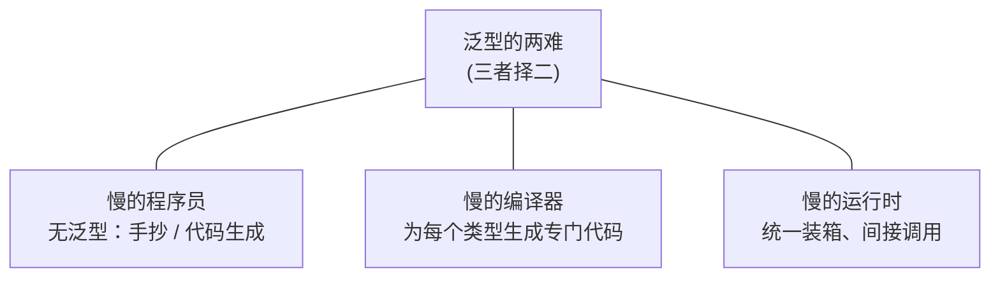
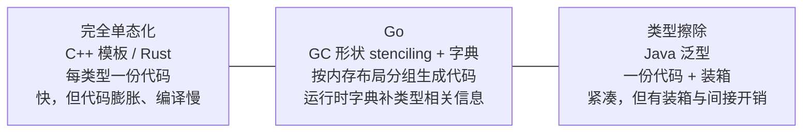

# 8.1 泛型设计的演进

泛型是 Go 等待最久、争论最烈、也最能体现其设计哲学的一项特性。从 2009 年开源到 2022 年的
Go 1.18 才落地，这十三年的迟疑与最终的取舍，本身就是一堂语言设计课。这一节回答三个问题：
Go 为何久久不加泛型、最终怎样加的、它在底层又是如何实现的。后者尤其关键，因为 Go 的实现
没有照搬任何一家成例，而是走了一条独特的中间道路，这条道路才是它对那个十三年难题的真正回答。
设计本身一路如何演变（合约、类型集、多轮语法提案），留待 [8.4](./future.md) 细说，本节只取
其骨架。

## 8.1.1 久拖不决：泛型的两难

缺了泛型，写一段对多种类型行为相同的代码会变成什么样？最直接的办法是为每个类型各抄一份：

```go
func MaxInt(a, b int) int         { if a > b { return a }; return b }
func MaxFloat64(a, b float64) float64 { if a > b { return a }; return b }
func MaxUintptr(a, b uintptr) uintptr { if a > b { return a }; return b }
// ……每多一个类型，就多抄一份逻辑相同的代码
```

逻辑一字不差，只有类型不同。第二条路是用 `interface{}` 把类型差异抹掉，让一份代码服务所有类型：

```go
func Max(a, b interface{}) interface{} {
    // 编译器不知道 a、b 能否比较，只能在运行时断言
    if a.(int) > b.(int) { // 写死了 int，换类型就崩；且每次调用都装箱、断言
        return a
    }
    return b
}
```

这条路丢掉了静态类型安全（比较操作要到运行时才知道对不对），还附带装箱与类型断言的开销。
第三条路是代码生成：写一份模板，用工具按类型批量产出具体版本，社区里 `genny` 是当年的代表：

```go
import "github.com/cheekybits/genny/generic"

// 用 genny 生成具体类型版本：
//   cat max.go | genny gen "T=int,float64,uintptr" > max_gen.go
type T generic.Type

func MaxT(a, b T) T { if a > b { return a }; return b }
```

代码生成恢复了静态类型与性能，代价是构建流程里多一道生成步骤、改一处要重新生成、且工具本身
不参与类型检查。三条路各有取舍，没有一条令人满意，这正是 Go 程序员长期的真实处境。

久拖的根由，Russ Cox 早在 2009 年就点破，即「泛型的两难」（the generic dilemma）：在
「慢的程序员、慢的编译器、慢的运行时」三者之间，任何一种泛型实现似乎只能三选其二。



不加泛型，省了编译器与运行时的代价，却把负担压给程序员（上面三条路都是这个意思）。C++ 模板
选了快运行时，牺牲编译速度与代码体积；Java 选了快编译与小体积，牺牲运行时的装箱开销。Go 极度
看重编译速度与运行时简洁，迟迟没找到一个三者都不太差的方案，于是宁可不做，也不愿草率引入一个
会侵蚀这些价值的设计。这种「想清楚再做」的克制，是 Go 一贯的性格。

## 8.1.2 落地的语法：约束即接口

Go 1.18 最终落地的语法只在已有概念上做了一处加法，方括号声明类型参数，约束写成一个接口：

```go
func Max[T cmp.Ordered](a, b T) T { // T 是类型参数，cmp.Ordered 是它的约束
    if a > b {
        return a
    }
    return b
}

_ = Max[int](3, 5)   // 显式实例化
_ = Max(3.0, 5.0)    // 类型推导，等价于 Max[float64]
```

关键的概念创新是把接口从「方法集」推广为「类型集」（type set）：一个约束接口描述的不再只是
「实现了哪些方法」，而是「哪些类型满足它」。于是 `comparable`（可比较的类型）、`~int`
（底层类型为 int 的类型）、`int | string`（类型的并集）都能作为约束写进接口。用既有的接口
概念去承载泛型约束，避免了再引入「第二种语言」，这正是几经周折后方案的精髓。约束、类型集、
以及从 2018 年合约提案到这套语法的多轮演进，详见 [8.4](./future.md)。

## 8.1.3 实现：GC 形状 stenciling 加字典

实现才是 Go 破解两难的地方。两个极端各有代价。一端是「完全单态化」（full
monomorphization），C++ 模板与 Rust 都走这条路：编译器为每个具体类型实参各生成一份专门代码，
`Max[int]` 与 `Max[float64]` 是两份独立的机器码。好处是运行时零开销、可深度特化，代价是代码
膨胀、编译变慢，以及（尤以 C++ 模板为甚）出了名难懂的错误信息。另一端是「完全类型擦除」
（type erasure），Java 泛型的做法：所有实例共用一份代码，值一律装箱成 `Object`。好处是代码
紧凑、编译快，代价是装箱与间接访问的运行时开销。Go 不愿付任一端的全价，于是落在中间：



Go 的办法叫「GC 形状（GC shape）stenciling 加字典（dictionary）」。名字拗口，但拆开看只有
两半：stencil 是「按形状去重的代码模板」，dictionary 是「补回类型差异的运行时小抄」。先说前
一半。它不为每个具体类型都生成一份代码，而是按「GC 形状」分组：内存布局相同、指针位置相同的
一组类型共用一份生成代码（一个 stencil，模板印版）。之所以叫「GC 形状」而非单纯「内存布局」，
是因为垃圾回收要据此判断一块内存里哪些字是指针（[13](../../part4memory/ch13gc)），指针位置一致是同形状的
硬条件，这也点出 Go 的实现一开始就与它的垃圾回收纠缠在一起。一个类型的形状，编译器取它的
底层类型（underlying type）来代表。这意味着
`Max[int]` 与 `Max[float64]` 形状不同（一个 8 字节整数、一个 8 字节浮点，标量类型不合并），
各得一份 stencil；而所有「以指针实参实例化、约束又只是普通接口」的调用会塌缩到同一个形状。
在编译器里这一步叫 `Shapify`，它对指针实参直接取一个统一的 `*byte` 作形状：

```go
// 形状归并的核心规则（取自 cmd/compile/internal/noder 的 Shapify，已裁剪）
//   指针实参 + 约束是普通接口 ⇒ 元素类型不影响生成代码，统一用 *byte 作形状
//   其余情形           ⇒ 以类型的底层类型（underlying type）作形状
func Shapify(targ *types.Type, basic bool) *types.Type {
    under := targ.Underlying()
    if basic && targ.IsPtr() && !targ.Elem().NotInHeap() {
        under = types.NewPtr(types.Types[types.TUINT8]) // 所有指针塌缩为 *byte
    }
    // ……以 under 为键，在 shape 包里查得（或新建）唯一的形状类型
}
```

于是凡是「以指针实例化、约束又只是 `any` 这类普通接口」的泛型函数，无论指针指向 `Node` 还是
`os.File`，都共用同一份机器码，这正是混合方案省下代码体积的要害：指针是泛型容器里最常见的
实参，把它们一网打尽，单态化的膨胀就被压住了大半。需要说明的是，
现行实现只塌缩指针，相同尺寸的标量（如 `int` 与 `int64`）尚未合并，源码里的 `TODO` 仍把更
激进的形状归并列为未来工作。形状越粗，省的代码越多，但下面要讲的字典与间接开销也越重，这是
一个仍在调整的旋钮。

同一份 stencil 要服务多个具体类型，它缺的那部分「类型相关信息」从哪来？答案是调用时由一个
「运行时字典」作为隐藏参数传进去。每个被实例化的泛型函数都对应一个编译期生成的字典，按需
携带这一份实例真正用得到的东西：

```go
// 某个泛型实例的运行时字典携带什么（概念速写，非源码结构体）
type dictionary struct {
    // 类型参数与派生类型的类型描述符：用于 new、类型断言、把值塞进 interface{}
    typ_T      *_type   // 类型参数 T 实参的描述符，如 *Node
    derived    []*_type // 函数体里出现的派生类型，如 []T、map[T]V 的描述符

    // 子字典：函数体若调用别的泛型函数，被调者的字典在此预先备好
    subdicts   []unsafe.Pointer

    // itab：把类型实参转成某约束接口时所需的接口表（见 4.2）
    itabs      []*itab

    // 类型参数的方法表达式：约束若声明了方法，按实参类型解析到的具体实现
    methods    []unsafe.Pointer
}
```

这几类条目并非凭空罗列，它们对应编译器内部 `readerDict` 真实持有的几组数据（类型描述符、
子字典、itab、方法表达式）。逻辑是：凡是「单凭形状无法确定、必须知道具体类型才能做」的事，
形状代码就不自己算，而是去字典里取。要 `new(T)` 就查 `typ_T`，要把 `T` 装进 `interface{}`
就查它的描述符，要调用约束里的方法就查 `methods`，要再调另一个泛型函数就把对应 `subdicts`
传下去。

这条「把类型相关的东西显式作为隐藏参数传递」的思路，与 [4.2](../ch04type/interface.md) 谈到的
Haskell「类型类的字典传递」一脉相承。Haskell 编译一个受 `Ord a` 约束的函数时，会把 `Ord` 的
方法实现打包成一个字典，作为额外参数传入；Go 的运行时字典正是这套机制在命令式语言里的回响。
两端的代价也一样：经字典的一次间接访问。手写一个受具体接口约束、直接调用其方法的函数，方法
调用是一次普通的接口分派；而形状化的版本若要调约束方法或构造 `T` 的值，得先读字典、再间接
跳转，因此泛型代码有时未必比手写的具体类型代码快。这是 Go 团队后续版本持续打磨的方向，
也是混合方案为省代码所付的那一笔利息。

把这条机制落到 `Max` 上走一遍，整张图就连起来了。`Max` 的约束是 `cmp.Ordered`，它能接受的
实参只有可比较大小的标量（整数、浮点、字符串），所以 `Max` 这个例子里没有指针塌缩可言，每个
具体类型各得一份 stencil，`>` 直接编译成该形状对应的机器指令，不经字典：

```go
_ = Max[int]    // 形状 int    ⇒ stencil_A，> 编译成整数比较指令，字典只携带 int 描述符
_ = Max[int64]  // 形状 int64  ⇒ stencil_B（标量互不合并），字典携带 int64 描述符
_ = Max[string] // 形状 string ⇒ stencil_C，> 编译成字符串比较，字典携带 string 描述符
```

指针塌缩的好处要换一个约束才看得见。考虑一个 `any` 约束的工具函数，它对元素只搬运、不比较：

```go
func Last[T any](s []T) T { return s[len(s)-1] }

_ = Last[*Node] // 形状 *byte ⇒ stencil_P，字典携带 *Node 的描述符
_ = Last[*File] // 形状 *byte ⇒ 复用 stencil_P！只换字典携带 *File 的描述符
```

`Last` 的约束是普通接口 `any`，元素具体指向什么类型不影响「取末位」这段逻辑，于是 `Shapify`
把所有指针实参塌缩成 `*byte`，`Last[*Node]` 与 `Last[*File]` 共用同一份机器码。可以把这份
形状代码想成下面这样，原本要知道 `T` 的地方都改成「向字典要」：

```go
// stencil_P 服务所有指针实参（概念示意，非真实生成码）
func Last_ptr(dict *dictionary, s sliceHeader) unsafe.Pointer {
    // 取末位只是指针算术，与 T 的具体类型无关，形状代码自己就能做；
    // 唯有当要把结果装进 interface{}、或 new(T) 时，才去 dict.typ_T 取描述符
    return elemAt(s, s.len-1)
}
```

`Last[*Node]` 与 `Last[*File]` 区别只在传入的字典不同。这就是混合方案的全部诀窍：代码按形状
去重，类型差异收进字典。`Max` 展示标量各占一份、`>` 内联不查字典的一面；`Last` 展示指针塌缩
共享一份、靠字典补类型描述符的一面。两面合起来，才是 GC 形状 stenciling 的完整图景。

形式地看，设程序里出现 $n$ 个不同的具体类型实参、归并后得到 $s$ 个形状（$s \le n$，指针越多
$s$ 越小于 $n$），完全单态化的代码量正比于 $n$，类型擦除正比于 $1$，而 Go 介于其间，正比于
$s$。代价侧则相反：单态化的每次调用都是直连、无额外间接；擦除与 Go 都要付间接访问，Go 这笔
间接只在「必须知道具体类型」的操作上发生（构造 `T`、装箱、调约束方法），比擦除「事事装箱」
要省。换言之 Go 用一个可调的 $s$，在代码体积 $O(s)$ 与间接开销之间换得了一个折中点，而把
旋钮（形状归并多激进）留给了未来。

## 8.1.4 跨语言对照

把实现策略排开看，泛型的版图就清晰了。**C++ 模板**与 **Rust** 走完全单态化：运行时零开销、
能高度特化，代价是代码膨胀、编译慢，以及难懂的错误信息（C++ 模板尤甚，Rust 以 trait bound
把约束前置，错误信息友善许多）。**Java** 走类型擦除：泛型只存在于编译期，运行时被擦成
`Object` 加装箱，因此 Java 没有运行时的泛型类型信息（写不出 `List<int>`，只能 `List<Integer>`）。
**C#** 做了「具体化」（reified）泛型：运行时保留类型参数，值类型不装箱、引用类型共享代码，
由 CLR 在加载时按需特化，比 Java 更进一步。**Haskell** 用类型类加字典传递，Go 的字典法正是
这条线在命令式语言里的回响。

Go 在这张版图上的位置是「中间偏务实」：既不像模板那样为零开销与特化付出膨胀，也不像擦除那样
彻底放弃类型信息，而是按 GC 形状分组共享代码、用字典补齐差异，在代码体积、编译速度与运行时
性能三者间求一个各方面都还过得去的折中。它最接近的精神同道其实是 C#（都保留类型信息、都对
引用/指针共享代码），但 Go 把「共享」的粒度交给了 GC 形状这一更贴近运行时与垃圾回收的概念。

## 8.1.5 取舍与未来

Go 泛型刻意省略了许多别家有的东西：没有模板元编程、没有特化（specialization）、没有高阶
类型（higher-kinded types）、没有运算符重载、方法不能带额外的类型参数。这些省略是有意的，
团队反复强调「先加最小可用的泛型，再看实践需要什么」，避免重蹈「一口气加一大堆复杂特性却
尾大不掉」的覆辙。

后续演进延续这一节奏。Go 1.21 为标准库补上了 `slices`、`maps`、`cmp` 等泛型工具包，让泛型
从语言特性变为日常可用的库；Go 1.24 补齐了泛型类型别名（[4.3](../ch04type/alias.md)）；而
字典间接带来的性能开销，以及更激进的形状归并，仍在被逐步打磨。

实现层面仍有未竟之处可供留意。其一是形状归并的粒度，前文 `Shapify` 的 `TODO` 已列出方向：
把相同尺寸、相同对齐的标量塌缩为同一形状，递归地对复合类型的成员做形状化，丢弃结构体的
字段名与标签。这些优化能进一步把 $s$ 压向 $1$、省下更多代码，但需要先精确追踪「类型参数到底
被怎样使用」，否则塌缩过头会让本可内联的操作退化为查字典。其二是去虚化（devirtualization）与
内联：当编译器能在调用点看穿具体实例时，理应把经字典的间接调用还原为直连，把这笔利息退回去。
这两件事都指向同一个目标，让形状化代码在保住小体积的同时，逼近手写具体类型代码的速度。泛型这十三年的故事，是 Go
设计哲学的缩影：对复杂度极度警惕，宁可慢一步也要想清楚，最终用一个并不炫技、却各方面都站得住
的方案落地。约束、类型集与历次语法提案的来龙去脉，是这个故事的另一半，下一节
[8.4](./future.md) 接着讲。

## 延伸阅读的文献

1. Russ Cox. *The Generic Dilemma.* 2009.
   https://research.swtch.com/generic （「三者择二」的最初表述）
2. Ian Lance Taylor, Robert Griesemer. *Type Parameters Proposal*（Go 1.18 泛型，
   合约到类型集的演进与最终语法）.
   https://go.googlesource.com/proposal/+/refs/heads/master/design/43651-type-parameters.md
3. The Go Authors. *Generics implementation: GC shape stenciling with dictionaries*
   （go1.18 实现设计文档，本节实现部分的主要依据）.
   https://go.googlesource.com/proposal/+/refs/heads/master/design/generics-implementation-dictionaries-go1.18.md
4. The Go Authors. *cmd/compile/internal/noder/reader.go*（`readerDict` 与 `Shapify`，
   字典条目与形状归并的实际实现）.
   https://github.com/golang/go/blob/master/src/cmd/compile/internal/noder/reader.go
5. The Go Authors. *Go 1.18 Release Notes（泛型）.* https://go.dev/doc/go1.18
6. Robert Griesemer, Ian Lance Taylor. *An Introduction To Generics.* 2022.
   https://go.dev/blog/intro-generics
7. Philip Wadler, Stephen Blott. *How to make ad-hoc polymorphism less ad hoc.* POPL 1989.
   （类型类与字典传递的原始论文，Go 字典法的理论源头）
8. The Go Authors. *Proposal: Generics（design/15292 系列）.* golang/proposal.
   https://github.com/golang/proposal/tree/master/design/15292 （2010 至 2018
   历次泛型草案的存档，含 Taylor 的 Type Functions、Generalized Types、Type Parameters
   in Go，Mills 的 Compile-time Functions，以及 Cox 的 Generics — Problem Overview，
   本节「十三年演进」的一手脉络即源出于此）
