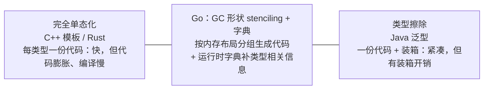

# 8.1 泛型设计的演进

泛型是 Go 等待最久、争论最烈、也最能体现其设计哲学的一项特性。从 2009 年开源到 2022 年的
Go 1.18 才落地，这十三年的迟疑与最终的取舍，本身就是一堂语言设计课。这一节讲清 Go 为何久久
不加泛型、最终怎样加的，以及它在底层是如何实现的,后者尤其关键，因为 Go 的实现走了一条
独特的中间道路。

## 8.1.1 久拖不决：泛型的两难

Go 团队并非不知道泛型有用,缺了它，写一个通用的容器或算法，要么用 `interface{}` 加类型断言
（丢掉类型安全、有装箱开销），要么用代码生成（笨重）。久拖的原因，Russ Cox 在 2009 年就点破，
即**泛型的两难**：在"慢的程序员、慢的编译器、慢的运行时"之间，任何泛型实现似乎只能三选其二。
C++ 模板选了快运行时（牺牲编译速度与代码体积），Java 选了快编译（牺牲运行时的装箱开销）。
Go 极度看重编译速度与运行时简洁，迟迟没找到一个三者都不太差的方案,于是宁可不做，也不愿
草率引入会侵蚀这些价值的设计。这种"想清楚再做"的克制，是 Go 一贯的性格。

## 8.1.2 从合约到类型集

第一次认真的尝试是 2018 年的**合约**（contracts）提案：用一段类似函数体的代码来描述类型参数
必须支持的操作。社区反馈它"像第二种语言"，太复杂。团队据此大幅简化，2020 年的提案改用一个
更优雅的想法：**让接口承担约束的职责**。Go 1.18 最终落地的语法是 `func F[T any](x T)`,
方括号声明类型参数，约束就是一个接口。关键的概念创新是把接口从"方法集"推广为**类型集**
（type set）：一个约束接口描述的是"哪些类型满足它"。于是 `comparable`（可比较的类型）、
`~int`（底层类型为 int 的类型）、`int | string`（并集）都能作为约束写进接口。用既有的接口概念
去承载泛型约束，避免了引入"第二种语言",这正是简化后方案的精髓。

## 8.1.3 实现：GC 形状 stenciling 加字典

实现才是 Go 破解"两难"的地方。两个极端各有代价：**完全单态化**（C++ 模板、Rust,为每个具体
类型生成一份专门代码）运行时快，但代码膨胀、编译变慢;**完全类型擦除**（Java,所有类型共用
一份代码、值装箱）代码紧凑，但有装箱与间接开销。Go 选了一条中间路。

Go 的办法是 **GC 形状（GC shape）stenciling 加字典（dictionary）**。它不为每个具体类型都生成
一份代码，而是按 **GC 形状**分组,内存布局相同、指针位置相同的一组类型（例如所有指针类型）
共用一份生成的代码（一个 stencil）。同一份代码要处理不同的具体类型，缺的那部分类型相关信息
（具体类型的描述符、方法、用到的其他泛型函数的实例等）则在调用时通过一个**运行时字典**传进去。
这条思路与 [4.2](../ch04type/interface.md) 提到的 Haskell **类型类的字典传递**一脉相承,把"类型
相关的东西"显式地作为一个隐藏参数传递。如此，Go 在代码体积（不为每个类型都复制）、编译速度、
与运行时性能之间取得了折中,这是它对那个十三年两难的回答。代价是：经字典的间接访问，使泛型
代码有时未必比手写的具体类型代码快，这也是 Go 团队后续版本持续优化的方向。

## 8.1.4 跨语言对照

把实现策略排开看，泛型的版图很清晰。**C++ 模板**与 **Rust** 走完全单态化：运行时零开销、
能高度特化，代价是代码膨胀、编译慢，以及（C++ 模板）出了名难懂的错误信息。**Java** 走类型擦除：
泛型只存在于编译期，运行时被擦成 `Object` 加装箱，因此 Java 泛型没有运行时类型信息（`List<int>`
不存在、要 `List<Integer>`）。**C#** 则做了**具体化**（reified）泛型,运行时保留类型参数，值类型
不装箱，比 Java 更进一步。**Haskell** 用类型类加字典传递,而 Go 的字典法正是这条线在命令式
语言里的回响。Go 在这张版图上的位置是"中间偏务实"：既不像模板那样追求零开销与特化，也不像
擦除那样彻底放弃类型信息，而是用 GC 形状分组加字典，求一个各方面都还不错的平衡。

## 8.1.5 取舍与未来

Go 泛型刻意**省略**了许多别家有的东西：没有模板元编程、没有特化（specialization）、没有
高阶类型、没有运算符重载。这种克制是有意的,团队反复强调"先加最小可用的泛型，再看实践
需要什么"，避免重蹈"加了一大堆复杂特性却尾大不掉"的覆辙。后续的演进延续这一节奏：Go 1.21
为标准库加了 `slices`、`maps`、`cmp` 等泛型工具包，Go 1.24 补上了泛型类型别名
（[4.3](../ch04type/alias.md)），而字典间接带来的性能开销仍在被逐步打磨。泛型这十三年的故事，
是 Go 设计哲学的缩影：**对复杂度极度警惕，宁可慢一步也要想清楚，最终用一个并不炫技、却各方面
都站得住的方案落地。**

## 延伸阅读的文献

1. Russ Cox. *The Generic Dilemma.* 2009. https://research.swtch.com/generic
2. Ian Lance Taylor, Robert Griesemer. *Type Parameters Proposal*（Go 1.18 泛型，
   合约→类型集的演进）.
   https://go.googlesource.com/proposal/+/refs/heads/master/design/43651-type-parameters.md
3. The Go Authors. *Go 1.18 Generics implementation: GC shape stenciling with dictionaries*
   （设计文档）.
   https://go.googlesource.com/proposal/+/refs/heads/master/design/generics-implementation-dictionaries-go1.18.md
4. The Go Authors. *Go 1.18 Release Notes（泛型）.* https://go.dev/doc/go1.18 ；
   *An Introduction To Generics.* https://go.dev/blog/intro-generics

## 许可

&copy; 2018-2026 The [golang.design](https://golang.design) Initiative Authors. Licensed under [CC-BY-NC-ND 4.0](https://creativecommons.org/licenses/by-nc-nd/4.0/).
