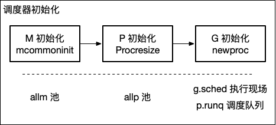
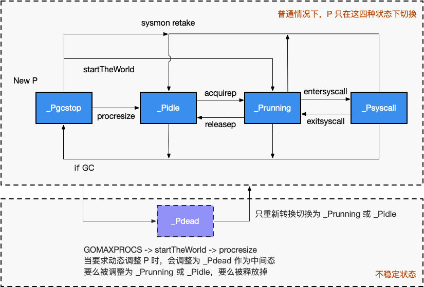
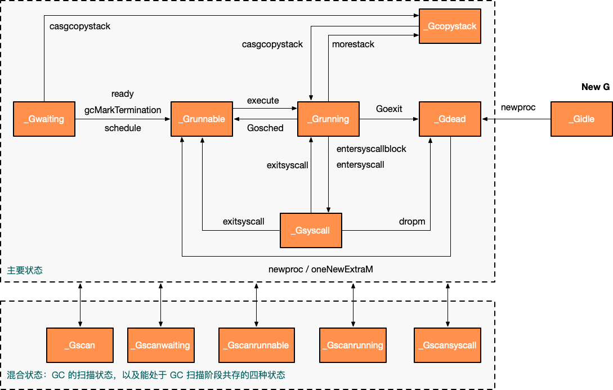

# 6.2 初始化

[TOC]

我们已经在 [初始化概览](../../part1basic/ch05life/init.md) 中粗略了解到 `schedinit` 函数，
现在我们来仔细分析里面真正关于调度器的初始化步骤。

```go
// runtime/proc.go
func schedinit() {
	_g_ := getg()
	(...)

	// M 初始化
	mcommoninit(_g_.m)
	(...)

	// P 初始化
	if procresize(procs) != nil {
		throw("unknown runnable goroutine during bootstrap")
	}
	(...)
}
```

```asm
TEXT runtime·rt0_go(SB),NOSPLIT,$0
	(...)
	CALL	runtime·schedinit(SB) // M, P 初始化
	MOVQ	$runtime·mainPC(SB), AX
	PUSHQ	AX
	PUSHQ	$0
	CALL	runtime·newproc(SB) // G 初始化
	POPQ	AX
	POPQ	AX
	(...)
	RET

DATA	runtime·mainPC+0(SB)/8,$runtime·main(SB)
GLOBL	runtime·mainPC(SB),RODATA,$8
```



**图1: MPG 初始化过程。M/P/G 彼此的初始化顺序遵循：`mcommoninit` --> `procresize` --> `newproc`，他们分别负责初始化 M 资源池（allm）、P 资源池（allp）、G 的运行现场（g.sched）以及调度队列（p.runq）。**

## M 初始化

M 其实就是 OS 线程，它只有两个状态：自旋、非自旋。
在调度器初始化阶段，只有一个 M，那就是主 OS 线程，因此这里的 `commoninit` 仅仅只是将对 M 进行一个初步的初始化，
该初始化进包含对 M 及用于处理 M 信号的 G 的相关运算操作，未涉及工作线程的暂止和复始。

```go
// src/runtime/proc.go

func mcommoninit(mp *m) {
	(...)

	lock(&sched.lock)
	(...)

	// mnext 表示当前 m 的数量，还表示下一个 m 的 id
	mp.id = sched.mnext
	// 增加 m 的数量
	sched.mnext++

	(...) // 初始化 gsignal，用于处理 m 上的信号

	// 添加到 allm 中，从而当它刚保存到寄存器或本地线程存储时候 GC 不会释放 g.m
	mp.alllink = allm

	// NumCgoCall() 会在没有使用 schedlock 时遍历 allm，等价于 allm = mp
	atomicstorep(unsafe.Pointer(&allm), unsafe.Pointer(mp))
	unlock(&sched.lock)

	(...)
}
```

这里省略了对不影响本节内容的 `gsignal` 的初始化过程，其作用参见 [调度器: 信号处理机制](signal.md)。

## P 初始化

在看 `runtime.procresize` 函数之前，我们先概览一遍 P 的状态转换图，如图 1 所示。



**图 1: P 的状态转换图**

通常情况下（在程序运行时不调整 P 的个数），P 只会在四种状态下进行切换。
当程序刚开始运行进行初始化时，所有的 P 都处于 `_Pgcstop` 状态，
随着 P 的初始化（`runtime.procresize`），会被置于 `_Pidle`。

当 M 需要运行时，会 `runtime.acquirep`，并通过 `runtime.releasep` 来释放。
当 G 执行时需要进入系统调用时，P 会被设置为 `_Psyscall`，
如果这个时候被系统监控抢夺（`runtime.retake`），则 P 会被重新修改为 `_Pidle`。
如果在程序运行中发生 GC，则 P 会被设置为 `_Pgcstop`，
并在 `runtime.startTheWorld` 时重新调整为 `_Pidle` 或者 `_Prunning`。

因为这里我们还在讨论初始化过程，我们先只关注 `runtime.procresize` 这个函数：

<!-- // 修改 P 的数量，此时所有工作均被停止 STW， sched 被锁定
// gcworkbufs 既不会被 GC 修改，也不会被 write barrier 修改
// 返回带有 local work 的 P 列表，他们需要被调用方调度 -->
```go
func procresize(nprocs int32) *p {
	// 获取先前的 P 个数
	old := gomaxprocs
	(...)

	// 更新统计信息，记录此次修改 gomaxprocs 的时间
	now := nanotime()
	if sched.procresizetime != 0 {
		sched.totaltime += int64(old) * (now - sched.procresizetime)
	}
	sched.procresizetime = now

	// 必要时增加 allp
	// 这个时候本质上是在检查用户代码是否有调用过 runtime.MAXGOPROCS 调整 p 的数量
	// 此处多一步检查是为了避免内部的锁，如果 nprocs 明显小于 allp 的可见数量（因为 len）
	// 则不需要进行加锁
	if nprocs > int32(len(allp)) {
		// 此处与 retake 同步，它可以同时运行，因为它不会在 P 上运行。
		lock(&allpLock)
		if nprocs <= int32(cap(allp)) {
			// 如果 nprocs 被调小了，扔掉多余的 p
			allp = allp[:nprocs]
		} else {
			// 否则（调大了）创建更多的 p
			nallp := make([]*p, nprocs)
			// 将原有的 p 复制到新创建的 new all p 中，不浪费旧的 p
			copy(nallp, allp[:cap(allp)])
			allp = nallp
		}
		unlock(&allpLock)
	}

	// 初始化新的 P
	for i := old; i < nprocs; i++ {
		pp := allp[i]

		// 如果 p 是新创建的(新创建的 p 在数组中为 nil)，则申请新的 P 对象
		if pp == nil {
			pp = new(p)
		}
		pp.init(i)
		atomicstorep(unsafe.Pointer(&allp[i]), unsafe.Pointer(pp)) // allp[i] = pp
	}

	_g_ := getg()
	// 如果当前正在使用的 P 应该被释放，则更换为 allp[0]
	// 否则是初始化阶段，没有 P 绑定当前 P allp[0]
	if _g_.m.p != 0 && _g_.m.p.ptr().id < nprocs {
		// 继续使用当前 P
		_g_.m.p.ptr().status = _Prunning
		(...)
	} else {
		// 释放当前 P，因为已失效
		if _g_.m.p != 0 {
			_g_.m.p.ptr().m = 0
		}
		_g_.m.p = 0
		_g_.m.mcache = nil

		// 更换到 allp[0]
		p := allp[0]
		p.m = 0
		p.status = _Pidle
		acquirep(p) // 直接将 allp[0] 绑定到当前的 M

		(...)
	}

	// 从未使用的 p 释放资源
	for i := nprocs; i < old; i++ {
		p := allp[i]
		p.destroy()
		// 不能释放 p 本身，因为他可能在 m 进入系统调用时被引用
	}


	// 清理完毕后，修剪 allp, nprocs 个数之外的所有 P
	if int32(len(allp)) != nprocs {
		lock(&allpLock)
		allp = allp[:nprocs]
		unlock(&allpLock)
	}

	// 将没有本地任务的 P 放到空闲链表中
	var runnablePs *p
	for i := nprocs - 1; i >= 0; i-- {
		// 挨个检查 p
		p := allp[i]

		// 确保不是当前正在使用的 P
		if _g_.m.p.ptr() == p {
			continue
		}

		// 将 p 设为 idel
		p.status = _Pidle
		if runqempty(p) {
			// 放入 idle 链表
			pidleput(p)
		} else {
			// 如果有本地任务，则为其绑定一个 M
			p.m.set(mget())
			// 第一个循环为 nil，后续则为上一个 p
			// 此处即为构建可运行的 p 链表
			p.link.set(runnablePs)
			runnablePs = p
		}
	}
	stealOrder.reset(uint32(nprocs))
	atomic.Store((*uint32)(unsafe.Pointer(gomaxprocs)), uint32(nprocs)) // gomaxprocs = nprocs
	return runnablePs // 返回所有包含本地任务的 P 链表
}

// 初始化 pp，
func (pp *p) init(id int32) {
	// p 的 id 就是它在 allp 中的索引
	pp.id = id
	// 新创建的 p 处于 _Pgcstop 状态
	pp.status = _Pgcstop
	(...)

	// 为 P 分配 cache 对象
	if pp.mcache == nil {
		// 如果 old == 0 且 i == 0 说明这是引导阶段初始化第一个 p
		if id == 0 {
			(...)
			pp.mcache = getg().m.mcache // bootstrap
		} else {
			pp.mcache = allocmcache()
		}
	}
	(...)
}

// 释放未使用的 P，一般情况下不会执行这段代码
func (pp *p) destroy() {
	// 将所有 runnable goroutine 移动至全局队列
	for pp.runqhead != pp.runqtail {
		// 从本地队列中 pop
		pp.runqtail--
		gp := pp.runq[pp.runqtail%uint32(len(pp.runq))].ptr()
		// push 到全局队列中
		globrunqputhead(gp)
	}
	if pp.runnext != 0 {
		globrunqputhead(pp.runnext.ptr())
		pp.runnext = 0
	}
	(...)
	// 将当前 P 的 G 复链转移到全局
	gfpurge(pp)
	(...)
	pp.status = _Pdead
}
```

`procresize` 这个函数相对较长，我们来总结一下它主要干了什么事情：

1. 调用时已经 STW，记录调整 P 的时间；
2. 按需调整 `allp` 的大小；
3. 按需初始化 `allp` 中的 P；
4 如果当前的 P 还可以继续使用（没有被移除），则将 P 设置为 _Prunning；
5. 否则将第一个 P 抢过来给当前 G 的 M 进行绑定
6. 从 `allp` 移除不需要的 P，将释放的 P 队列中的任务扔进全局队列；
7. 最后挨个检查 P，将没有任务的 P 放入 idle 队列
8. 出去当前 P 之外，将有任务的 P 彼此串联成链表，将没有任务的 P 放回到 idle 链表中

显然，在运行 P 初始化之前，我们刚刚初始化完 M，因此第 7 步中的绑定 M 会将当前的 P 绑定到初始 M 上。
而后由于程序刚刚开始，P 队列是空的，所以他们都会被链接到可运行的 P 链表上处于 `_Pidle` 状态。

## G 初始化

运行完 `runtime.procresize` 之后，我们知道，主 goroutine 会以被调度器调度的方式进行运行，
这将由 `runtime.newproc` 来完成主 goroutine 的初始化工作。

在看 `runtime.newproc` 之前，我们先大致浏览一下 G 的各个状态，如图 2 所示。



**图2: G 的转状态转换图**

我们接下来就来粗略看一看 `runtime.newproc`：

```go
//go:nosplit
func newproc(siz int32, fn *funcval) {
	// 从 fn 的地址增加一个指针的长度，从而获取第一参数地址
	argp := add(unsafe.Pointer(&fn), sys.PtrSize)
	gp := getg()
	pc := getcallerpc() // 获取调用方 PC/IP 寄存器值

	// 用 g0 系统栈创建 goroutine 对象
	// 传递的参数包括 fn 函数入口地址, argp 参数起始地址, siz 参数长度, gp（g0），调用方 pc（goroutine）
	systemstack(func() {
		newproc1(fn, (*uint8)(argp), siz, gp, pc)
	})
}
type funcval struct {
	fn uintptr
	// 变长大小，fn 的数据在应在 fn 之后
}
// getcallerpc 返回它调用方的调用方程序计数器 PC program conter
//go:noescape
func getcallerpc() uintptr
```

详细的参数获取过程需要编译器的配合，也是实现 goroutine 的关键。我们来看一下具体的传参过程：

```go
package main

func hello(msg string) {
	println(msg)
}

func main() {
	go hello("hello world")
}
```

```asm
LEAQ go.string.*+1874(SB), AX // 将 "hello world" 的地址给 AX
MOVQ AX, 0x10(SP)             // 将 AX 的值放到 0x10
MOVL $0x10, 0(SP)             // 将最后一个参数的位置存到栈顶 0x00
LEAQ go.func.*+67(SB), AX     // 将 go 语句调用的函数入口地址给 AX
MOVQ AX, 0x8(SP)              // 将 AX 存入 0x08
CALL runtime.newproc(SB)      // 调用 newproc
```

这个过程里我们基本上可以看到栈是这样排布的：

```
             栈布局
      |                 |       高地址
      |                 |
      +-----------------+ 
      | &"hello world"  |
0x10  +-----------------+ <--- fn + sys.PtrSize
      |      hello      |
0x08  +-----------------+ <--- fn
      |       siz       |
0x00  +-----------------+ SP
      |    newproc PC   |  
      +-----------------+ callerpc: 要运行的 goroutine 的 PC
      |                 |
      |                 |       低地址
```
从而当 `newproc` 开始运行时，先获得 siz 作为第一个参数，再获得 fn 作为第二个参数，
然后通过 `add` 计算出 `fn` 参数开始的位置。


现在我们知道 `newproc` 会获取需要执行的 goroutine 要执行的函数体的地址、
参数起始地址、参数长度、以及 goroutine 的调用地址。
然后在 g0 系统栈上通过 `newproc1` 创建并初始化新的 goroutine ，下面我们来看 `newproc1`。

```go
// 创建一个运行 fn 的新 g，具有 narg 字节大小的参数，从 argp 开始。
// callerps 是 go 语句的起始地址。新创建的 g 会被放入 g 的队列中等待运行。
func newproc1(fn *funcval, argp *uint8, narg int32, callergp *g, callerpc uintptr) {
	_g_ := getg() // 因为是在系统栈运行所以此时的 g 为 g0
	(...)

	_g_.m.locks++ // 禁止这时 g 的 m 被抢占因为它可以在一个局部变量中保存 p
	siz := narg
	siz = (siz + 7) &^ 7
	(...)

	// 获得 p
	_p_ := _g_.m.p.ptr()
	// 根据 p 获得一个新的 g
	newg := gfget(_p_)

	// 初始化阶段，gfget 是不可能找到 g 的
	// 也可能运行中本来就已经耗尽了
	if newg == nil {
		// 创建一个拥有 _StackMin 大小的栈的 g
		newg = malg(_StackMin)
		// 将新创建的 g 从 _Gidle 更新为 _Gdead 状态
		casgstatus(newg, _Gidle, _Gdead)
		allgadd(newg) // 将 Gdead 状态的 g 添加到 allg，这样 GC 不会扫描未初始化的栈
	}
	(...)

	// 计算运行空间大小，对齐
	totalSize := 4*sys.RegSize + uintptr(siz) + sys.MinFrameSize // extra space in case of reads slightly beyond frame
	totalSize += -totalSize & (sys.SpAlign - 1)                  // align to spAlign

	// 确定 sp 和参数入栈位置
	sp := newg.stack.hi - totalSize
	spArg := sp
	(...)

	// 处理参数，当有参数时，将参数拷贝到 goroutine 的执行栈中
	if narg > 0 {
		// 从 argp 参数开始的位置，复制 narg 个字节到 spArg（参数拷贝）
		memmove(unsafe.Pointer(spArg), unsafe.Pointer(argp), uintptr(narg))
		// 栈到栈的拷贝。
		// 如果启用了 write barrier 并且 源栈为灰色（目标始终为黑色），
		// 则执行 barrier 拷贝。
		// 因为目标栈上可能有垃圾，我们在 memmove 之后执行此操作。
		if writeBarrier.needed && !_g_.m.curg.gcscandone {
			f := findfunc(fn.fn)
			stkmap := (*stackmap)(funcdata(f, _FUNCDATA_ArgsPointerMaps))
			if stkmap.nbit > 0 {
				// 我们正位于序言部分，因此栈 map 索引总是 0
				bv := stackmapdata(stkmap, 0)
				bulkBarrierBitmap(spArg, spArg, uintptr(bv.n)*sys.PtrSize, 0, bv.bytedata)
			}
		}
	}

	// 清理、创建并初始化的 g 的运行现场
	memclrNoHeapPointers(unsafe.Pointer(&newg.sched), unsafe.Sizeof(newg.sched))
	newg.sched.sp = sp
	newg.stktopsp = sp
	newg.sched.pc = funcPC(goexit) + sys.PCQuantum // +PCQuantum 从而前一个指令还在相同的函数内
	newg.sched.g = guintptr(unsafe.Pointer(newg))
	gostartcallfn(&newg.sched, fn)

	// 初始化 g 的基本状态
	newg.gopc = callerpc
	newg.ancestors = saveAncestors(callergp) // 调试相关，追踪调用方
	newg.startpc = fn.fn                     // 入口 pc
	(...)

	newg.gcscanvalid = false
	// 现在将 g 更换为 _Grunnable 状态
	casgstatus(newg, _Gdead, _Grunnable)

	// 分配 goid
	if _p_.goidcache == _p_.goidcacheend {
		// Sched.goidgen 为最后一个分配的 id，相当于一个全局计数器
		// 这一批必须为 [sched.goidgen+1, sched.goidgen+GoidCacheBatch].
		// 启动时 sched.goidgen=0, 因此主 goroutine 的 goid 为 1
		_p_.goidcache = atomic.Xadd64(&sched.goidgen, _GoidCacheBatch)
		_p_.goidcache -= _GoidCacheBatch - 1
		_p_.goidcacheend = _p_.goidcache + _GoidCacheBatch
	}
	newg.goid = int64(_p_.goidcache)
	_p_.goidcache++
	(...)

	// 将这里新创建的 g 放入 p 的本地队列或直接放入全局队列
	// true 表示放入执行队列的下一个，false 表示放入队尾
	runqput(_p_, newg, true)

	// 如果有空闲的 P、且 spinning 的 M 数量为 0，且主 goroutine 已经开始运行，则进行唤醒 p
	// 初始化阶段 mainStarted 为 false，所以 p 不会被唤醒
	if atomic.Load(&sched.npidle) != 0 && atomic.Load(&sched.nmspinning) == 0 && mainStarted {
		wakep()
	}
	releasem(_g_.m)
}
//go:nosplit
func releasem(mp *m) {
	_g_ := getg()
	mp.locks--
	if mp.locks == 0 && _g_.preempt {
		// 如果我们在 newstack 中清除了抢占请求，则恢复抢占请求
		_g_.stackguard0 = stackPreempt
	}
}
```

创建 G 的过程也是相对比较复杂的，我们来总结一下这个过程：

1. 首先尝试从 P 本地 gfree 链表或全局 gfree 队列获取已经执行过的、已经执行过的 g
2. 初始化过程中程序无论是本地队列还是全局队列都不可能获取到 g，因此创建一个新的 g，并为其分配运行线程（执行栈），这时 g 处于 `_Gidle` 状态
3. 创建完成后，g 被更改为 `_Gdead` 状态，并根据要执行函数的入口地址和参数，初始化执行栈的 SP 和参数的入栈位置，并将需要的参数拷贝一份存入执行栈中
4. 根据 SP、参数，在 `g.sched` 中保存 SP 和 PC 指针来初始化 g 的运行现场
5. 将调用方、要执行的函数的入口 PC 进行保存，并将 g 的状态更改为 `_Grunnable`
6. 给 goroutine 分配 id，并将其放入 P 本地队列的队头或全局队列（初始化阶段队列肯定不是满的，因此不可能放入全局队列）
7. 检查空闲的 P，将其唤醒，准备执行 G，但我们目前处于初始化阶段，主 goroutine 尚未开始执行，因此这里不会唤醒 P。

值得一提的是，`newproc` 是由 `go:nosplit` 修饰的函数（见 [6.7 协作与抢占](./preemption.md)），
因此这个函数在执行过程中不会发生扩张和抢占，这个函数中的每一行代码都是深思熟虑过、确保能够在有限的栈空间内
完成执行。

### 一些细节

我们再额外看几个调用的函数：

```go
// 从 gfree 链表中获取 g
// 如果 P 本地 gfree 链表为空，从调度器的全局 gfree 链表中取
func gfget(_p_ *p) *g {
retry:
	if _p_.gFree.empty() && (!sched.gFree.stack.empty() || !sched.gFree.noStack.empty()) {
		lock(&sched.gFree.lock)
		// 将一批空闲的 G 移动到 P
		for _p_.gFree.n < 32 {
			// 倾向于有栈的 G
			gp := sched.gFree.stack.pop()
			if gp == nil {
				gp = sched.gFree.noStack.pop()
				if gp == nil {
					break
				}
			}
			sched.gFree.n--
			_p_.gFree.push(gp)
			_p_.gFree.n++
		}
		unlock(&sched.gFree.lock)
		goto retry
	}
	gp := _p_.gFree.pop()
	if gp == nil {
		return nil
	}
	// 拿到一个 g
	_p_.gFree.n--
	// 查看是否需要分配运行栈
	if gp.stack.lo == 0 {
		// 栈可能从全局 gfree 链表中取得，栈已被 gfput 给释放，所以需要分配一个新的栈。
		// 栈分配发生在系统栈上
		systemstack(func() {
			gp.stack = stackalloc(_FixedStack)
		})
		// 计算栈边界
		gp.stackguard0 = gp.stack.lo + _StackGuard
	}
	(...)
	return gp
}
```

总结一下整个过程，gFree 用来表示已经执行完毕那些 g 对象，在 P 和调度器中均有保存，目的很明显是复用：

1. 首先从 P 的 gFree 链表中取；
2. 如果从 P 的 gFree 链表中取不到，再看从调度器的 gfree 链表取；
    - 首先倾向于获取已经有执行栈的 g，因为省去了执行栈的获取
    - 否则才去取没有执行栈的队列
    - 如果都找不到则确实找不到可以复用的 g 了；
3. 无论如何，如果找到了，则从 gfree 链表中取一个 g，这时 g 可能是从调度器的 gfree 中取出的没有执行栈的 g，因此按需创建

在初始化阶段，什么都没有，这个函数直接返回 `nil`。

将 g 添加到 allg 队列中，用于避免 GC 扫描这些没有初始化过的栈（GC 的优化）：

```go
func allgadd(gp *g) {
	if readgstatus(gp) == _Gidle {
		throw("allgadd: bad status Gidle")
	}

	lock(&allglock)
	allgs = append(allgs, gp)
	allglen = uintptr(len(allgs))
	unlock(&allglock)
}
```

清理 g 的运行现场调用了 `memclrNoHeapPointers`，它的作用是将该段内存清零，我们会在内存分配器中讨论它的具体实现。
然后就是保存 g 的运行入口 `gostartcallfn`：

```go
// funcPC 返回函数 f 的入口 PC。
// 它假设 f 是一个 func 值。否则行为是未定义的。
// 小心：在包含插件的程序中，funcPC 可以对相同的函数返回不同的值（因为在地址空间中相同的函数可能有多个副本）
// 为安全起见，不要在任何 == 表达式中使用此函数。它只在作为地址用于执行代码时是安全的。
//go:nosplit
func funcPC(f interface{}) uintptr {
	return **(**uintptr)(add(unsafe.Pointer(&f), sys.PtrSize))
}

// 调整 Gobuf，就好像它执行了对 fn 的调用，然后立即进行了 gosave
func gostartcallfn(gobuf *gobuf, fv *funcval) {
	var fn unsafe.Pointer
	if fv != nil {
		fn = unsafe.Pointer(fv.fn)
	} else {
		fn = unsafe.Pointer(funcPC(nilfunc))
	}
	gostartcall(gobuf, fn, unsafe.Pointer(fv))
}
// 调整 Gobuf，就好像它用上下文 ctxt 对 fn 执行了一个调用，然后立即进行了 gosave
func gostartcall(buf *gobuf, fn, ctxt unsafe.Pointer) {
	sp := buf.sp
	if sys.RegSize > sys.PtrSize {
		sp -= sys.PtrSize
		*(*uintptr)(unsafe.Pointer(sp)) = 0
	}
	sp -= sys.PtrSize
	*(*uintptr)(unsafe.Pointer(sp)) = buf.pc
	buf.sp = sp
	buf.pc = uintptr(fn)
	buf.ctxt = ctxt
}
```

整个过程就只是将要执行的函数 `fv` 或者称 `fn` 保存到了 `newg.sched` 这个 buf 中。

最后，将 g 放入运行队列之中的 `runqput`：

这个过程中，在 next 为 false 时，会将 要放入的 g 
插入到队列尾部，如果队列已满，则放入全局队列。

而当 next 为 true 时，则 g 放入计划运行的 next 任务中，而原有的
next 任务会放到队列尾部，若队列已满，则会被放入全局队列（好惨）。

```go
// runqput 尝试将 g 放入本地可运行队列中
// 如果 next 为 false，则 runqput 会将 g 放到可运行队列的尾部
// 如果 next 为 true，则 runqput 会将 g 放入 _p_.runnext 槽内
// 如果运行队列已满，则runnext 会放到全局队列中去
// 仅在所有 P 下执行。
func runqput(_p_ *p, gp *g, next bool) {
	if randomizeScheduler && next && fastrand()%2 == 0 {
		next = false
	}

	if next {
	retryNext:
		oldnext := _p_.runnext
		if !_p_.runnext.cas(oldnext, guintptr(unsafe.Pointer(gp))) {
			goto retryNext
		}
		if oldnext == 0 {
			return
		}
		// 将原先的 runnext 踢出普通运行队列
		gp = oldnext.ptr()
	}

retry:
	h := atomic.LoadAcq(&_p_.runqhead) // load-acquire, 与 consumer 进行同步
	t := _p_.runqtail
	// 如果 P 的本地队列没有满，入队
	if t-h < uint32(len(_p_.runq)) {
		_p_.runq[t%uint32(len(_p_.runq))].set(gp)
		atomic.StoreRel(&_p_.runqtail, t+1) // store-release, 使 consumer 可以开始消费这个 item
		return
	}
	// 可运行队列已经满了，只能扔给全局队列了
	if runqputslow(_p_, gp, h, t) {
		return
	}
	// 如果队列不空则上面已经返回
	goto retry
}
```

扔给全局队列还有什么意想不到的操作？

```go
// 将 g 和一批 work 从本地 runnable 队列放入全局队列
// 由拥有 P 的 M 执行
func runqputslow(_p_ *p, gp *g, h, t uint32) bool {
	var batch [len(_p_.runq)/2 + 1]*g

	// 首先，从本地队列中抓取一半 work
	n := t - h
	n = n / 2
	(...)

	for i := uint32(0); i < n; i++ {
		batch[i] = _p_.runq[(h+i)%uint32(len(_p_.runq))].ptr()
	}
	if !atomic.CasRel(&_p_.runqhead, h, h+n) { // cas-release, commits consume
		return false
	}
	batch[n] = gp

	// 打乱顺序
	if randomizeScheduler {
		for i := uint32(1); i <= n; i++ {
			j := fastrandn(i + 1)
			batch[i], batch[j] = batch[j], batch[i]
		}
	}

	// 将 goroutine 彼此连接
	for i := uint32(0); i < n; i++ {
		batch[i].schedlink.set(batch[i+1])
	}
	var q gQueue
	q.head.set(batch[0])
	q.tail.set(batch[n])

	// 将这批 work 放到全局队列中去
	lock(&sched.lock)
	globrunqputbatch(&q, int32(n+1))
	unlock(&sched.lock)
	return true
}
// 将一批 runnable goroutine 放入全局 runnable 队列中
// 它会清楚 *batch
// 调度器必须锁住才可调用
func globrunqputbatch(batch *gQueue, n int32) {
	sched.runq.pushBackAll(*batch)
	sched.runqsize += n
	*batch = gQueue{}
}
```

可见，当要将一个 g 放入全局队列时，不仅仅只影响它自己，
还会将本地队列中一半的 work 给拿走，然后将他们的执行顺序重新打乱。
再放入全局队列。

## 小结

我们已经分析完了整个运行链条：`mcommoninit` --> `procresize` --> `newproc`。

在调度器的初始化过程中，首先通过 `mcommoninit` 对 M 的信号 G 进行初始化。
而后通过 `procresize` 创建与 CPU 核心数 (或与用户指定的 GOMAXPROCS) 相同的 P。
最后通过 `newproc` 创建包含可以运行要执行函数的执行栈、运行现场的 G，并将创建的 G
放入刚创建好的 P 的本地可运行队列（第一个入队的 G，也就是主 goroutine 要执行的函数体），
完成 G 的创建。

## 许可

[Go under the hood](https://github.com/changkun/go-under-the-hood) | CC-BY-NC-ND 4.0 & MIT &copy; [changkun](https://changkun.de)