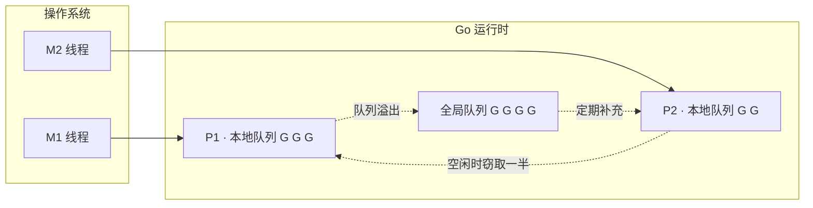
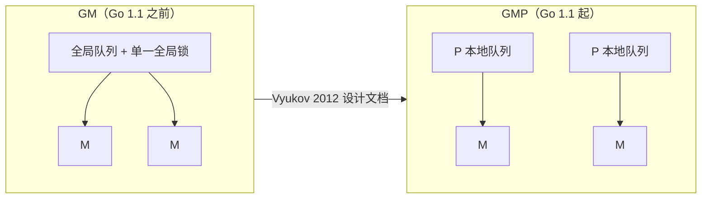

# 6.1 调度问题与 GMP 模型

写下 `go f()`，一个 goroutine 就开始运行了。这行代码背后，是 Go 运行时最精巧的一台机器：
调度器。它要回答一个并不简单的问题：成千上万个 goroutine，如何在为数不多的几个 CPU 核心上
轮转，既跑得快，又让用户几乎察觉不到它的存在。这一章把这台机器逐块拆开，本节先把它要解决
的问题与整体骨架交代清楚，后面各节再深入每个部件。

## 6.1.1 为什么需要一个用户态调度器

最直接的并发实现，是把每个并发任务交给一个操作系统线程，由内核去调度，即 1:1 模型。
它简单，却经不起 goroutine 的用法：一个线程的栈通常以兆字节计，创建与切换都要陷入内核，
开成千上万个线程会很快耗尽内存、压垮内核调度器。另一个极端是 N:1，把所有任务塞进一个线程，
切换成本极低，却用不上多核，一次阻塞的系统调用还会卡住全部任务。

Go 选择介于两者之间的 M:N 模型：把 $N$ 个 goroutine 多路复用到 $M$ 个操作系统线程上。
goroutine 由运行时在用户态创建、切换、调度，起步只占几 KB 栈、按需增长，切换不必陷入内核。
这样既保留了 N:1 的轻量，又能像 1:1 那样吃满多核。代价是，内核原来替我们做的调度，现在
得由运行时自己实现，而这正是本章的主题。

调度器要同时照顾几个互相牵扯的目标：用并行与局部性把吞吐做高；把网络轮询器、垃圾回收器
这些用户看不见的工作也一并调度好；还要严格维持用户代码的内存次序（见 [5.9 内存一致模型](../../part1basic/ch05sync/mem.md)）。
把这些都藏进一个 `go` 关键字之下，是调度器最见功力的地方。

## 6.1.2 GMP 模型一览

Go 调度器围绕三个抽象展开，合称 GMP。

- **G（goroutine）**：一个 goroutine，即一段并发执行的用户代码，连同它的栈与执行现场。
- **M（machine）**：一个操作系统线程，是真正在 CPU 上执行指令的实体。
- **P（processor）**：一个逻辑处理器，代表「执行 Go 代码所需的资源与许可」。P 的数量由
  `GOMAXPROCS` 决定，默认等于可用的 CPU 核数。

三者的关系可以一句话概括：**M 必须先拿到一个 P，才能运行 G**。P 的个数因此设定了同时执行
Go 代码的并行度上限。每个 P 自带一个**本地运行队列**，存放就绪的 G；另有一个所有 P 共享的
**全局运行队列**兜底。

一次调度，简化来说就是：一个绑定了 P 的 M，从 P 的本地队列里取出一个 G 来运行；G 让出
或被抢占后，再取下一个。本地队列空了，就去别处找活干，这便引出了工作窃取（见 [6.2](./steal.md)）。
队列、窃取、线程管理、抢占等部件如何协作，是后续各节的内容。

## 6.1.3 P 是怎么来的：从 GM 到 GMP

P 并非一开始就有。Go 1.1 之前的调度器只有 G 和 M，所有就绪的 G 挂在一个全局队列上，
由一把全局锁保护。2012 年，Dmitry Vyukov 在《Scalable Go Scheduler Design Doc》中指出了
这套 GM 调度器的四个症结：

1. 单一全局锁与集中式状态，所有与 goroutine 相关的操作都要争这把锁；
2. M 之间频繁地交接（hand-off）G，带来额外的延迟与开销；
3. 每个 M 都带着内存缓存（mcache）等资源，而真正在跑 Go 代码的 M 只是少数，造成浪费与
   局部性变差；
4. 系统调用导致线程频繁阻塞与唤醒。

引入 P 正是为了对症下药。把运行队列从全局拆成每个 P 一份，绝大多数入队、出队操作便不再需要
全局锁；把 mcache 一类资源从 M 移到 P 上，资源数量就固定为 `GOMAXPROCS` 个，局部性也随之
改善；M 与 P 的解绑与再绑定，让线程在系统调用阻塞时能把 P 交给别的 M 继续干活。这套 GMP
调度器随 Go 1.1（2013 年 5 月）落地，沿用至今，后续版本在其上不断打磨（例如 Go 1.5 为每个
P 增设了 `runnext` 槽，Go 1.14 加入了异步抢占，分别见 [6.3](./mpg.md) 与 [6.8](./preemption.md)）。

## 6.1.4 一点调度理论

> 这一小节面向有兴趣的读者，跳过它不影响理解后续实现。

工作窃取不是 Go 的发明，它的有效性有坚实的理论支撑。Blumofe 与 Leiserson（JACM 1999）
证明，对一个总工作量为 $T_1$、关键路径长度为 $T_\infty$ 的计算，工作窃取调度器在 $P$ 个处理器
上的期望执行时间满足

$$T_P \le \frac{T_1}{P} + O(T_\infty)$$

其中 $T_1/P$ 是理想的并行加速，$O(T_\infty)$ 是无法再被并行化掉的串行尾巴。这个界限说明，
只要计算本身具备足够的并行性（$T_\infty$ 足够小），工作窃取就能接近线性加速，且所需的额外
通信与空间都有上界。这正是 Go 把工作窃取选作负载均衡基石的底气所在。该结论的源流可追溯到
MIT 的 Cilk 项目。

更广义地看，调度还可以放进**在线调度**的框架里分析：任务何时到来、要跑多久，事先并不知道，
调度器只能基于当下信息决策，其优劣用**竞争比**（相对于事后最优解的倍数）来衡量。这类分析
解释了为什么实际系统里没有「完美」的调度，只有针对特定目标的权衡。Go 的选择，是把吞吐、
延迟与实现复杂度放在一起折中，后面会反复看到这种取舍。

## 许可

&copy; 2018-2026 The [golang.design](https://golang.design) Initiative Authors. Licensed under [CC-BY-NC-ND 4.0](https://creativecommons.org/licenses/by-nc-nd/4.0/).
