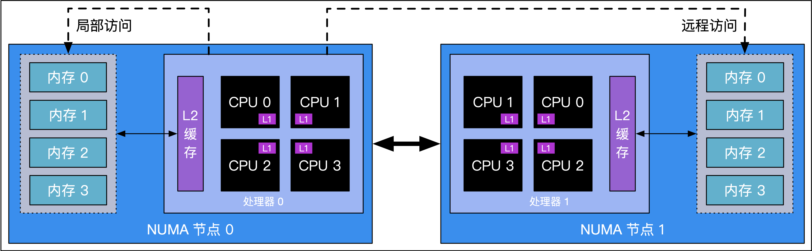

# 6.12 非均匀访存下的调度模型

## 6.12.1 调度器架构的演变

Go 的运行时调度器只经历了两个主要版本的迭代。Go 语言诞生之初的调度器，和我们现在所看到的从 Go 1.1 起引入的工作窃取调度器。

### 单线程版调度器

最早期（Go 1 之前）的 Go 调度器甚至不能良好的支持多线程 [Cox, 2008]，即默认的最大 M 数为 1。
这个版本的调度器负责将准备运行的 G
与等待工作的调度程序 M 相匹配。如果有准备好的 G 且没有等待的 M，则会在新的 OS 线程中启动一个新的 m，
这样所有准备好的（有限多个）G 可以同时运行。并且，这时的 M 无法退出。

原因在于最早先的 Go 只适当的支持了 Linux，甚至连目标支持的 OS X （当时还没有更名为 macOS）也尚未实现。
其中一个主要的问题就在调度器锁的处理并不完善、垃圾回收的支持也不够完整。

### 多线程版调度器

随后的一年时间中，调度器得到了完善的改进，能够正式的支持多个系统线程的版本 [Cox, 2009]。
但这时仍然需要用户态代码通过 $GOMAXPROCS 或 runtime.GOMAXPROCS() 调用来调整最大核数。
而 `m` 不能退出的问题仍然没有得到改进。

### 工作窃取调度器

随着 Go 1.1 的出现，Go 的运行时调度器得到了质的飞越，调度器正式引入 M 的本地资源 P [Vyukov, 2013a]，
大幅降低了任务调度时对全局锁的竞争，提出了沿用至今的 MPG 工作窃取式调度器设计。
我们已经在前面的使用了大量篇幅介绍这一调度器的设计，这里便不再赘述了。

## 6.12.2 改进展望：非均匀访存感知的调度器

目前的调度器设计总是假设 M 到 P 的访问速度是一样的，即不同的 CPU 核心访问多级缓存、内存的速度一致。
但真实情况是，在 NUMA（non-uniform memory access，非均匀访存）架构下，CPU 仅在
局部访问自身 NUMA 节点内的内存时才能获得一致的访问速度。更一般地说，这种基于 NUMA 架构的处理器是也是一个分布式的系统。

<strong>图 1：NUMA 架构</strong>

针对这一点，Go 官方已经提出了具体的调度器设计 [Vyukov, 2014]，但由于工作量巨大，甚至没有提上日程。

TODO: 讨论设计的优劣

## 小结

Go 语言用户态代码的调度核心在未来的十年里只进行了两次改进，足见其设计功力，
但随着 Go 语言的大规模应用，以及越来越多的在多核机器上使用调度器的性能问题也会逐渐暴露出来，
让我们对未来下一个大版本的改进拭目以待。

## 许可

&copy; 2018-2020 The [golang.design](https://golang.design) Initiative Authors. Licensed under [CC-BY-NC-ND 4.0](https://creativecommons.org/licenses/by-nc-nd/4.0/).

