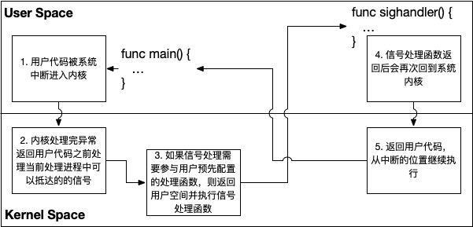

# 6.6 信号处理机制

我们已经知道了 Go 运行时调度以 Goroutine 的方式调度了所有用户态代码。
每个 Goroutine 都有可能在不同的线程上重新被执行。
那么如果用户态的某个 Goroutine 需要接收系统信号，
如何才能确保某个线程的信号能够正确的发送到可能在其他线程上执行的监听信号的 Goroutine 呢？

本节我们讨论调度器里涉及的 signal 信号处理机制。

## 6.6.1 信号与软中断

信号机制是 UNIX、类 UNIX 甚至其他 POSIX 兼容系统上规定的一种进程异步通信的限制形式。
用于提醒某个事件的发生状态。
信号被定义为整数，产生信号的条件包括用户使用某些按键组合（比如 Control + C）、
硬件异常、`kill` 信号等等。

这些信号通常有三种不同的处理方式：忽略、捕获或者执行系统的默认行为。
忽略与捕获处理无法处理 `SIGKILL` 和 `SIGSTOP`，默认处理通常为停止进程。
而对于捕获处理而言，当信号发生时，操作系统将中断用户代码，并保存其执行的上下文，切换到内核空间
并重新切换到用户空间来执行预先设置好的信号处理回调。当回调执行完毕之后，会重新切换回内核
空间，并从中断的位置进行恢复，如图 1 所示。

<div class="img-center" style="margin: 0 50px 0px 30px; float: left; max-width: 60%">

<strong>图 1: 用户空间与内核空间的信号处理流程</strong>
</div>

早期的 UNIX 系统特性是，当某个进程执行一个长时间系统调用时发生阻塞，
如果此时捕获到一个信号，则系统调用便被中断且不再执行，并以失败返回。
因此系统调用也会被分为两类：低速系统调用和高速系统调用。低速系统调用可能使进程永远阻塞，
例如 IO。

系统调用 `sigaltstack` 可以用于定义一个备用的信号栈来获取一个存在的额外信号栈的状态。
一个额外的信号栈会在信号处理执行中进行使用。

每个进程都包含一个信号屏蔽字（signal mask），规定了当前要阻塞递送到该进程的信号集。
对于每种可能的信号，屏蔽字中都有一位与之对应。
对于某种信号，若其对应位置已设置，则它当前是被阻塞的。
如果要检测和修改当前信号屏蔽字，则需要调用 `sigprocmask`
系统调用来进行。通过 `_SIG_SETMASK` 可以直接设置想要的屏蔽字，并获得原先的屏蔽字。

值得注意的是，信号会在所有线程中进行共享。
换句话说，尽管某个线程可以阻止某些信号，但当线程修改了某个信号相关的处理行为后，
所有线程都必须共享这个行为带来的变化。
如果一个线程选择忽略某个信号，则其他线程可以恢复信号的默认处理行为，或者设置为信号设置
一个新的处理函数，进而能够撤销线程的信号选择。
进程中信号会被传递给单个线程，如果信号与硬件故障或计时器超时有关，
信号便会被发送到引起事件的线程中去，而其他的信号则被发送到任一个线程。

Linux 上的线程以独立进程进行实现，通过 `clone` 调用来共享资源，因此 Linux 上的信号
处理与类 Unix 系统略有不同，POSIX.1 线程模型会在异步信号发送到进程后，
且没有阻塞屏蔽字时接受信号。而 Linux 上每个线程作为独立进程执行，系统无法选择没有
阻塞屏蔽字的线程，进而无法注意到这个信号。所以 Linux 上也存在不可靠信号和可靠信号的
概念。其中不可靠信号可能丢失，多次发送相同的信号只能收到一次，取值从 1 至 31；
可靠信号则可以进行排队，取值从 32 至 64。

这便是运行时信号处理的基本原理。

## 6.6.2 处理函数的初始化

[6.3 调度循环](./exec.md) 中讨论过了 M 的生命周期，M 可以在两种情况下被创建：

1. 程序运行之初的 M0，无需创建已经存在的系统线程，只需对其进行初始化即可。其函数调用链如下所示：

	```
	schedinit
	 ↳ mcommoninit
	    ↳ mpreinit
	       ↳ msigsave
	          ↳ initSigmask
	             ↳ mstart
	```

2. 需要时创建的 M，某些特殊情况下一定会创建一个新的 M 并进行初始化，而后创建系统线程。这些情况包括：

   1. startm 时没有空闲 m
   2. startTemplateThread 时
   3. startTheWorldWithSema 时 p 如果没有 m
   4. main 时创建系统监控
   5. oneNewExtraM 时

	其调用链为：

	```
	newm
	 ↳ allocm
	    ↳ mcommoninit
	       ↳ mpreinit
	          ↳ newm1
	             ↳ newosproc
	                ↳ mstart
	```

在 `mcommoninit` 里，会在一个父线程（或引导时的主线程）上调用 `mpreinit`，并最终会为一个 M 创建 `gsignal`，是一个在 M 上用于处理信号的 Goroutine。因此，除了 g0 外，其实第一个创建的 g 应该是它，
但是它并没有设置 Goid (Goroutine ID)：

```go
func mcommoninit(mp *m) {
	...
	// 初始化 gsignal，用于处理 m 上的信号。
	mpreinit(mp)
	// gsignal 的运行栈边界处理
	if mp.gsignal != nil {
		mp.gsignal.stackguard1 = mp.gsignal.stack.lo + _StackGuard
	}
	...
}
// 从一个父线程上进行调用（引导时为主线程），可以分配内存
func mpreinit(mp *m) {
	mp.gsignal = malg(32 * 1024) // OS X 需要 >= 8K，此处创建处理 singnal 的 g
	mp.gsignal.m = mp            // 指定 gsignal 拥有的 m
}
```

### 获取原始信号屏蔽字

在调度器的初始化的阶段，`initSigmask` 目标旨在记录主线程 M0 创建之初的屏蔽字 `sigmask`：

```go
func schedinit() {
	_g_ := getg()
	...
	mcommoninit(_g_.m)
	...
	msigsave(_g_.m)
	initSigmask = _g_.m.sigmask
	...
}
```

其中 `msigsave` 通过 `sigprocmask` 这个系统调用将当前 `m0` 的屏蔽字保存到
`mp.sigmask` 上：

```go
const _SIG_SETMASK = 3

// msigsave 将当前线程的信号屏蔽字保存到 mp.sigmask。
//go:nosplit
//go:nowritebarrierrec
func msigsave(mp *m) {
	sigprocmask(_SIG_SETMASK, nil, &mp.sigmask)
}
```

`sigprocmask` 的本质为系统调用，其返回值通过 `old` 交付给调用者：

```go
type sigset uint32
//go:nosplit
//go:nowritebarrierrec
func sigprocmask(how int32, new, old *sigset) {
	rtsigprocmask(how, new, old, int32(unsafe.Sizeof(*new)))
}
//go:noescape
func rtsigprocmask(how int32, new, old *sigset, size int32)
```

`rtsigprocmask` 在 Linux 上由汇编直接包装 `rt_sigprocmask` 调用：

```c
TEXT runtime·rtsigprocmask(SB),NOSPLIT,$0-28
	MOVL	how+0(FP), DI
	MOVQ	new+8(FP), SI
	MOVQ	old+16(FP), DX
	MOVL	size+24(FP), R10
	MOVL	$SYS_rt_sigprocmask, AX
	SYSCALL
	CMPQ	AX, $0xfffffffffffff001
	JLS	2(PC)
	MOVL	$0xf1, 0xf1  // crash
	RET
```

注意，`rt_sigprocmask` 只适用于单个线程的调用，多线程上的调用时未定义行为，
不过初始化阶段的此时还未创建其他线程，因此此调用时安全的。

在 Darwin 系统中，所有的信号处理函数均通过 `pthread_sigmask` 来完成：

```go
//go:nosplit
//go:cgo_unsafe_args
func sigprocmask(how uint32, new *sigset, old *sigset) {
	libcCall(unsafe.Pointer(funcPC(sigprocmask_trampoline)), unsafe.Pointer(&how))
}
func sigprocmask_trampoline()
```

```asm
TEXT runtime·sigprocmask_trampoline(SB),NOSPLIT,$0
	PUSHQ	BP
	MOVQ	SP, BP
	MOVQ	8(DI), SI	// arg 2 new
	MOVQ	16(DI), DX	// arg 3 old
	MOVL	0(DI), DI	// arg 1 how
	CALL	libc_pthread_sigmask(SB)
	TESTL	AX, AX
	JEQ	2(PC)
	MOVL	$0xf1, 0xf1  // crash
	POPQ	BP
	RET
```

`msigsave` 执行完毕后，`sigmask` 最后保存到 `initSigmask` 这一全局变量中，
用于初始化新创建的 M 的信号屏蔽字：

```go
// 用于新创建的 M 的信号掩码 signal mask 的值。
var initSigmask sigset

func schedinit() {
	...
	initSigmask = _g_.m.sigmask
	...
}
```

用于当新创建 M 时（`newm`），将 M 的 `sigmask` 进行设置。

### 初始化信号栈

在进入 `mstart` 后，调用链关系就变成了：

```
mstart
 ↳ mstart1
    ↳ minit
       ↳ mstartm0 (仅当 m0 调用)
          ↳ schedule
             ↳ mexit
                ↳ sigblock
                   ↳ unminit 
```

`mstart1` 会调用 `minit` 进行初始化：

```go
func minit() {
	minitSignals()
	...
}
func minitSignals() {
	minitSignalStack()
	minitSignalMask()
}
```

M 在初始化过程中，会判定当前线程是否设置了备用信号栈，
正常情况下一个新创建的 M 是没有备用信号栈的。
如果没有，则会将 `m.gsignal` 的执行栈设置为备用信号栈，用于处理产生的信号。

另一种情况是，当使用 cgo 时，非 Go 线程可能调用 Go 代码，
而这时用户态的 C 代码可能已经为非 Go 线程设置了信号栈，这时的替换必须小心。
因此如果 M 已经存在了备用信号栈，则会将现有的信号栈保存到 `m.goSigStack` 中。

```go
type stackt struct { // 信号栈
	ss_sp     *byte
	ss_flags  int32
	pad_cgo_0 [4]byte
	ss_size   uintptr
}
// 如果没有为线程设置备用信号栈（正常情况），则将备用信号栈设置为 gsignal 栈。
// 如果为线程设置了备用信号栈（非 Go 线程设置备用信号栈然后调用 Go 函数的情况），
// 则将 gsignal 栈设置为备用信号栈。
// 如果没有使用 cgo 我们还设置了额外的 gsignal 信号栈（无论其是否已经被设置）
// 记录在 newSigstack 中做出的选择，
// 以便可以在 unminit 中撤消。
func minitSignalStack() {
	_g_ := getg()
	// 获取原有的信号栈
	var st stackt
	sigaltstack(nil, &st)

	if st.ss_flags&_SS_DISABLE != 0 {
		// 如果禁用了当前的信号栈
		// 则将 gsignal 的执行栈设置为备用信号栈
		signalstack(&_g_.m.gsignal.stack)
		_g_.m.newSigstack = true
	} else {
		// 否则将 m 的 gsignal 栈设置为从 sigaltstack 返回的备用信号栈
		setGsignalStack(&st, &_g_.m.goSigStack)
		_g_.m.newSigstack = false
	}
}

// 将 s 设置为备用信号栈，此方法仅在信号栈被禁用时调用
//go:nosplit
func signalstack(s *stack) {
	st := stackt{ss_size: s.hi - s.lo}
	setSignalstackSP(&st, s.lo)
	sigaltstack(&st, nil)
}
//go:nosplit
func setSignalstackSP(s *stackt, sp uintptr) {
	*(*uintptr)(unsafe.Pointer(&s.ss_sp)) = sp
}
// setGsignalStack 将当前 m 的 gsignal 栈设置为从 sigaltstack 系统调用返回的备用信号堆栈。
// 它将旧值保存在 *old 中以供 restoreGsignalStack 使用。
// 如果非 Go 代码设置了，则在处理信号时使用备用栈。
//go:nosplit
//go:nowritebarrierrec
func setGsignalStack(st *stackt, old *gsignalStack) {
	g := getg()
	if old != nil {
		old.stack = g.m.gsignal.stack
		old.stackguard0 = g.m.gsignal.stackguard0
		old.stackguard1 = g.m.gsignal.stackguard1
		old.stktopsp = g.m.gsignal.stktopsp
	}
	stsp := uintptr(unsafe.Pointer(st.ss_sp))
	g.m.gsignal.stack.lo = stsp
	g.m.gsignal.stack.hi = stsp + st.ss_size
	g.m.gsignal.stackguard0 = stsp + _StackGuard
	g.m.gsignal.stackguard1 = stsp + _StackGuard
}
```

### 初始化信号屏蔽字

当设置好信号栈后，会开始对 M 设置信号的屏蔽字，通过 `sigmask` 来获得当前 M
的屏蔽字，而后通过遍历所有运行时信号表来对屏蔽字进行初始化：

```go
func minitSignalMask() {
	nmask := getg().m.sigmask
	// 遍历整个信号表
	for i := range sigtable {
		// 判断某个信号是否为不可阻止的信号，
		// 如果是不可阻止的信号，则删除对应的屏蔽字所在位
		if !blockableSig(uint32(i)) {
			sigdelset(&nmask, i)
		}
	}
	// 重新设置屏蔽字
	sigprocmask(_SIG_SETMASK, &nmask, nil)
}
// 判断某个信号是否为不可阻止的信号
// 1. 当信号是非阻塞信号，则不可阻止
// 2. 当改程序为模块时，则可阻止
// 3. 当信号为 Kill 或 Throw 时，可阻止，否则不可阻止
func blockableSig(sig uint32) bool {
	flags := sigtable[sig].flags
	if flags&_SigUnblock != 0 {
		return false
	}
	if isarchive || islibrary {
		return true
	}
	return flags&(_SigKill|_SigThrow) == 0
}


func sigdelset(mask *sigset, i int) {
	*mask &^= 1 << (uint32(i) - 1)
}
```

```go
type sigTabT struct {
	flags int32
	name  string
}
var sigtable = [...]sigTabT{
	/* 0 */ {0, "SIGNONE: no trap"},
	/* 1 */ {_SigNotify + _SigKill, "SIGHUP: terminal line hangup"},
	...
	/* 63 */ {_SigNotify, "signal 63"},
	/* 64 */ {_SigNotify, "signal 64"},
}
const (
	_SigNotify   = 1 << iota // let signal.Notify have signal, even if from kernel
	_SigKill                 // if signal.Notify doesn't take it, exit quietly
	_SigThrow                // if signal.Notify doesn't take it, exit loudly
	_SigPanic                // if the signal is from the kernel, panic
	_SigDefault              // if the signal isn't explicitly requested, don't monitor it
	_SigGoExit               // cause all runtime procs to exit (only used on Plan 9).
	_SigSetStack             // add SA_ONSTACK to libc handler
	_SigUnblock              // always unblock; see blockableSig
	_SigIgn                  // _SIG_DFL action is to ignore the signal
)
```

## 6.6.3 信号处理

万事俱备，只欠东风。信号处理相关的初始化已经完成，包括了信号的屏蔽字、信号栈等。
正式进入调度循环之前，在 M0 上将调用 `mstartm0`，进而调用 `initsig` 初始化信号，针对每个信号进行单独处理：

```go
//go:yeswritebarrierrec
func mstartm0() {
	...
	initsig(false)
}
//go:nosplit
//go:nowritebarrierrec
func initsig(preinit bool) {
	...

	for i := uint32(0); i < _NSIG; i++ {
		t := &sigtable[i]
		if t.flags == 0 || t.flags&_SigDefault != 0 {
			continue
		}

		// 此时不需要原子操作，因为此时没有其他运行的 Goroutine
		fwdSig[i] = getsig(i)

		// 检查该信号是否需要设置 signal handler
		if !sigInstallGoHandler(i) {
			// 即使不设置 signal handler，在必要时设置 SA_ONSTACK
			if fwdSig[i] != _SIG_DFL && fwdSig[i] != _SIG_IGN {
				setsigstack(i)
			} else if fwdSig[i] == _SIG_IGN {
				sigInitIgnored(i)
			}
			continue
		}

		handlingSig[i] = 1
		setsig(i, funcPC(sighandler))
	}
}
```

对于一个需要设置 `sighandler` 的信号，会通过 `setsig` 来设置信号对应的动作（action）：

```go
//go:nosplit
//go:nowritebarrierrec
func setsig(i uint32, fn uintptr) {
	var sa usigactiont
	sa.sa_flags = _SA_SIGINFO | _SA_ONSTACK | _SA_RESTART
	sa.sa_mask = ^uint32(0)
	if fn == funcPC(sighandler) {
		if iscgo {
			fn = funcPC(cgoSigtramp)
		} else {
			fn = funcPC(sigtramp)
		}
	}
	*(*uintptr)(unsafe.Pointer(&sa.__sigaction_u)) = fn
	sigaction(i, &sa, nil)
}
```

值得注意的是这里有一个特殊处理，当 `fn` 为 `sighandler` 时候，
产生信号后的动作并非直接调用 `sighandler`，而是被替换为了 `sigtramp`：

```asm
TEXT runtime·sigtramp(SB),NOSPLIT,$72
	...
	MOVQ	DX, ctx-56(SP)
	MOVQ	SI, info-64(SP)
	MOVQ	DI, signum-72(SP)
	MOVQ	$runtime·sigtrampgo(SB), AX
	CALL AX
	...
	RET
```

进而调用 `sigtrampgo`。这样的处理方式是因为，
`sighandler` 会将产生的信号交给对应的 g ，此时还无法决定究竟谁来进行处理。
因此，当信号发生时，而 `sigtrampgo` 会被调用：

```go
//go:nosplit
//go:nowritebarrierrec
func sigtrampgo(sig uint32, info *siginfo, ctx unsafe.Pointer) {
	if sigfwdgo(sig, info, ctx) {
		return
	}
	...
	setg(g.m.gsignal)
	...
	sighandler(sig, info, ctx, g)
	setg(g)
	...
}
```

而 `sigfwdgo` 用于约定该信号是否应该由 Go 进行处理，
如果不由 Go 进行处理（例如 cgo）则将其转发到 Go 代码之前设置的 handler 上。

我们暂时关注 Go 端的情况，代码会继续执行，将 g 设置为 `gsignal`，从而来到了 `sighandler`：

```go
//go:nowritebarrierrec
func sighandler(sig uint32, info *siginfo, ctxt unsafe.Pointer, gp *g) {
	_g_ := getg()
	c := &sigctxt{info, ctxt}

	// profile 时钟超时
	if sig == _SIGPROF {
		sigprof(c.sigpc(), c.sigsp(), c.siglr(), gp, _g_.m)
		return
	}

	if sig == _SIGTRAP && testSigtrap != nil && testSigtrap(info, (*sigctxt)(noescape(unsafe.Pointer(c))), gp) {
		return
	}

	// 用户信号
	if sig == _SIGUSR1 && testSigusr1 != nil && testSigusr1(gp) {
		return
	}

	if sig == sigPreempt {
		// 可能是一个抢占信号
		doSigPreempt(gp, c)
		// 即便这是一个抢占信号，它也可能与其他信号进行混合，因此我们
		// 继续进行处理。
	}

	flags := int32(_SigThrow)
	if sig < uint32(len(sigtable)) {
		flags = sigtable[sig].flags
	}
	if flags&_SigPanic != 0 && gp.throwsplit {
		// 我们无法安全的 sigpanic 因为它可能造成栈的增长，因此忽略它
		flags = (flags &^ _SigPanic) | _SigThrow
	}
	...
	if c.sigcode() != _SI_USER && flags&_SigPanic != 0 {
		// 产生 panic 的信号
		...
		c.preparePanic(sig, gp)
		return
	}

	// 对用户注册的信号进行转发
	if c.sigcode() == _SI_USER || flags&_SigNotify != 0 {
		if sigsend(sig) {
			return
		}
	}

	// 设置为可忽略的用户信号
	if c.sigcode() == _SI_USER && signal_ignored(sig) {
		return
	}

	// 处理 KILL 信号
	if flags&_SigKill != 0 {
		dieFromSignal(sig)
	}

	// 非 THROW，返回
	if flags&_SigThrow == 0 {
		return
	}

	// 处理一些直接 panic 的情况
	...
}
```

注意，在信号处理中，当信号为 `sigPreempt` 时，将触发运行时的异步抢占机制，我们会在
[6.8 协作与抢占](./preemption.md) 一节中进行讨论。

函数 `sigsend` 会将用户信号发送到信号队列 `sig` 中：

```go
var sig struct {
	note       note
	mask       [(_NSIG + 31) / 32]uint32
	wanted     [(_NSIG + 31) / 32]uint32
	ignored    [(_NSIG + 31) / 32]uint32
	recv       [(_NSIG + 31) / 32]uint32
	state      uint32
	delivering uint32
	inuse      bool
}
func sigsend(s uint32) bool {
	bit := uint32(1) << uint(s&31)
	if !sig.inuse || s >= uint32(32*len(sig.wanted)) {
		return false
	}

	atomic.Xadd(&sig.delivering, 1)
	// We are running in the signal handler; defer is not available.

	if w := atomic.Load(&sig.wanted[s/32]); w&bit == 0 {
		atomic.Xadd(&sig.delivering, -1)
		return false
	}

	// Add signal to outgoing queue.
	for {
		mask := sig.mask[s/32]
		if mask&bit != 0 {
			atomic.Xadd(&sig.delivering, -1)
			return true // signal already in queue
		}
		if atomic.Cas(&sig.mask[s/32], mask, mask|bit) {
			break
		}
	}

	// Notify receiver that queue has new bit.
Send:
	for {
		switch atomic.Load(&sig.state) {
		default:
			throw("sigsend: inconsistent state")
		case sigIdle:
			if atomic.Cas(&sig.state, sigIdle, sigSending) {
				break Send
			}
		case sigSending:
			// notification already pending
			break Send
		case sigReceiving:
			if atomic.Cas(&sig.state, sigReceiving, sigIdle) {
				notewakeup(&sig.note)
				break Send
			}
		}
	}

	atomic.Xadd(&sig.delivering, -1)
	return true
}
```

用户信号的接收方是通过 os/signal 完成的，我们随后讨论。

## 6.6.4 辅 M 线程

辅 M 是一个用于服务非 Go 线程（cgo 产生的线程）回调的 M。

```go
//go:yeswritebarrierrec
func mstartm0() {
	// 创建一个额外的 M 服务 non-Go 线程（cgo 调用中产生的线程）的回调，并且只创建一个
	// windows 上也需要额外 M 来服务 syscall.NewCallback 产生的回调，见 issue #6751
	if (iscgo || GOOS == "windows") && !cgoHasExtraM {
		cgoHasExtraM = true
		newextram()
	}
	initsig(false)
}
// newextram 分配一个 m 并将其放入 extra 列表中
// 它会被工作中的本地 m 调用，因此它能够做一些调用 schedlock 和 allocate 类似的事情。
func newextram() {
	c := atomic.Xchg(&extraMWaiters, 0)
	if c > 0 {
		for i := uint32(0); i < c; i++ {
			oneNewExtraM()
		}
	} else {
		// 确保至少有一个额外的 M
		mp := lockextra(true)
		unlockextra(mp)
		if mp == nil {
			oneNewExtraM()
		}
	}
}
// onNewExtraM 分配一个 m 并将其放入 extra list 中
func oneNewExtraM() {
	mp := allocm(nil, nil)
	gp := malg(4096)
	gp.sched.pc = funcPC(goexit) + sys.PCQuantum
	gp.sched.sp = gp.stack.hi
	gp.sched.sp -= 4 * sys.RegSize
	gp.sched.lr = 0
	gp.sched.g = guintptr(unsafe.Pointer(gp))
	gp.syscallpc = gp.sched.pc
	gp.syscallsp = gp.sched.sp
	gp.stktopsp = gp.sched.sp
	gp.gcscanvalid = true
	gp.gcscandone = true
	casgstatus(gp, _Gidle, _Gdead)
	gp.m = mp
	mp.curg = gp
	mp.lockedInt++
	mp.lockedg.set(gp)
	gp.lockedm.set(mp)
	gp.goid = int64(atomic.Xadd64(&sched.goidgen, 1))
	...
	// 给垃圾回收器使用
	allgadd(gp)

	atomic.Xadd(&sched.ngsys, +1)

	// 将 m 添加到 extra m 链表中
	mnext := lockextra(true)
	mp.schedlink.set(mnext)
	extraMCount++
	unlockextra(mp)
}
```

## 6.6.5 对 `os/signal` 包的支持

我们已经看到了用户注册的信号会通过 `sigsend` 进行发送，这就是我们使用 `os/signal` 包的核心。

在使用 `os/signal` 后，会调用 `signal.init` 函数，懒惰的注册一个用户端的信号处理循环（当调用 Notify 时启动）：

```go
var (
	watchSignalLoopOnce sync.Once
	watchSignalLoop     func()
)
func init() {
	signal_enable(0) // 首次调用，进行初始化
	watchSignalLoop = loop
}
func loop() {
	for { process(syscall.Signal(signal_recv())) }
}
```

这个 `signal_enable` 和 `signal_recv` 用于激活运行时的信号队列，并从中接受信号：

```go
// 启用运行时信号队列
//go:linkname signal_enable os/signal.signal_enable
func signal_enable(s uint32) {
	if !sig.inuse {
		// The first call to signal_enable is for us
		// to use for initialization. It does not pass
		// signal information in m.
		sig.inuse = true // enable reception of signals; cannot disable
		noteclear(&sig.note)
		return
	}

	if s >= uint32(len(sig.wanted)*32) {
		return
	}

	w := sig.wanted[s/32]
	w |= 1 << (s & 31)
	atomic.Store(&sig.wanted[s/32], w)

	i := sig.ignored[s/32]
	i &^= 1 << (s & 31)
	atomic.Store(&sig.ignored[s/32], i)

	sigenable(s)
}
// 从信号队列中接受信号
//go:linkname signal_recv os/signal.signal_recv
func signal_recv() uint32 {
	for {
		// Serve any signals from local copy.
		for i := uint32(0); i < _NSIG; i++ {
			if sig.recv[i/32]&(1<<(i&31)) != 0 {
				sig.recv[i/32] &^= 1 << (i & 31)
				return i
			}
		}

		// Wait for updates to be available from signal sender.
	Receive:
		for {
			switch atomic.Load(&sig.state) {
			default:
				throw("signal_recv: inconsistent state")
			case sigIdle:
				if atomic.Cas(&sig.state, sigIdle, sigReceiving) {
					notetsleepg(&sig.note, -1)
					noteclear(&sig.note)
					break Receive
				}
			case sigSending:
				if atomic.Cas(&sig.state, sigSending, sigIdle) {
					break Receive
				}
			}
		}

		// Incorporate updates from sender into local copy.
		for i := range sig.mask {
			sig.recv[i] = atomic.Xchg(&sig.mask[i], 0)
		}
	}
}
```

当接受到信号后，信号 `sig` 会被发送到用户在 `Ignore/Notify/Stop` 上所注册的 channel 上：

```go
func process(sig os.Signal) {
	n := signum(sig)
	if n < 0 {
		return
	}

	handlers.Lock()
	defer handlers.Unlock()

	for c, h := range handlers.m {
		if h.want(n) {
			// 发送
			select {
			case c <- sig:
			default:
			}
		}
	}

	... // Stop 的处理
}
```

例如 `signal.Notify`，将信号 channel 注册到 handler 全局变量中：

```go
var handlers struct {
	sync.Mutex
	m map[chan<- os.Signal]*handler
	ref [numSig]int64
	stopping []stopping
}
func Notify(c chan<- os.Signal, sig ...os.Signal) {
	if c == nil {
		panic("os/signal: Notify using nil channel")
	}

	watchSignalLoopOnce.Do(func() {
		if watchSignalLoop != nil {
			go watchSignalLoop()
		}
	})

	handlers.Lock()
	defer handlers.Unlock()

	h := handlers.m[c]
	if h == nil {
		if handlers.m == nil {
			handlers.m = make(map[chan<- os.Signal]*handler)
		}
		h = new(handler)
		handlers.m[c] = h // 保存到 handler 中
	}

	add := func(n int) {
		if n < 0 {
			return
		}
		if !h.want(n) {
			h.set(n)
			if handlers.ref[n] == 0 {
				enableSignal(n)
			}
			handlers.ref[n]++
		}
	}

	if len(sig) == 0 {
		for n := 0; n < numSig; n++ {
			add(n)
		}
	} else {
		for _, s := range sig {
			add(signum(s))
		}
	}
}
```

## 6.6.6 小结

由于调度器在 Go 程序运行时的特殊地位，以及在进行跨语言调用时需要 `cgo` 的支持，
运行时信号处理相对而言还是较为复杂的，需要一套完整的机制来对各种情况进行处理，
甚至对用户态代码的 `os/signal` 进行支持。当然，信号处理的功能远不止如此，
利用此信号机制还可以实现抢占式调度，我们将在 [6.7 协作与抢占](./preemption.md) 中
再来讨论这一机制的另一巨大作用。

## 许可

&copy; 2018-2020 The [golang.design](https://golang.design) Initiative Authors. Licensed under [CC-BY-NC-ND 4.0](https://creativecommons.org/licenses/by-nc-nd/4.0/).