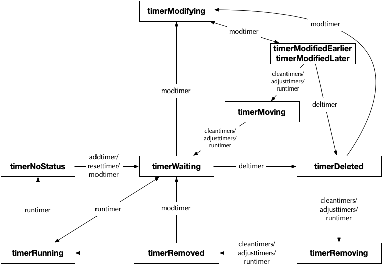

# 6.11 计时器

> 本节内容提供一个线上演讲：[YouTube 在线](https://www.youtube.com/watch?v=XJx0eTP-y9I)，[Google Slides 讲稿](https://changkun.de/s/timer114/)。

time 是一个很有意思的包，除去需要获取当前时间的 Now 这一平淡无奇、直接对系统调用进行
封装（ `runtime·nanotime` ）的函数外，其中最有意思的莫过于它所提供的 Timer 和 Ticker 了。
他们的实现，驱动了诸如 `time.After`, `time.AfterFunc`, `time.Tick`, `time.Sleep` 等方法。
本节我们便来仔细了解一下 Timer 的实现机制。

TODO: Timer 最近增加了几次更新，修复了一些性能问题，本文需要更新：
- https://go-review.googlesource.com/c/go/+/214299/
- https://go-review.googlesource.com/c/go/+/214185/
- https://go-review.googlesource.com/c/go/+/215722
- https://go-review.googlesource.com/c/go/+/221077

如果用户代码启动和停止很多计时器（例如 context.WithTimeout）则将稳定使用内存中残留的已经停止的计时器，而不是已经从计时器堆中删除的计时器。，第一个 CL 解决了这个问题，会在计时器总数超过 1/4 堆计时器时候，删除所有已经删除的计时器。
第二个 CL 尝试解决这个问题：空闲的 P 在偷取计时器时会与正在运行的 P 发生锁的竞争。方法是仅在下一个计时器准备运行或有一些计时器需要运行时才获得计时器锁定。
但是这个方案有带来了新的问题：导致越来越多的已经删除的计时器积累，从而没有就绪任何计时器。一个解决方案是在没有获取锁的情况下检查否有很多已经删除的计时器。

Timer 和 Ticker 所有的功能核心自然由运行时机制来驱动。当创建一个 Timer 时候：

```go
type Timer struct {
	C <-chan Time
	r runtimeTimer
}
func NewTimer(d Duration) *Timer {
	c := make(chan Time, 1)
	t := &Timer{
		C: c,
		r: runtimeTimer{
			when: when(d), // when 仅仅只是将事件触发的 walltime 转换为 int64
			f:    sendTime,
			arg:  c,
		},
	}
	startTimer(&t.r)
	return t
}
func (t *Timer) Stop() bool {
	(...)
	return stopTimer(&t.r)
}
func (t *Timer) Reset(d Duration) bool {
	(...)
	w := when(d)
	active := stopTimer(&t.r)
	resetTimer(&t.r, w)
	return active
}
```

Ticker 与 Timer 的本质区别仅仅在与 Ticker 多设置了 period 字段：

```go
type Ticker struct {
	C <-chan Time // 当事件触发时，Timer 会向此通道发送触发的时间
	r runtimeTimer
}
func NewTicker(d Duration) *Ticker {
	(...)
	c := make(chan Time, 1)
	t := &Ticker{
		C: c,
		r: runtimeTimer{
			when:   when(d),
			period: int64(d),
			f:      sendTime,
			arg:    c,
		},
	}
	startTimer(&t.r)
	return t
}
func (t *Ticker) Stop() {
	stopTimer(&t.r)
}
func Tick(d Duration) <-chan Time {
	(...)
	return NewTicker(d).C
}
```

Timer 同时为 After、AfterFunc 提供了支持，代码相对简单，我们不在此赘述。
直接进入 runtimeTimer 结构。runtime 对外暴露的 timer 所有功能如下：

```go
type runtimeTimer struct {
	pp uintptr // timer 所在的 P 的指针

	// 当时间为 when 时，唤醒 timer，当时间为 when+period, ... (period > 0)
	// 时，均在 timer Goroutine 中调用 f(arg, now)，从而 f 必须具有良好的行为（不会阻塞）
	when     int64
	period   int64
	f        func(interface{}, uintptr)
	arg      interface{}
	seq      uintptr
	nextwhen int64
	status   uint32
}
func startTimer(*runtimeTimer)
func stopTimer(*runtimeTimer) bool
func resetTimer(*runtimeTimer, int64)
```

可见，timer 返回的 channel 会被用户代码的 Goroutine 持有，为了使 channel 能正常
进行消息通信，每当 timer 被唤醒时，timer 自建的 Goroutine 会单独向 channel 发送
当前时间 `Now()`：

```go
func sendTime(c interface{}, seq uintptr) {
	select {
	case c.(chan Time) <- Now():
	default:
	}
}
```

## 6.11.1 Timer 状态机

早在 Go 1.10 以前，所有的 timer 均在一个全局的四叉小顶堆中进行维护，显然并发性能是
不够的，随后到了 Go 1.10 时，将堆的数量扩充到了 64 个，但仍然需要在唤醒 timer 时，
频繁的将 M 和 P 进行解绑（ `timerproc` ），性能依然不够出众。而到 Go 1.14 时，
Go 运行时中的 timer 使用 netpoll 进行驱动，每个 timer 堆均附着在 P 上，形成一个
局部的 timer 堆，消除了唤醒一个 timer 时进行 M/P 切换的开销，大幅削减了锁的竞争，
与 nginx 中 timer 的实现方式非常相似。

在 P 结构的定义中，存在两个有关 timer 的字段：

```go
type p struct {
	(...)

	// timers 字段的锁。我们通常在 P 运行时访问 timers，但 scheduler 仍可以
	// 在不同的 P 上进行访问。
	timersLock mutex

	// 某段时间需要进行的动作。用于实现 time 包。
	timers []*timer

	// 在 P 堆中 timerModifiedEarlier timers 的数量。
	// 仅当持有 timersLock 或者当 timer 状态转换为 timerModifying 时才可以修改
	adjustTimers uint32

	(...)
}
```

**在 P 中建立一个局部的 timers 堆，用于在调度器进入调度循环时，快速确定是否需要就绪一个 timer。**

`p.timers` 中的 timer 以四叉小顶堆（最早发生的 timer 维护堆顶）的形式进行维护，
每当新增一个 timer 时，都会通过 `siftupTimer` 和 `siftdownTimer` 维护堆中元素
的顺序以满足最小堆的条件。

```go
// 堆维护算法
// 当想 timer 数组末尾 append 一个 timer 后，通过 siftupTimer 进行重整
func siftupTimer(t []*timer, i int) bool {
	if i >= len(t) {
		return false
	}
	(...) // 对 i 位置的 timer 根据 when 字段进行调整
	return true
}
func siftdownTimer(t []*timer, i int) bool {
	n := len(t)
	if i >= n {
		return false
	}
	(...) // 对 i 位置的 timer 根据 when 字段进行调整
	return true
}
```

我们知道，当调度器完成对一个 G 的调度后，会重新进入调度循环（`runtime.schedule`）。
timer 作为一个对时间敏感的功能，同网络数据的拉取操作一样，可运行的 timer 也在此进行
检查（`runtime.checkTimers`），如果有 timer 可以运行，则直接调度该 G。
其中 checkTimer 会调整 timers 数组中 timer 的顺序（`runtime.adjusttimers`），
然后运行需要执行的 timer（`runtime.runtimer`）。

如果此时没有直接可用的 timer，且当前 P 的 G 队列已空，则 `runtime.findrunnable` 
便会进行任务偷取工作（`runtime.runqsteal`），对应到 timer，操作仍可以被抽象为 `runtime.checkTimers`。

在这个过程中要小心当 P 被回收时，需要将局部的 P 进行删除，或者转移到其他 P 上，
由 `runtime.moveTimers` 实现。

一个 Timer 具有十种状态，他们之间的状态转换图如图 1 所示。

<div class="img-center" style="margin: 0 auto; max-width: 70%">

<strong>图 1: 计时器状态机</strong>
</div>

总结来说：

1. 一个 Timer 的标准生命周期为：`NoStatus -> Waiting -> Running -> NoStatus`
2. 当人为的对 Timer 进行删除时：`NoStatus -> Waiting -> Deleted -> Removing -> Removed`
3. 当人为的对 Timer 进行修改时：`NoStatus -> Waiting -> Modifying -> ModifiedEarlier/ModifiedLater -> Moving -> Waiting -> Running -> NoStatus`
4. 当人为的对 Timer 进行重置时：`NoStatus -> Waiting -> Deleted -> Removing -> Removed -> Waiting -> Running -> NoStatus`

### Timer 的启动（startTimer）

启动一个 timer 的操作非常直观：
当 timer 分配好后，会通过 addtimer 将 timer 添加到创建 timer 的 P 上。

```go
func startTimer(t *timer) {
	(...)
	addtimer(t)
}

func addtimer(t *timer) {
	(...)
	if t.status != timerNoStatus {
		panic(...)
	}
	t.status = timerWaiting
	addInitializedTimer(t)
}
// 将 timer 初始化到当前的 P 上
func addInitializedTimer(t *timer) {
	when := t.when

	pp := getg().m.p.ptr()
	lock(&pp.timersLock)
	ok := cleantimers(pp) && doaddtimer(pp, t)
	unlock(&pp.timersLock)
	if !ok {
		panic(...)
	}
	wakeNetPoller(when)
}
```

在添加数组之前，需要确保不会对其他的 timer 产生影响，存在两种状态转换：

1. `timerDeleted` -> `timerRemoving` -> `timerRemoved`
2. `timerModifiedEarlier/timerModifiedLater` -> `timerMoving` -> `timerWaiting`

```go
// 此时已持有 timersLock
func cleantimers(pp *p) bool {
	for {
		if len(pp.timers) == 0 {
			return true
		}
		t := pp.timers[0] // 堆顶，when 最小，最早发生的 timer
		(...)

		switch s := atomic.Load(&t.status); s {
		case timerDeleted:
			// timerDeleted --> timerRemoving --> 从堆中删除 timer --> timerRemoved
			if !atomic.Cas(&t.status, s, timerRemoving) {
				continue
			}
			if !dodeltimer0(pp) {
				return false
			}
			if !atomic.Cas(&t.status, timerRemoving, timerRemoved) {
				return false
			}
		case timerModifiedEarlier, timerModifiedLater:
			// timerMoving --> 调整 timer 的时间 --> timerWaiting
			// 此时 timer 被调整为更早或更晚，将原先的 timer 进行删除，再重新添加
			if !atomic.Cas(&t.status, s, timerMoving) {
				continue
			}
			t.when = t.nextwhen
			if !dodeltimer0(pp) {
				return false
			}
			if !doaddtimer(pp, t) {
				return false
			}
			if s == timerModifiedEarlier {
				atomic.Xadd(&pp.adjustTimers, -1)
			}
			if !atomic.Cas(&t.status, timerMoving, timerWaiting) {
				return false
			}
		default:
			// 无需调整
			return true
		}
	}
}
```

然后将 timer 链接到当前的 P 上，在直接 append 到数组中：

```go
// 将 timer 添加到当前 P 的堆上
// 此时已持有 timersLock
func doaddtimer(pp *p, t *timer) bool {
	(...)
	t.pp.set(pp)
	i := len(pp.timers)
	pp.timers = append(pp.timers, t)
	return siftupTimer(pp.timers, i)
}
```

处理掉已经过期的 timer：

```go
func dodeltimer0(pp *p) bool {
	t := pp.timers[0]
	t.pp = 0
	(...)
	last := len(pp.timers) - 1
	if last > 0 {
		// 将堆顶元素放到数组最后，并将其标记为 nil，并随后进入 timerRemoved 状态
		// 要么等待 GC 进行回收，要么被 reset 复用
		pp.timers[0] = pp.timers[last]
	}
	pp.timers[last] = nil
	pp.timers = pp.timers[:last]
	ok := true
	if last > 0 {
		// 对堆进行重新维护
		ok = siftdownTimer(pp.timers, 0)
	}
	return ok
}
```

至于 `wakeNetPoller(when)`，我们展示先专注于查看 timer 的逻辑，最后再来留意为什么
需要使用 poller。

### Timer 的终止（stopTimer）

停止一个 timer 的操作自然是尝试将 timer 从它所在的堆中删除，包含四种类型的状态转换：

1. timerWaiting/timerModifiedLater --> timerDeleted
2. timerModifiedEarlier --> timerModifying --> timerDeleted
3. timerDeleted/timerRemoving/timerRemoved 状态保持
4. timerRunning/timerMoving 等待下一次状态检查

```go
func stopTimer(t *timer) bool {
	return deltimer(t)
}
func deltimer(t *timer) bool {
	for {
		switch s := atomic.Load(&t.status); s {
		case timerWaiting, timerModifiedLater:
			// timerWaiting/timerModifiedLater --> timerDeleted
			if atomic.Cas(&t.status, s, timerDeleted) {
				// timer 尚未运行
				return true
			}
		case timerModifiedEarlier:
			// timerModifiedEarlier --> timerModifying --> timerDeleted
			tpp := t.pp.ptr()
			if atomic.Cas(&t.status, s, timerModifying) {
				atomic.Xadd(&tpp.adjustTimers, -1)
				if !atomic.Cas(&t.status, timerModifying, timerDeleted) {
					panic(...)
				}
				// timer 尚未运行
				return true
			}
		case timerDeleted, timerRemoving, timerRemoved:
			// Timer 已经运行
			return false
		case timerRunning, timerMoving:
			// timer 正在运行或被其他 P 移动，等待完成
			osyield()
		case timerNoStatus:
			// 删除一个从未被添加或者已经运行的 timer
			return false
		case timerModifying:
			// 并发调用 deltimer 和 modtimer
			panic(...)
		default:
			panic(...)
		}
	}
}
```

### Timer 的重置（resetTimer）

重置 timer 可以是将 timer 的时间提前或者延后，为了保证程序的正确性，从而引入了
timerModifiedEarlier 和 timerModifiedLater 两种状态。

当进行 timer 的

```go
func resetTimer(t *timer, when int64) {
	(...)
	resettimer(t, when)
}
func resettimer(t *timer, when int64) {
	(...)
	if when < 0 {
		when = maxWhen
	}

	for {
		switch  s {
		case timerNoStatus, timerRemoved:
			// 复用一个为初始化或者已经运行完毕或者已经删除的 timer
			// timerNoStatus/timerRemoved --> timerWaiting
			atomic.Store(&t.status, timerWaiting)
			t.when = when
			addInitializedTimer(t)
			return
		case timerDeleted:
			if atomic.Cas(&t.status, s, timerModifying) {
				t.nextwhen = when
				newStatus := uint32(timerModifiedLater)
				if when < t.when {
					newStatus = timerModifiedEarlier
					atomic.Xadd(&t.pp.ptr().adjustTimers, 1)
				}
				if !atomic.Cas(&t.status, timerModifying, newStatus) {
					panic(...)
				}
				if newStatus == timerModifiedEarlier {
					wakeNetPoller(when)
				}
				return
			}
		case timerRemoving:
			// Wait for the removal to complete.
			osyield()
		case timerRunning:
			// Even though the timer should not be active,
			// we can see timerRunning if the timer function
			// permits some other goroutine to call resettimer.
			// Wait until the run is complete.
			osyield()
		case timerWaiting, timerModifying, timerModifiedEarlier, timerModifiedLater, timerMoving:
			// Called resettimer on active timer.
			panic(...)
		default:
			panic(...)
		}
	}
}
```

### Timer 的执行（runtimer）

我们还没有分析到一个 timer 究竟如何被唤醒，但我们不妨先查看当 timer 被唤醒后会做什么。

```go
//go:systemstack
func runtimer(pp *p, now int64) int64 {
	for {
		t := pp.timers[0]
		(...)
		switch s := atomic.Load(&t.status); s {
		case timerWaiting:
			if t.when > now {
				// Not ready to run.
				return t.when
			}

			if !atomic.Cas(&t.status, s, timerRunning) {
				continue
			}
			// runOneTimer 可能临时解锁 pp.timersLock
			runOneTimer(pp, t, now)
			return 0

		case timerDeleted:
			if !atomic.Cas(&t.status, s, timerRemoving) {
				continue
			}
			if !dodeltimer0(pp) {
				panic(...)
			}
			if !atomic.Cas(&t.status, timerRemoving, timerRemoved) {
				panic(...)
			}
			if len(pp.timers) == 0 {
				return -1
			}

		case timerModifiedEarlier, timerModifiedLater:
			if !atomic.Cas(&t.status, s, timerMoving) {
				continue
			}
			t.when = t.nextwhen
			if !dodeltimer0(pp) {
				panic(...)
			}
			if !doaddtimer(pp, t) {
				panic(...)
			}
			if s == timerModifiedEarlier {
				atomic.Xadd(&pp.adjustTimers, -1)
			}
			if !atomic.Cas(&t.status, timerMoving, timerWaiting) {
				panic(...)
			}

		case timerModifying:
			// 等待修改完成
			osyield() // usleep(1)
		case timerNoStatus, timerRemoved，timerRunning, timerRemoving, timerMoving:
			// 这些状态的 timer 是不应该被观察到的
			panic(...)
		default:
			panic(...)
		}
	}
}
//go:systemstack
func runOneTimer(pp *p, t *timer, now int64) {
	(...)

	f := t.f
	arg := t.arg
	seq := t.seq

	// 如果是 period > 0 则说明此时 timer 为 ticker，需要再次触发
	if t.period > 0 {
		// 放入堆中并调整触发时间
		delta := t.when - now
		t.when += t.period * (1 + -delta/t.period)
		if !siftdownTimer(pp.timers, 0) {
			panic(...)
		}
		if !atomic.Cas(&t.status, timerRunning, timerWaiting) {
			panic(...)
		}
	} else { // 否则为一次性 timer
		// 从堆中移除
		if !dodeltimer0(pp) {
			panic(...)
		}
		if !atomic.Cas(&t.status, timerRunning, timerNoStatus) {
			panic(...)
		}
	}

	(...)

	unlock(&pp.timersLock)

	f(arg, seq) // 触发 sendTime 信号 通知用户 Goroutine

	lock(&pp.timersLock)

	(...)
}
```

## 6.11.2 Timer 的触发

### 从调度循环中直接触发

前面我们已经简单的提到了 Timer 会在调度循环中进行例行检查，或者是通过 `wakeNetPoller` 来强制触发 timer。
在调度循环中：

```go
func schedule() {
	_g_ := getg()

	(...)

top:
	pp := _g_.m.p.ptr()
	(...)

	checkTimers(pp, 0)

	(...)
	execute(gp, inheritTime)
}
//go:yeswritebarrierrec
func checkTimers(pp *p, now int64) (rnow, pollUntil int64, ran bool) {
	lock(&pp.timersLock)

	adjusttimers(pp)

	rnow = now
	if len(pp.timers) > 0 {
		if rnow == 0 {
			rnow = nanotime()
		}
		for len(pp.timers) > 0 {
			// Note that runtimer may temporarily unlock
			// pp.timersLock.
			if tw := runtimer(pp, rnow); tw != 0 {
				if tw > 0 {
					pollUntil = tw
				}
				break
			}
			ran = true
		}
	}

	unlock(&pp.timersLock)

	return rnow, pollUntil, ran
}
func adjusttimers(pp *p) {
	if len(pp.timers) == 0 {
		return
	}
	if atomic.Load(&pp.adjustTimers) == 0 {
		return
	}
	var moved []*timer
	for i := 0; i < len(pp.timers); i++ {
		t := pp.timers[i]
		if t.pp.ptr() != pp {
			throw("adjusttimers: bad p")
		}
		switch s := atomic.Load(&t.status); s {
		case timerDeleted:
			if atomic.Cas(&t.status, s, timerRemoving) {
				if !dodeltimer(pp, i) {
					panic(...)
				}
				if !atomic.Cas(&t.status, timerRemoving, timerRemoved) {
					panic(...)
				}
				// Look at this heap position again.
				i--
			}
		case timerModifiedEarlier, timerModifiedLater:
			if atomic.Cas(&t.status, s, timerMoving) {
				// Now we can change the when field.
				t.when = t.nextwhen
				// Take t off the heap, and hold onto it.
				// We don't add it back yet because the
				// heap manipulation could cause our
				// loop to skip some other timer.
				if !dodeltimer(pp, i) {
					panic(...)
				}
				moved = append(moved, t)
				if s == timerModifiedEarlier {
					if n := atomic.Xadd(&pp.adjustTimers, -1); int32(n) <= 0 {
						addAdjustedTimers(pp, moved)
						return
					}
				}
			}
		case timerNoStatus, timerRunning, timerRemoving, timerRemoved, timerMoving:
			panic(...)
		case timerWaiting:
			// OK, nothing to do.
		case timerModifying:
			// Check again after modification is complete.
			osyield()
			i--
		default:
			panic(...)
		}
	}

	if len(moved) > 0 {
		addAdjustedTimers(pp, moved)
	}
}
func addAdjustedTimers(pp *p, moved []*timer) {
	for _, t := range moved {
		if !doaddtimer(pp, t) {
			panic(...)
		}
		if !atomic.Cas(&t.status, timerMoving, timerWaiting) {
			panic(...)
		}
	}
}
```

与调度器调度 Goroutine 的机制相同，如果一个 P 中没有了 timer，同样会尝试从其他
的 P 中偷取一半的 timer：

```go
func findrunnable() (gp *g, inheritTime bool) {
	_g_ := getg()

top:
	_p_ := _g_.m.p.ptr()
	(...)

	now, pollUntil, _ := checkTimers(_p_, 0)
	(...)

	// Poll 网络，优先级比从其他 P 中偷要高。
	// 在我们尝试去其他 P 偷之前，这个 netpoll 只是一个优化。
	// 如果没有 waiter 或 netpoll 中的线程已被阻塞，则可以安全地跳过它。
	// 如果有任何类型的逻辑竞争与被阻塞的线程（例如它已经从 netpoll 返回，但尚未设置 lastpoll）
	// 该线程无论如何都将阻塞 netpoll。
	if netpollinited() && atomic.Load(&netpollWaiters) > 0 && atomic.Load64(&sched.lastpoll) != 0 {
		if list := netpoll(0); !list.empty() { // 无阻塞
			gp := list.pop()
			injectglist(&list)
			casgstatus(gp, _Gwaiting, _Grunnable)
			(...)
			return gp, false
		}
	}

	// 从其他 P 中偷 timer
	ranTimer := false
	(...)

	for i := 0; i < 4; i++ {
		// 随机偷
		for enum := stealOrder.start(fastrand()); !enum.done(); enum.next() {
			(...)

			// Consider stealing timers from p2.
			// This call to checkTimers is the only place where
			// we hold a lock on a different P's timers.
			// Lock contention can be a problem here, so avoid
			// grabbing the lock if p2 is running and not marked
			// for preemption. If p2 is running and not being
			// preempted we assume it will handle its own timers.
			if i > 2 && shouldStealTimers(p2) {
				tnow, w, ran := checkTimers(p2, now)
				now = tnow
				if w != 0 && (pollUntil == 0 || w < pollUntil) {
					pollUntil = w
				}
				if ran {
					// Running the timers may have
					// made an arbitrary number of G's
					// ready and added them to this P's
					// local run queue. That invalidates
					// the assumption of runqsteal
					// that is always has room to add
					// stolen G's. So check now if there
					// is a local G to run.
					if gp, inheritTime := runqget(_p_); gp != nil {
						return gp, inheritTime
					}
					ranTimer = true
				}
			}
		}
	}
	if ranTimer {
		// 执行完一个 timer 后可能存在已经就绪的 Goroutine
		goto top
	}

stop:

	// 没有任何 timer
	(...)
	delta := int64(-1)
	if pollUntil != 0 {
		// checkTimers ensures that polluntil > now.
		delta = pollUntil - now
	}
	(...)

	// poll 网络
	// 和上面重新找 runqueue 的逻辑类似
	if netpollinited() && (atomic.Load(&netpollWaiters) > 0 || pollUntil != 0) && atomic.Xchg64(&sched.lastpoll, 0) != 0 {
		atomic.Store64(&sched.pollUntil, uint64(pollUntil))
		(...)
		list := netpoll(delta) // block until new work is available
		atomic.Store64(&sched.pollUntil, 0)
		atomic.Store64(&sched.lastpoll, uint64(nanotime()))
		(...)
		lock(&sched.lock)
		_p_ = pidleget()
		unlock(&sched.lock)
		if _p_ == nil {
			injectglist(&list)
		} else {
			acquirep(_p_)
			if !list.empty() {
				gp := list.pop()
				injectglist(&list)
				casgstatus(gp, _Gwaiting, _Grunnable)
				(...)
				return gp, false
			}
			(...)
			goto top
		}
	} else if pollUntil != 0 && netpollinited() {
		pollerPollUntil := int64(atomic.Load64(&sched.pollUntil))
		if pollerPollUntil == 0 || pollerPollUntil > pollUntil {
			netpollBreak()
		}
	}

	// 真的什么都没找到
	// park 当前的 m
	stopm()
	goto top
}
func shouldStealTimers(p2 *p) bool {
	if p2.status != _Prunning {
		return true
	}
	mp := p2.m.ptr()
	if mp == nil || mp.locks > 0 {
		return false
	}
	gp := mp.curg
	if gp == nil || gp.atomicstatus != _Grunning || !gp.preempt {
		return false
	}
	return true
}
```

当一个 P 因为某种原因被销毁时，还需要考虑 timer 的转移：

```go
func (pp *p) destroy() {
	(...)
	if len(pp.timers) > 0 {
		plocal := getg().m.p.ptr()
		// The world is stopped, but we acquire timersLock to
		// protect against sysmon calling timeSleepUntil.
		// This is the only case where we hold the timersLock of
		// more than one P, so there are no deadlock concerns.
		lock(&plocal.timersLock)
		lock(&pp.timersLock)
		moveTimers(plocal, pp.timers)
		pp.timers = nil
		pp.adjustTimers = 0
		unlock(&pp.timersLock)
		unlock(&plocal.timersLock)
	}
	(...)
}
func moveTimers(pp *p, timers []*timer) {
	for _, t := range timers {
	loop:
		for {
			switch s := atomic.Load(&t.status); s {
			case timerWaiting:
				t.pp = 0
				if !doaddtimer(pp, t) {
					panic(...)
				}
				break loop
			case timerModifiedEarlier, timerModifiedLater:
				if !atomic.Cas(&t.status, s, timerMoving) {
					continue
				}
				t.when = t.nextwhen
				t.pp = 0
				if !doaddtimer(pp, t) {
					panic(...)
				}
				if !atomic.Cas(&t.status, timerMoving, timerWaiting) {
					panic(...)
				}
				break loop
			case timerDeleted:
				if !atomic.Cas(&t.status, s, timerRemoved) {
					continue
				}
				t.pp = 0
				// We no longer need this timer in the heap.
				break loop
			case timerModifying:
				// Loop until the modification is complete.
				osyield()
			case timerNoStatus, timerRemoved:
				// We should not see these status values in a timers heap.
				panic(...)
			case timerRunning, timerRemoving, timerMoving:
				// Some other P thinks it owns this timer,
				// which should not happen.
				panic(...)
			default:
				panic(...)
			}
		}
	}
}
```

在调度循环中，我们可以看到，netpoller 的作用在于唤醒唤醒调度循环，每当一个 timer 被设置后
当通过 wakeNetPoller 唤醒 netpoller 时，都能快速让调度循环进入 timer 的检查过程，
从而高效的触发设置的 timer。

```go
func wakeNetPoller(when int64) {
	if atomic.Load64(&sched.lastpoll) == 0 {
		pollerPollUntil := int64(atomic.Load64(&sched.pollUntil))
		if pollerPollUntil == 0 || pollerPollUntil > when {
			netpollBreak()
		}
	}
}
```

### 从系统监控中触发

与 Goroutine 调度完全一样，系统监控也负责 netpoller 的触发，并在必要时启动 M 来执行需要的 timer 或获取网络数据。

```go
//go:nowritebarrierrec
func sysmon() {
	(...)
	checkdead()
	(...)
	for {
		(...)
		now := nanotime()
		next := timeSleepUntil()

		// 如果在 STW，则暂时休眠
		if debug.schedtrace <= 0 && (sched.gcwaiting != 0 || atomic.Load(&sched.npidle) == uint32(gomaxprocs)) {
			lock(&sched.lock)
			if atomic.Load(&sched.gcwaiting) != 0 || atomic.Load(&sched.npidle) == uint32(gomaxprocs) {
				if next > now {
					(...)
					notetsleep(&sched.sysmonnote, sleep)
					(...)
					now = nanotime()
					next = timeSleepUntil()
					(...)
				}
				(...)
			}
			unlock(&sched.lock)
		}
		(...)
		// 如果超过 10ms 没有 poll，则 poll 一下网络
		lastpoll := int64(atomic.Load64(&sched.lastpoll))
		if netpollinited() && lastpoll != 0 && lastpoll+10*1000*1000 < now {
			atomic.Cas64(&sched.lastpoll, uint64(lastpoll), uint64(now))
			list := netpoll(0) // 非阻塞，返回 Goroutine 列表
			if !list.empty() {
				// 需要在插入 g 列表前减少空闲锁住的 m 的数量（假装有一个正在运行）
				// 否则会导致这些情况：
				// injectglist 会绑定所有的 p，但是在它开始 M 运行 P 之前，另一个 M 从 syscall 返回，
				// 完成运行它的 G ，注意这时候没有 work 要做，且没有其他正在运行 M 的死锁报告。
				incidlelocked(-1)
				injectglist(&list)
				incidlelocked(1)
			}
		}
		if next < now {
			// There are timers that should have already run,
			// perhaps because there is an unpreemptible P.
			// Try to start an M to run them.
			startm(nil, false)
		}
		(...)
	}
}
```

在死锁检查中，可以对 timers 进行一次检查，并根据 timer 的状态选择唤醒 M 来执行：

```go
func checkdead() {
	(...)

	// Maybe jump time forward for playground.
	_p_ := timejump()
	if _p_ != nil {
		for pp := &sched.pidle; *pp != 0; pp = &(*pp).ptr().link {
			if (*pp).ptr() == _p_ {
				*pp = _p_.link
				break
			}
		}
		mp := mget()
		if mp == nil {
			// There should always be a free M since
			// nothing is running.
			throw("checkdead: no m for timer")
		}
		mp.nextp.set(_p_)
		notewakeup(&mp.park)
		return
	}

	// There are no goroutines running, so we can look at the P's.
	for _, _p_ := range allp {
		if len(_p_.timers) > 0 {
			return
		}
	}
	(...)
}
func timejump() *p {
	(...)
	// Nothing is running, so we can look at all the P's.
	// Determine a timer bucket with minimum when.
	var (
		minT    *timer
		minWhen int64
		minP    *p
	)
	for _, pp := range allp {
		(...)
		if len(pp.timers) == 0 {
			continue
		}
		c := pp.adjustTimers
		for _, t := range pp.timers {
			switch s := atomic.Load(&t.status); s {
			case timerWaiting:
				if minT == nil || t.when < minWhen {
					minT = t
					minWhen = t.when
					minP = pp
				}
			case timerModifiedEarlier, timerModifiedLater:
				if minT == nil || t.nextwhen < minWhen {
					minT = t
					minWhen = t.nextwhen
					minP = pp
				}
				if s == timerModifiedEarlier {
					c--
				}
			case timerRunning, timerModifying, timerMoving:
				panic(...)
			}
			// The timers are sorted, so we only have to check
			// the first timer for each P, unless there are
			// some timerModifiedEarlier timers. The number
			// of timerModifiedEarlier timers is in the adjustTimers
			// field, used to initialize c, above.
			if c == 0 {
				break
			}
		}
	}

	(...)
	return minP
}
```

## 小结

Timer 的实现已经经历了好几次大幅度的优化。如今的 Timer 生存在 P 中，每当进入调度循环时，
都会对 Timer 进行检查，从而快速的启动那些对时间敏感的 Goroutine，
这一思路也同样得益于 netpoller，通过系统事件来唤醒那些对有效性极度敏感的任务。

## 许可

&copy; 2018-2020 The [golang.design](https://golang.design) Initiative Authors. Licensed under [CC-BY-NC-ND 4.0](https://creativecommons.org/licenses/by-nc-nd/4.0/).
