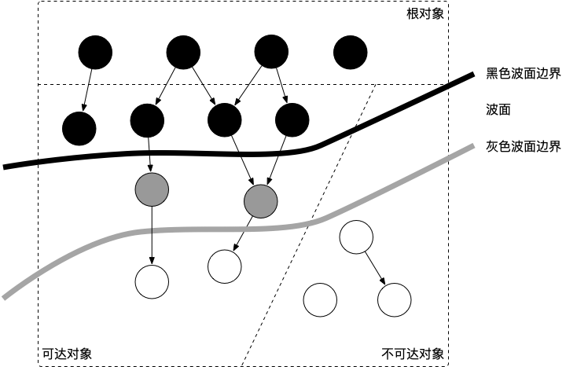

# 8.1 垃圾回收的基本想法


Go 实现的垃圾回收器是无分代（对象没有代际之分）、
不整理（回收过程中不对对象进行移动与整理）、并发（与用户代码并发执行）的三色标记清扫算法。
从宏观的角度来看，Go 运行时的垃圾回收器主要包含五个阶段：

| 阶段 | 说明 | 赋值器状态 |
|:--:|:--|:--:|
| 清扫终止 | 为下一个阶段的并发标记做准备工作，启动写屏障 | STW |
| 标记 | 与赋值器并发执行，写屏障处于开启状态 | 并发 |
| 标记终止 | 保证一个周期内标记任务完成，停止写屏障 | STW |
| 内存清扫 | 将需要回收的内存归还到堆中，写屏障处于关闭状态 | 并发 |
| 内存归还 | 将过多的内存归还给操作系统，写屏障处于关闭状态 | 并发 |

对象整理的优势是解决内存碎片问题以及“允许”使用顺序内存分配器。
但 Go 运行时的分配算法基于 tcmalloc，基本上没有碎片问题。
并且顺序内存分配器在多线程的场景下并不适用。
Go 使用的是基于 tcmalloc 的现代内存分配算法，对对象进行整理不会带来实质性的性能提升。

在这五个阶段中，只有标记、内存清扫和内存归还三个阶段的写屏障状态是保持不变的。
在清扫终止过程中，写屏障先出于关闭状态，
而后对上个垃圾回收阶段进行一些收尾工作（例如清理缓存池、停止调度器等等），
然后才被启动；在标记终止阶段，写屏障先出于启动状态，完成标记阶段的收尾工作后，
写屏障被关闭，并随后对整个 GC 阶段进行的各项数据进行统计等等收尾工作。
而在实际实现过程中，垃圾回收器通过 `_GCoff`、`_GCMark` 和 `_GCMarktermination` 
三个标记来确定写屏障状态，这时写屏障的启动状态严格的在 `_GCoff` 到 `_GCMark` 到 
`_GCMarktermination` 再到 `_GCoff` 的切换中进行变化。

分代 GC 依赖分代假设，即 GC 将主要的回收目标放在新创建的对象上（存活时间短，更倾向于被回收），
而非频繁检查所有对象。但 Go 的编译器会通过逃逸分析将大部分新生对象存储在栈上（栈直接被回收），
只有那些需要长期存在的对象才会被分配到需要进行垃圾回收的堆中。
也就是说，分代 GC 回收的那些存活时间短的对象在 Go 中是直接被分配到栈上，
当 goroutine 死亡后栈也会被直接回收，不需要 GC 的参与，进而分代假设并没有带来直接优势。
并且 Go 的垃圾回收器与用户代码并发执行，使得 STW 的时间与对象的代际、对象的 size 没有关系。
Go 团队更关注于如何更好地让 GC 与用户代码并发执行（使用适当的 CPU 来执行垃圾回收），
而非减少停顿时间这一单一目标上。

# 4.2 标记清扫法与三色抽象

自动内存管理的另一个重要的组成部分便是自动回收。在自动内存回收中，
垃圾回收器扮演一个十分重要的角色。通常，
垃圾回收器的执行过程可根据代码的行为被划分为两个半独立的组件：
赋值器（Mutator）和回收器（Collector）。

赋值器一词最早由 Dijkstra 引入 [Dijkstra et al., 1978]，意指用户态代码。
因为对垃圾回收器而言，需要回收的内存是由用户态的代码产生的，
用户态代码仅仅只是在修改对象之间的引用关系（对象之间引用关系的一个有向图，即对象图）
进行操作。回收器即为程序运行时负责执行垃圾回收的代码。

## 4.2.1 串行标记清扫

原始的标记清扫方法将回收过程分为两个阶段：

1. 标记追踪：从根集合（寄存器、执行栈、全局变量）开始遍历对象图，标记遇到的每个对象；

    ```go
    func mark() {
        worklist.Init()                       // 初始化标记 work 列表
        for root := range roots {             // 从根开始扫描
            ref := *root
            if ref != nil && !isMarked(ref) { // 标记每个遇到的对象
                setMarked(ref)
                worklist.Add(ref)
                for !worklist.Empty() {
                    ref := worklist.Remove()  // ref 已经标记过
                    for fld := range Pointers(ref) {
                        child := *fld
                        if child != nil && !isMarked(child) {
                            setMarked(child)
                            worlist.Add(child)
                        }
                    }
                }
            }
        }
    }
    ```

2. 清扫回收：检查堆中每一个对象，将所有未标记的对象当做垃圾进行回收。

    ```go
    func sweep() {
        // 检查堆区间内所有的对象
        for scan := worklist.Start(); scan < worklist.End(); scan = scan.Next {
            if isMarked(scan) {
                unsetMarked(scan)
            } else {
                free(scan) // 将未标记的对象释放
            }
        }
    }
    ```

## 4.2.2 三色抽象及其不变性

原始的标记清理是一个串行的过程，这种方法能够简化回收器的实现，因为只需要让回收器开始执行时，
将并发执行的赋值器挂起。这种情况下，对用户态代码而言，回收器是一个原子操作。
那么能不能让上面描述的过程并发执行呢？也就是说当赋值器在执行时，同时执行回收器呢？
这就面临一个非常严峻的问题：程序的正确性。当我们谈论一个垃圾回收程序的正确性时，
实际上是在描述用户态代码必须保障回收器不会将存活的对象进行回收，
而回收器也必须保证赋值器能够正确的访问到已经被重新整理和移动的对象。

三色抽象只是一种描述追踪式回收器的方法，在实践中并没有实际含义，
它的重要作用在于从逻辑上严密推导标记清理这种垃圾回收方法的正确性。
也就是说，当我们谈及三色标记法时，通常指标记清扫的垃圾回收。

从垃圾回收器的视角来看，三色抽象规定了三种不同类型的对象，并用不同的颜色相称：

- 白色对象（可能死亡）：未被回收器访问到的对象。在回收开始阶段，所有对象均为白色，当回收结束后，白色对象均不可达。
- 灰色对象（波面）：已被回收器访问到的对象，但回收器需要对其中的一个或多个指针进行扫描，因为他们可能还指向白色对象。
- 黑色对象（确定存活）：已被回收器访问到的对象，其中所有字段都已被扫描，黑色对象中任何一个指针都不可能直接指向白色对象。

<div class="img-center" style="margin: 0 50px 0px 30px; float: left; max-width: 50%">

<strong>图 4.2.1: 垃圾回收器中的波面抽象<span style="padding-right:50px"></strong>
</div>

这样三种不变性所定义的回收过程其实是一个 **波面（Wavefront）** 不断前进的过程，
这个波面同时也是黑色对象和白色对象的边界，灰色对象就是这个波面。

当垃圾回收开始时，只有白色对象。随着标记过程开始进行时，灰色对象开始出现（着色），这时候波面便开始扩大。当一个对象的所有子节点均完成扫描时，会被着色为黑色。当整个堆遍历完成时，只剩下黑色和白色对象，这时的黑色对象为可达对象，即存活；而白色对象为不可达对象，即死亡。这个过程可以视为以灰色对象为波面，将黑色对象和白色对象分离，使波面不断向前推进，直到所有可达的灰色对象都变为黑色对象为止的过程，如图 4.2.1 所示。

对象的三种颜色可以这样来判断：

```go
func isWhite(ref interface{}) bool {
    return !isMarked(ref)
}
func isGrey(ref interface{}) bool {
    return worklist.Find(ref)
}
func isBlack(ref interface{}) bool {
    return isMarked(ref) && !isGrey(ref)
}
```

## 4.2.3 并发标记清扫

并发标记的思想可以简要描述如下：

```go
func markSome() bool {
    if worklist.empty() {       // 初始化回收过程
        scan(Roots)             // 赋值器不持有任何白色对象的引用
        if worklist.empty() {   // 此时灰色对象已经全部处理完毕
            sweep()             // 标记结束，立即清扫
            return false
        }
    }
    // 回收过程尚未完成，后续过程仍需标记
    ref = worklist.remove()
    scan(ref)
    return true
}

func scan(ref interface{}) {
    for fld := range Pointers(ref) {
        child := *fld
        if child != nil {
            shade(child)
        }
    }
}

func shade(ref interface{}) {
    if !isMarked(ref) {
        setMarked(ref)
        worklist.add(ref)
    }
}
```

在这个过程中，回收器会首先扫描 worklist，而后对根集合进行扫描并重新建立 worklist。
在根集合扫描过程中赋值器现场被挂起时，扫描完成后则不会再存在白色对象。

并发清扫的思想可以简要描述如下：

```go
func New() (interface{}, error) {
    collectEnough()
    ref := allocate()
    if ref == nil {
        return nil, errors.New("Out of memory")
    }
    return ref, nil
}

func collectEnough() {
    stopTheWorld()
    defer startTheWorld()
    
    for behind() { // behind() 控制回收工作每次的执行量
        if !markSome() {
            return
        }
    }
}
```

<!-- ## 编译标志 `go:nowritebarrier`、`go:nowritebarrierrec` 和 `go:yeswritebarrierrec`

如果一个函数包含写屏障，则被 `go:nowritebarrier` 修饰的函数触发一个编译器错误，但它不会抑制写屏障的产生，只是一个断言。
`go:nowritebarrier` 主要适用于在没有写屏障会获得更好的性能，且没有正确性要求的情况。
我们通常希望使用 `go:nowritebarrierrec`。

如果声明的函数或任何它递归调用的函数甚至于 `go:yeswritebarrierrec` 包含写屏障，则 `go:nowritebarrierrec` 触发编译器错误。

逻辑上，编译器为每个函数调用添加 `go:nowritebarrierrec` 且当遭遇包含写屏障函数的时候产生一个错误。
`go:yeswritebarrierrec` 则反之。`go:nowritebarrierrec` 用于防止写屏障实现中的无限循环。

两个标志都在调度器中使用。写屏障需要一个活跃的 P （`getg().m.p != nil`）且调度器代码通常在没有活跃 P 的情况下运行。
在这种情况下，`go:nowritebarrierrec` 用于释放 P 的函数上，或者可以在没有 P 的情况下运行。
而且`go:nowritebarrierrec` 还被用于当代码重新要求一个活跃的 P 时。
由于这些都是函数级标注，因此释放或获取 P 的代码可能需要分为两个函数。

这两个指令都在调度程序中使用。
写屏障需要一个活跃的P（ `getg().mp != nil`）并且调度程序代码通常在没有活动 P 的情况下运行。
在这种情况下，`go:nowritebarrierrec` 用于释放P的函数或者可以在没有P的情况下运行并且去：
当代码重新获取活动P时使用 `go:yeswritebarrierrec`。
由于这些是功能级注释，因此释放或获取P的代码可能需要分为两个函数。 -->

## 许可

&copy; 2018-2020 The [golang.design](https://golang.design) Initiative Authors. Licensed under [CC-BY-NC-ND 4.0](https://creativecommons.org/licenses/by-nc-nd/4.0/).