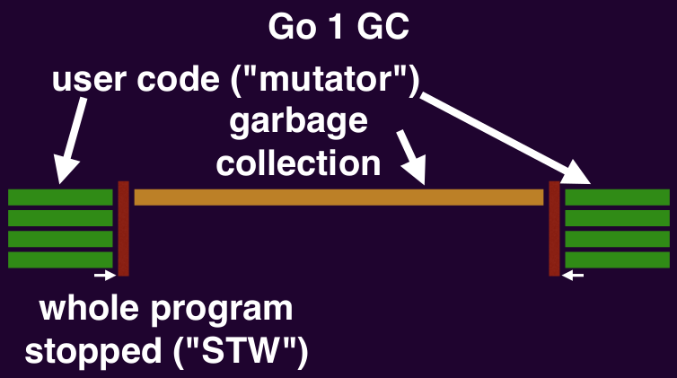
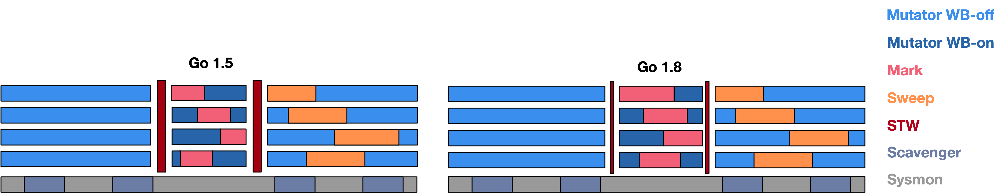
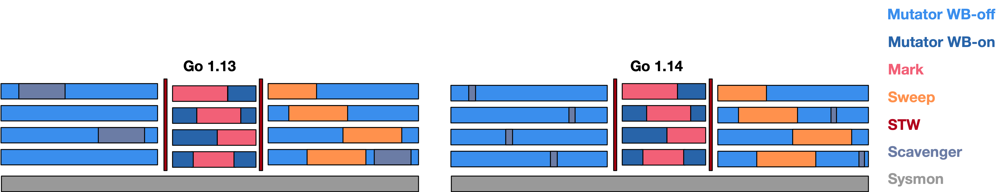

# 8.11 过去、现在与未来

## 8.14.1 被采纳的方案

我们现在来详细回顾一下 Go 中 GC 在各个版本上的演进历史。

### Go 1：朴素标记清扫

在 Go 1 的时代，尽管所有的用户代码都是并发执行的，但是一旦垃圾回收器开始进行垃圾回收工作时，所有的用户代码都会停止执行，而且垃圾回收器仅在一个线程上执行，这时是最原始的垃圾回收器的实现，即单线程版的三色标记清扫。

### Go 1.1, 1.3：并行清扫与精准标记

在 Go 1.3 时候，官方将三色标记清扫算法的垃圾回收代码改为并行，从而缩短了用户代码的停止时间，但是这仍然会造成大量的空隙，如果用户代码是一个 Web 应用，且正在处理一个非常重要的请求，则会对请求延迟造成巨大的影响。

<strong>图 1: Go 1 与 1.3 的垃圾回收器</strong>

<!-- Better GC and malloc
The existing allocator is based on TCMalloc (designed for C/C++). It can be re-designed to better suit Go.
Lighter representation and colocation of GC metadata.
Various strategies for reducing GC pause time (concurrent sweep, etc).
Rough estimate: 10-20% overall speedup, 20-50% GC pause reduction, 5-10% RSS reduction.

Details:

golang.org/s/go14mallocgc -->

### Go 1.5：并发回收

为了解决 STW 问题，官方在 Go 1.5 开始使用 Dijkstra 写屏障技术让垃圾回收与用户代码得以并行执行。
从而只有在执行写屏障和很短一段时间内才需要进行 STW。

### Go 1.6：状态化回收器与位图技术

TODO:

### Go 1.7：独立栈收缩

TODO:

### Go 1.8, 1.9：混合写屏障

Go 团队在 1.8 引入混合屏障将 STW 进一步缩短，几乎解决了 STW 的问题。

<strong>图 1: Go 1.5 与 1.8 的垃圾回收器</strong>

### Go 1.10, 1.11：双限度机制

### Go 1.12：终止奇点

### Go 1.13：清道夫

### Go 1.14：页分配器

到了 Go 1.14，由于页分配器的引入，向操作系统归还内存的操作页完全得到并发。

<strong>图 1: Go 1.13 与 1.14 的垃圾回收器</strong>

## 8.14.2 被抛弃的方案

### 并发栈重扫

早期的 Go 选择了在 STW 期间，重新对栈进行扫描。
垃圾回收器首先在 GC 循环开始时扫描所有栈从而收集根。
但是如果没有栈的写屏障，我们便无法确保堆栈以后不会包含对白色对象的引用，
所以扫描栈只有黑色，直到其 Goroutine 再次执行，
因此它保守地恢复为灰色。从而在循环结束时，
垃圾回收器必须重新扫描灰色堆栈以使其变黑并完成标记任何剩余堆指针。
由于必须保证栈在此期间不会继续更改，因此重新扫描过程在 STW 时发生。
实践表明，栈的重扫需要消耗 10 - 100 毫秒的时间。

因为存在重扫的问题，除了引入混合屏障来消除重扫这一过程外，
有另一种做法可以提高重扫过程的性能，那就是将重扫的过程并发执行，
然而这一方案并没有得以实现。原因很简单：实现过程相比引入混合屏障而言十分复杂，
而且引入混合屏障能够消除重扫这一过程，将简化垃圾回收的步骤。

### ROC

请求制导式回收器可谓成也假设败也假设。请求制导假设非常符合直觉，但在实现上，由于垃圾回收器必须确保是否有 Goroutine 私有指针被写入公共对象，因此写屏障必须一直打开，这也就产生了该方法的致命缺点：昂贵的写屏障及其带来的缓存未命中，这也是这一设计最终没有被采用的主要原因。

### 传统分代 GC

实践证明请求制导回收器性能并没有带来显著提升之后，作为备选方案，Go 团队还尝试了实现传统的分代式 GC。但最终同样发现分代假设并不适用于 Go 的运行栈机制，年轻代对象在栈上就已经死亡，扫描本就该回收的执行栈并没有为由于分代假设带来明显的性能提升，也成为了这一方案最终没有被采用的主要原因。

## 8.14.3 展望

### 标记辅助时间过长

### 清扫时间过长

### 大规模场景下性能低下

### 对齐导致的内存浪费

### 可能的进化方向

## 许可

&copy; 2018-2020 The [golang.design](https://golang.design) Initiative Authors. Licensed under [CC-BY-NC-ND 4.0](https://creativecommons.org/licenses/by-nc-nd/4.0/).
