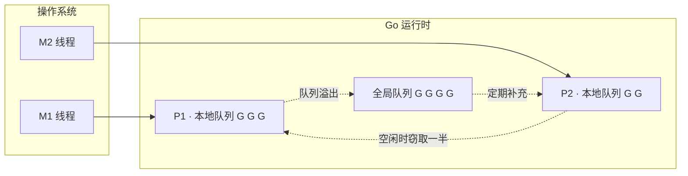
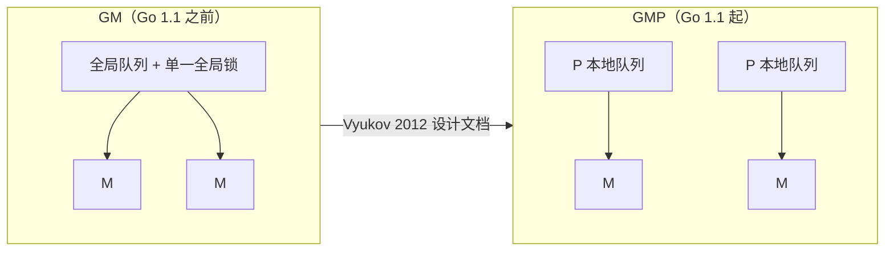

# 9.1 调度问题与 GMP 模型

写下 `go f()`，一个 goroutine 就开始运行了。这行代码背后，是 Go 运行时最精巧的一台机器：
调度器。它要回答一个并不简单的问题：成千上万个 goroutine，如何在为数不多的几个 CPU 核心上
轮转，既跑得快，又让用户几乎察觉不到它的存在。本节先把它要解决的问题、整体骨架，以及它在
并发运行时这个大家族里的位置交代清楚，后面各节再深入每个部件。

## 9.1.1 三种线程模型，与一段历史

把"并发任务"映射到"CPU 执行资源"上，历史上有三种模型，它们的取舍决定了一切。

- **1:1（内核线程）**：每个用户线程对应一个操作系统线程。真并行、阻塞系统调用由内核透明
  处理、实现简单；代价是每次创建与切换都要陷入内核，每个线程还要预留以兆字节计的栈。
  Linux 的 NPTL、现代 Windows、Java 的平台线程都走这条路。
- **N:1（纯用户线程，即早期的「绿色线程」）**：多个用户线程挤在一个操作系统线程上。切换
  极廉价、栈极小；但**用不上多核**，而且**一次阻塞的系统调用会卡住全部线程**,这是它的死穴。
- **M:N（混合 / 两级）**：把 $M$ 个用户线程多路复用到 $N$ 个内核线程上。既廉价又能并行，
  代价是需要**用户态与内核态两个调度器协作**,这正是复杂度的根源。

历史在这里拐过一个有意思的弯。1990 年代，M:N 一度被寄予厚望，最有影响的方案是
Anderson 等人的**调度器激活**（scheduler activations，SOSP 1991）：让内核在阻塞、就绪等
时刻"通知"用户态调度器，使两个调度器协同。但工业界最终大多退回了 1:1。Drepper 与 Molnar
为 Linux 设计 NPTL 时（2005）把理由写得很直白：M:N 需要两个调度器，若不协同则性能受损，
而要让它们协同所需引入内核基础设施的成本与维护代价都太高，"不符合 Linux 内核的理念"。
于是 Linux 选了 1:1。

Go 偏偏又走回了 M:N。它之所以能避开当年的坑，靠的是三件事，而这三件事都握在运行时自己手里：
goroutine 的栈很小且可增长（起步几 KB），创建与切换都廉价；运行时掌握所有会阻塞的点，
能在阻塞前把执行权让出；网络 I/O 由内置的网络轮询器（[9.9](./poller.md)）接管，阻塞的
goroutine 会被挂起而不占用线程。当年杀死 N:1 的"阻塞系统调用"难题，Go 是在运行时内部解决的，
而不是去求内核提供激活机制。

## 9.1.2 GMP 模型一览

Go 调度器围绕三个抽象展开，合称 GMP。

- **G（goroutine）**：一段并发执行的用户代码，连同它的栈与执行现场。
- **M（machine）**：一个操作系统线程，真正在 CPU 上执行指令的实体。
- **P（processor）**：一个逻辑处理器，代表"执行 Go 代码所需的资源与许可"。P 的数量由
  `GOMAXPROCS` 决定，默认等于可用的 CPU 核数。

三者的关系一句话概括：**M 必须先拿到一个 P，才能运行 G**。P 的个数因此设定了同时执行 Go 代码
的并行度上限。每个 P 自带一条**本地运行队列**存放就绪的 G，另有一个所有 P 共享的**全局运行
队列**兜底（上图）。一次调度，简化来说就是一个绑定了 P 的 M，从队列里取出一个 G 来运行，
G 让出或被抢占后再取下一个；本地队列空了，就去别处找活儿，这便引出工作窃取（[9.2](./steal.md)）。

goroutine 是**有栈协程**（stackful coroutine）：它有自己的栈，可以从任意嵌套的函数调用中挂起，
也可以被抢占。这与下面要对比的"无栈"路线是一条根本的分界线。Go 的栈早期用分段栈实现，
自 Go 1.3 改为可增长的**连续栈**（[14 执行栈管理](../../part4memory/ch14stack)）。

## 9.1.3 同一个问题的不同答案

"如何廉价地跑海量并发单元"是这一代运行时共同面对的问题，Go 的 GMP 只是答案之一。横向看看
别家的选择，更能看清 GMP 的定位。

- **Erlang / BEAM**：轻量进程各自独立堆、互不共享可变状态；调度器按**归约计数**（reduction，
  约等于函数调用次数）抢占，每个核一个调度器、各有运行队列，辅以进程迁移做负载均衡。它把
  "隔离"做到了极致。
- **Java 虚拟线程 / Project Loom**（JEP 444，Java 21，2023 定稿）：虚拟线程是续体加调度器，
  挂载到平台"载体线程"上运行、阻塞时卸载，调度器是一个 FIFO 工作窃取的 `ForkJoinPool`,
  并行度默认等于可用核数。这本质上就是 M:N，正是当年 Drepper 为 Linux 否决、如今又在 JVM
  里返场的模型。
- **GHC Haskell**：轻量线程复用到少数与核数相当的"能力"（HEC）上，配合工作窃取与 `par`
  火花（Marlow 等人，ICFP 2009）。
- **Rust async / .NET async**：走的是**无栈**（stackless）路线。`async fn` 被编译成状态机
  （`Future`），挂起状态存进一个枚举而非独立的栈，由运行时（如 Tokio）驱动。

这里点出一条关键的设计轴：**有栈 vs 无栈**。Go 的 goroutine 是有栈的，代价是每个都要一条
（可增长的）栈，好处是能从任意深度挂起、并且**能被抢占**。Rust/.NET 的 async 是无栈的，
省去独立栈、挂起点在编译期固定，但也因此**只能协作式调度**,一个不含 `.await` 的循环无法被
运行时打断。Go 选择有栈，换来的正是 [9.7](./preemption.md) 那种"连死循环都能抢占"的能力。

## 9.1.4 P 是怎么来的：从 GM 到 GMP

P 并非一开始就有。Go 1.1 之前的调度器只有 G 和 M，所有就绪的 G 挂在一个全局队列上，
由一把全局锁保护。2012 年，Dmitry Vyukov 在《Scalable Go Scheduler Design Doc》中指出了
这套 GM 调度器的四个症结：

1. 单一全局锁与集中式状态，所有与 goroutine 相关的操作都要争这把锁；
2. M 之间频繁交接 G，破坏局部性、增加切换开销；
3. 每个 M 都带着内存缓存（mcache）等资源，即便阻塞在系统调用、并不运行 Go 代码时也占着，
   既浪费内存又损害局部性；
4. 系统调用导致线程频繁阻塞与唤醒。

引入 P 正是对症下药：本地队列让多数入队出队不再争全局锁；把 mcache 一类资源移到 P 上，
份数就固定为 `GOMAXPROCS`、局部性也改善；M 与 P 的解绑再绑定，让线程陷入系统调用时能把 P
交给别的 M 继续干活。这套 GMP 调度器随 Go 1.1（2013 年 5 月）落地。一个值得一提的细节：
Go 1.1 的发布说明里其实**并没有**正面描述这次调度器重写，只在性能一节提了一句"运行时与网络
库更紧的耦合减少了网络操作的上下文切换",那其实是内置网络轮询器落地的旁证。重大的内部变革，
有时就这样安静地发生。

`GOMAXPROCS` 就是 P 的个数。它在 Go 1.5 起默认等于 `runtime.NumCPU()`（此前默认为 1）;
自 Go 1.25 起，运行时在带 CPU 限额的容器里会把默认值取为 $\min(\text{CPU 限额}, \text{核数})$
（限额为小数时向上取整），并周期性地动态调整,避免在被限额的容器里因取整机核数而过度并行。
注意这里的"1.25"是 Go 版本号，不是某个倍数。

## 9.1.5 一点调度理论

> 本小节面向有兴趣的读者，跳过它不影响理解后续实现。

为什么没有"完美"的调度器？因为真实调度器是**在线**（online）的：它在不知道未来 goroutine
何时到来、何时阻塞的情况下当场决策。一个拥有全部未来信息的**离线**调度器总能做得更好，
二者的差距用**竞争比**（competitive ratio，在线代价与离线最优代价之比的最坏值）来刻画。
这给了我们一个干净的说法：运行时可以做到"可证明地不错",但不可能"最优"。

那么工作窃取这种在线选择"不错"到什么程度？Blumofe 与 Leiserson（JACM 1999）证明，
对一个总工作量为 $T_1$、关键路径长度为 $T_\infty$ 的计算，随机化工作窃取在 $P$ 个处理器上的
期望时间为 $T_1/P + O(T_\infty)$。$T_1/P$ 是理想的线性加速，$O(T_\infty)$ 是无法再并行的串行
尾巴。这条界限是 Go、GHC、Erlang、Loom 不约而同地选择"每核一队列 + 随机工作窃取"的理论
底气，其完整的陈述、证明思路与适用边界（它针对 fork-join 计算，对 Go 的任意 goroutine 只是
"动机"而非严格保证），留到 [9.2](./steal.md) 详谈。

## 延伸阅读的文献

1. Thomas E. Anderson, Brian N. Bershad, Edward D. Lazowska, Henry M. Levy. "Scheduler
   Activations: Effective Kernel Support for the User-Level Management of Parallelism."
   *SOSP 1991 / ACM TOCS* 10(1), 1992. https://doi.org/10.1145/146941.146944
2. Ulrich Drepper, Ingo Molnar. *The Native POSIX Thread Library for Linux.* 2005.
   https://www.akkadia.org/drepper/nptl-design.pdf （1:1 胜出的论证）
3. Dmitry Vyukov. *Scalable Go Scheduler Design Doc.* 2012. https://go.dev/s/go11sched
4. Simon Marlow, Simon Peyton Jones, Satnam Singh. "Runtime Support for Multicore
   Haskell." *ICFP 2009*. https://doi.org/10.1145/1596550.1596563
5. OpenJDK. *JEP 444: Virtual Threads.* Java 21, 2023. https://openjdk.org/jeps/444
6. Robert D. Blumofe, Charles E. Leiserson. "Scheduling Multithreaded Computations by
   Work Stealing." *JACM* 46(5), 1999. https://doi.org/10.1145/324133.324234
7. The Go Authors. *Container-aware GOMAXPROCS.* 2025.
   https://go.dev/blog/container-aware-gomaxprocs
8. Erik Stenman. *The BEAM Book（The Erlang Runtime System）.*
   https://github.com/happi/theBeamBook

## 许可

&copy; 2018-2026 The [golang.design](https://golang.design) Initiative Authors. Licensed under [CC-BY-NC-ND 4.0](https://creativecommons.org/licenses/by-nc-nd/4.0/).
