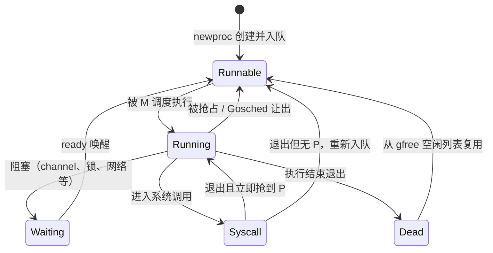

# 9.3 MPG 模型与并发调度单元

[9.1](./model.md) 从整体上介绍了 G、M、P 三个抽象。这一节走近一层，看它们作为数据结构各自
承载了什么状态，以及由这些状态驱动的两台状态机：goroutine 的生命周期，与工作线程的暂止和
复始。我们关心的不是结构体的每一个字段，而是那些真正承载设计意图的部分。

## 9.3.1 三个单元各自承载什么

**G 是一段可保存、可恢复的执行片段。** 它最核心的状态有三样：一条**执行栈**（起步只有几 KB，
按需增长，见 [14 执行栈管理](../../part4memory/ch14stack)）、一个**状态**字段（见下文的生命周期），
以及一份**保存的执行现场**（被切下 CPU 时，程序计数器与栈指针等寄存器存放于此，以便日后原样
恢复）。正因为现场可以这样被完整地存取，成千上万个 G 才能在少数线程上来回切换而互不干扰，
且切换不必陷入内核。

**M 是操作系统线程在运行时中的代身。** 它持有一条特殊的系统栈 `g0`（运行时代码、调度本身都在
`g0` 上执行，而非用户 G 的栈），一个指向当前正在运行的用户 G 的 `curg`，以及一个它当前绑定的
P。真正在 CPU 上执行指令的是 M，但它必须先取得一个 P 才被允许运行 Go 代码。

**P 是执行 Go 代码的许可与本地资源。** 它握有一条本地运行队列与 `runnext` 槽（[9.2](./steal.md)），
还有一个本地的内存分配缓存 `mcache`（[12 内存分配器](../../part4memory/ch12alloc)）。把这些资源
绑在 P 上而非 M 上，是 [9.1](./model.md) 讲过的 GM 到 GMP 演进的关键：资源的份数就此固定为
`GOMAXPROCS`，局部性也随之改善。

## 9.3.2 goroutine 的生命周期

一个 G 在它的一生中会在若干状态间迁移。理解这台状态机，就理解了调度器在对 G 做什么。

几个要点。**Runnable** 的 G 待在某条运行队列里，等待被调度，此刻它不占用任何栈以外的执行资源。
一旦被某个 M 选中，便进入 **Running**，独占该 M 与 P 执行用户代码。运行中的 G 可能因为被抢占
或主动 `Gosched` 而回到 **Runnable**，也可能因为等待 channel、锁、网络等而进入 **Waiting**，
直到对应的事件通过 `ready` 把它重新唤醒为 Runnable。进入**系统调用**时 G 转为 **Syscall**，
此时它仍占着 M 的栈，但不再真正持有 P（见 [9.5 线程管理](./thread.md) 中 P 的移交）。G 退出后
并不立刻被销毁，而是转入 **Dead** 并挂到空闲列表 `gfree` 上，下次 `newproc` 创建新 G 时优先复用，
省去重新分配的开销。此外还有两个过渡态：栈在增长或收缩时短暂处于 copystack，被异步抢占
挂起时处于 preempted（见 [9.7 协作与抢占](./preemption.md)）。

## 9.3.3 P 的状态

P 的状态机要简单些，它描述的是「这份执行许可此刻在做什么」：空闲（idle，在空闲列表里待命）、
运行（running，正被某个 M 持有并执行 G）、系统调用（syscall，其 M 陷入了系统调用）、
为垃圾回收停转（gcstop），以及销毁（dead，`GOMAXPROCS` 调小后多出来的 P）。这台状态机与 M
的暂止复始、与系统调用时 P 的移交紧密咬合，是后面几节反复出现的背景。

## 9.3.4 工作线程的暂止与复始

回到一个朴素的问题：到底该有多少个工作线程在跑？设运行中有 $n$ 个工作线程（M），每个 M
在任一时刻至多调度一个 G。由抽屉原理可得两条性质：

- 性质 1：当用户态创建了 $p\ (p > n)$ 个 G 时，必有 $p-n$ 个 G 尚未被调度；
- 性质 2：当用户态只创建了 $q\ (q < n)$ 个 G 时，必有 $n-q$ 个 M 无 G 可调度。

这两条性质，分别对应工作线程的**复始（unpark）**与**暂止（park）**。活儿多于线程时，需要唤醒
或新建线程来消化；线程多于活儿时，多出来的线程应当休眠，免得空转浪费 CPU。调度器要做的，
就是让运行的线程数动态地贴合可运行的 G 的数量。

难点在于「贴合」的火候。线程一空下来就立刻休眠，那么下一个 G 刚就绪又得把它唤醒，频繁的
休眠与唤醒（都要陷入内核）代价高昂；反之，留太多线程空转又浪费 CPU。Go 的折中是允许少量
**自旋（spinning）**线程：它们暂不休眠，而是主动反复查找可运行的 G，数量上限为 `GOMAXPROCS`
（运行时以 `sched.nmspinning` 计数）。只要还有自旋线程在，新就绪的 G 就能被迅速接住，无须
唤醒一个睡着的线程；只有当确实没有自旋线程、且有新工作出现时，才去复始一个线程。这一机制
把线程的暂止复始频率压到了较低水平，是 [9.2](./steal.md) 自旋线程那一段在生命周期视角下的展开。

## 9.3.5 GOMAXPROCS

`GOMAXPROCS` 就是 P 的个数，它设定了同时执行 Go 代码的并行度上限。默认值等于运行时探测到的
可用 CPU 核数。它可以在运行时通过 `runtime.GOMAXPROCS` 动态调整，调整会触发 P 集合的
重新分配（`procresize`）：调大则新建 P，调小则把多出来的 P 置为 dead 并把它们队列里的 G
迁移走。需要强调的是，`GOMAXPROCS` 限制的是并行执行 Go 代码的 P，而非线程总数，因为陷入
系统调用、被运行时占用的 M 并不计入这个上限，一个 Go 程序实际拥有的线程数往往多于
`GOMAXPROCS`。

> 自 Go 1.25 起，运行时在容器环境下还会参考 cgroup 的 CPU 配额来确定默认的 `GOMAXPROCS`，
> 避免在被限额的容器里因默认取整机核数而造成过度并行。这一点会在线程管理一节再述。

至此，调度的「材料」就备齐了：知道了 G、M、P 各自是什么、处于什么状态，下一节就可以进入
真正把它们转起来的调度循环。

## 许可

&copy; 2018-2026 The [golang.design](https://golang.design) Initiative Authors. Licensed under [CC-BY-NC-ND 4.0](https://creativecommons.org/licenses/by-nc-nd/4.0/).
