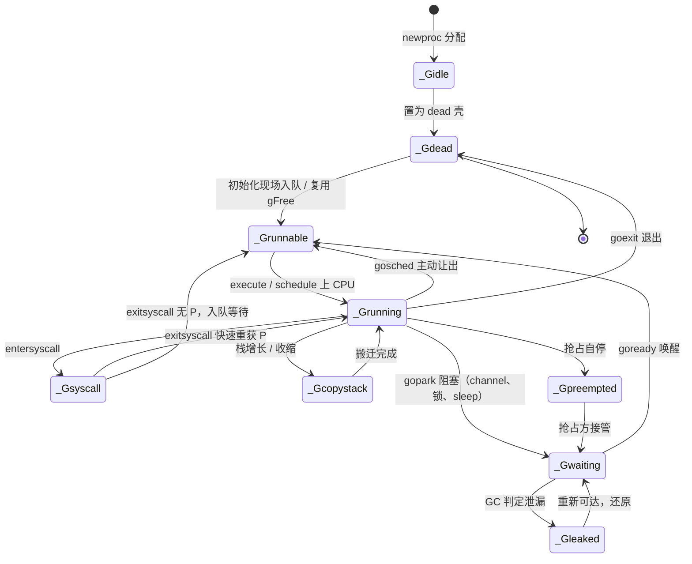

# 9.3 MPG 模型与并发调度单元

调度器要回答的第一个问题不是「怎么调度」，而是「调度什么」。Go 把这个被调度的对象叫
goroutine，并用一套 M、P、G 三元组承载它。在动手分析调度算法（[9.4](./exec.md) 起）之前，
本节先把这三个调度单元安顿好：goroutine 在计算机科学谱系里究竟是什么、它的运行现场如何编码、
为何调度本身要在一个特殊的 g0 上进行、一个 goroutine 的一生会经历哪些状态，以及承载它们的
工作线程 M 如何被暂止与复始。读懂这几样东西，后面的调度算法就只是「在这些单元之间搬运 G」。

为避免落回逐字段翻译源码的窠臼，下文给出的结构体都是裁剪后的速写：只保留与设计相关的字段，
并在注释里说明它为何存在。完整定义可对照 `runtime/runtime2.go` 与 `runtime/proc.go`（本节对标
go1.26）。

## 9.3.1 goroutine 是什么：有栈协程

goroutine 常被一句「轻量级线程」带过，这话不错，却遮住了它真正的身世。把它放回计算机科学的
谱系里，goroutine 是一个**有栈协程**（stackful coroutine）。

协程的概念可上溯到 Conway 1963 年提出 coroutine 一词时的设想：两段子程序互为对方的调用者，
能在中途交出控制权、又能从交出处原样恢复，而非像普通函数那样必须执行到底才返回。Moura 与
Ierusalimschy 在 2009 年给协程做了一份清晰的分类，两条正交的轴至今仍是讨论协程的基本坐标：

- **对称（symmetric）与非对称（asymmetric）**：对称协程之间地位平等，靠一个统一的 transfer
  原语彼此跳转；非对称协程则有明确的「调用者」与「被调者」，被调者只能让出（yield）回它的
  调用者。Go 的用户看不到 yield，但运行时内部 goroutine 与调度循环之间正是非对称的让出关系。
- **有栈（stackful）与无栈（stackless）**：有栈协程拥有自己独立的调用栈，因此可以在**任意
  深度的嵌套调用中**挂起，挂起点不必是协程入口函数本身；无栈协程则没有独立栈，只能在顶层
  函数里挂起，深层调用想挂起就得把整条调用链改写成状态机。

goroutine 落在「非对称、有栈」这一格。有栈这一点尤其关键，它意味着一个 goroutine 可以在
任意函数、任意调用深度处被挂起（无论是主动 `<-ch` 阻塞，还是被调度器抢占），挂起时整条 Go
调用栈连同其上的局部变量原封不动地保留，复始时从断点继续。用更理论的话说，一次挂起就是对
当前执行的一次**一次性定界续延**（one-shot delimited continuation）的捕获，而这份续延的物理
形态，就是下一节要讲的 `gobuf`：一组保存下来的寄存器（SP、PC 等），足以让执行从断点恢复。

有栈付出的代价是每个 goroutine 都要常驻一份栈内存。Go 用「初始很小、按需增长」化解它：新
goroutine 的栈只有 2 KB（`runtime/stack.go` 中的 `stackMin = 2048`），不够用时由连续栈机制
（[9.10](./stack.md)）整段搬迁扩容。这把「有栈」的固定开销压到了与无栈协程可比的量级。

有栈换来的好处，是绕开了 Nystrom 2015 年所称的**函数染色问题**（the function-coloring
problem）。在无栈协程的语言里（典型如基于 `async`/`await` 的实现），一个函数若想在内部挂起，
自己必须被声明为 `async`，于是「会挂起」成了函数的一种颜色，会沿调用链向上传染：调用 `async`
函数的函数往往也得是 `async`，普通函数与 `async` 函数不能自由互换，标准库常要为两种颜色各备
一份。有栈协程没有这道裂痕：任何普通函数都能在任意深处挂起，无需特殊标注，调用方也无须知情。
Go 里没有 `async` 关键字、没有「异步函数」与「同步函数」之分，正是有栈设计的直接红利。

## 9.3.2 三个调度单元：G、M、P

理解调度器，绕不开三个概念：

- **G**：goroutine，我们用 `go` 关键字创建的执行体，调度的基本对象；
- **M**：machine，即一个 OS 工作线程（worker thread），真正占用 CPU 执行指令的实体；
- **P**：processor，一种人为抽象出来的、执行 Go 代码所需的局部资源。一个 M 只有先关联上某个
  P，才能执行 Go 代码。

P 的存在初看费解：既然 M 已是线程，为何还要在 M 与 G 之间插一层 P？答案要到工作窃取
（[9.5](./steal.md)）才完整，这里先记住一句话：P 是「执行 Go 代码的许可证 + 一批本地资源」，
它的个数（`GOMAXPROCS`）决定了并行执行用户代码的上界，而把本地运行队列、内存缓存等资源挂在
P 而非 M 上，是为了让这些资源随「许可证」在线程间转手，既支持工作窃取，又把锁挡在快路径之外。

### G：执行体与它的运行现场

G 是 goroutine，自然要带着自己的执行栈，以及一份「断点快照」用于挂起后恢复：

```go
// g：一个 goroutine 的执行体（速写）
type g struct {
	stack        stack   // 栈内存区间 [stack.lo, stack.hi)
	stackguard0  uintptr // 栈溢出检查的警戒线；置为 stackPreempt 即变成抢占信号
	sched        gobuf   // 运行现场：挂起时保存、复始时恢复的寄存器快照
	atomicstatus uint32  // goroutine 的状态（见 9.3.4），须以原子方式读写
	goid         uint64  // goroutine 编号
	m            *m      // 当前正在运行本 g 的 M（未运行时为 nil）
	param        unsafe.Pointer // 被唤醒时由唤醒方传入的参数
	preempt      bool    // 抢占信号，stackguard0 = stackPreempt 的一份副本
	waitreason   waitReason // 处于 _Gwaiting 时，记录因何阻塞（便于诊断）
}
```

其中 `sched` 这个 `gobuf` 就是 9.3.1 所说的续延的物理形态：

```go
// gobuf：goroutine 的运行现场，足以从断点恢复执行（速写）
type gobuf struct {
	sp   uintptr        // 栈指针
	pc   uintptr        // 程序计数器：下一条要执行的指令
	g    guintptr       // 所属 goroutine
	ctxt unsafe.Pointer // 闭包上下文（被当作 GC 根特殊处理）
	bp   uintptr        // 帧指针（在启用 framepointer 的架构上）
}
```

goroutine 没有什么黑魔法：创建时把要执行的函数入口存进 `gobuf.pc`、参数拷上执行栈，挂起时
把当前 SP/PC 等寄存器存回 `gobuf`，复始时再把它们灌回真实寄存器，执行便从断点接着走。
`atomicstatus` 须原子访问，是因为它会被别的 M（乃至 GC、系统监控）并发读写，这正是
[9.3.4](#934-goroutine-的生命周期状态机) 状态机的存储载体。

### M：OS 线程的实体

M 对应一个真实的 OS 线程。它最要紧的几个字段，都围绕「一个线程要执行 Go 代码需要随身带什么」：

```go
// m：一个 OS 工作线程（速写，原结构有五十余字段）
type m struct {
	g0       *g       // 专用于执行调度、运行时代码的 goroutine（见 9.3.3）
	curg     *g       // 当前正在运行的用户 goroutine
	p        puintptr // 当前关联的 P（无 P 则不能执行 Go 代码）
	mcache   *mcache  // 本线程的内存分配缓存（实际随 P 转手，见 12.2）
	gsignal  *g       // 专用于处理信号的 goroutine（见 9.7）
	tls      [tlsSlots]uintptr // 线程本地存储，存放当前 g 等
	spinning bool     // 是否处于自旋寻找工作的状态（见 9.3.6）
	alllink  *m       // 串入全局 allm 链表
}
```

每个 M 都持有两个特殊的 goroutine：`g0` 与 `gsignal`，它们不执行用户代码，分别承担调度与信号
处理。`curg` 才是当前在跑的用户 goroutine。`p` 是那张「执行许可证」：M 失去 P（如陷入长时间
系统调用）便不能再执行 Go 代码。

### P：执行 Go 代码的本地资源

P 是处理器的抽象，而非处理器本身。它存在的全部意义，是把执行 Go 代码所需的局部资源就近放在
一处，从而让快路径无锁、并支撑工作窃取：

```go
// p：执行 Go 代码所需的本地资源（速写）
type p struct {
	id     int32
	status uint32   // _Pidle / _Prunning / _Psyscall / _Pgcstop ...
	m      muintptr // 关联的 M（nil 表示空闲）
	mcache *mcache  // 每 P 一份的内存分配缓存（无锁快路径，见 12.2）

	// 本地可运行队列：一个无锁环形缓冲 + 一个优先槽
	runqhead uint32
	runqtail uint32
	runq     [256]guintptr // 本地 runnable G 的环形队列，可无锁存取
	runnext  guintptr      // 「下一个就运行它」的优先 G：保护刚被唤醒者的局部性

	gFree struct {         // 本 P 缓存的、已退出可复用的 dead G（连栈一起）
		gList
		n int32
	}
}
```

P 的核心是那条本地运行队列。`runq` 是一个容量 256 的环形缓冲，持有 P 的 M 从队头取、放回队尾，
因无人争用而能**无锁**存取；窃取（[9.5](./steal.md)）则发生在别的 P 来偷它一半时。`runnext`
是一个单槽的优先位：当一个 goroutine 唤醒另一个（如 channel 收发），被唤醒者会放进 `runnext`
而非排到队尾，让它「下一个就跑」，以保住生产者与消费者之间的缓存局部性。`gFree` 缓存已退出
的 G 连同其栈，使下一次 `go` 能复用而免去重新分配，正是 [9.3.4](#934-goroutine-的生命周期状态机)
里 `_Gdead` 状态的归宿。把这些资源挂在 P 上、随 P 在 M 间转手，是「每 P 无锁缓存」这一招式在
调度器里的体现，它与内存分配器的 mcache（[12.2](../../part4memory/ch12alloc/component.md)）、
`sync.Pool` 的每 P 分片（[11.6](../ch11sync/pool.md)）同出一脉。

## 9.3.3 为什么调度跑在 g0 上

调度本身也是代码，也要在某个栈上执行。如果让它直接跑在用户 goroutine 的栈上，会有麻烦：用户
栈很小（初始 2 KB）且可能正待搬迁扩容，而调度、栈拷贝这类运行时操作恰恰不能在一个「自己随时
会被挪动」的栈上安全进行。Go 的解法是给每个 M 配一个专用的 `g0`：它的栈较大、固定不挪，运行时
的调度循环、栈管理等关键操作都在 g0 上执行。

于是 M 在「跑用户代码」与「跑调度代码」之间反复换栈。两个运行时原语承担这次切换：

- `mcall(fn)`：从当前用户 goroutine 切到 g0，在 g0 栈上执行 `fn`，且 `fn` 不再返回到原 g。
  `gopark`、`goschedImpl` 这类「让出后由调度器接管」的操作都经它进入 g0。
- `systemstack(fn)`：临时切到 g0 栈执行 `fn`，执行完切回原 goroutine 继续。需要更大栈或不可
  被抢占的运行时片段（如栈增长、部分 GC 工作）走它。

这样，「执行用户代码」与「决定下一个执行谁」被干净地分到了两个栈上：用户 goroutine 只管跑业务，
一旦要让出或被调度，控制权经 `mcall` 落到 g0，由 g0 上的 `schedule()` 挑选下一个 G 并经
`execute` → `gogo` 跳回去执行。本节后面提到的状态切换，绝大多数都发生在这次「换到 g0」之后。

## 9.3.4 goroutine 的生命周期状态机

一个 goroutine 的一生，是 `atomicstatus` 字段在若干状态间的迁移。这些状态定义在
`runtime/runtime2.go`，状态切换统一经由 `casgstatus`（compare-and-swap g status）完成，以保证
并发安全。主干状态有这样几个：

- `_Gidle`：刚分配，尚未初始化；
- `_Grunnable`：在某个运行队列里，等待被调度，尚未执行；
- `_Grunning`：正在某个 M 上执行用户代码，已绑定 M 与 P；
- `_Gsyscall`：正在执行系统调用，未执行用户代码；
- `_Gwaiting`：阻塞在运行时中（如 channel 收发、`time.Sleep`、加锁），不在运行队列上，需由某处
  显式唤醒；
- `_Gdead`：未被使用，可能是刚退出、也可能是待复用的空壳，缓存在 `p.gFree` / `sched.gFree`；
- `_Gcopystack`：栈正在被搬迁（连续栈扩容/收缩），此刻不执行代码；
- `_Gpreempted`：因抢占而自行停下，形似 `_Gwaiting`，但等待抢占方负责把它转回 `_Gwaiting`。

go1.26 在此之上新增了一个诊断用状态 `_Gleaked`（值 10）。它不是生命周期的常规一环，而是 GC 给
**疑似泄漏**的阻塞 goroutine 打的一个标记：GC 扫描时若发现某个 `_Gwaiting` 的 goroutine 已无法
再被唤醒（不可达），便经 `casgstatus(gp, _Gwaiting, _Gleaked)` 将其标为泄漏（`runtime/mgc.go`）；
若它后来又变回可达，再经 `casgstatus(gp0, _Gleaked, _Gwaiting)` 还原。它是覆盖在「阻塞」之上的
一层诊断视图，运行时并不会就此回收该 goroutine。

驱动这些迁移的，是一组我们会反复遇到的运行时函数：`newproc` 创建新 G、`execute` 上 CPU、
`gopark` 主动阻塞、`goready` 唤醒、`entersyscall`/`exitsyscall` 进出系统调用、`goexit` 退出。
把它们标在边上，goroutine 的一生如下：



新建一个 goroutine 的过程，正是这张图最初的几步：`newproc` 先把 G 由 `_Gidle` 置为 `_Gdead`
并挂入 `allg`（让 GC 知道但不扫描其未初始化的栈），随后据函数入口与参数初始化执行栈与 `gobuf`，
再 `casgstatus` 为 `_Grunnable` 入队，等待 `execute` 把它推上 CPU。状态还有一个与 GC 协作的
`_Gscan` 位族（如 `_Gscanrunning`），用于在不打断 goroutine 的前提下扫描其栈，为保持图的可读
我们略去，细节见 [13 垃圾回收](../../part4memory/ch13gc)。

## 9.3.5 横向对照：别家的并发执行体

把 goroutine 放到同侪中看，9.3.1 那套「有栈 / 无栈」的分类立刻显出分量。下表对照几种语言的
并发执行体，关键在于它们是否有独立栈，以及由此决定的「有没有函数染色问题」：

| 系统 | 有栈? | 表示形态 | 起步开销 |
| --- | --- | --- | --- |
| Go goroutine | 是 | 独立栈 + `gobuf` 续延，连续栈按需增长 | 初始栈 2 KB |
| Erlang/BEAM 进程 | 是 | 独立轻量进程，私有堆，调度于 BEAM 之上 | 数百字节量级 |
| Java 虚拟线程（Loom, JEP 444） | 是 | 续延挂载到载体线程（carrier）执行 | 栈按需增长，远小于平台线程 |
| Lua 协程 | 是（非对称） | 独立栈，`coroutine.resume`/`yield` 显式让出 | 轻量，由解释器管理 |
| Kotlin 协程 | 否 | `suspend` 编译为 CPS 状态机，无独立栈 | 极小（仅状态对象），但有函数染色 |

值得点出的是分类列。Go、Erlang、Java 虚拟线程、Lua 协程都是有栈的，因而都没有函数染色问题：
任意深度的调用都能挂起。Kotlin 协程则是无栈的，编译器把 `suspend` 函数翻成续延传递风格（CPS）
的状态机，代价就是 `suspend` 这种「颜色」会沿调用链传染，正是 9.3.1 所说 Go 用有栈设计避开的
那道裂痕。Lua 协程尤其值得一提：Moura 与 Ierusalimschy 2009 年那篇奠定协程分类的论文，本就
源自 Lua 的协程设计，goroutine 的「非对称有栈」血统与它一脉相承，只是 Go 把显式的
`resume`/`yield` 藏进了运行时，让用户只见 `go` 与 channel。

## 9.3.6 工作线程的暂止与复始

最后回到承载 G 的工作线程 M。调度器要在两条相互拉扯的诉求间权衡：既要保持足够多的运行线程
以吃满硬件并行度，又要暂止多余的线程以省下 CPU 能耗。用抽屉原理可以把这对张力说清楚：设进程
中有 $n$ 个 M、用户创建了 $p$ 个 G，则当 $p > n$ 时，必有 $p - n$ 个 G 暂时无 M 可跑（需要更多
线程，即**复始 / unpark**）；当 $p < n$ 时，必有 $n - p$ 个 M 无 G 可跑（应当休眠，即**暂止 /
park**）。

求这个权衡的最优解很难，难在两处。其一，多个 M 各持本地队列，彼此看不到对方的状态，这本质上
是一个分布式系统：没有一个让所有线程同步的全局时钟，要在不加屏障的快路径上算出「全局是否还有
空闲工作」这样的全局谓词，按共识理论是做不到的。其二，最优的暂止决策需要未来信息：理想情况下，
若知道下一刻就会有新 G 就绪，就不该现在去暂止一个 M。但 G 何时就绪是随机的（设想一个 Web
服务，请求到达即创建 G），无法预知。

几种朴素设计都不可取：集中管理全部状态需要全局锁，并发实体一多就成瓶颈；每就绪一个 G 就立刻
复始一个 M，会因「复始后下一刻又没活干」而陷入线程颠簸（thrashing）；不加判断地每次都多复始一
个线程，则会制造大量「醒来发现没活、随即又睡」的无效暂止/复始。

Go 的解法是引入工作线程的**自旋（spinning）状态**：一个本地队列、全局队列、网络轮询器中都找
不到工作的 M，不立刻睡去，而是先短暂自旋寻找工作。其要点是：

1. 唤醒一个 G 时，先看是否已有自旋线程（`sched.nmspinning`），若有就不再额外复始新线程，让那个
   正在找活的线程接住即可；
2. 仅当存在空闲 P、且没有任何自旋线程时，就绪一个 G 才复始一个新线程；
3. 最后一个自旋线程找到工作、转为非自旋时，再复始一个新的自旋线程顶上。

这套规则消除了不合理的线程复始尖峰，又保住了 CPU 并行度的上限。可以把它想象成银行服务台：身手
敏捷的顾客（自旋的 M）随时准备扑向任何空出来的窗口（待运行的 G），只有当所有人都已就位、却仍
有窗口空着时，才请一位新顾客进场。

实现的微妙之处全在自旋与非自旋的状态切换必须无缝衔接，否则会在「提交新 G」与「线程转为非自旋」
之间撞出竞争，最终双方都以为对方会处理，结果谁都没处理，留下 CPU 利用不足的尾巴。为此两侧都
要插一道 `StoreLoad` 风格的屏障：就绪一个 G 时，先把 G 入本地队列、再屏障、再检查 `nmspinning`；
线程转非自旋时，先减 `nmspinning`、再屏障、再回扫所有本地队列确认确无遗漏的工作。两道带屏障的
检查彼此交叉，保证不会有「刚提交的 G 无人认领」的窗口。值得一提的是，这套复始逻辑只对每 P 的
本地队列适用，向**全局队列**提交工作时并不触发线程复始。

至此，三个调度单元与承载它们的线程都已就位：G 是被调度的有栈协程，M 是出力的线程，P 是连接
二者、携带本地资源的许可证。它们如何在每一次调度循环里协同运转，是 [9.4 调度循环](./exec.md)
与 [9.5 工作窃取](./steal.md) 的主题。

## 延伸阅读的文献

1. Melvin E. Conway. "Design of a Separable Transition-Diagram Compiler."
   *Communications of the ACM*, 6(7), 1963. https://doi.org/10.1145/366663.366704
   （coroutine 一词与概念的出处）
2. Ana Lúcia de Moura and Roberto Ierusalimschy. "Revisiting Coroutines."
   *ACM TOPLAS*, 31(2), 2009. https://doi.org/10.1145/1462166.1462167
   （对称/非对称、有栈/无栈分类，源自 Lua 协程设计）
3. Bob Nystrom. "What Color is Your Function." 2015.
   https://journal.stuffwithstuff.com/2015/02/01/what-color-is-your-function/
   （函数染色问题，有栈协程所规避者）
4. Keith Randall. *Contiguous Stacks* (Go design doc), 2013.
   https://docs.google.com/document/d/1wAaf1rYoM4S4gtnPh0zOlGzWtrZFQ5suE8qr2sD8uWQ
   （连续栈：把「有栈」的固定开销压低的实现）
5. Dmitry Vyukov. *Scalable Go Scheduler Design Doc*, 2012.
   https://golang.org/s/go11sched （自旋线程、`nmspinning`、暂止/复始的设计原型）
6. Ron Pressler et al. *JEP 444: Virtual Threads.* OpenJDK, 2023.
   https://openjdk.org/jeps/444 （Java Loom 的有栈虚拟线程）
7. Kotlin. *KEEP: Coroutines.*
   https://github.com/Kotlin/KEEP/blob/master/proposals/coroutines.md
   （无栈协程：`suspend` 编译为 CPS 状态机）
8. The Go Authors. *runtime/runtime2.go、proc.go、stack.go.*
   https://github.com/golang/go/tree/master/src/runtime
   （`g`/`m`/`p`/`gobuf` 结构、`_G*` 状态常量、`casgstatus`）

## 许可

&copy; 2018-2026 The [golang.design](https://golang.design) Initiative Authors. Licensed under [CC-BY-NC-ND 4.0](https://creativecommons.org/licenses/by-nc-nd/4.0/).
