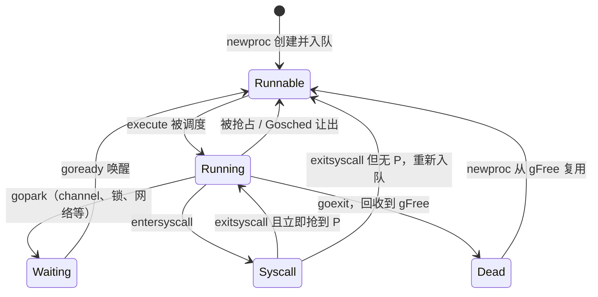

# 9.3 MPG 模型与并发调度单元

[9.1](./model.md) 从整体上介绍了 G、M、P 三个抽象。这一节走近一层：goroutine 在理论上究竟是
什么、它作为数据结构承载了什么状态、它的一生如何在各状态间迁移，以及把它放到整个并发语言
谱系里看，Go 的选择处在哪个位置。

## 9.3.1 goroutine 是一种有栈协程

goroutine 的祖先是**协程**（coroutine）。这个词由 Conway 在 1963 年提出，指一组彼此平等、
没有主从之分、可以互相让出控制权的子程序。半个多世纪里，协程演化出几条分支，其中两条
分类轴最要紧（Moura 与 Ierusalimschy 在《Revisiting Coroutines》2009 中给出了精确的刻画）：

- **对称 / 非对称**：对称协程之间用单一的转移操作互相切换；非对称协程则有 resume/yield
  一对操作，从属于唤醒它的调用方。
- **有栈 / 无栈**：**有栈**（stackful）协程能从**任意嵌套的函数调用深处**挂起，下次从原地继续；
  **无栈**协程只能在自己的顶层帧挂起（Python 的生成器即属此类）。

goroutine 是**非对称、有栈**的协程。「有栈」这一点是后面一切的关键。Moura 与 Ierusalimschy
还证明了一个漂亮的结论：第一类的有栈协程，其表达能力等价于**一次性（delimited）续体**
（one-shot continuation）。这不是抽象的巧合,在 Go 里它有具体的化身：一个被挂起的 goroutine，
它「余下的计算」就保存在 `gobuf` 里（PC、SP 等寄存器现场），恢复它，就是带着这份续体跳回去
继续跑。汇编例程 `gogo` 做的正是「调用这份续体」。

有栈带来一个常被低估的好处：它躲开了无栈方案的**函数染色**问题。Nystrom 在《What Color is
Your Function?》（2015）里点出，`async/await` 这类无栈方案会把函数分成「红」（异步）与
「蓝」（同步）两色，红函数只能被红函数调用，异步性像病毒一样沿调用链蔓延，污染所有签名。
Go 没有 `async` 关键字：任何函数都可以阻塞，运行时把整个 goroutine 挂起（`gopark`）即可，
阻塞式的 I/O 代码读起来和同步代码一模一样。代价，就是每个 goroutine 都得有一条（可增长的）栈。

## 9.3.2 三个调度单元各承载什么

把三者裁剪成只剩设计相关的字段，分工一目了然：

```go
type g struct {            // goroutine
    stack        stack     // 执行栈的上下界 [lo, hi)
    sched        gobuf     // 被切下 CPU 时保存的现场（PC、SP 等），即那份续体
    atomicstatus atomic.Uint32 // 状态（见下文的生命周期）
    m            *m        // 当前正在运行它的 M（仅在拥有 M 的状态下有效）
}
type m struct {            // machine：OS 线程
    g0   *g                // 运行调度与运行时代码的系统栈
    curg *g                // 当前正在运行的用户 G
    p    puintptr          // 当前绑定的 P（运行 Go 代码必须持有）
}
type p struct {            // processor：执行 Go 代码的许可
    runq    [256]guintptr  // 本地运行队列（定长环形）
    runnext guintptr       // 下一个优先运行的 G（LIFO，利于局部性）
    mcache  *mcache        // 本地内存分配缓存
    gFree   gList          // 本 P 的空闲 G 列表，供复用
}
```

为什么调度代码要跑在 M 的 `g0` 上而非用户 G 的栈上？因为「挑选下一个 goroutine」「搬移一条
用户栈」这类操作，本身不能安全地运行在那条可能正被挂起、被扫描、被复制的用户栈之上。`g0`
负责调度，用户 G 负责干活，二者通过 `mcall` / `systemstack` 往返。

## 9.3.3 goroutine 的生命周期

一个 G 的一生在若干状态间迁移，理解这台状态机就理解了调度器在对 G 做什么。



要点：**Runnable** 的 G 待在某条运行队列里、不占用栈以外的执行资源；被 `execute` 选中后进入
**Running**，独占 M 与 P 并拥有自己的栈；运行中可能被抢占或 `Gosched` 退回 Runnable，
可能因等待 channel/锁/网络而 `gopark` 进入 **Waiting**（由 `goready` 唤醒），可能 `entersyscall`
转入 **Syscall**（此时仍占着栈、但不再真正持有 P，见 [9.5](./thread.md)）。G 退出后并不立即销毁，
而是 `goexit` 把它转入 **Dead** 并挂到 `gFree` 空闲列表，下次 `newproc` 优先复用，省去重新
分配栈与结构体的开销，这正是高频创建 goroutine 仍然廉价的原因。所有状态变更都经由
`casgstatus` 这一道闸口，它在发现 GC 正在扫描该栈（`_Gscan` 位）时会自旋等待，以维持不变式。

此外还有几个过渡或特殊态：栈在增长收缩时短暂处于 **copystack**；被异步抢占挂起时处于
**preempted**（[9.7](./preemption.md)）。Go 1.26 还新增了一个 **`_Gleaked`** 状态：垃圾回收器
若发现某个 goroutine 既永久阻塞、又不再可达（即泄漏了），会把它标为 `_Gleaked`,这是运行时
向「goroutine 泄漏检测」迈出的一步，也是本书相较旧版需要补记的一处新变化。

## 9.3.4 放到谱系里看

goroutine 的表示方式，在并发语言里只是众多选择之一。横向对照能看清各自的取舍：

| 系统 | 单元 | 有栈? | 表示 | 起步开销 |
| --- | --- | --- | --- | --- |
| Go | goroutine | 是 | `g` 结构 + 可增长私有栈 + `gobuf` 续体 | 栈下限 2 KB，GC 自适应 |
| Erlang | 进程 | 是 | 独立堆栈合一、独立 GC、share-nothing | 约 327 字 |
| Java（Loom） | 虚拟线程 | 是 | 受限续体 + Runnable，挂载到载体线程 | M:N，工作窃取池 |
| Kotlin | 协程 | 否 | 编译器 CPS + 状态机，`Continuation` 对象 | 每个挂起帧一个堆对象 |
| Lua | 协程 | 是 | 每协程一条独立 Lua 栈 | 一条栈 |

可以看到，有栈一路（Go、Erlang、Lua、Loom）能在任意深度挂起、且可被抢占，代价是每个单元
一条栈；无栈一路（Kotlin、C#/JS 的 async）省去独立栈、挂起点在编译期固定，但无法在任意深度
挂起、也无法被透明抢占。Go 选了有栈，[9.7](./preemption.md) 的「连死循环都能抢占」正是这一
选择的红利。

## 9.3.5 工作线程的暂止与复始

最后回到一个朴素的问题：到底该有多少 M 在跑？设有 $n$ 个工作线程，每个在任一时刻至多调度
一个 G，由抽屉原理：活儿多于线程（$p > n$）时必有 $p-n$ 个 G 等着，需要**复始（unpark）**或
新建线程；线程多于活儿（$q < n$）时必有 $n-q$ 个 M 闲着，应当**暂止（park）**以免空转。
难点在火候：线程一空就睡、下个 G 一来又得唤醒，频繁的睡眠唤醒（都要陷入内核）代价高昂。
Go 的折中是允许少量 M **自旋**（上限 `GOMAXPROCS`，计于 `sched.nmspinning`）主动找活儿而暂不
休眠，新就绪的 G 因此能被迅速接住，无须每次唤醒睡着的线程。`GOMAXPROCS` 本身的含义与历史
（默认值、容器感知）已在 [9.1](./model.md) 交代。

## 延伸阅读的文献

1. Melvin E. Conway. "Design of a Separable Transition-Diagram Compiler."
   *Communications of the ACM*, 6(7), 1963. https://doi.org/10.1145/366663.366704
   （coroutine 一词的出处）
2. Ana Lúcia de Moura, Roberto Ierusalimschy. "Revisiting Coroutines."
   *ACM TOPLAS*, 31(2), 2009. https://doi.org/10.1145/1462166.1462167
   （对称/非对称、有栈/无栈的精确分类，及有栈协程与一次性续体的等价性）
3. Bob Nystrom. *What Color is Your Function?*, 2015.
   https://journal.stuffwithstuff.com/2015/02/01/what-color-is-your-function/
4. Keith Randall. *Contiguous stacks design doc*, 2013. https://golang.org/s/contigstacks ；
   *Go 1.3 Release Notes*（分段栈改连续栈）. https://go.dev/doc/go1.3
5. OpenJDK. *JEP 444: Virtual Threads.* 2023. https://openjdk.org/jeps/444
6. Andrey Breslav, Roman Elizarov. *Kotlin Coroutines (KEEP).*
   https://github.com/Kotlin/KEEP/blob/master/proposals/coroutines.md

## 许可

&copy; 2018-2026 The [golang.design](https://golang.design) Initiative Authors. Licensed under [CC-BY-NC-ND 4.0](https://creativecommons.org/licenses/by-nc-nd/4.0/).
